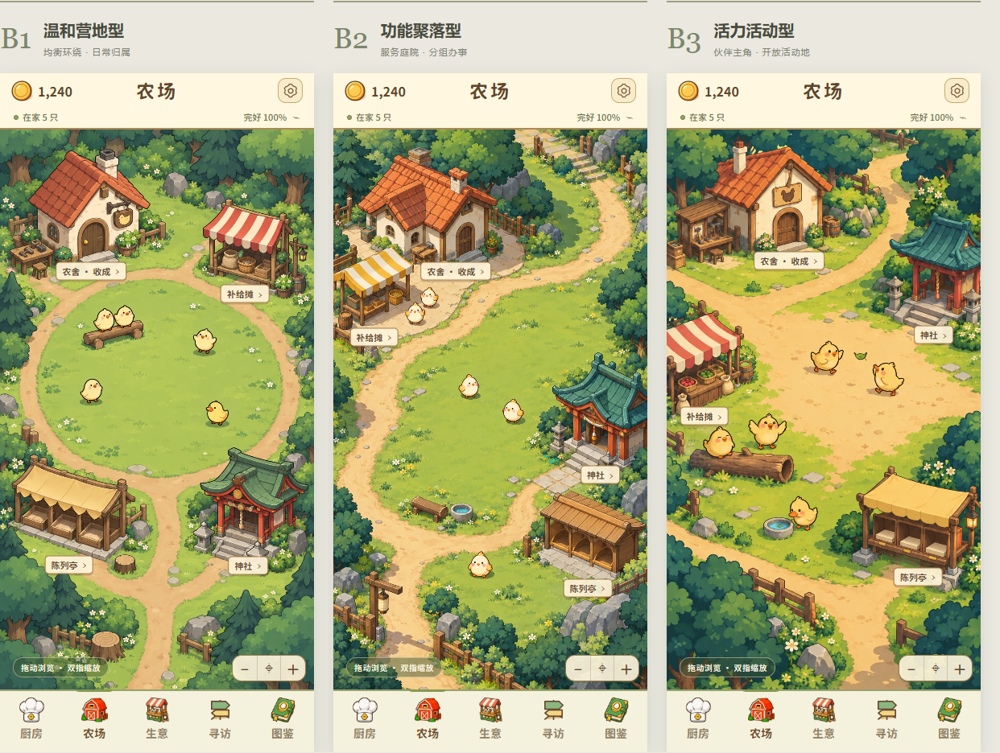

# 《鸡宝厨房》Farm · B Direction Scene Gate

2026-09-28｜完整场景候选，等待用户与 Chat 判断。**B 已选定；三案均为轻斜俯视 / 3/4 oblique camp view。** 上轮推荐 A 的结论不再用于本轮。

[打开三案比较板](http://127.0.0.1:4173/web/prototypes/farm-b-scene-gate-20260928/index.html) · [本地比较板](../../../../web/prototypes/farm-b-scene-gate-20260928/index.html) · [生成提示词与来源](PROMPTS.md) · [核验记录](VALIDATION.md)

## 交付入口

每张主界面为 **390×844 PNG**，含顶部 HUD、场景、四处建筑短名、镜头操作示意和底部五栏。说明图同尺寸，用六个编号标出位置；编号只属于评审层。

| 候选 | 完整主界面 | 位置说明图 |
|---|---|---|
| B1 温和营地型 | [B1 · 390×844](../../../../web/prototypes/farm-b-scene-gate-20260928/deliverables/b1-390x844.png) | [B1 标注图](../../../../web/prototypes/farm-b-scene-gate-20260928/deliverables/b1-annotated-390x844.png) |
| B2 功能聚落型 | [B2 · 390×844](../../../../web/prototypes/farm-b-scene-gate-20260928/deliverables/b2-390x844.png) | [B2 标注图](../../../../web/prototypes/farm-b-scene-gate-20260928/deliverables/b2-annotated-390x844.png) |
| B3 活力活动型 | [B3 · 390×844](../../../../web/prototypes/farm-b-scene-gate-20260928/deliverables/b3-390x844.png) | [B3 标注图](../../../../web/prototypes/farm-b-scene-gate-20260928/deliverables/b3-annotated-390x844.png) |

三张说明图统一编号：**1 农舍／收成；2 补给；3 神社；4 陈列；5 中央活动区；6 整修台。** 比较板上的「显示建筑位置说明」可同时显示三案编号与图例。

## B1 · 温和营地型

1. **核心概念：** 完整椭圆草地＋均衡环路，四处设施围绕伙伴日常生活。中央留白最大、边缘最稳定，适合作为长时间停留的主界面。
2. **视角处理：** 中景偏远。主屋、神社和棚架都露出顶面与立面；前景建筑有更清楚的侧面和门阶。没有天空地平线，也不是只看屋顶的俯拍地图。
3. **画风借鉴：** 用深棕外轮廓、树冠色团、短接地影与暖／冷区域区分对象；保留鸡宝奶油黄和暖红屋顶，整体比塔塔参考更温和。
4. **功能组织：** 左上农舍与整修台，右上补给，左下陈列，右下神社；短路从环路接到各建筑门前，中央伙伴在木凳与草地停留。
5. **最大风险：** 环路规整，可能更像陈列庭院；后续需要用少量自然错位和伙伴动线增加生活感，避免继续堆草花。

## B2 · 功能聚落型

1. **核心概念：** 两组庭院围住中央草地。左侧是农舍／补给的服务组，右下是神社／陈列的安静组；功能邻接关系最明确。
2. **视角处理：** 中景。S 形斜向主路形成纵深，主屋显示屋顶、两面墙与门阶，右侧设施前后错开；默认视野允许摊位侧缘、神社屋檐少量出屏。
3. **画风借鉴：** 学习塔塔「设施成组、空地分隔」的方式；石坪、木架、屋瓦共享光向和材质符号，地面颜色帮助分清服务区与活动区。
4. **功能组织：** 农舍与小工具台处于左上，补给紧邻下侧并共用石坪；神社与陈列沿右侧短路成组，伙伴在庭院边缘和中央草地停留。
5. **最大风险：** 大主屋与石坪会抢走中央伙伴的注意，纵长草地又可能让缩小后的角色太小；下一轮应优先校准建筑与伙伴的相对尺度。

## B3 · 活力活动型

1. **核心概念：** 开放沙地＋三处低矮生活边缘。追叶、木凳停留、探看水盆形成中央活动感，伙伴是三案中最明显的视觉主角。
2. **视角处理：** 中景偏近。后侧主屋、右中神社、右前陈列构成前后关系；门阶、侧墙、角色脚底阴影把各对象固定在同一地面。
3. **画风借鉴：** 更鲜明的黄绿、暖土色与深色轮廓；用简单姿态、稀疏脚印和接地影表达活力，不加奖励气泡或活动横幅。
4. **功能组织：** 主屋与整修在后侧，补给在左中，神社在右中，陈列在右前。分叉路径沿活动场边缘通过；低凳、水盆是环境道具，不新增功能入口。
5. **最大风险：** 生动姿态容易让玩家期待可点击小游戏；伙伴行为必须被定义为环境表现，不能暗示未实现的奖励、饲养或训练系统。

## 镜头附注

以下是**下一轮镜头设计约束**；本轮没有制造地图外延，也没有通过放大一张背景图宣称完成相机原型。

| 候选 | 默认镜头 | 缩小后应多看到 | 放大后应看清 |
|---|---|---|---|
| B1 | 中景偏远，完整中央椭圆和四个设施均可辨认 | 工具台西侧边界、南入口、林带与完整环路 | 木凳、伙伴、农舍门前；向两侧平移可查看陈列／神社 |
| B2 | 中景，先读左服务庭院和右静区，中央草地连接两者 | 左庭院完整轮廓、右侧支路、上方林间路和南入口 | 中央草地与服务庭院交界，农舍／摊位细节；右静区通过平移到达 |
| B3 | 中景偏近，中央姿态最可读，部分外围建筑侧缘出屏 | 左摊位全貌、神社右屋檐、陈列外侧与三条分叉路 | 追叶、木凳、水盆三处关系及建筑门阶；不会随放大新增玩法 |

共用原则：固定相机倾角，不旋转、不切回横向侧视；只做双轴平移与缩放。场地通过道路延伸、截断树簇和连续地面暗示世界延续。真正扩图时要补齐建筑边缘，不能把现有裁切边缘直接当相机极限。HUD、底栏、标签与缩放控件应保持屏幕字号；远景降低细节，近景也不堆状态泡泡。

## 保留的产品语义与 UI 边界

- 农舍仍进收成表；补给仍进小卖部；神社统一入口后分委托簿／御神签；陈列仍为三个纯展示位。
- 完好度入口在右上状态处，整修工具台附属于农舍。满值只表达「完好」，不新增工坊或升级线。
- 顶部样例为 1240 CP、在家 5 只、完好 100%；**不是用户存档，也不是已经接通的运行状态**。场景中五只伙伴只用于候选构图，不建立一只精灵等于一只库存的规则。
- 底栏复用项目原有厨房／农场／生意／寻访／图鉴图标。场景内只保留四处短名，没有活动条、红点群、计时器或奖励数字。
- 镜头控件与设置是外观示意。比较板只有评审标注开关，未接建筑操作、库存、昼夜、整修或真实拖拽缩放。
- 生成角色用于本轮姿态与尺度判断，未作为新角色身份入库；不替换正式角色资产。B3 陈列亭已从初稿草窝修正为三个空展示台。

## 场景方向判断与下一步

三案的实质差异是 **环路草坪 / 双组庭院 / 开放活动地**，同时改变地面材质分区、建筑邻接关系、角色尺度与日常姿态，不只是移动建筑。

若按「中央伙伴活动场」这一已冻结目标，我建议**优先评审 B3**；若更重视安静耐看，优先 B1；若更重视办事路径，优先 B2。尚未替用户选定，也未自动混合。可以讨论以 B3 的中央关系配合 B1 的克制装饰，但应先确定主构图，避免三案资产简单拼贴。

本轮环境的草花、瓦片仍比塔塔参考细一些。下一轮若选定方向，应统一降低非功能区域的细节密度，进一步校准建筑外轮廓与正式鸡宝角色的粗细关系。需要先检验色面与角色尺度，再决定最终美术细节。

**停止在完整场景方向 Gate。** 等待 Chat 与用户选方向或提出明确混合意见，然后进入 Farm Art Finalization 或 Farm Zoom / Camera Prototype。未修改正式 Runtime，未开始 Kitchen 或其它页面。
