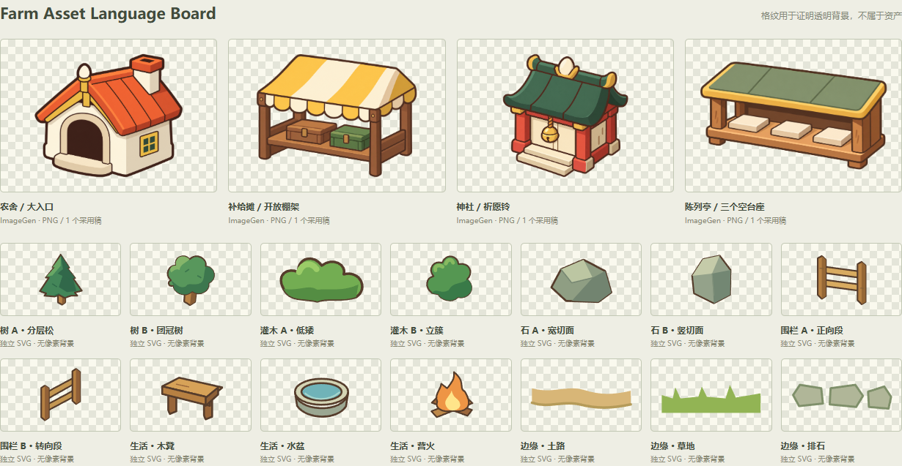
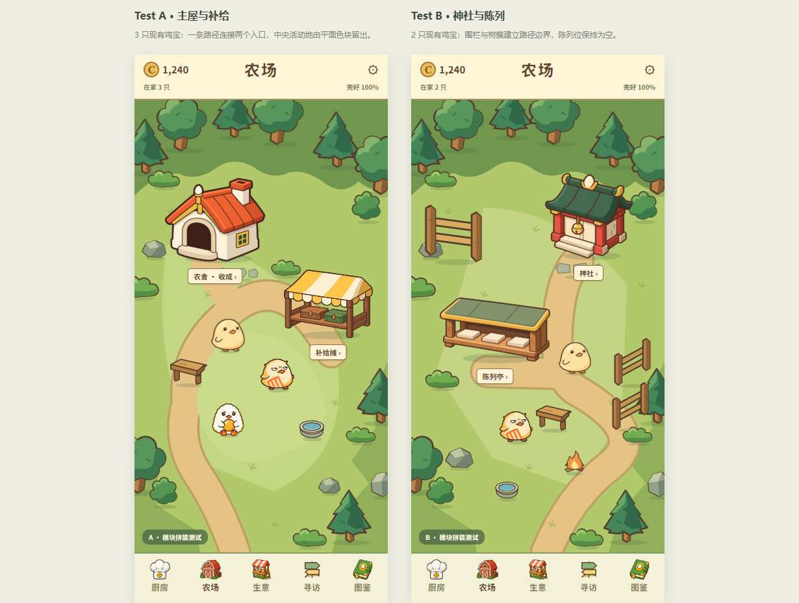
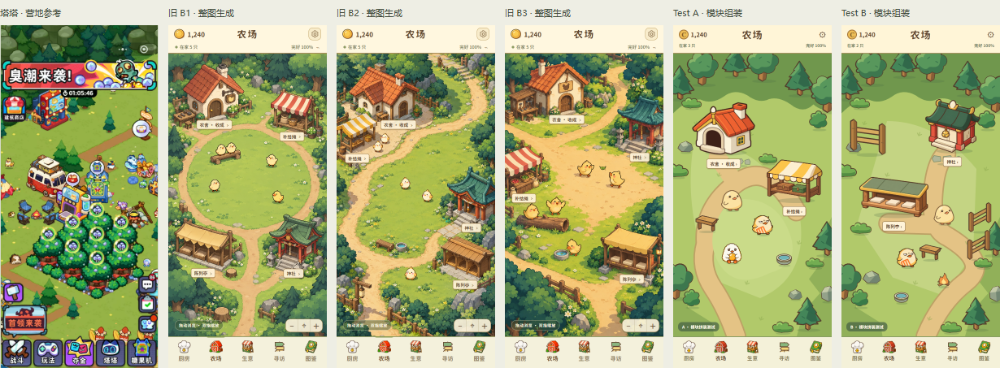

# Farm · Modular Asset Language Gate

2026-09-28 启动，2026-09-29 完成交付。**生产方法已切换；资产语言仍需局部修订，不自动放行完整 Farm。**

[打开资产与组装比较板](http://127.0.0.1:4173/web/prototypes/farm-modular-asset-gate-20260928/index.html) · [本地文件](../../../../web/prototypes/farm-modular-asset-gate-20260928/index.html) · [三张塔塔参考笔记](TATA-REFERENCE-NOTES.md) · [资产与提示词](ASSET-KIT.md) · [核验记录](VALIDATION.md)

## 1. Style Forensics

本轮先扫描根目录，逐张阅读三张参考并形成 [TATA-REFERENCE-NOTES.md](TATA-REFERENCE-NOTES.md)，再开始生成。第一张是加载插画，第二张是营地，第三张是活动玩法；没有把三张都当作营地组织证据。

**塔塔的建筑资产感：** 完整剪影、可辨认的顶／正侧面、被夸张的入口／设备正面、短接地暗部和少量材质符号。功能设施高对比，普通树石同色族重复。树、椅子、岩石、营火都能从周围地面中单独辨认出来。

**地面和对象分工：** 黄绿草地、棕色道路和空地提供连续平面；树林主要靠同类对象重叠组成边界。地面不承担远景透视、空气光和满屏材质细节。UI 标记和对象的对应关系清楚，但不迁移它的活动密度、紫黑外壳和数值系统。

**上轮问题来自生成任务的边界。** B1 实际提示词含 `Finished full-bleed environment`；B2 要求 `OUTPUT ONLY full-bleed scene artwork`；B3 同时指定地面、建筑、伙伴动作和树林。三案的 `board.js` 都把每案整张 PNG 放进 `.scene-art`，再叠标签。于是建筑、草地、阴影、角色与光照共同烘焙成一幅画。即使文字要求 cel shading，也不能在后续独立校准尺度、脚点、描边或遮挡。这不是单纯「细节太多」；是场景组织权仍交给了整图生成。

本轮以独立资产为单位，空间关系交给代码。环境小件采用代码原生 SVG，以准确控制轮廓、色块和复用；没有假称它们是 ImageGen 输出。

## 2. Farm Asset Language Board

| 类型 | 交付 | 制作方式 |
|---|---|---|
| 功能建筑 | 农舍、补给摊、神社、陈列亭各 1 个采用稿 | 4 张透明 PNG；农舍另有 1 个修正前稿，共 5 次内置 ImageGen 调用，无额外扩候选 |
| 自然环境 | 分层松／团冠树、低矮／立簇灌木、宽／竖切面石头 | 6 个独立透明 SVG |
| 边界 | 正向／转向围栏；土路／草地／排石边缘 | 5 个独立透明 SVG |
| 生活道具 | 木凳、营火、水盆 | 3 个独立透明 SVG |
| 角色 | 现有鸡宝、香煎鸡、荷包蛋鸡 | 复用 `characterImage(0,0/3/4)` 与现有 sprite 定义，不生成新角色 |

四栋建筑共享正面＋右侧面的斜俯视、暖棕轮廓、有限大色面和功能夸张。农舍用大门区分；补给是开放棚架；神社用祈愿铃、短柱与曲檐；陈列使用同一横台上的三个空台座，避免鸡窝语义。没有文字、UI 或环境地面烘焙进建筑。

透明格纹只在资产板显示，不属于图像。PNG 原字节保持不变，读取 alpha 边界后在 SVG viewport 中裁显示区域；不是从旧完整场景切碎取件。阴影由组装代码统一绘制为脚点右下短椭圆，物件内部的檐下和侧面暗部保留。

## 3. Test A · 主屋＋商店＋中央活动区

[390×844 原图](../../../../web/prototypes/farm-modular-asset-gate-20260928/evidence/test-a.png)

农舍位于左后，商店位于右中；一段弯路连接门前，中央浅草地留给三只现有鸡宝。树／灌木沿边界重复摆放，木凳和水盆作为低矮生活物件。只验证两个功能入口及活动区的关系，不声称这是完整 Farm。

## 4. Test B · 神社＋陈列＋路径边界

[390×844 原图](../../../../web/prototypes/farm-modular-asset-gate-20260928/evidence/test-b.png)

神社在右后，低矮陈列亭在左中；主路与短支路到达两处入口，转向围栏和树簇建立侧边界。两只现有鸡宝提供尺度参照，展示台保持为空。木凳、营火和水盆只是场景物件，不新增玩法。

**组装证据：** [移除建筑层](../../../../web/prototypes/farm-modular-asset-gate-20260928/evidence/layers-without-buildings.png)后，地面、路径、角色、树、道具仍完整存在；[脚点图](../../../../web/prototypes/farm-modular-asset-gate-20260928/evidence/anchor-debug.png)标出独立物件落点。比较板可开关建筑层、环境层和脚点。这些是只读评审工具，不是自由摆放或镜头原型。

## 5. 与塔塔及 B1/B2/B3 并排

每个槽为 195×422；旧版本与测试图为原屏一半尺寸，塔塔原图完整等比缩入同尺寸槽。不放大某个候选制造优劣，也不裁掉参考图的 UI 密度。

| 本轮要判断的事 | 从画面和组装可确认什么 | 尚未通过的部分 |
|---|---|---|
| 是否像同一游戏的对象 | 建筑暖棕边、功能剪影与同向侧面一致；现有鸡宝没有被重新解释 | PNG 与 SVG 的精细程度仍有差别，树冠还偏几何符号 |
| 是否更像游戏营地 | 路面与对象分离、同类树重复、建筑可独立删改；不再靠完整环境光粘合一幅画 | 这是两块稀疏测试场，不足以证明完整 Farm 的密度和主次已成立 |
| 是否减少整图插画感 | 草地没有空气透视；道路是程序色带；角色、道具、建筑尺寸由代码决定 | 建筑大面仍有轻微渐变，尚未完全达到纯硬边 2–3 色面的目标 |
| 建筑是否像功能入口 | 四种剪影明确，门／柜台／祈愿铃／展示台区别清楚，标签附着对应对象 | 主屋入口偏深洞，补给两个箱子偏空；仍需功能识别小修，不能补成杂货插画 |
| 地面／路径／林缘是否是程序组织 | SVG 地面路径与重复树簇可单独查看；路径没有烘焙进建筑 | 林缘疏密、路径宽度与接口还需在下一次资产修订中校准 |

原型曾把土路边缘／草地边缘当作孤立贴片摆入中心，视觉不成立，已从两块测试场撤下。这两类 SVG 保留在资产板作为**待修接口模块**，不能视作已通过的拼接组件。排石模块已用于门前。不会为了展示每个模块而强塞进场景。

## 6. 结论

**是否值得扩成完整 Farm？** 模块化生产方式值得保留，和 B1/B2/B3 相比明显减少了整图插画式组织。但这批资产语言只部分通过，暂不直接扩完整 Farm。

**哪些资产继续修？** 优先压平四个建筑剩余渐变，统一缩小后的线重；修主屋门洞深度与补给柜台识别；树冠增加少量自然错落但不增加叶片细节；重做土路／草地边缘的可拼接口。神社与陈列的功能剪影可作为较稳定基准，陈列三个空台座不改回格窝。

**下一步是否进入 Farm Modular Scene Assembly Gate？** 建议先完成上述小修并由用户／Chat 认可，再进入。当前已完成方法验证和两个小场景，停止继续生成，不自动扩大地图、接 Runtime 或制作缩放原型。
