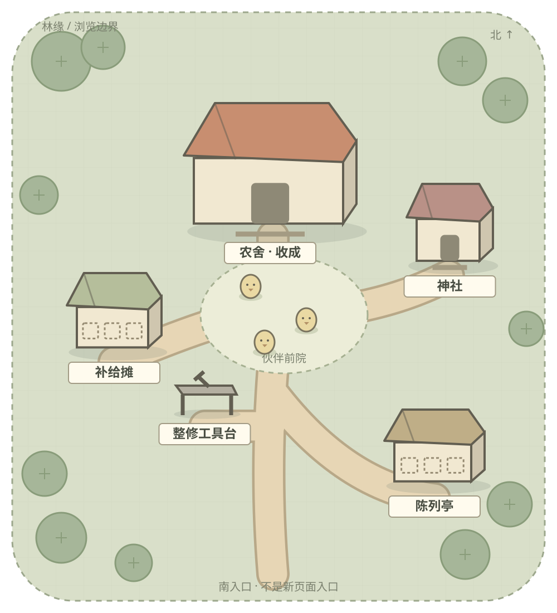
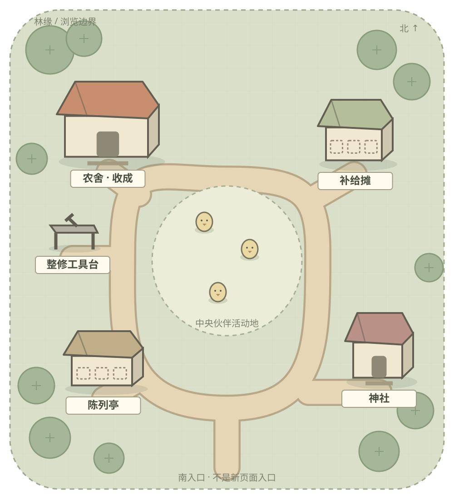

# 《鸡宝厨房》Farm · Reference + Product Reset Gate

2026-09-28｜提案，待 Chat 与用户评审。止于产品定义、布局与镜头；不代表美术定稿或已接入正式游戏。

**新 Farm 是一个固定建筑布局、可双轴平移与缩放的轻俯视伙伴营地；以农舍承接收成管理，让伙伴库存、神社事务与陈列拥有可辨认的场所。**

推荐优先讨论 **A「农舍营地型」**：它最直接承接当前收成管理这一核心用途。B「中央活动空地型」则更突出伙伴生活与浏览小世界的感受。两者使用相同功能集合，不靠增加玩法制造差异。

- [打开双方向可浏览蓝图](../../../../web/prototypes/farm-product-reset-20260928/index.html)
- [A 完整地图](../../../../web/prototypes/farm-product-reset-20260928/direction-a.svg) · [B 完整地图](../../../../web/prototypes/farm-product-reset-20260928/direction-b.svg)
- [交付核验](VALIDATION.md)

## 1. 证据与判断边界

| 证据 | 本轮用途 | 限制 |
|---|---|---|
| [用户提供的塔塔营地截图](evidence/tata-user-reference.jpg)，1256×2760 | 本轮画风、空间与 UI 拆解的第一参考 | 单张裁切营地；不能据此证明完整地图、操作方式、精确相机角度、建造规则或美术生产方式 |
| [正式 Runtime 审计](../kitchen-farm-audit-20260928/AUDIT-BOARD.md)及左／中／右截图 | 旧功能清单、入口重复与空间问题 | 历史隔离存档快照，不能代表用户存档 |
| `web/farm-theme.js`、`farm-scene.js`、`farm.js`、`app.js`、`inventory.js`、`world-clock.js` | 本轮读取当前正式代码，复核入口、库存、昼夜和镜头 | 代码与旧审计冲突时明确指出，不静默沿用旧结论 |
| [外部研究](../ui-art-reference-study-20260928/REPORT.md)、[页面矩阵](../ui-art-reference-study-20260928/PAGE-TYPE-MATRIX.md) | 对照观察方法和鸡宝成功页 | 不把旧报告的候选条款当作本轮已批准要求 |
| [旧 Architecture Gate](../kitchen-farm-architecture-gate-20260928/ARCHITECTURE-GATE-BOARD.md) | 保留有用功能判断，识别需要废弃的前提 | F1/F3 都基于横向三段，不再作为新 Farm 的布局基础 |
| J01 生意、J04 寻访、J07 图鉴留档，已直接看图 | 提取本项目已有视觉语言 | 成功页面参考样本，并非声明所有二级页面或现版本都已认可 |
| [本轮正式 Farm 快照](evidence/current-runtime-farm.png)与[入口记录](evidence/verification.json) | 隔离存档中进入当前 Farm、打开农舍收成表 | 样例为 3 只基础鸡宝、1240 CP；未使用用户存档，未验证全部状态 |

下文「观察」仅指图上可见或代码可核对的事实；「解释」是设计判断；尺寸、颜色比例、缩放阈值均为**本轮建议值**，不是从塔塔截图测出的规范。

## 2. 塔塔画风拆解

### 2.1 线、轮廓、颜色、体积与材质

| 项目 | 截图观察 | 为什么有效（解释） | 鸡宝转译 |
|---|---|---|---|
| 线条 | 外形以连续粗线包住；树冠用大锯齿／圆瓣，房车和设备用圆角矩形；内部接缝较细 | 先读剪影，再读部件，最后读装饰；线有明确职责 | 使用鸡宝的深棕外边；屋檐、门、牌子明确，木纹和草叶退后 |
| 轮廓强弱 | 设备、角色、气泡接近黑色重边；远处树林多为深绿边；地面小花很弱 | 不同对象不会全部像贴在前景的贴纸；功能物件能从同色环境中跳出 | 建筑＞树石＞地面三级；交互牌不沿用装饰细边 |
| 色彩结构 | 草地形成连续黄绿底；林缘偏深绿／蓝绿；房车和设施集中红、黄、蓝；状态环另用荧光绿 | 大面积同色底提供安静背景，高饱和只在少数节点集中 | 草地偏浅灰绿、路径奶土色；主屋暖赭红，神社低饱和朱色，状态沿用鸡宝绿／暖橙。色号待美术样张标定 |
| 阴影 | 树冠、石柱、设备可见几块明确明暗面；脚底与基座有局部暗部；少有长而写实的投影 | 不依赖复杂灯光也能区分顶、侧、落地；缩小后仍有体积 | 顶／正面／侧面用约三档明度，檐下和脚底加短影；夜景也保留这层级 |
| 材质 | 树叶用成团色片；石头用切面；房车用板缝、窗框、轮子；木件用短刻线；金属只留高光块与铆钉 | 少量符号足以说明材料，不必为每块表面填充随机细节 | 每种材质先限定 1–2 类识别符号，如木接缝、石切面、瓦片分段，禁止均匀铺纹 |
| 建筑比例 | 房车露出明显顶面和正侧面；售货设备的正面放大；角色仍以易识别正面出现 | 轻俯视负责布局，面向玩家的立面负责识别，功能比例优先于真实比例 | 固定斜俯视、平行投影感；屋顶可见且有门前地面，不画远山地平线；不锁死等距 30° 网格 |
| 地形体积 | 地面近乎平面，深色林石围边；高物件依靠重叠与底部接触建立深度 | 地面简单才容得下角色、路径与设施；体积主要由物件承担 | 建筑基座和树根有接地；场地边缘可有一档土坡，不加多层高低差系统 |

### 2.2 为什么看起来像成熟游戏，而不是拼图

这里评价的是**视觉一致性**，不能仅凭截图断言是否使用 AI 制作。

1. **资产共享形状和光影规则。** 同类树、设备的边、面、阴影一致；同一种材质不会一栋写实、一栋黏土、一栋水彩。
2. **每件物品有落脚点。** 房车、机器、树干的基座和遮挡关系可解释，角色也贴地；不是漂浮图标散落在背景上。
3. **细节有预算。** 脸、入口和设备正面细节集中，草地大块留空。不是每平方厘米都被草花、亮边和纹理填满。
4. **重复受控制。** 下部同类树形成可数、可扫读的群组；树形和状态槽复用，位置错开。这种规律比随机生成的「处处不同」更像系统。
5. **交互标记有归属。** 白气泡尾巴指向设施，绿色数值圈落在同类树上；文字不是无主地飘在地面上。
6. **前后层级稳定。** 草地、路径、树石／建筑、角色、状态、屏幕 UI 的关系清楚。后续实现仍须定义遮挡排序，截图本身不能证明排序算法。

需要保留批判：这张截图顶部活动横幅十分抢眼，下部重复数字圈较密，遮住部分景物。它的「画风统一」不等于「信息密度值得全盘复制」。本项目第一版主动降低这种叠加密度。

## 3. 塔塔营地组织拆解

### 3.1 空间不是一排背景建筑

- **观察：** 地面贯穿前后，没有天空地平线；路径斜向穿过草地，并在下方转折。房车、机器、篝火座椅和烹饪道具构成中部聚落，同类树在下方集中；上方和两侧树林建立边缘。
- **解释：** 连续地面让设施之间存在可理解的距离。功能群组＋路径＋留白比「左一栋、中一栋、右一栋」更像营地。
- **边界：** 图片被 UI 和屏幕裁切；无法证明房车是全游戏主建筑，也不能从路径推断角色一定可沿它行走。

### 3.2 主次分层与阅读顺序

| 层 | 图上作用 | 可借鉴规律 |
|---|---|---|
| 主要设施聚落 | 房车和亮色设备集中，形状与背景树显著不同 | 主功能用尺寸、色彩、门前留白共同定义，不只靠文字写「主屋」 |
| 次级设施 | 左上设备、右侧烹饪点、散布的设施与角色 | 以短路径或邻接关系组成小组，不让所有建筑等距等大 |
| 同类生产／状态对象群 | 下方树群重复，数字圈可逐个对应 | 同类对象可成簇；本 Farm 没有该生产语义，不引入果树收取 |
| 空地与路 | 分隔功能簇，给角色提供活动背景 | 空地是阅读间隔和伙伴舞台，不能被后续按钮逐步占满 |
| 林缘 | 深色、重复、连续 | 作为地图边界和构图框，不作为新可探索地区承诺 |

**场景层阅读顺序（推断）：** 中部亮色房车／设备 → 邻近功能气泡 → 下方成组对象 → 路径与周边小点。**整屏实际注意顺序：** 顶部巨幅活动条和底栏也会先抢视线。两者需区分，不能说参考图完全由主建筑主导。

「有内容但不乱」主要来自区域内的重复规则、区域之间的空地和不同层的对比差异；并非对象少，也并非每件东西都贴文字标签。

### 3.3 UI 如何叠在场景上

世界内状态贴对象、屏幕级导航贴边缘；两者共享粗轮廓、圆角和强色块，因此虽是不同坐标层，风格仍相连。描边和白底气泡给状态提供稳定对比，不依赖背后是哪块草地。

鸡宝应迁移这种**层次与归属关系**，用自己的深棕、奶油底和绿色状态。固定五栏与场景分区；全局 HUD 不随地图缩放；场景标牌锚定建筑，文字保持屏幕可读尺寸。塔塔的顶部横幅、倒计时、满屏红点与重复数字圈不迁移。

## 4. 与鸡宝成功页面对齐

| 页面 | 已直接看图的游戏感来源 | Farm 采用 | 不机械复制 |
|---|---|---|---|
| [生意 J01](../ui-art-reference-study-20260928/evidence/J01.png) | 两篮一盘的大角色是主对象；营业牌、数量牌贴着对应容器；柜台线分开商品和管理 | 农舍／收成入口有主位，伙伴有明确活动承托，状态贴对象 | 不把营地排成三个商品篮，也不把所有建筑压进卡片 |
| [寻访 J04](../ui-art-reference-study-20260928/evidence/J04.png) | 连续河道连接错位地标；地标和路牌比背景更清楚；棕边、奶绿、橙旗统一 | 同一地面内错位排建筑，路径连接门前，立面可读 | 不把 Farm 做成四个静态旅行节点；Farm 有可浏览的连续空间 |
| [图鉴 J07](../ui-art-reference-study-20260928/evidence/J07.png) | 贴纸占主位，未知位保留；纸页、章、夹签表达收藏规则 | 真实功能具有稳定载体，陈列点空时仍保持位置与身份 | 不把营地整体做成纸张或给每栋房子白色贴纸边 |

统一的不是背景纹理，而是**鸡宝比例与表情、深棕轮廓、暖浅底色、少量明暗面、状态附着物件**。Farm 可以提高树石的块面感和空间层次，但不能突然变成塔塔的黑边紫色科幻界面。

### 借鉴边界

**应该借鉴：** 轻俯视连续地面；设施成组而非横排；可识别剪影；按职责分配明度与饱和度；少量色面造体积；符号化材质；门前空间与路径连接；世界状态和屏幕 UI 分层；稳定资产语法。

**不能直接照搬：** 房车、机器、树种及角色的具体设计；具体地图摆位和路径；黑紫 UI 外壳、字形与图标；数字「35」、活动倒计时、付费／活动条；塔塔的成长、收取、建筑购买、自由布置或经济系统。参考截图不进入游戏资产，也不裁成生产素材。

## 5. Farm Product Reset

### 5.1 第一版的玩家任务

进入营地 → 看见伙伴生活与营地状态 → 点农舍管理收成，或点次要设施办事 → 关闭二级页面后回到原镜头。平移与缩放用于看清营地，不消耗资源，不移动建筑。

第一版固定 **4 个功能目的地＋1 处整修设施**：农舍、补给摊、神社、陈列亭；工具台附属于农舍服务区，不再新设一栋「升级工坊」。不增加种田、采集、喂食、角色派驻、设施生产、建造或自由装修。

### 5.2 旧语义 → 新载体

| 旧语义／当前事实 | 保留内容 | 新产品定义（提案） |
|---|---|---|
| 农舍牌与底部收成表都进入 `openAlbum` | 鸡鸭库存、筛选、选择数量、保留一只、预留、奖励、出售及详情 | 农舍是唯一主要场景入口；全局固定的「定位」菜单只移动镜头到农舍，不复制管理操作 |
| 补给摊进入小卖部默认厨具页 | 既有商店页与购买流程 | 场景叫「补给摊」，进入后仍是既有小卖部；不暗示多人集市或新增交易 |
| 神社牌进入委托簿，底部神社进入御神签 | 两条真实功能均保留 | 一个神社建筑 → 轻量选择层「委托簿／御神签」，再进入现有子页；关闭返回原镜头。消除同名异目的入口 |
| 陈列架进入收藏册的纪念物分类，有 3 个陈列位 | 纯展示、已有收藏与槽位；无数值、耐久、出售 | 次级陈列亭，靠生活区侧边；蓝图用三个空位表示，不虚构收藏内容 |
| 完好度随时间下降、CP 整修、低完好度逃走检查 | 原费用与后果规则 | 顶部小状态持续可见；工具台是整修载体。100% 显示「完好」，不提供 0 CP 确认；1–99% 可点查看费用；低于 30% 一枚文字＋图形警示 |
| 伙伴可见性按品种与时段；当前展示按可用种类采样，不是一只库存一个精灵 | 昼夜与伙伴身份，不改变库存权益 | 活动草地显示代表性伙伴；角色活动不新增点击玩法。数量读账本／摘要，不能数草地上的精灵当库存 |
| 全局五栏、CP、设置 | 跨页导航与全局货币／设置 | 五栏保持。Farm 标题替代厨房等级的视觉主位；不把厨房升级误称 Farm 等级（其入口仍属于 Kitchen） |

**库存口径必须纠正后再接入。** 当前 `farm-scene.js` 的「在家」实际直接求和 `s.farm`（总量 T）；旧审计称它为可用库存，二者不一致。`inventory.js` 已明确定义：外出占用 R、营业占用 S、订单预留 Q；在家为 `T−R−S`，可安排为 `T−R−S−Q`。新版建议摘要「在家 X 只」，展开说明「可安排 Y 只」，种数按同一口径计数。草地继续是代表性展示；不能把夜间隐藏或订单预留解释成失去伙伴。本轮不修改数据或计算代码。

空态分开表达：总量为 0 →「去厨房孵化伙伴」；有在家伙伴但当前时段不露面 →「这个时段，伙伴暂未露面」；都在外出／营业 → 展示实际去向。不要统一写「正在睡觉」，现有规则无法证明所有隐藏品种都在休息。

### 5.3 应废弃的组织

- 830 逻辑像素宽、一维 `farmScroll` 的旧横向空间；左／中／右章节、切段箭头与横向进度条。
- 「一张横幅背景＋上沿建筑＋下方大片草地＋透明入口」作为未来地图的基础。旧图保留历史证据用途，不整体铺进新地图。
- 固定底部「整修／神社／收成」三按钮与建筑重复争主位；新底部仅保留全局五栏。
- 神社同名异目的、Farm 等级却跳厨房升级的语义混用。
- F1/F3 三段式原型的镜头和位置判断。其「建筑即入口」「神社合并」「低频整修降权」可以保留。

## 6. 共用镜头与交互定义

这是二维场景的平移／缩放相机，不引入旋转、自由倾斜、3D 漫游或玩家移动建筑。

| 档位 | 建议倍率（相对全景适配） | 看什么 | 保留 UI |
|---|---|---|---|
| 远景／总览 | 1.0× | 完整营地轮廓、4 个功能地标、道路连接、主活动空地；角色看作小点 | 固定 HUD、完好度、五栏、缩放／复位／定位；地标短名与至多一枚优先待办标记 |
| 默认／日常 | 1.45× | A 主屋＋前院与最近设施；B 中央伙伴区＋周边入口的方向关系 | 上述固定 UI；视口内建筑短名；不显示所有数量和气泡 |
| 近景／观察 | 2.2×，上限 2.4× | A 农舍门前、收成牌、工具台和伙伴；B 中央伙伴、路径接点，平移可看单栋建筑 | 固定 UI不放大；选中建筑显示动作说明；不在角色头顶新增姓名／数值条 |

**几何定义。** 蓝图均使用 1000×1100 世界单位。地面边界是封闭圆角场地，最外圈约 70–90 单位只放边缘树石，关键建筑保持内缩。`fit=min(安全视口宽/1000, 安全视口高/1100)`，实际缩放为 `fit×倍率`。安全视口排除顶部 HUD、底栏与设备安全区；小屏窄时允许上下留边，不能把地图拉伸填满。

**平移。** 单指／鼠标拖动两个方向；超过约 8 CSS px 后视作拖动并取消本次建筑点击。硬边界约束，不拖出空白世界；当某轴场地小于视口时，该轴居中。第一版不依赖惯性。关闭子页恢复中心点、缩放和选中建筑；切出 Farm 后本次会话保留，首次进入用默认镜头。

**缩放。** 双指中心或滚轮指向的位置尽量保持不动；夹取后不触发建筑。＋／− 提供单指替代；「全景」回总览，「归位」回本方向默认镜头。键盘方向键可平移；定位菜单提供无需拖动的建筑发现方式。原型已演示这些镜头手段，但不代表正式触摸体验验收。

**标牌与点击。** 世界跟随缩放，短名与状态标记使用屏幕尺寸；远景收起细节，碰撞时只保留优先标牌，其余从定位菜单访问。功能入口触区建议至少 44×44 CSS px，不能跨两个建筑；过密时先聚焦再操作。树、花、草地不画成可点击按钮。

**状态优先级。** 全局保留完好度；低于 30% 优先提示整修，其次是神社真实可领取项。场景同屏最多一枚主动提示，不以热闹为由补红点；其它状态进入建筑后查看。数值应在二级界面核对，缩放不能改变可操作资格。

## 7. Direction A · 农舍营地型

### Blueprint Summary

**「先回家，再办事。」** 主屋位于上中部，是全图最大、最暖的建筑；伙伴前院在它门前，补给与整修组成生活服务侧翼，神社沿短支路退到安静一侧。布局像一个经营营地，主要入口在首次视野里。

成立理由：当前最重要的收成管理落在最可记忆的场所；前院让库存不再只是数字。不是把旧三段压成一屏，而是让空间围绕主屋形成邻接关系。

| 对象 | 世界范围 x / y / w / h | 功能与关系 |
|---|---|---|
| 农舍 | 330 / 185 / 310 / 235 | 最大建筑，门朝前院；收成表入口，主视觉锚 |
| 补给摊 | 120 / 490 / 170 / 145 | 主屋左下，连接前院左支路；次功能 |
| 神社 | 730 / 330 / 155 / 150 | 右上独立小庭，短支路接主路；与主屋有空隙，不争最高体量 |
| 陈列亭 | 690 / 735 / 180 / 140 | 右下伙伴散步侧路，展示次于库存；三个空陈列位 |
| 整修工具台 | 310 / 660 / 115 / 85 | 主屋服务侧，邻接前院；小设施，不变成另一栋主建筑 |
| 伙伴前院 | 中心约 510 / 570，椭圆约 300×210 | 主屋与南入口之间；少量伙伴活动，保留留白 |
| 路径 | 南入口→前院→主屋门；向左接摊位、向右分接神社和陈列 | 树不能挡路端，路径必须落在门前／摊前，避免装饰线悬空 |
| 景观 | 西北树簇、北缘灌木、东侧小石坡、南缘疏树 | 包住场地，不在前院填花坛；装饰无功能 |
| 镜头边界 | 全图 0–1000 × 0–1100；默认中心约 490 / 485；近景中心约 490 / 420 | 近景优先农舍门前；边缘设施能通过双轴平移和定位到达 |

**Zoom Spec。** 总览首先看见主屋和放射状联系；默认镜头仍能理解前院与补给关系；近景看主屋立面、门前伙伴和牌子。远景主屋名称保留，工具台只留简图；近景选中工具台才出现整修说明。无论远近，全局完好度都可见。

**最大风险：** 主屋做得太大，容易从「主锚点」变成遮挡伙伴和路径的大墙，也可能再次退回「上部屋子、下部草地」。须保留左右错位建筑、右后神社与纵深支路，前院不能变成第二条横向舞台。

**美术难点：** 同时看清屋顶和门；屋檐遮挡不能盖住门牌；暖屋顶要突出但不能把鸡宝压成配角。后续先验证主屋＋工具台＋一个伙伴的尺寸、投影与棕边一致性。

## 8. Direction B · 中央活动空地型

### Blueprint Summary

**「先看伙伴，再沿路逛。」** 中央保留大块活动草地，农舍、补给、神社和陈列分居周边，环路加短支路连接各门前；主屋依然承接核心功能，但只略大于次建筑。

成立理由：中央空白成为伙伴生活的视觉主角，周边地标形成可浏览小世界。这里的「活动」指伙伴日常停留、散步，不引入运营活动、小游戏或新调度规则。

| 对象 | 世界范围 x / y / w / h | 功能与关系 |
|---|---|---|
| 农舍 | 125 / 180 / 225 / 180 | 西北，朝中央开门；首要功能但不占中央 |
| 补给摊 | 700 / 220 / 165 / 145 | 东北，环路旁，鲜明棚顶作路标 |
| 神社 | 760 / 690 / 150 / 155 | 东南静区；树石围合但入口不藏起来 |
| 陈列亭 | 140 / 730 / 175 / 130 | 西南，靠散步边缘；不抢中央 |
| 整修工具台 | 105 / 465 / 110 / 85 | 西侧主屋服务支路；不是中央建筑 |
| 中央活动地 | 中心约 500 / 555，椭圆约 330×370 | 伙伴为主；允许空态，禁止后续用无关建筑填满 |
| 路径 | 南入口接环路；环绕中央草地，四条短支路到设施门前 | 中央不画密集十字路；路径是组织边界，不是强制角色寻路系统 |
| 景观 | 林缘闭合、东北岩石、外侧疏灌木；中央仅少量低草 | 建筑之间有间隔；不在中央种高树遮住伙伴 |
| 镜头边界 | 全图 0–1000 × 0–1100；默认中心约 500 / 555；近景同中心 | 近景突出伙伴，可平移浏览外围；全景及定位始终可用 |

**Zoom Spec。** 远景同时理解「四周建筑＋中央留白」；默认看中央活动地及环路，周边建筑可能部分离开视口；近景看伙伴和路缘小物，点定位可聚焦农舍或神社。固定「定位」入口解决近景找不到外围建筑的问题，不在四边新增一圈快捷操作按钮。

**最大风险：** 低库存或夜间时中央可能显空；日常收成入口离中心更远，发现成本高于 A。应通过在家口径、空态短句、少量环境节奏与可见路径解释场景，不用无来源的 NPC／伙伴或一堆活动气泡填空。

**美术难点：** 四边建筑朝向要服从同一投影语言，同时把最可识别的面留给玩家；远端不能写实缩小到看不见。中央草地要有边界与少量色面变化，不能铺成写实纹理毯。

## 9. 下一步与评审门槛

可直接比较[双方向远景截图](evidence/blueprints-overview.png)、[A 近景](evidence/direction-a-near.png)与[B 近景](evidence/direction-b-near.png)。低保真地图的几何色块用于判断排布，不代表本轮画风拆解已经转化为合格的游戏美术。

| 判断项 | A | B |
|---|---|---|
| 收成管理可发现性 | 强：主屋与前院主导 | 中：须依赖路标／定位 |
| 伙伴生活的主角感 | 前院生活，收敛 | 中央生活，更强 |
| 浏览与探索感 | 较紧凑 | 较强，周边切换更多 |
| 低库存／夜间空态稳定性 | 建筑仍能支撑构图 | 中央空地更依赖留白设计 |
| 后续美术首要任务 | 主屋体量与前院层次 | 环路秩序与四向设施一致性 |

**建议下一轮优先以 A 为工作候选，由用户／Chat 判断是否接受；本轮不自行冻结。** 若更看重看伙伴与逛营地，就选择 B，并接受功能入口发现成本的增加。不要拼成「A 巨型主屋＋B 完整中央广场」，那会同时挤压路径和活动空间。

评审时应能明确回答：①新定位是否接受；②A 或 B 哪个体验优先；③主屋、补给、神社、陈列和整修载体是否准确；④远景是否一眼理解，近景能否找到主功能；⑤是否同意视觉方向为「鸡宝暖棕语言＋塔塔块面、轮廓与营地秩序」。

通过后，下一轮才做选定方案的**局部画风样张**（一栋建筑、一棵树、一个角色、一个入口牌），同时在 390×844 与 320×568 比较远近镜头。样张过关后再谈全图资产和 Runtime 接入。本轮不生成最终 Farm 大图，不开始 Kitchen，不改其它页面。
