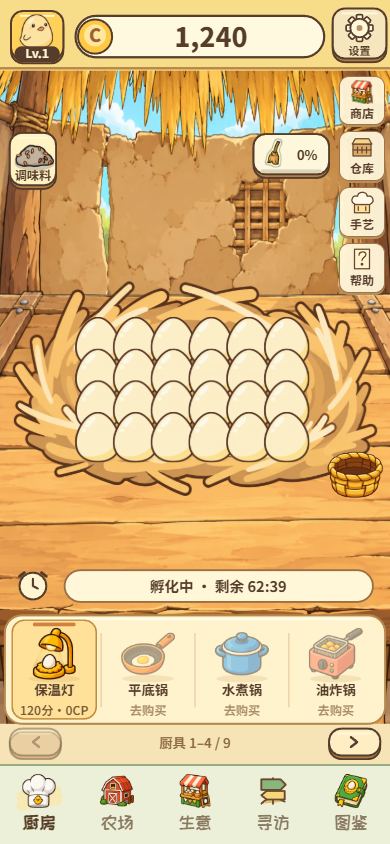
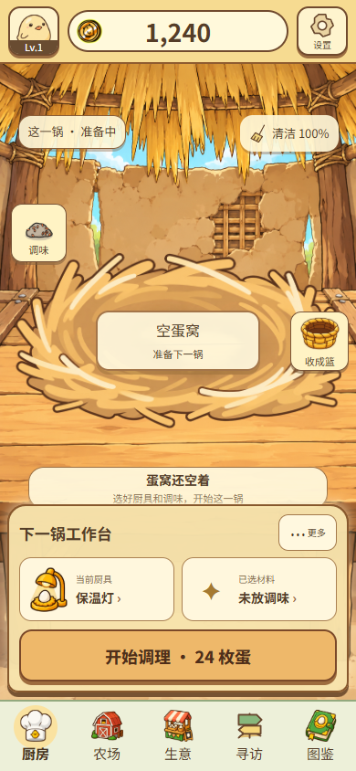
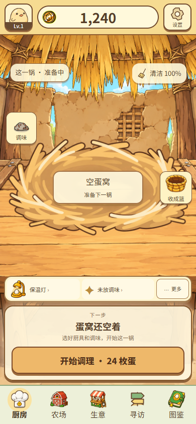
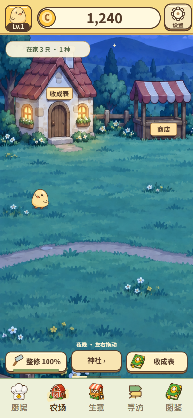
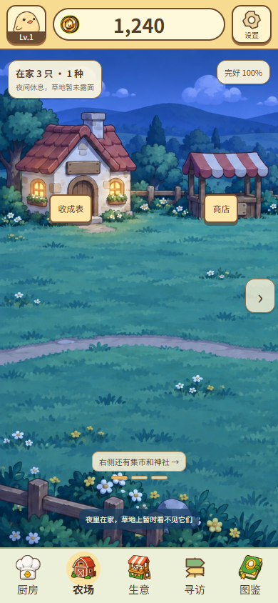
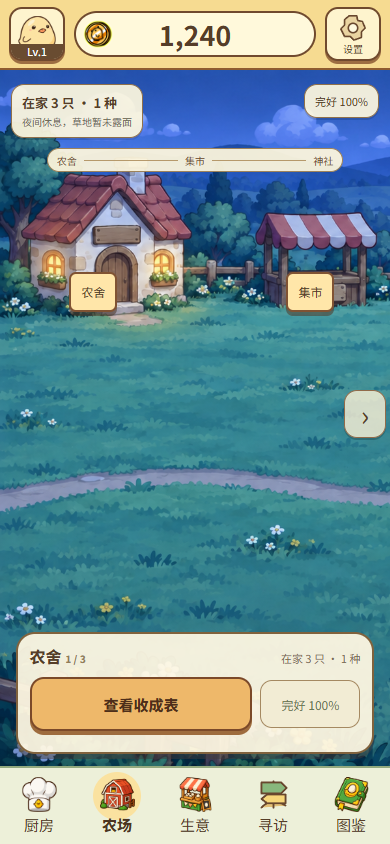

# 《鸡宝厨房》Kitchen / Farm · UI Architecture Visual Gate

**性质：Experiment / Prototype。** 本板只比较完整手机主屏的信息架构、位置、状态层级与交互骨架。正式 Runtime、正式素材和玩家存档未接入或改动。复用当前正式素材只是为了让结构可判断；所有视觉细节仍待 Creative Direction。

[打开可交互 Architecture Gate Board](../../../../web/prototypes/kitchen-farm-architecture-gate-20260928/index.html) · [查看全部 27 张候选手机截图及验证记录](../../../../web/prototypes/kitchen-farm-architecture-gate-20260928/evidence) · [上一轮 Product + UI Architecture Audit](../kitchen-farm-audit-20260928/AUDIT-BOARD.md)

预览入口：本地项目服务运行时访问 `http://127.0.0.1:4173/web/prototypes/kitchen-farm-architecture-gate-20260928/index.html`。Board 顶部可切换 Kitchen 四个阶段、Farm 左中右三段、完好度和 390×844 / 320×568。手机里的操作入口只显示原型反馈，不执行正式功能。

## 1. Kitchen · 同屏 Before / K1 / K3

| 正式 Runtime Before | K1 · 蛋窝中心＋底部工作台 | K3 · 阶段焦点切换 |
| --- | --- | --- |
|  |  |  |

**K1 固定关系：** 大蛋窝与邻近批次状态在中段；下段固定“下一锅工作台”，持续显示厨具、调味和本阶段主操作。调味罐、清洁用品语义及收成篮作为轻量场景入口；其他低频功能收在“更多”。

**K3 固定关系：** 保留相同蛋窝、调味与收成篮；底部细轨持续显示厨具和调味，主面板只随当前阶段变更。空锅开锅、孵化提醒、逐只收取、整锅收完安排去向分别占主位。

| 阶段 | K1 主 CTA | K3 主 CTA | 蛋窝 / 篮子反馈 |
| --- | --- | --- | --- |
| 空锅 | 开始调理 · 24 枚蛋 | 开始调理 · 24 枚蛋 | 空蛋窝，提示准备下一锅 |
| 孵化中 | 查看孵化时间 | 开启孵化提醒 | 24 枚蛋与倒计时，未熟蛋无收取热区 |
| 部分可收 | 去蛋窝收取 · 4 只 | 去蛋窝收取 · 4 只 | 4 枚可收蛋有独立触点；其他蛋只显示状态 |
| 全收完 | 安排本锅收成 | 安排本锅收成 | 蛋窝显示已收完，篮子改为安排收成入口 |

**四阶段完整 390×844 截图：** [K1 空锅](../../../../web/prototypes/kitchen-farm-architecture-gate-20260928/evidence/k1-empty-390.png) · [孵化中](../../../../web/prototypes/kitchen-farm-architecture-gate-20260928/evidence/k1-incubating-390.png) · [部分可收](../../../../web/prototypes/kitchen-farm-architecture-gate-20260928/evidence/k1-ready-390.png) · [全收完](../../../../web/prototypes/kitchen-farm-architecture-gate-20260928/evidence/k1-done-390.png)；[K3 空锅](../../../../web/prototypes/kitchen-farm-architecture-gate-20260928/evidence/k3-empty-390.png) · [孵化中](../../../../web/prototypes/kitchen-farm-architecture-gate-20260928/evidence/k3-incubating-390.png) · [部分可收](../../../../web/prototypes/kitchen-farm-architecture-gate-20260928/evidence/k3-ready-390.png) · [全收完](../../../../web/prototypes/kitchen-farm-architecture-gate-20260928/evidence/k3-done-390.png)。

**320×568 压力截图：** [K1 空锅](../../../../web/prototypes/kitchen-farm-architecture-gate-20260928/evidence/k1-empty-320.png) · [K1 可收](../../../../web/prototypes/kitchen-farm-architecture-gate-20260928/evidence/k1-ready-320.png) · [K3 空锅](../../../../web/prototypes/kitchen-farm-architecture-gate-20260928/evidence/k3-empty-320.png) · [K3 可收](../../../../web/prototypes/kitchen-farm-architecture-gate-20260928/evidence/k3-ready-320.png)。小屏保留可收蛋、厨具、调味与 Bottom Navigation 的独立点击区。状态短句移到蛋窝上缘，避免与最后一排蛋挤在一起。

## 2. Farm · 同屏 Before / F1 / F3

Board 的区域切换器可对同一左 / 中 / 右视口同步比较正式截图、F1 与 F3。以下为农舍段基准：

| 正式 Runtime Before | F1 · 建筑即入口 | F3 · 横向章节＋随段焦点 |
| --- | --- | --- |
|  |  |  |

| 区域 | F1 · 物件入口 | F3 · 当前行动区 | 横向发现 |
| --- | --- | --- | --- |
| 农舍段 | 农舍牌进收成表；摊位可在视口中直接进入商店 | 行动区“查看收成表” | 右箭头与“右侧还有集市和神社”；F3 另有三段细标尺 |
| 集市段 | 摊位商店；陈列架保持次级 | 行动区“进入小卖部” | 左右箭头、地点短句与进度条 / 三段细标尺 |
| 神社段 | 神社牌打开神社语境，再明确“看委托簿 / 求御神签” | 行动区并列明确命名“查看委托簿 / 求御神签” | 左箭头与返回农舍、集市的提示 |

**F1 三段完整 390×844：** [农舍](../../../../web/prototypes/kitchen-farm-architecture-gate-20260928/evidence/f1-left-390.png) · [集市](../../../../web/prototypes/kitchen-farm-architecture-gate-20260928/evidence/f1-middle-390.png) · [神社](../../../../web/prototypes/kitchen-farm-architecture-gate-20260928/evidence/f1-right-390.png)。

**F3 三段完整 390×844：** [农舍](../../../../web/prototypes/kitchen-farm-architecture-gate-20260928/evidence/f3-left-390.png) · [集市](../../../../web/prototypes/kitchen-farm-architecture-gate-20260928/evidence/f3-middle-390.png) · [神社](../../../../web/prototypes/kitchen-farm-architecture-gate-20260928/evidence/f3-right-390.png)。

**320×568 三段验证：** [F1 农舍](../../../../web/prototypes/kitchen-farm-architecture-gate-20260928/evidence/f1-left-320.png) · [集市](../../../../web/prototypes/kitchen-farm-architecture-gate-20260928/evidence/f1-middle-320.png) · [神社](../../../../web/prototypes/kitchen-farm-architecture-gate-20260928/evidence/f1-right-320.png)；[F3 农舍](../../../../web/prototypes/kitchen-farm-architecture-gate-20260928/evidence/f3-left-320.png) · [集市](../../../../web/prototypes/kitchen-farm-architecture-gate-20260928/evidence/f3-middle-320.png) · [神社](../../../../web/prototypes/kitchen-farm-architecture-gate-20260928/evidence/f3-right-320.png)。

**完好度状态：** [F1 · 100%](../../../../web/prototypes/kitchen-farm-architecture-gate-20260928/evidence/f1-left-390.png) 只读状态；[F1 · 需整修](../../../../web/prototypes/kitchen-farm-architecture-gate-20260928/evidence/f1-repair-390.png) 才出现行动提示。[F3 · 100%](../../../../web/prototypes/kitchen-farm-architecture-gate-20260928/evidence/f3-left-390.png) 的行动区只有只读完好度；[F3 · 农舍段需整修](../../../../web/prototypes/kitchen-farm-architecture-gate-20260928/evidence/f3-repair-390.png) 出现整修次行动；[F3 · 神社段需整修](../../../../web/prototypes/kitchen-farm-architecture-gate-20260928/evidence/f3-right-repair-390.png) 在神社两项操作上方显示一条整修提示。夜景顶部同时写“在家 3 只”和“夜间休息，草地暂未露面”，让库存与空草地的关系可解释。

## 3. 取舍，不替用户选择

| 候选 | 得到什么 | 代价 / 需要继续验证 |
| --- | --- | --- |
| K1 | 工作台位置稳定，厨具和调味更容易记住；蛋窝仍是主视觉 | 小屏工作台吃掉更多场景高度；孵化与收取时“下一锅工作台”还会占据主位 |
| K3 | 画面聚焦当前阶段，主 CTA 与循环更直接 | 细轨需要长期保持厨具 / 调味可发现；阶段面板更新时要保持位置和操作记忆 |
| F1 | 建筑物与功能入口一一对应，世界感完整 | 中段可能显得空；右侧神社发现依赖明显方向提示和拖动反馈 |
| F3 | 三段当前区域与行动关系最清楚 | 必须准确判定当前视口；底部行动区不能逐渐膨胀成新的管理面板 |

**技术实现风险。** Kitchen 320 宽下 24 枚蛋视觉上密集；只有真正可收者应有触点，且触点、篮子、调味与工作台不能互盖。若进入正式实现，批次、清洁度、提醒与收成去向须接实际状态和解锁条件。Farm 要处理拖动与建筑点击的手势冲突、横向位置与当前段同步、白天 / 夜间可见库存规则，以及完好度变化时行动区的稳定切换。

**Creative Direction 保留项。** 字体、材质、按钮质感、昼夜光感、蛋窝与建筑的最终绘制、动效节奏和其他厨房等级的视觉延展均未在本 Gate 决定。没有生成新角色身份、发现或纪念物内容。

**取证与验证。** 截图用固定原型样本：Kitchen Lv.1、24 枚蛋、4 枚可收；Farm 夜景、在家 3 只 / 1 种、完好 100% 或 24%。这些数值不代表玩家实时存档。27 张候选屏在 390×844 与 320×568 下运行：页面错误 0、画面溢出 0、文字截断 0、低于 40px 的按钮热区 0。[查看逐屏机器记录](../../../../web/prototypes/kitchen-farm-architecture-gate-20260928/evidence/verification.json)。

**停止点：** 本 Gate 到此结束，等待用户和 Chat 选择下一 Gate。
