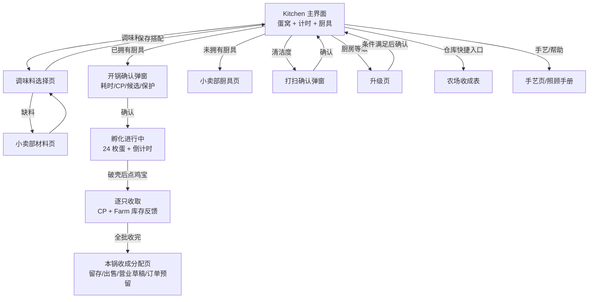
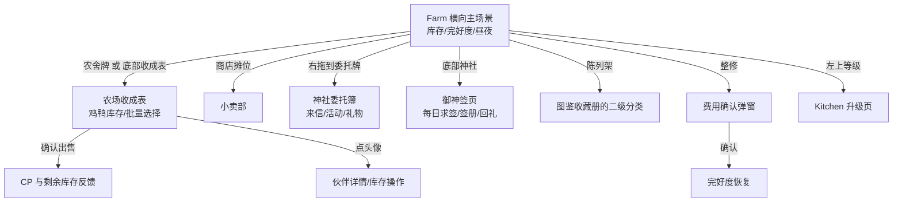

# 《鸡宝厨房》Kitchen / Farm Product + UI Architecture Audit

**Gate：结构判断输入，2026-09-28。** 本文件只审计当前正式 Web Runtime（`/web/index.html`）及其真实交互。截图在 390×844 竖屏、隔离本地存档中采集；演示存档为 Kitchen Lv.1、进行中的一批 24 枚蛋、农场仅持有原有基础鸡宝 3 只。采集时是夜间，基础鸡宝按现有昼夜规则不在草地上显示。未使用 Prototype / Experiment 图、Background A–D 或新美术作为当前事实；没有改动正式 Runtime。交互证据见 [runtime-inspection.json](evidence/runtime-inspection.json)，可用 [capture-runtime.mjs](capture-runtime.mjs)复现。

**证据口径。** `R`＝在隔离正式 Runtime 中点击验证；`C`＝当前正式代码可达、受状态条件限制；`J`＝本轮架构判断。截图是有代表性的状态，不等于所有可能状态。下面的“应放何处”均为候选判断，不是已经实现的功能。

## 1. 当前完整主界面

| Kitchen · 390×844 | Farm 左段 · 390×844 |
|:--:|:--:|
|  |  |

Farm 是 830 逻辑像素宽的横向场景，单张手机截图只能呈现一个视口。[中段](evidence/farm-middle-390x844.png)显示商店与陈列架，[右段](evidence/farm-right-390x844.png)显示神社委托；顶部 HUD、底部三项操作和五栏导航在拖动时固定。这三张共同组成 Farm 主界面取证。右段不展示任何纪念物内容。

### 共同框架与非点击对象

- 顶部 `Lv.1` 可点：Kitchen 打开厨房升级；Farm 先切回 Kitchen，再打开同一升级页。CP 数字只是状态显示；右上设置可点。`R` [app.js](../../../../web/app.js)、[scene.js](../../../../web/scene.js)
- 底部固定五入口依次为 **厨房、农场、生意、寻访、图鉴**。Kitchen / Farm 是场景；生意、寻访、图鉴是全页式独立体验。生意与寻访的红点只表示可领取/待处理结果；Farm 和 Kitchen 目前无对应红点。`C` [theme.js](../../../../web/theme.js)、[app.js](../../../../web/app.js)
- Kitchen 的 CP 框、计时条、蛋窝背景、篮子、墙架上的已选调味料、脏污痕迹只是显示；场景中可点的是另建的透明 hotspot。Farm 的“在家只数/种数”、行走鸡宝、昼夜天空、草地、拖动提示、横向进度条只是显示，行走鸡宝没有独立点击入口。`C/R` [scene.js](../../../../web/scene.js)、[farm-scene.js](../../../../web/farm-scene.js)

## 2. Kitchen 功能与状态表

**分类：** 核心＝高频核心操作；状态＝高频查看状态；低频＝低频操作；系统＝系统入口；二级＝可隐藏/二级展开。一个入口可兼有主次属性。

| 当前可点对象 / 入口 | 实际作用、子界面与动态状态 | 出现条件 | 重要度 | 长占主场景？适合的载体（J） |
|---|---|---|---|---|
| 蛋窝中的每一枚蛋 / 已破壳鸡宝，最多 24 个 | 孵化中点击不收取；破壳可收取，逐只给 CP 并进入 Farm 库存，首次收取会有临时发现反馈。24 只全部收完后出现“本锅已收完”。`C` | 有未收蛋时 | **核心＋状态** | **是**。自然错落蛋窝必须是视觉与交互中心；成熟/未熟应在对象附近分辨，避免把角色身份提前展示。 |
| 厨具带：当前显示 4/9 件，可左右翻页/横向滑动 | 已拥有厨具 → 开锅确认弹窗，显示蛋种、材料、耗时、CP、保鲜和可展开的候选/保护选项；若已有未收取批次，重新开锅会提示放弃。未拥有厨具 → 小卖部厨具页。厨具等级、耗时、价格、锁定状态逐件变化。`R/C` | 永久；各件状态变化 | **核心** | **是，但应集中为一个清晰操作层**。厨具是真实场景物件；购买与复杂规则适合二级弹窗/商店。 |
| 调味料入口、墙架上的已选材料 | 入口打开选择页，可选槽随厨房等级变化；库存数量、已选数显示，缺料可去商店补货并返回。墙架图只是结果回显。`R` | 入口永久；材料图仅选中后 | **核心＋状态** | **是**，但无需入口、墙架和开锅长文同时争夺注意；适合“场景容器＋轻抽屉”，数量在展开后。 |
| 鸡/鸭蛋切换 | 更改**下一批**蛋种，不影响当前批次；鸭蛋需商店开放才出现两枚切换按钮。`C` | `duck=true` | **低频，开锅前核心选择** | 放在配方/厨具准备区，常驻两枚按钮仅在确有选择时合理。 |
| 孵化计时条、可收数、闹钟 | 显示剩余时间与可收数。仅有未收蛋时，钟形按钮可开关提醒；Android 开启时可能先要系统通知权限。`R/C` | 计时与闹钟只在进行中；无批次显示“选择下方厨具开始” | **状态**；闹钟**低频** | 计时/可收提醒应紧贴蛋窝；闹钟可作旁边小状态开关，不应像主要行动。 |
| 清洁度按钮 | 百分比和进度条；点击“照顾小厨房”确认层，显示距离变脏时间、按比例计算的 CP、不可打扫/不足 CP。脏污达到 100% 会影响破壳结果，打扫清零；升级也会清洁。`R/C` | 永久；脏污纹理/可打扫状态变化 | **状态＋低频操作** | 应有常驻状态但不需要独立强按钮；可以成为墙面/清洁用品的环境指示，点击进入小弹窗。 |
| 左上厨房等级 | 进入升级整页：当前/下一状态、六件厨具门槛、CP、可升级/锁定，满足后再确认。`R` | 永久 | **低频操作** | 保留可发现的层级标记；详细条件进子页面。与顶部全局 HUD 合并考虑。 |
| “本锅已收完 · 安排收成” | 收完当前批次后进入本锅分配页：可留种、即时出售、营业草稿、订单预留；确认再改变状态。`C` | 仅 24 枚均收完 | **阶段性核心** | 应作为收完后的上下文 CTA，从蛋窝/篮子附近出现；不永久占位。 |
| 右侧商店 / 仓库 / 手艺 / 帮助四个快捷按钮 | 商店→小卖部厨具、材料、其他；仓库→农场收成表；手艺→技能方案/旧采购/旧路线；帮助→照顾手册。`R` | Kitchen 无面板时永久 | 商店**低频**；仓库**低频/状态**；手艺**低频**；帮助**系统** | **不宜四个都常驻**。商店可与缺料/锁定厨具上下文互通；仓库与 Farm 收成表同页；手艺进二级目录；帮助并入设置。 |
| 右上设置 | 音乐/音效/提醒、保存备份、手册等。`C` | 永久 | **系统** | 顶部小入口即可。 |
| 底部五栏 | 主场景之间、正式生意/寻访/图鉴之间切换。`R` | 永久 | **系统** | 保留全局层；Kitchen 快捷列不应重复争夺它已覆盖的跨页角色。 |

**状态组合（C）。** 空锅→准备配方；进行中→24 蛋与倒计时；部分可收→每枚破壳、`可收取 n / 剩余 n`；全收→本锅分配 CTA。另有锁定/已购/升级的厨具状态、鸡鸭蛋开放状态、调味料库存与槽数、0–100% 清洁度、提醒开关、CP 不足。开锅确认里还有保护、复刻等进阶选项，已经在二级层，无需升到主场景。[app.js](../../../../web/app.js)、[engine.js](../../../../web/engine.js)

## 3. Farm 功能与状态表

| 当前可点对象 / 入口 | 实际作用、子界面与动态状态 | 出现条件 | 重要度 | 长占主场景？适合的载体（J） |
|---|---|---|---|---|
| 农舍“收成表”牌；底部“收成表”按钮 | **同一个**农场收成表：鸡/鸭页、库存筛选、单只/批量数量、保留一只、为采购留货、经营奖励、出售结算；点头像进入详情。库存、售价、选中数量、CP 估价随状态变化。`R` | 永久 | **核心＋状态** | 收成/库存是 Farm 主用途；保留一个明确主入口，建议农舍承载，底部入口可做情境 CTA 或取消重复。完整表进子页面。 |
| 顶部“在家 X 只 · Y 种” | 当前可用 Farm 库存汇总，不是点击入口；夜间某些基础品种可能全部不显示在草地，但库存仍存在。`R/C` | 永久 | **状态** | **是**，要与行走角色/收成屋形成可解释关系；不能让“在家 3 只”与空草地显得矛盾。 |
| 商店摊位牌 | 打开与 Kitchen“商店”相同的小卖部；默认厨具页。`R` | 摊位在视口内 | **低频** | 可作场景物件，但应避免厨房、Farm、锁定厨具多处等权入口。可保留有场景语义的摊位，信息/操作仍在商店页。 |
| 神社“神社委托”牌 | 打开**神社委托簿**（来信、礼物、活动等入口）。`R` | 向右拖到神社段 | **低频/待领状态** | 场景物件合适；只有待领取/可操作时加小状态，不必长期与底部按钮并列强调。 |
| 底部“神社 ›” | 直接进入**神社御神签**求签页；与场景牌的目标不同。可领取礼物/收藏回礼时有 `!`。`R/C` | 永久 | **低频/待领状态** | 与场景委托入口名称近似、目标不同；建议统一成一个“神社”家入口，再分“委托/求签”，或保留场景牌而仅在待办时给底部提示。 |
| 陈列架牌 | 打开图鉴的收藏册“纪念物”分类与 3 个陈列位；纯陈列，没有数值、耐久或出售。`R/C` | 向右拖到中段 | **二级** | 既有功能可以保留为场景趣味，但不应是 Farm 主要操作，也不在本轮展示任何收集内容。 |
| 底部“整修 XX%” | 农场完好度随时间下降（每约 2 小时减 1 点）；点击确认层显示现值、CP 费用，确认后恢复。长时间低完好度会在回访等边界触发逃走检查。当前 100% 仍可弹出“0 CP”确认。`R/C` | 永久；低于 30% 有 `!` | **状态＋低频操作** | 完好度应可长期查看；整修动作适合状态驱动的场景设施或小弹窗，满值时不必等权呈现。 |
| 昼夜场景、行走鸡宝、横向拖动 | 昼夜切换四张场景；在家角色按品种和时段可见，行走角色不可点。左右拖动覆盖左/中/右建筑，底部位置条提示横向范围。`R/C` | 永久，内容随时间/库存变化 | **状态/浏览** | 场景是 Farm 的情绪与归属载体；可见反馈需与库存和时间规则对齐，横向目标需要更明确的路径提示。 |
| 左上等级、右上设置、底部五栏 | 等级跨回 Kitchen 升级；设置为系统页；五栏跨主场景。`R/C` | 永久 | **系统/低频** | 保持全局统一。Farm 不应借用 Kitchen 等级作为自己的一级信息。 |

**关键条件（C）。** Farm 无“作物种植”或农场专属升级玩法；收成是厨房孵化后进入 Farm 的伙伴库存。可用库存扣除出行、营业与订单预留；收成表可售自由数量。完好度低时的风险和整修 CP 是现有规则，不应凭空增添喂养、种植或设施建造系统。[farm.js](../../../../web/farm.js)、[farm-clock.js](../../../../web/farm-clock.js)、[collection-ui.js](../../../../web/collection-ui.js)

## 4. Screen / Interaction Map

### Kitchen

**主屏挤占：** 24 个蛋点击区域有产品价值；9 件厨具、箭头和右侧四按钮都在同一视线中，抢走“何时可收/下一锅如何开”的注意。**重复：** 仓库直达 Farm 收成表；商店还可经锁定厨具、缺料和 Farm 摊位进入。**不清晰：** 当前蛋窝强但蛋状态趋同，计时条离蛋窝较远；墙架“已选”与调味料入口的关系弱；收完后的批次去向直到 24 只全收才显现。`J`

### Farm

**主屏挤占：** 固定三按钮占底部操作位，横向场景已有房屋/摊位/神社等空间入口。**重复：** 农舍与底部按钮完全同页；神社牌与底部按钮名字近而目的不同。**不清晰：** Farm 的“在家 3 只”可与夜间空草地并存；拖动提示只说左右，未告诉玩家还有哪些功能在场景另一段；满完好度依然提示整修。**更自然的结合：** 收成在农舍；整修状态跟农场设施；待办贴近神社牌；商店由摊位承载。完整列表和结算仍应留在子页面。`J`

## 5. 结构诊断：为何不像完整特色游戏页

1. **Kitchen 有真实高频操作，但容器关系断开。** 蛋窝、调味料、计时、厨具分别是“画面中间”“左上按钮”“下方条”“底部商品格”；选择→开锅→等待→收取的顺序需要玩家自行拼接。屏幕中的蛋窝像一张插画，下方厨具像管理面板，右侧又是一列菜单。
2. **Farm 的场景信息密度与功能密度错位。** 大片草地提供情绪，真正的库存出售/整修/求签集中在固定底部，房屋反而像装饰；夜间无可见鸡宝时，既有库存的核心语义弱。横向后段增加场景入口，但底部并不随段变化。
3. **相同功能有多个“一级”入口。** 商店在 Kitchen 右列、锁定厨具、调味料缺货、Farm 摊位；收成表在 Kitchen 仓库、Farm 农舍、Farm 固定底部。重复入口各有合理路径，但视觉同权使主场景像功能导航页。
4. **状态的单位和空间没有绑定。** Kitchen 可收数/倒计时在蛋窝外；Farm 完好度是纯按钮进度，库存数字与可见角色互不解释；“神社”红点和实际委托/求签两个空间目标分离。
5. **底部导航已定义五个大世界，场景内部仍塞跨世界入口。** 正式“生意/寻访/图鉴”的画面与导航是一整套，而 Kitchen/Farm 像共享 HUD 上覆盖插画与临时工具条。若只重画背景，仍会落入普通场景插画或 AI Cozy Illustration；若再加卡片，只会成为管理面板。`J`

## 6. 已认可页面的结构规律

取证于正式可用页面：[生意 390×844](../../../../artifacts/golden-business-r3/active-390x844.png)、[寻访 390 地图](../../../../artifacts/journey-convergence/after/idle-map-390.png)、[图鉴空收藏页 390](../../../../artifacts/golden-collection-v2/empty-390.png)。这里比较的是结构，不导入任何收集内容到本轮方案。

| 正式已认可页面 | 玩法对象如何成为界面 | 状态与操作如何相连 | Kitchen / Farm 的缺口 |
|---|---|---|---|
| **生意：鸡宝篮子小铺** | 篮子本身承载正在出售的对象和数量；小店招牌给“营业中”，菜单牌是设置入口。 | “已售/剩余”落在篮子下方，主 CTA“查看账单”在同一营业语境；订单、常客、项目是下层纸件入口。`C` [business-golden-ui.js](../../../../web/business-golden-ui.js) | Kitchen 的厨具和蛋窝还没有共同的“本锅工作台”结构；Farm 的收成屋虽能点击，却未承载可读的收成动作。 |
| **寻访：童话旅行地图** | 地点插画就是可选节点，路径和旗帜表达所选目标。 | 下方一块目的地面板只说明当前选择和主行动；运行中变为同行/倒计时/收获，而不是永久列出每项配置。`C` [regional-ui.js](../../../../web/regional-ui.js)、[journey.css](../../../../web/journey.css) | Farm 有横向建筑却没有明确“当前焦点→行动”；Kitchen 的阶段变化没有重构主 CTA。 |
| **图鉴：贴纸收藏册 / 手账** | 纸页、贴纸位、印章就是浏览、进度和收藏对象的容器。 | 目录/搜索折在上层，未获得时留明确空位；完成状态由印章表现。`C` [golden-collection-ui.js](../../../../web/golden-collection-ui.js) | Kitchen/Farm 仍用独立功能按钮表达很多状态，缺少有物理语义的“位”和“痕迹”。 |

**共性（J）：** 一屏有一个核心隐喻与一个当前主动作；状态附着在具体对象/容器；少数次级入口被包装为同世界里的纸件、标牌或目录；场景在状态变化时仍是可操作界面。值得迁移的是组织法，不是篮子、地图或手账的外观。

## 7. 外部参考：8 个机制，不采样角色或美术

以下链接指向开发者/发行方页面或官方商店展示。建议是根据其公开玩法和页面截图抽出的**可迁移机制**，不是声称这些游戏与本项目玩法相同。

| 参考 | 值得借鉴的具体机制 | 对本项目的边界 |
|---|---|---|
| [Neko Atsume 2 官方站](https://www.nekoatsume.com/sp2/index_en.html) | 院子里的道具/食物吸引访客；记录进 Catbook/Album 等二级层。提示：主场景可承载“正在发生什么”，完整目录不必铺到院子上。 | Farm 不新增摆放/猫访客系统；借“场景与记录分层”。 |
| [Usagi Shima 官方介绍](https://usagishima.net/presskit/) / [商店页](https://apps.apple.com/us/app/usagi-shima-cute-bunny-game/id1632728038) | 岛屿、可互动建筑、来访动物、日夜变化共用一个空间；图册与商店作为后续层。提示：世界反馈与入口应是同一地点。 | 不新增喂养、装饰或小游戏。 |
| [Tsuki’s Odyssey 官方页](https://hyperbeard.com/game/tsukisodyssey/) | 村庄/家居空间让对象自己活动，玩家回访发现变化；任务和空间身份绑定。提示：Farm 的时段变化可以更清楚地解释“可见/在家”，而非只换背景。 | 不引入村民剧情或自由装饰。 |
| [Cats & Soup 官方页](https://www.catsnsoup.com/) / [Google Play](https://play.google.com/store/apps/details?id=com.hidea.cat) | 烹饪设施在森林中持续工作；点击设施进入升级/生产细节。提示：让厨具既有实体位置，又直接表达批次状态。 | 不增加自动化设施或放置生产线。 |
| [Animal Restaurant 官方商店页](https://play.google.com/store/apps/details?id=droidhang.twgame.restaurant) | 菜谱、家具、员工和顾客围绕餐厅空间组织；物件类别各自有空间含义。提示：Farm 建筑承担入口，Kitchen 物件承担流程。 | 不扩张为餐厅顾客系统。 |
| [Good Pizza, Great Pizza 官方介绍](https://www.goodpizzagreatpizza.com/press/) / [商店页](https://play.google.com/store/apps/details?id=com.tapblaze.pizzabusiness) | 订单→厨房制作→交付构成明确的一次循环，设备升级留在外围。提示：Kitchen 应把“准备→开锅→等候→收取”作为屏幕的阶段骨架。 | 不做实时手工烹饪或新订单玩法。 |
| [Adorable Home 官方玩法说明](https://hyperbeard.zendesk.com/hc/en-us/articles/35400141507095-Gameplay) | 房间/宠物/互动是一层，新增房间、物品与信件各有对应入口。提示：系统性信息可以收进与场景相称的二级容器。 | 不加家居/信件玩法。 |
| [My Dear Farm 官方页](https://hyperbeard.com/game/mydearfarm/) | 收获→市场出售是相连但分层的行为；装饰服务于空间身份。提示：Farm 可让“在家库存→收成屋出售”在地理上相接。 | 本作没有作物播种或农场装饰系统，不能照搬。 |

## 8. 下一 Gate 的线框级 Architecture 候选

以下只定**位置、层级和状态转场**；不决定画法、配色、材质、角色、美术或任何 Kitchen 后续等级版本。所有 Kitchen 候选保留**自然错落的蛋窝、孵化、厨具**为产品中心；所有 Farm 候选只使用现有库存/出售/整修/商店/神社/陈列/昼夜规则。

### Kitchen 候选

| 候选 | 竖屏布局骨架 | 阶段转场与入口层级 | 主要取舍 |
|---|---|---|---|
| **K1：蛋窝中心＋底部工作台** | 顶部轻 HUD；中段最大蛋窝；蛋窝边缘小状态（可收、清洁）；下段一条“下一锅工作台”承载已选材料与当前厨具；五栏导航。 | 空锅显示“准备下一锅”；孵化中工作台弱化、计时靠蛋窝；可收时蛋窝强调；全收后篮子旁出现“安排收成”。商店/手艺/帮助折进工作台二级菜单与情境缺料入口。 | 最贴当前核心循环，需验证多枚蛋触点与下段工作台可同时舒适使用。 |
| **K2：从左到右的物件链** | 顶部轻 HUD；中段自然蛋窝；一侧“调味罐/选材位”，另一侧“清洁/篮子位”；下段厨具展示位只露当前选择与切换。 | 选材→选厨具→确认的空间顺序固定；进行中当前厨具保留状态标签；系统功能经一个次级抽屉。 | 物件语义最强，但 390 宽屏两侧控件容易压住蛋窝，需专门测 320 宽。 |
| **K3：阶段焦点切换** | 场景骨架不变；上方小状态条；中段蛋窝；下段一块随阶段变化的主操作区。 | 空锅=选材/厨具；孵化中=倒计时/提醒；可收=收取提示；全收=安排收成。所有低频入口归同一“厨房簿”抽屉。 | 主行动最清晰，但换阶段时需要保持厨具和选材的可找回性。 |

### Farm 候选

| 候选 | 竖屏布局骨架 | 入口与状态层级 | 主要取舍 |
|---|---|---|---|
| **F1：建筑即入口** | 顶部库存短句与全局 HUD；横向场景；农舍、摊位、神社各带一个清晰牌；底部只留场景位置提示及状态驱动的单一 CTA。 | 农舍进收成表；摊位进商店；神社进委托簿再到求签；整修仅在需照料时浮现；陈列留二级。 | 世界感最强；需解决玩家不知道右侧有神社、横向拖动的可发现性。 |
| **F2：农舍主场＋远景支线** | 初屏始终让农舍与“在家数”成为焦点；固定低矮信息带显示完好度和唯一“查看收成”；横拖进入商店/神社段。 | 收成表是主动作；商店/神社是场景物件；满完好度只显示状态，低值才出现整修动作；陈列不占一级。 | 保证核心效率，但底带可能重新变成面板，需严控只留 1 个行动。 |
| **F3：横向章节＋随段焦点** | 同一 Farm 横向场景分“农舍/集市/神社”三个可感知区域；顶部常驻库存和完好度；底部一块随当前视口变化的地点/行动栏。 | 农舍段显示“收成”；集市段显示“商店”；神社段显示“委托/求签”；低频陈列只在物件点击；全局五栏始终固定。 | 入口清楚且能解释拖动，但实现需要可靠的当前段判定与转场，不宜多出一套永久导航。 |

### 需要下一 Gate 决定的三件事

1. Kitchen 优先用**固定工作台（K1）**还是**阶段主操作（K3）**来承载下一锅；K2 可作为空间布局的压力测试。
2. Farm 是否把**农舍收成表**确立为唯一长期主入口，并将整修与神社改为状态驱动层级；若是，再在 F1/F2/F3 中选横向导览方式。
3. 下一 Gate 要先验证 390×844 与 320×568 的线框触点/信息层级，再进入 Creative Direction；不要先决定背景或等级外观。

**停止点：** 本轮只到事实审计和 Architecture 候选。尚未选定结构，未制作完整视觉方案，未改正式 Runtime。
