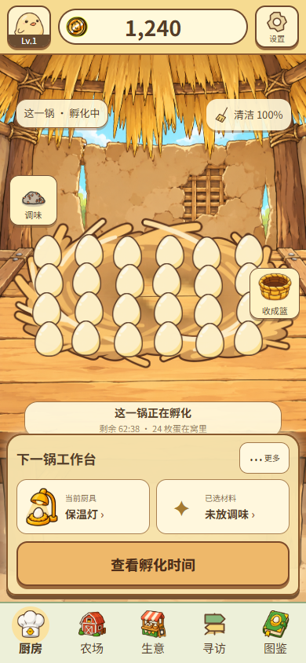

# 《鸡宝厨房》Kitchen / Farm 历史生产链取证与成功/失败对照

2026-09-28 · 本地只读取证 · 不生成新图、不修改Runtime、不设计新方案、不提交最终Production Pipeline。

**本轮恢复到11个相关历史会话、49条用户消息、253条公开Work回复、1,095条工具调用输入和80个已完成ImageGen事件。** 80个生成源图均仍在本机；59个事件找到项目内逐字节一致的PNG副本。另恢复过去工具结果中缓存的5轮Chat，其中包含Lv.2和A–D背景的直接反馈。数据库全部只读查询。

## 主要结论

**成功差异不在于“这三个题材可以整图直出，厨房/农场天生不行”。** 生意、寻访、图鉴是整页概念先获认可，再经独立资产、动态数据组合、截图对照与多轮修正成功。它们并没有把完整AI页面直接用作正式Runtime。

Kitchen/Farm的多条失败路径解决了不同的局部问题，却未累积成用户认可的整页：

- **任务翻译偏向室内组织。** Work把厨房具体化为圆桌、转角柜台、壁龛推车，并要求完整房间关系；“不要AI插画”的禁令与这些正向要求并存。许多家具/装饰不能归咎模型擅自增加。
- **Style Test锁住了未获认可的结构。** 为保证24蛋与布局一致，最终沿A→B→C edit；平涂/描边变了，窗帘、桌腿、地毯仍在。
- **Lv.2又走向过度保守。** 原始Prompt精确保留旧窗/架/墙台分界；用户明确说“不是实现错误”，而是没有达到主界面视觉重制。
- **局部Gate不能回答完整效果。** 单Asset的内部PASS、空背景和矩形Overlay各有检查价值，但不能替代真实对象、UI和背景同屏。用户在原始Chat里明确说没有整体融入就难判断。
- **蛋窝回退来自组合代码。** K1/K3复用旧蛋图，却改成6列4行加微偏移，失去原有紧密遮挡；不是ImageGen失误。F1/F3也没有调用ImageGen，不能把结构原型的不足算为生成失败。

成功页也返工、也使用强reference与edit。寻访甚至有“先通过、后撤回Runtime通过”，再进入高精度复刻。因此报告保留成功过程中的失败、失败过程中的正确判断，以及每个结论的证据边界。

## 九项交付

|交付|内容|
|---|---|
|[1. History Recovery Report](01-history-recovery-report.md)|能恢复什么、读取路径/方法、来源等级、原始证据索引|
|[2. Forensics Master Table](02-forensics-master-table.md)|29案例，同一12项生产链模板＋10维视觉结果；含所有指定实验、4类Asset、K1/K3/F1/F3及额外成功族|
|[3. Timeline](03-timeline.md)|由原始消息/图像事件定位的阶段切换、执行与用户Gate|
|[4. ImageGen Prompt Archive](04-imagegen-prompt-archive.md)|80个事件的完整真实Prompt字段、原始调用、reference变量定义、源图哈希和文件对应|
|[5. Success vs Failure Comparison](05-success-vs-failure-comparison.md)|Prompt、Work执行、ImageGen、结果四层同模板对照；蛋窝回退专项取证|
|[6. Repeated Failure Patterns](06-repeated-failure-patterns.md)|反复失败模式、证据强度与反例|
|[7. Successful Production Patterns](07-successful-production-patterns.md)|真实发生过的成功模式，不直接外推为Kitchen新流程|
|[8. 整图直出专项结论](08-whole-image-conclusion.md)|逐一对照生意/图鉴/寻访与Kitchen/Farm，解释历史分化|
|[9. Evidence Gaps](09-evidence-gaps.md)|完整Chat、附件、单候选签收、模型/成本、Farm样本量等明确缺口|

## 代表性图片证据

以下全部是此前已有PNG，本轮没有制作新图。更完整的中间产物路径在Master Table和Prompt Archive内。

### 成功也经过收敛：图鉴确认稿 → 初版Runtime → 修订Runtime

用户在初版后具体要求修白边、纸张、字体与底栏；后续明确“当前图鉴Golden Sample已通过”。不能只留下右侧，删掉其失败过程。

### 同一厨房构图逐渐变平，但组织目标仍未改变

这不是单靠“木纹多/渐变多”能解释的问题。A→B→C保留圆桌、窗帘与地毯是原始编辑指令的要求。

### Lv.2：实现正确与用户认为改动不足可以同时成立

该轮保住原蛋群，淘汰遮蛋新窝，也验证了交互；但主要变化确实是旧背景减纹与入口重排。用户明确不通过。

### K1/K3：同一蛋图不等于同一窝蛋

|旧Runtime，紧密重叠|K1结构原型，规则分散|
|---|---|
|||

源码与图片共同证实6列4行布局。这里比较的是群形/遮挡，不是把不同房屋等级当成配色优劣对照。

## 阅读证据的口径

ORIGINAL只指找到了真实指令/工具记录，不指成图通过。Work自评PASS、程序检查PASS、用户Gate、分析报告通过分别记录。历史Chat缺失的部分不补造；无生成的原型标N/A，不编一段“推测Prompt”冒充原始生产记录。

最终核对结果见 [verification.json](evidence/verification.json)。原始执行输入归档为文本证据，不应当重新运行其中的历史生成/修改命令。本轮停止在取证与对照，不继续任何设计或美术生产。
