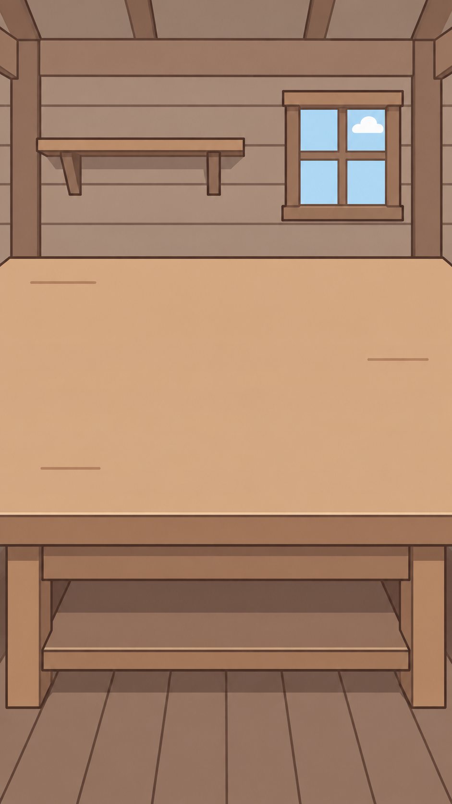
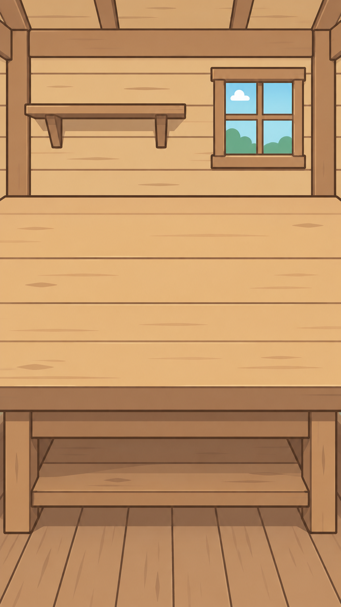
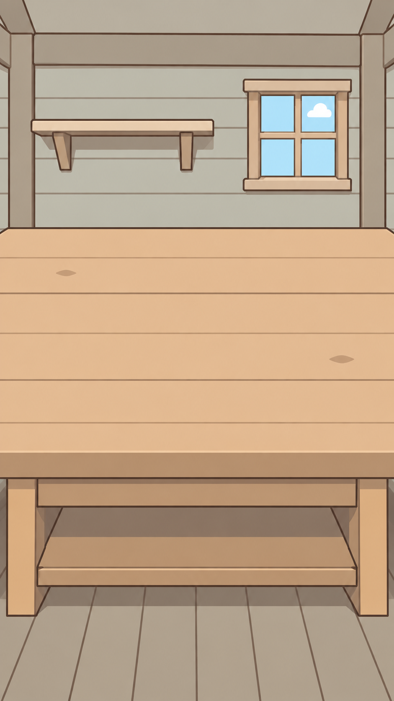
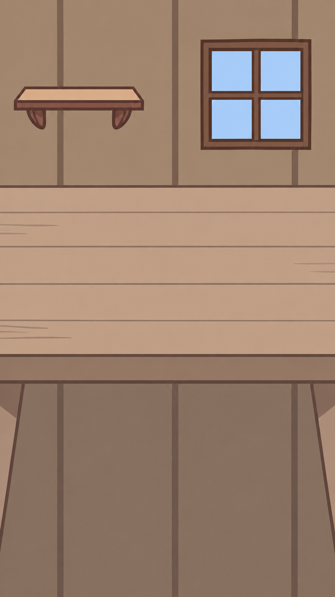
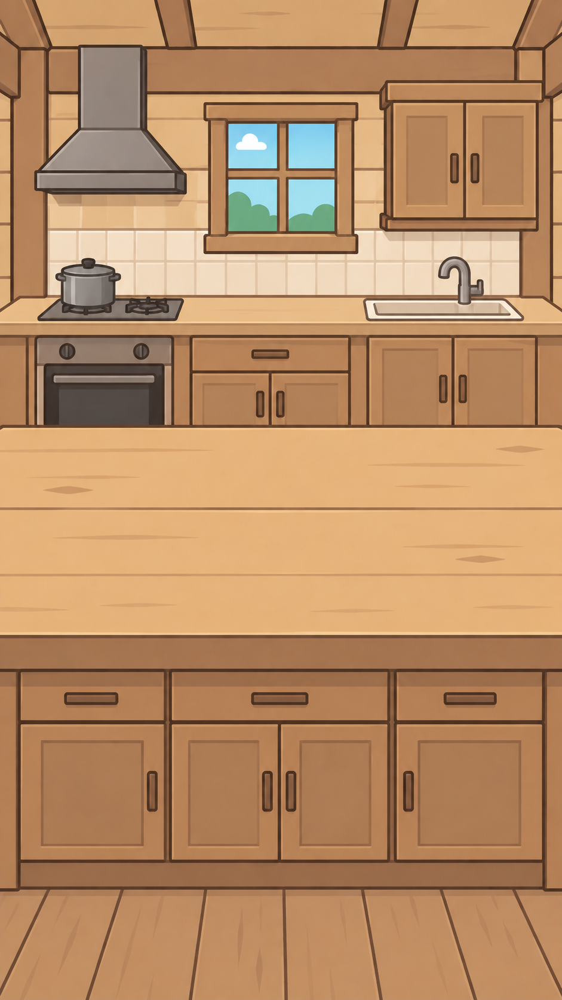
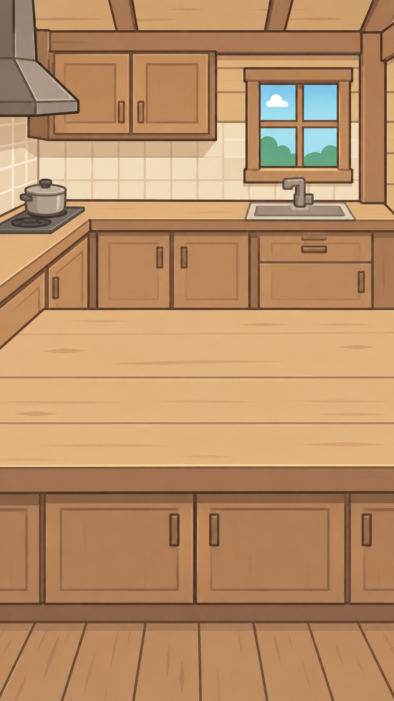
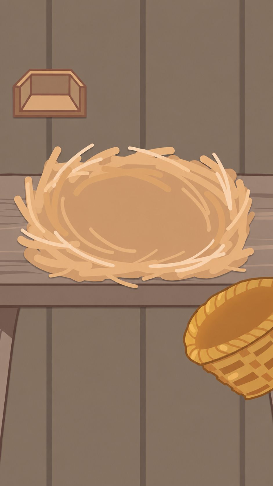

# 目前的几个厨房背景其实和原本的内容画风有一点不一样，或者说AI味有一点重，这里你有方法解决吗，或者可以再生成几个我来挑选

## 9 · 2026-09-19T16:54:23.262000+08:00 · userMessage

目前的几个厨房背景其实和原本的内容画风有一点不一样，或者说AI味有一点重，这里你有方法解决吗，或者可以再生成几个我来挑选

## 10 · 2026-09-19T16:56:04.122000+08:00 · agentMessage

我先看看项目里原本的素材和现有厨房背景，找出画风差异，再按更贴近原作的方向做几版供你挑选。我会用 imagegen 技能来生成候选图。

## 46 · 2026-09-19T16:57:29.007000+08:00 · agentMessage

看过原图后，差异主要在这里：原版用色块和少量线条交代材质，现在的背景则有很多木纹、渐变、高光和立体阴影，所以容易显得像另一套游戏素材。

我先用同一个木板厨房做三张风格小样，方便直接比较：A「原版朴素平涂」、B「暖色手绘线稿」、C「清爽淡彩卡通」。都会保留放鸡宝的大块空台面，重点减少材质细节和光影。

## 61 · 2026-09-19T17:00:41.883000+08:00 · agentMessage

前两张小样已经出来，木纹和装饰明显少了。不过生成结果仍保留了一些柔和渐变，离原版那种直接、朴素的色块感还有距离。我会再核对第三张，并把候选图整理好，标清各自的取舍。

## 75 · 2026-09-19T17:01:44.203000+08:00 · agentMessage

三张结果说明，仅给现有背景“减细节”，还是容易沿用它原来的立体画法。我再补一张 D：直接以原版背景为底改绘，用它来比较“沿用原素材画法”能否更贴近你要的感觉。

## 84 · 2026-09-19T17:02:54.694000+08:00 · agentMessage

D 的造型和构图更接近原版；B 更暖，C 更清爽。四张都保留了空台面，但仍有少量柔和渐变，所以这轮适合先挑方向，还不能算完全解决了画风统一。

我会把四张保存为独立候选图，并按 verify-before-complete 技能核对文件和尺寸，供你选择。

## 99 · 2026-09-19T17:04:23.166000+08:00 · agentMessage

有办法：**以原素材为底改绘，统一色块和线条，减少木纹、渐变与高光**，更容易贴近原作。

已经生成四版同一厨房的小样，方便比较。我更推荐 **D 的方向**，造型最接近原版；**B** 则更温暖。

| A · 朴素低饱和 | B · 暖色卡通 | C · 清爽淡彩 | D · 原素材改绘 |
|---|---|---|---|
|  |  |  |  |

这些仍有少量柔和渐变，属于挑方向的小样。四张已保存并核对，尚未替换游戏背景。使用内置图像生成工具，[完整提示词与素材记录](../../../../../artifacts/art-exploration/kitchen-style-20260919/notes.md)已留存。

你可以直接选 **A/B/C/D**，也可以说“D 的画法，加 B 的颜色”。

## 107 · 2026-09-19T17:04:36.226000+08:00 · userMessage

D更好一点，其他几个版本的布局不像厨房，只是桌子
如果能把这个地方改进一下的话，B更好一点

## 108 · 2026-09-19T17:04:47.731000+08:00 · agentMessage

明白，你更喜欢 B 的暖色画法，但场景要有明确的厨房结构。我会沿用 B 的颜色，把独立桌子改成连贯的操作台和下柜，加上吊柜、灶台、抽油烟机和水槽，同时保留中间放鸡宝的空位，再做两版给你比较。

## 133 · 2026-09-19T17:08:23.879000+08:00 · agentMessage

两版都出来了：B1 的灶台、水槽和橱柜正面排开，画面更规整；B2 用转角布局，厨房的空间感更强。它们都保留了 B 的暖色，以及前方放鸡宝的空操作面。这次我更倾向 B2。

## 146 · 2026-09-19T17:10:02.657000+08:00 · agentMessage

按你的意思，保留 **B 的暖色画法**，补上灶台、水槽、吊柜和完整下柜，做了两版：

| B1 · 正面厨房，布局规整 | B2 · 转角厨房，空间感更强 |
|---|---|
|  |  |

**我更推荐 B2**，转角把烹饪、洗涤和备餐区域连接起来，厨房感更明确。前方仍留有放鸡宝的位置，具体遮挡需要接入后调整。

两张已核对保存，尚未替换游戏背景。由内置图像工具生成，[提示词与修改记录](../../../../../artifacts/art-exploration/kitchen-style-20260919/layout-revision-notes.md)已保存。

## 151 · 2026-09-19T17:10:16.747000+08:00 · userMessage

不对，要符合我们之前的设定，木板房不需要这么豪华
界面设计要有逻辑，整体是一个放置厨具的平台

## 152 · 2026-09-19T17:10:40.796000+08:00 · agentMessage

明白，刚才把木板房做成了带成套橱柜的现代厨房，偏离了等级设定。这里应该是朴素木板房里的厨具平台：背景交代木墙、简单搁架和结实台面，厨具由玩家购买后放上去。

我会保留 B 的暖色画法，撤掉固定灶具、水槽和橱柜，把台面改成靠墙搭建、下方有简单储物格的操作平台。

## 174 · 2026-09-19T17:12:12.488000+08:00 · agentMessage

我重新对照了四级设定：木板房这一级的提升应当体现在木板完整、支架整齐、平台更稳固。画面也要服务于玩法——中央留给孵化，下方承接可切换的厨具；背景里不预先画入玩家尚未拥有的设备。这次先做一张符合这个逻辑的修正版。

## 186 · 2026-09-19T17:17:24.813000+08:00 · userMessage

重要的就是一个平台加墙背景，主要要统一好整体的豪华程度，最开始是残破-破旧-正常-豪华-神奇（后续内容）

## 189 · 2026-09-19T17:17:49.404000+08:00 · agentMessage

明白，核心就定为**一面墙＋一个放置厨具的平台**，沿用 B 的暖色画法，墙和平台的档次同步变化。

我按你最新的顺序做前四级同构图对照：**残破 → 破旧 → 正常 → 豪华**；“神奇”留给后续。每级只通过材料、完整程度和做工体现升级，厨具仍由游戏单独放置。

## 218 · 2026-09-19T17:23:12.206000+08:00 · agentMessage

“破旧”这一档已简化成木墙和一整块空平台，磨损集中在接缝与边缘。接下来用它作为构图底稿，让残破、正常、豪华三档沿用相同布局，只改变材质和做工。

## 227 · 2026-09-19T17:25:23.310000+08:00 · userMessage

你这里连墙都没有了，内容和原本游戏的内容统一，可以少量优化一下

## 231 · 2026-09-19T17:25:46.364000+08:00 · agentMessage

是我改动过头了，新稿把墙面和台面的空间关系画平了，也偏离了原作内容。接下来直接以原版完整场景为底，保留墙面、台沿、窝和收取容器的位置与造型，只小幅整理线条和颜色。先做一张原版对照稿，不再重设计布局。

## 266 · 2026-09-19T17:32:18.354000+08:00 · agentMessage

对，应该以**原版场景为基础做小幅修整**。前面的重设计方向放弃。

这次直接保留原版的木墙、台面、草窝和竹篮，做了一张清稿对照：

| 原版 | 轻微修整候选 |
|---|---|
|  |  |

右图仍增加了少量柔和阴影，后续应继续收敛。等级按你定的 **残破 → 破旧 → 正常 → 豪华 → 神奇**，保持原作内容一致。

候选图已核对保存，未替换游戏。使用内置图像工具，[提示词与记录](../../../../../artifacts/art-exploration/kitchen-style-20260919/original-touchup-notes.md)已保存。

## 274 · 2026-09-19T17:32:36.975000+08:00 · userMessage

除了这个，应用图标也需要调整，现在的有点丑，可以参考原本游戏

## 275 · 2026-09-19T17:33:10.603000+08:00 · agentMessage

我先对照原版和现在的应用图标，保留原作的鸡鸭造型与辨识度，做一版更清楚、适合手机桌面小尺寸显示的调整。

## 300 · 2026-09-19T17:35:03.315000+08:00 · agentMessage

找到原版图标了：它的特点是右侧探头的鸡宝、头顶小毛、张嘴的表情，以及左侧的锅具和盘子。我会沿着这个构图调整，保留原作的平涂画风，简化小装饰，并检查圆形图标裁切后脸部是否完整。

## 319 · 2026-09-19T17:38:30.925000+08:00 · agentMessage

新稿已保留原版的探头姿势、张嘴表情和厨房背景，去掉了左上角的小徽标。我接下来把它接入应用图标资源，并用 agent-browser 技能检查小尺寸和圆形裁切效果。

## 376 · 2026-09-19T17:56:58.403000+08:00 · agentMessage

新版已接入工程。我在内置浏览器里查看了 48 和 72 像素的圆形、圆角方形预览，眼睛和嘴都能保留；Android 图标资源也已编译检查通过。原版图片和修改前的图标都留了备份，手机上的版本尚未更新。

