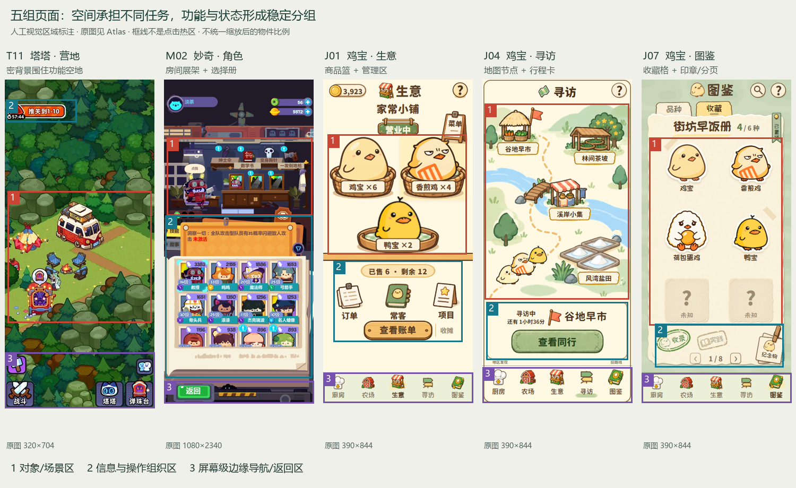

# 《鸡宝厨房》Kitchen / Farm 外部 UI + Art 逆向研究

2026-09-28 · 研究交付，等待与历史 Forensics 合并。本文不选择最终 Creative Direction，不设计新 Kitchen/Farm，不给最终 Production Pipeline，不修改 Runtime。

读者是后续负责合并证据、制定制作约束的设计与制作人员。读完应能做三件事：找到具体截图；区分可见事实与设计推断；选出值得验证的 UI/美术约束。不能据本文直接宣称已有新页面方案。

**最重要的发现：鲜明游戏感来自可操作对象、状态容器和画面层级之间的对应关系。二维感、粗描边、低细节只是其中一部分，而且三组样本的使用方式不同。** 本项目已经具备篮子商品槽、地图节点、册页收藏格这三种有效组织方式，后续不需要从外部游戏重新借一整套皮肤。

## 证据规则与研究边界

- **O / 观察**：本轮直接看图可见的事实。**I / 推断**：对画面选择可能服务何种目的的解释，不声称知道原设计师想法。**C / 候选约束**：供后续合并和测试使用，不是已经批准的规范。
- 本轮共建立 **52 个证据条目**：塔塔 16、妙奇 25、鸡宝 11。条目包括完整实机、局部、攻略拼图、宣传图、历史浏览器留档；**52 不等于 52 个不同页面，也不等于所有页面已覆盖**。
- 本轮新获取 25 张公开参考图；复核项目内 16 张妙奇旧档与 11 张鸡宝截图。每张标注来源、尺寸、局限；新增下载另存原始 URL 和 SHA-256。没有使用 Computer Use，没有生成新美术。
- 塔塔的国服公开玩家图、全球服媒体教程和官方宣传分组阅读；妙奇 2021 年实机与后期商店宣传分组阅读。没有据混合资料绘制“当前完整导航树”。
- 点击效果、转场、触控范围、Drawer 动画、可用性收益未实测；不会从单张图推断具体实现。
- 本项目认可范围来自本轮用户说明。选用与三个页面族对应的留档进行视觉分析；不声称每一张具体留档均再次得到确认。

## 1. Reference Atlas

打开 [可筛选图集](atlas.html)，按游戏、页面、来源类型筛选，点击图片看原尺寸。配套 [证据索引 CSV](evidence-index.csv)、[证据索引 JSON](evidence-index.json)、[原始下载记录](downloads.jsonl)。

图中框线是本轮人工标注的**视觉区域**，不是运行时点击区域。编号说明：1 为对象/场景区，2 为信息与操作组织区，3 为屏幕级边缘导航或返回区。不同游戏不强行套相同占屏比例。

| 研究锚点 | 看什么 | 能支持什么 | 不能支持什么 |
|---|---|---|---|
| [T11 营地](atlas.html#T11) + [T12 路线](atlas.html#T12) | 林间空地、固定边缘入口；路径节点、宽黄按钮 | 同游戏场景按任务变形；完整森林可以服务功能聚落 | 营地一定有规整底栏；中文图一定属于国服 |
| [T05 角色列表](atlas.html#T05) + [T09 设置](atlas.html#T09) | 四列卡框；紫框白底弹窗 | 复杂插图进入稳定字段槽，跨页面保留边框/颜色语法 | 两页所有颜色都具有同一业务语义 |
| [T03 挖宝](atlas.html#T03) + [T15 成长](atlas.html#T15) | 棋盘格、队友槽、进度；大数字与属性块 | 场景、列表、成长都可通过槽位组织 | 攻略紫底文字属于运行 UI |
| [M01 打工](atlas.html#M01) + [M07 商店](atlas.html#M07) | 生产卡与货架 | 真实建筑/道具被改写成信息容器 | 整个游戏每页都应浓密或深色 |
| [M02 角色房间](atlas.html#M02) + [M23 装备](atlas.html#M23) | 装备层板、相框、册页和弹窗 | 功能物件化可以同时保留明确分组和数值面板 | 房间一定必须少于某种物件数量 |
| [M20 奖池内容](atlas.html#M20) + [M25 皮肤弹窗](atlas.html#M25) | 未拥有剪影、已有标志；编号 Tab 与挑战按钮 | 可见/不可用/拥有状态属于容器设计 | 奖池列表等于全游戏图鉴 |
| [J01 生意](atlas.html#J01) + [J02 空态](atlas.html#J02) | 2+1 篮子、营业牌、库存标签 | 本项目已把经营数据变成具体对象 | 所有物件都必须排列成 2+1 |
| [J04 寻访](atlas.html#J04) + [J05 地区](atlas.html#J05) | 地图四节点；功能行与同行 | 连续景观与显式 UI 分区并不冲突 | “避免环境插画”必然等于切断全部空间 |
| [J07 收藏](atlas.html#J07) + [J08 空态](atlas.html#J08) | 二列三行、贴纸/问号、印章/翻页 | 布局承担收集规则，状态可变而视觉容器稳定 | 纸张、胶带和印章适合复制到所有系统 |

**本轮更正旧证据标签：** M02/M03 实际呈现角色房间与选择册，不能继续当作已确认的打工排班；M04 显示筛选浮层；M13 是幽灵主题群像宣传，不能当成图鉴网格。T01 是活动道具横条，不是入口实机；T06 的“塔塔图鉴”字样属于官方宣传卡。旧文件保持原样，本轮索引写明更正。

主要公开出处：[塔塔官方商店页](https://www.taptap.cn/app/866257)、[官方活动指南](https://www.taptap.cn/moment/846445543147177753)、[公开玩家列表](https://www.taptap.cn/moment/852581458705908228)、[营地/设置/战斗实机组](https://shouyou.3dmgame.com/android/560350.html)、[成长局部组](https://shouyou.3dmgame.com/gl/635361.html)、[妙奇官方商店页](https://www.taptap.cn/app/162127)、[2021 角色指南](https://wap.gamersky.com/news/Content-1357180.html)。具体图片与出处一一对应见图集，不把商店宣传文字当作视觉证据。

## 2. Page Type Matrix

见 [完整页面矩阵](PAGE-TYPE-MATRIX.md) 和 [可合并 CSV](page-type-matrix.csv)。三组对象均使用“页面、主视觉对象、主 CTA、次级入口、UI 与场景关系、画风、关键设计点”相同字段，并另列证据边界。

覆盖主场景、主界面、商店、角色、图鉴/收藏、任务、活动、弹窗、设置、成长页、二级页面。无法取证的类型保留空缺。鸡宝仅研究本轮认可的三个页面族及少量相邻页面，活动/设置明确写为范围外。

观察单页之外，还需看**页面之间如何换容器**：塔塔从营地到四列角色面板，再到居中设置；妙奇从房间展架到角色册，再到装备面板；鸡宝寻访从地图到功能行，再到单件发现物展示。三者都没有要求所有页面使用同一种空间结构。

## 3. UI Grammar

### 同一维度的五组对照

| 维度 | 塔塔冒险队 | 妙奇星球 | 鸡宝·生意 | 鸡宝·寻访 | 鸡宝·图鉴 |
|---|---|---|---|---|---|
| HUD | 营地左上阶段条；不同页按任务换信息 | 左头像右双资源；角色页仍沿用 | 左货币、中标题、右帮助 | 标题+帮助；地区有返回 | 标题、搜索、帮助 |
| Bottom Navigation | 营地边角主入口，并非均匀全宽栏；二级面板底部 X | M05 背景有七入口，M01/M02 二级页以返回收尾 | 五等分图标文字底栏 | 同五栏 | 同五栏 |
| CTA | 路线页黄宽按钮；胜利继续绿按钮 | 返回绿、出发/升级蓝在样本内复用 | 木色账单/开张；收摊弱化 | 绿色出发/收好；详情为弱按钮 | 收藏页以浏览、翻页为主，无须造大 CTA |
| Tab | 好友列表与角色底部类别槽 | 技能/故事纸签、任务/委托垂签、编号装备页签 | 二级页营业/订单/常客/项目 | 地区行为用物件行，不伪装成 Tab | 品种/收藏上沿纸签 |
| Popup | 紫标题白底、遮罩、独立 X；胜利为横幅 | 紫面板、纸页、夹子、编号与成本槽 | 浅纸色账单，信息表单感较强 | 当前样本是独立结果页 | 册页是主内容，非弹窗 |
| Drawer | 无可靠运动证据 | 下方书册是静态选择区，不能据图叫抽屉 | 无证据 | 无证据 | 无证据 |
| 二级入口 | 营地角落图标、列表筛选 | 房间物件、相框、底部入口 | 三个物件入口加短文字 | 地区“补材料/找标本/寻见闻” | 纪念物夹签、搜索、置顶 |
| 状态 | 星级、等级、碎片进度、加号、剪影 | 青感叹号、已有、未激活、计时、库存 | 营业牌、篮中数量、已售/剩余、空篮 | 路线、同行、目的地、倒计时、新发现 | 未知格、4/6、收录/实践章、置顶、页码 |
| 物件化程度 | 场景设备与面板槽位并用 | 货架/相框/册页高度物件化 | 篮子、菜单牌、账本图标 | 地标牌、道具、同行垫、发现信封 | 整张册页就是容器 |

证据组：塔塔 T05/T08–15；妙奇 M01–07/M20–25；鸡宝 J01–11。表中仅描述样本，不推断没有看到的菜单。

### 可转化为约束的规律

| 编号 | O：具体可见 | I：可能的设计取舍 | C：可验证候选约束 |
|---|---|---|---|
| U1 对象与状态绑定 | J01 的数量在篮子前牌；M07 的价格在对应货架下；T05 的进度在同一卡下 | 降低“这个数字属于谁”的查找成本 | 名称、数量、计时与对象同组；不得跨另一个对象摆放。测试时逐一指认对应关系 |
| U2 固定槽位，变化内容 | T05 头型差异大但字段位置不变；J07 未知格保持原位 | 收藏和管理依赖记忆位置 | 设计空、满、未知、选中时先保留语义槽位；是否重排由行为需求决定 |
| U3 操作层级按任务变化 | T12 单主按钮；J01 主/弱操作；J07 没有巨型主按钮 | 并非所有页面都需要“唯一大按钮”模板 | 对确认/提交类页明确主 CTA；浏览页强调选择和返回，不强塞确认 |
| U4 UI 与场景共享语法 | M02 相框和 M25 弹窗都用夹持/纸页；J01 木牌和按钮共用棕轮廓 | 不靠统一背景贴图也能产生归属 | 每个页面族声明轮廓、承托、标签、状态、动作五种语言；允许不同容器 |
| U5 遮罩承担模式切换 | T09/M25/J03 中底层变暗，内容层独立 | 进入具体决策时暂停背景竞争 | 弹窗正文不透出干扰纹理；关闭结构可见；全屏插画不能替代遮罩层级 |

这些是视觉/组织约束，不意味着每个物件必须能点击。若装饰长得像按钮却无动作，同样会损害游戏感和可预期性。

## 4. Scene Composition Grammar

### 不是“画一个可信空间”，而是明确空间负责什么

| 页面族 | 空间模型 | 功能对象排布 | 主动牺牲的真实关系（观察 + 推断） | 装饰如何退后 |
|---|---|---|---|---|
| 塔塔营地 T11 | 斜俯视连续森林与中央空地 | 房车在中、设施围绕空地、入口锚定边缘 | 不用真实远景/地平线解释森林；亮设备与房车成为对象锚点。其真实碰撞尺度不可由截图判断 | 树石虽密，但多数是低明度绿色同族；亮色功能聚落从中分离 |
| 塔塔章节 T12 / 战斗 T13 | 蛇形关卡路线 / 纵向战斗走廊 | 节点按关卡链；战斗留一条窄操作带 | 同一森林题材随任务改变占屏形状，不能据此认定共享同一地图几何 | 树林成为两侧边界，进度/节点/按钮占据清晰区域 |
| 妙奇 M01/M02/M07 | 街景概览+卡片；正视房间展架；货架 | 建筑对应生产行；装备一排、相框一排、角色册一块 | 巨大药瓶屋顶比门醒目；子弹/帽子/枪在层板上按辨认尺寸陈列。货架把不同道具压进相似槽宽 | 店内远背景降低清晰度；前景角色/价格/计时保持清楚 |
| 鸡宝生意 J01 | 无完整房间的商品展示台 | 两篮在上、一盘在下；柜台下放管理入口 | 鸡鸭按角色识别和存量展示放大；没画摊位背墙、顶梁、货仓也成立 | 奶油空底、细柜台线，不靠补满家具证明场景 |
| 鸡宝寻访 J04/J05 | 示意地图 / 分段功能舞台 | 四地标错位；地区页 2 地点、3 行为、3 同行 | 地标与队伍都远大于真实地图比例；不同区块切换俯视/正视以便识别 | 山、水、树提供地区气质，不与节点使用同强度牌子和描边 |
| 鸡宝图鉴 J07 | 纸上信息空间 | 两列三行、下方印章与页码 | 角色可以比纸签大很多；“空间”不需要建筑透视 | 纸纹低对比，胶带/缺口只出现在边界，空位不被装饰填充 |

### 为什么不容易被误读成纯环境插画

1. **存在可数的功能组。** 篮子、四列卡、五个展位、三个强化块、两个抽取价槽，都有重复语法。自然场景不会稳定重复这些数据槽。
2. **状态有固定载体。** 标签、星级、进度、价格、计时与对象对应，改变状态不用重讲环境故事。
3. **局部秩序比全局均匀更重要。** 鸡宝地图地标错落，但同类地名牌一致；妙奇展位不等高，但槽形一致；塔塔树林不规整，但菜单卡字段规整。
4. **场景在必要处被截断或压扁。** 妙奇房间仅提供展架和角色位置，后接册页；鸡宝生意只保留柜台线；塔塔战斗环境被压到两旁。
5. **功能比例可脱离现实比例。** 妙奇屋顶药瓶、鸡宝大角色与大地标都在优先传达用途/身份。放大哪个建筑必须有任务理由，不是越大越像游戏。

**反例必须保留：** 塔塔营地保留连续空间，妙奇家园宣传 M12 也呈现完整房间；鸡宝寻访有连续河道。因此“禁止完整空间”“全部对象都必须高饱和”“不要任何环境光”都不是本轮可成立的通用结论。应检查空间是否遮蔽功能分组，而不是只检查有没有墙、窗、树。

## 5. Art / Visual Grammar

以下是直接看图后的相对描述，未从压缩截图反推源资产参数。像素线宽、精确色号、调色板数量不伪装成已测规范。

| 维度 | 塔塔（T05/T06/T11） | 妙奇（M01/M02/M07/M20） | 鸡宝·生意 J01 | 鸡宝·寻访 J04/J05 | 鸡宝·收藏 J07 |
|---|---|---|---|---|---|
| 轮廓 | 角色尖角、折线与大圆块混合，强剪影；卡框黑边 | 角色大头小身、装备极简符号；背景多色块边界 | 鸡鸭整体蛋形，嘴、冠、翅形成少量识别突起 | 建筑用屋顶、棚面、篮盘识别；地形轮廓更软 | 角色保留原轮廓并加白贴纸边；纸边不规则 |
| 比例 | 大眼/耳/头，角色卡截取胸像；场景角色很小 | 道具可大于人物头部；角色为短比例符号 | 角色撑满篮子，三个可读大对象 | 地标和同行超出真实地图比例；屋顶占建筑较大部分 | 贴纸主体占格大部；未知格保持近似视觉份量 |
| 描边 | UI 接近黑/深蓝的厚边；树木边相对细 | 前景角色/道具深边明显，建筑不处处等粗 | 深棕外轮廓较重，篮子内纹更细 | 地标棕边较清楚，远山/地面弱边或无边 | 棕色角色边+白描边；纸与印章各用不同边法 |
| 色彩组织 | 紫/蓝面板、黄/绿/青强调，营地大量绿 | 紫科技外壳、奶黄纸、青蓝动作与状态、主题场景色 | 奶油底+棕字+橙黄角色，绿色营业状态 | 奶油底+草绿+浅蓝河流，橙虚线与旗 | 浅绿外底+奶黄内纸+绿色章，角色色仍鲜明 |
| 饱和度 | 强调色很高；森林并非每处同高 | 霓虹/按钮高，纸页/墙体较低；按层分配 | 角色局部饱和，背景低 | 路线/旗较高，风景偏柔和 | 主体高于纸张；未知位降饱和 |
| 明度 | 暗树林/深面板对亮空地/白内容，跨度大 | 暗壳对浅纸页，数值和按钮从暗部弹出 | 整体亮，主要靠深棕轮廓与留白分层 | 整体亮，山水明度接近，但节点边界更明确 | 外底略暗于纸页；未知格与主体清晰分档 |
| 阴影 | 树石有硬块明暗；卡槽有边缘厚度 | 局部投影、设备层叠，角色少量色阶 | 局部承托阴影与硬色面，非写实接触阴影堆积 | 建筑底部小影；地形大色块不写实渲染 | 白边与浅影显示贴纸层；纸页有轻边影 |
| 光照 | 无证据支持全局柔和影视布光；局部高光符号强 | 霓虹、灯光存在，且 M01 店内背景模糊；仍保持 UI 高对比 | 高光是角色图形一部分，背景不统一染色 | 底图有柔和块面，但无强日照方向支配按钮 | 纸纹/浅明暗并存，主体不被环境色覆盖 |
| 材质 | 帐篷条纹、岩石面、卡面网点等图形化符号 | 金属铆钉、纸折角、木架用少量边与色面说明 | 篮筐编织与木纹简化为重复符号 | 茅草/木棚/石块保留能识别的少量线 | 纸纹、胶带、章纹承担主题，非每处精细纤维 |
| 透视 | 场景斜俯视；菜单完全正面，不追求统一消失点 | 城镇/星球混合视角，角色房间接近正面剖面 | 角色正面、篮子微俯视，允许混合 | 地图俯视、地标正侧视，强化可识别正面 | 平面册页，物件插图自行保留局部体积 |
| 细节密度 | 卡片数据密；营地树林密；功能区仍独立 | 角色房间密但分层板，槽位数量有限；纸页内容有空白 | 轮廓与脸最丰富，商品外部空白很大 | 地标精度高于山水草点；行为物件大而少 | 贴纸与印章集中细节，格间和纸边留空 |
| 背景复杂度 | 可以很复杂，但被颜色和空地隔离 | 随页变化，房间/舞台与信息板共存 | 极低；没有背墙依然像游戏 | 中等；河道连续但不抢节点 | 低；纸上结构为主 |

### 可进入未来 Prompt / Asset brief 的候选条款

这些是**条款库**，不是 Kitchen/Farm 完整 Prompt，也不是最终方向。每次应选与所在页面族一致的一组，不能把塔塔粗黑边、妙奇霓虹和鸡宝浅纸色无差别混合。

| 条款 | 可执行表述 | 检查方式 | 依据 / 限制 |
|---|---|---|---|
| V1 轮廓职责 | 主对象保持独立可识别剪影；装饰轮廓低于交互对象的强调级别 | 缩略图观察、同尺寸剪影对照 | T05、J01/J07；不是强制所有画面粗黑边 |
| V2 线条分层 | 选定一套外轮廓基准，内部材质线更轻；背景边缘不与角色同等抢眼 | 并排放角色/道具/按钮/建筑四类样张 | 五组样本均存在层差；准确线宽需后续标定 |
| V3 色彩按职责分配 | 先声明底色、对象色、文本色、动作色、状态色；允许主题色变化但保持职责清晰 | 状态矩阵；去色后检查层级是否仍能读 | M05/M20、J07；颜色不能单独承载状态 |
| V4 弱体积而非无体积 | 主体用少量明确色面与局部承托影；不靠全屏柔光塑形 | 检查每个对象是否被连续渐变包裹 | T06/J01；玻璃/霓虹等例外须有对象理由 |
| V5 材质符号预算 | 每种材质只保留少量辨认符号，细节不能进入文字和状态牌背后 | 手机尺寸检查，删掉纹理后身份仍可读 | J01 的编织，J07 的纸页；数量上限未定 |
| V6 允许功能性混合透视 | 角色面向读者，容器提供承托面，建筑露出最有辨识度的一面 | 查看主要功能对象是否因透视缩小或遮挡 | M02/J04；不是允许同一对象内部透视混乱 |
| V7 形状家族有差别 | 用大圆块建立角色基础，保留嘴/冠/屋顶/牌角的尖角与折线 | 把不同物件做成轮廓时仍能区分 | T06、J01/J04；不把全套做成软胶团 |
| V8 密度按任务集中 | 脸、对象身份、状态处可以精细；不均匀铺满全屏 | 九宫格标注“功能/装饰/空白”再比较 | T11、M07、J01；高密收藏页另评 |

## 6. Asset Language Grammar

同一视觉系统不意味着每类资产用相同描边、阴影或材质。更可靠的是：对象在各种尺寸下仍保留身份，组件之间有一致的边缘层级、色彩职责和信息附着方式。

| 资产类 | 塔塔：可见语言 | 妙奇：可见语言 | 鸡宝生意 / 寻访 / 图鉴：已有语言 | 候选约束 |
|---|---|---|---|---|
| 建筑 | 房车/设施以独立轮廓落在空地；深绿森林为框 | 主题道具上屋顶；房间墙面成为陈列背板 | 生意可无建筑；寻访小棚/摊位带地名牌；图鉴无建筑需求 | 建筑是否存在由页面任务决定；身份部件优先于真实构造 |
| 角色 | 强剪影、表情差异、卡框和场景两种尺度 | 短体大头、帽饰区别身份、人物册重复槽 | 同一鸡鸭在篮子/同行/贴纸里复用 | 保留角色原型；用容器与尺度适配页面，不能每次换物种比例 |
| 道具 | 粗边、亮面、可成为消耗/奖励符号 | 简化器物与大尺寸陈列；道具同时进入价格、材料和装备槽 | 篮子、麻袋、放大镜、信封、纪念物 | 同一道具跨场景/图标/奖励出现时保留主要轮廓和配色 |
| 按钮 | 黑边厚底，黄/绿主动作，紫色列表行 | 金属框配绿返回、蓝动作；高光与边沿厚度 | 生意木色；寻访绿色；图鉴轻翻页 | 按页面族分材质，统一可点击轮廓、文字安全区和状态层级 |
| 标签 | 黑白高对比字、等级/星级/进度固定字段 | 青色姓名条、黄价格牌、纸签 Tab | 篮子名称数量牌、地图地名牌、册页 Tab 与置顶签 | 标签不能为装饰倾斜牺牲读数；允许物件不规则、文字区域稳定 |
| 图标 | 元素/类型/星级分别占位，形色双编码 | 元素六边形、感叹号、资源符号共用 | 五导航图标一致；行为图标用熟悉物件 | 用轮廓与符号区分功能，颜色补充而不独占意义 |
| 弹窗 | 紫白卡片与胜利横幅并存 | 紫外壳、纸内页、夹子/编号 Tab | 生意账单可读但较通用；寻访结果与图鉴册页不是弹窗 | 不为“统一”强制同一种弹窗；先统一层级和信息附着 |

**人为不规则的边界：** J07 纸边和胶带位置可以不对称，但两列槽和页码保持规整；J04 路线和地标错落，但牌子仍成套；T05 角色动作很乱，卡片框和状态字段不乱。把随机抖动加到按钮间距、数字基线和标签关联上，不是本轮发现的有效规律。

## 7. Anti-AI Visual Checklist

这里的名称沿用任务要求。清单检验的是**容易产生生成式插画观感或交互混乱的可见现象**，不鉴定图片是否由 AI 制作。下表的数量/时间是后续测试的建议阈值（C），不是从参考游戏统计得到的事实。当前没有给 Kitchen/Farm 打分，也没有进行用户测试。

| 问题 | 可观察指标 / 记录方法 | 候选触发条件 | 不能误伤的反例 |
|---|---|---|---|
| 过度完整空间 | 列出墙/窗/梁/路/围栏等构件，并标明是否承载操作、状态、边界或主题识别 | 当装饰迫使关键对象变小、遮住状态或推离主要操作区时需返查；不是按家具数量判死刑 | T11 连续森林可成立，J04 连续河道可成立 |
| 柔光吞没层级 | 比较对象边、按钮边、文字底与背景；记录是否共享一层暖雾/辉光/景深 | 主体轮廓和状态牌因光照显著融入背景，即为问题 | T09 的背景模糊是弹窗分层；M07 的局部霓虹有主题职责 |
| 同质暖色 | 按“背景/对象/标签/动作/状态”列色彩职责，再看灰度层级 | 五类都靠相近橙棕渐变、需要读文字才能区分状态时返查 | J01 也偏暖，但深轮廓、绿状态和空白仍形成层级 |
| 过度圆润 | 对照角色、篮子、建筑、工具、按钮的剪影 | 所有类别都变成同半径软胶块、重要身份特征消失时返查 | 蛋形鸡鸭本身可以圆；屋顶/嘴/工具需要保留差异 |
| 均匀撒物件 | 九宫格标注功能对象、装饰对象与空白；找主组、次组、安静区 | 每个区块都有相近数量、大小、对比的摆件，第一眼难找到任务对象时返查 | T05 收藏列表可以均匀，因为均匀的是功能槽，不是装饰 |
| 背景过精致 | 在相同显示尺寸比较主体与背景边缘密度、材质数量、局部高对比 | 装饰比主角/状态更先被注意到，或缩小后只剩背景纹理时返查 | T11 密树林作为边框可保留；不能只用总边缘数量判定 |
| UI 后贴感 | 检查资产边、按钮厚度、投影、透视、标签附着与安全区 | 文字压住对象身份特征；按钮另有写实阴影；状态找不到所属物件，任一成立需返查 | 弹窗可以盖场景；覆盖本身不是后贴感 |
| 物件意义不清 | 让未读说明的人逐个说出可操作对象及预期作用，记录误点对象 | 建议 5 秒首视后不能辨认当前主要任务，或把装饰稳定当成入口，需调整 | 浏览页可以无主 CTA；必须仍能分辨选择/返回 |
| 状态依赖重画环境 | 对照空/进行中/完成/锁定四态，记录变化位置 | 换状态导致对象身份、位置、光照风格同时大变，无法建立对应 | 必要的建筑升级可以换外形，但状态/名称位置仍须可追踪 |
| 材质与细节平均用力 | 在放大图圈出木纹、编织、纸纹、金属高光，再看手机图 | 纹理穿过字底、细节小到只形成噪点；减少后无信息损失则可删 | M07/J01 需要足够材质符号辨认货架与篮子 |
| 透视压缩交互 | 记录所有主要对象的可见正面、重叠与遮挡 | 靠后的重要对象必须放大或拉到前面才能认，说明真实透视优先级过高 | 建筑和角色可以混合视角；单物件透视仍需自洽 |
| 假手绘随机化 | 检查不规则落在纸边/外轮廓还是文本/控件间距 | 数字对不齐、标签无法对应、点击区因抖动难预测时返查 | 胶带、纸边、角色姿态的不对称可保留 |

候选验收记录可使用“通过 / 待改 / 不适用 + 截图圈点 + 原因”，不建议把十二项相加成一个“AI 味分数”。某项不通过时需要改具体关系，不能简单在 Prompt 末尾追加“更像手游、不要 AI 感”。

## 8. Transferable Patterns

### 强烈建议迁移（规律，而非最终页面形态）

| 规律 | 证据 | 迁移理由 | 适用边界 |
|---|---|---|---|
| 对象—承托—标签—状态成组 | J01、M07、T05 | 本项目已有成功样本；减少无所属的信息漂浮 | 不要求每组都有写实支架 |
| 同一槽位展示不同状态 | J07/J08、M20、T03/T04 | 为未知、等待、完成提供稳定识别基础 | 何时重排仍需结合玩法 |
| 场景空间服从当前任务 | T11/T12/T13、J04/J05/J06 | 一套主题可以有地图、列表、展示页等不同空间语法 | 不能直接推出 Kitchen/Farm 用哪一种 |
| 细节、饱和度和描边按层分配 | T11、M01、J01/J04/J07 | 可转化为资产和检查约束，而不是抽象风格词 | 具体参数需与旧资产样张标定 |
| 复用鸡宝自身角色与导航语法 | J01/J04/J07 | 认可页面已形成身份；外部参考用于找规则 | 不把收藏纸张当全局统一皮肤 |

### 可以参考

| 规律 | 证据 | 条件 |
|---|---|---|
| 用功能物件装载二级入口 | M02/M24，J01/J05 | 用户能辨认，且入口数量/状态不会使物件过载 |
| 林间空地式的对比围合 | T11 | 需要保留环境连续感时可参考“亮功能区—暗边界”，不复制森林题材 |
| 大主题部件代替建筑细节 | M01 屋顶大药瓶；J04 地标 | 适合需要快速识别的功能建筑；不照搬资产 |
| 厚边与鲜明状态色 | T05/T09 | 只借层级分工；黑边厚度、荧光配色需服从鸡宝已有画风 |
| 物件化内容容器 | M05/M07、J07 | 容器要承担真实结构，不是给表单额外加个壳 |

### 不适合直接迁移到《鸡宝厨房》

- 塔塔的高饱和紫黑卡牌皮肤、密集星级/碎片/属性徽章：服务其养成密度，不是鸡宝经营画面的默认需要。
- 妙奇的重科技金属外壳、霓虹与大量底部入口：有世界观和旧版导航背景；照搬会冲突于鸡宝现有浅色、棕轮廓语法。
- 宣传海报的巨型前景角色、斜标题、放射光、包装边框：能卖主题，不能证明可运行主界面。
- 全面消除空间、全面粗黑边、全面低饱和、全面去阴影：都被本轮样本中的反例否定。
- 用装饰随机化、额外木纹或不规则边框补救没有功能分组的构图：会增加噪声，不建立操作语义。
- 直接移植外部角色、建筑和组件资产；本轮只迁移可解释的组织规律与美术职责。

## 9. Missing Evidence List

见 [手机补图清单](MISSING-EVIDENCE.md)。优先补塔塔同版本主界面→糖果机→角色详情→升星/进化→返回，以及妙奇纯净主界面→总图鉴→角色详情→成长→返回。每条列明截图状态、要解决的问题和优先级；不用为了研究升级账号、购买或参加付费活动。

### 与历史 Forensics 的合并接口

本轮可交出：证据 ID、O/I/C 分级、页面矩阵、语法候选 U1–U5 / V1–V8、可观察检查项、缺证项。历史 Forensics 应回答：过去失败究竟发生在任务结构、构图、资产风格、状态承载还是装配阶段；是否与上述某条对应；有没有相反证据。

**保持未决：** Kitchen/Farm 的最终空间模型、视觉基准数值、哪些资产生成/手工/代码制作、生成粒度、审批顺序与最终生产流程。这些不能在合并前由外部参考单独决定。
