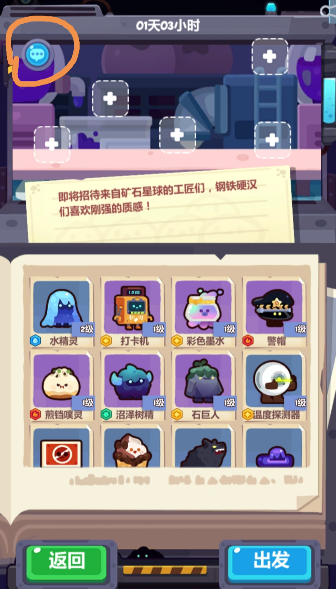
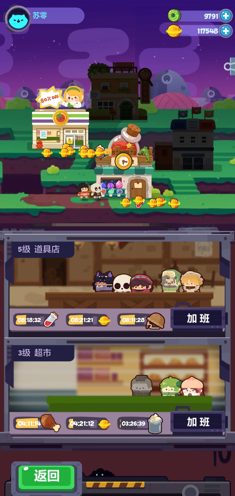
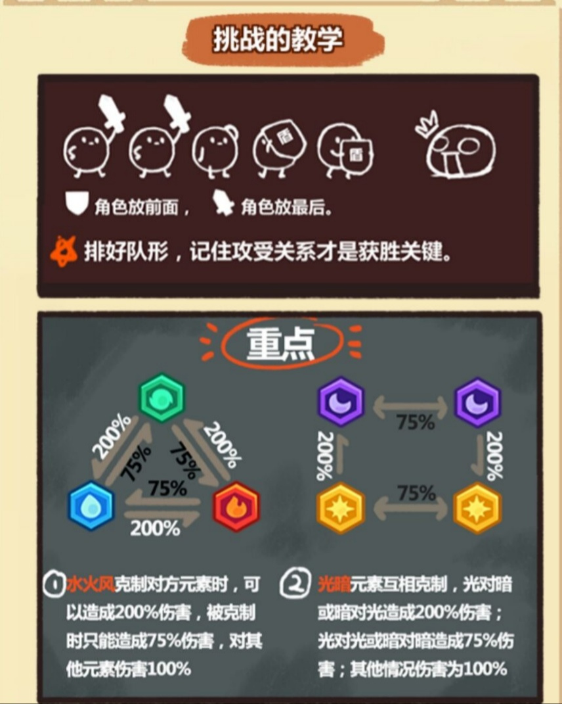
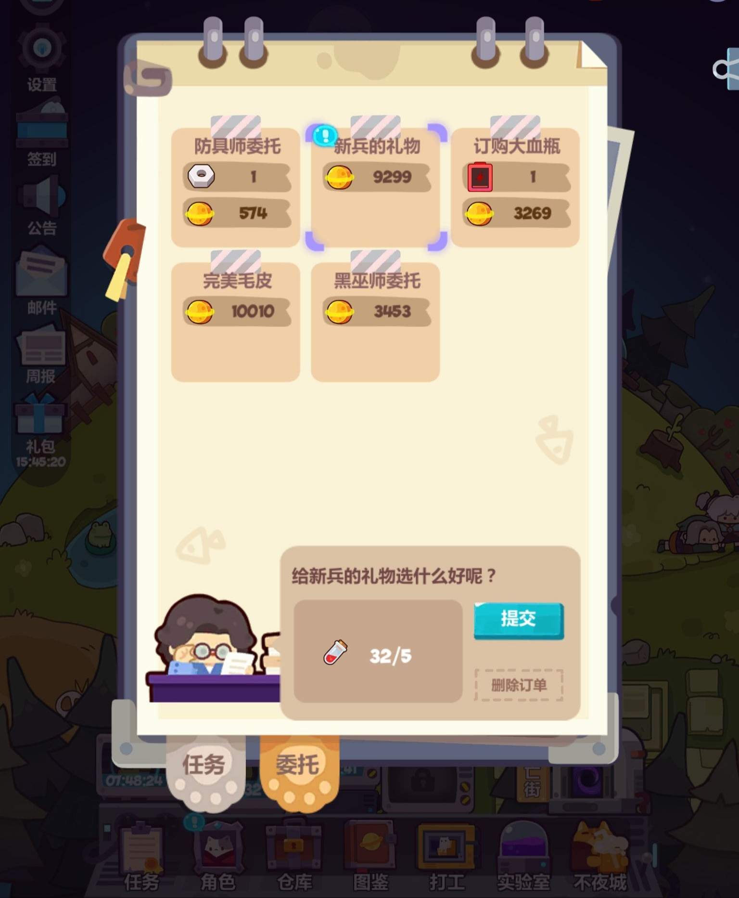

# 《妙奇星球》玩法·数值·图鉴调研

归档：2026-09-22；调研日期：2026-09-15。保留理由：带来源分级、截图和31×164评分矩阵的独有外部研究，可复核，不能作为当前功能要求。以下建议与版本信息仅代表调研时。

为《鸡宝厨房》扩充新玩法而做的外部参考调研。旧旅行方向稿（已合并到[当前计划](../../plan.md)）曾提出「参考《妙奇星球》的玩法组织方式」，本文补齐该参考的具体内容。

**本文是调研记录，不是《鸡宝厨房》的设计决定，其中任何数值都不应直接照搬进本项目。**

## 0. 资料可信度与时间戳（先读这一节）

调研过程中发现同一份数据在不同来源差异很大，原因是**游戏 2021-01-18 上线后持续更新了近三年**，而大部分攻略资料停在 2021 年初。本文按可信度分三档标注：

| 档位 | 含义 | 本文标记 |
| --- | --- | --- |
| A｜官方 | 应用商店官方文案、官方更新日志 | 「官方」 |
| B｜实机 | 玩家实机截图、游戏内教学界面 | 「实机」 |
| C｜实测/推算 | 玩家社区实验、攻略推算，可能有误差或已过时 | 「实测」 |

三个必须注意的时间差：

1. **官方商店文案仍写着「4 大星球、128 个角色、162 套皮肤、167 个宠物、200 张事件卡」**，这是 2021 年上线时的数据，至今没改过。实际到 2023-10 已有 **7 个星球**。凡引用这组数字必须注明是首发规模。
2. **BWIKI（wiki.biligame.com/mqxq）最后有效编辑在 2021 年 2—3 月**，只收录了 6 个角色、冒险星与美食星的内容，角色属性表整个是空的。它的价值在于**机制与公式**（这些没变），不在于**内容清单**（早已过时）。
3. 本文抓不到 2023-12 之后的资料，**米洛卡、占卜屋、科技馆、家园装饰**等后期系统只有官方更新日志级别的描述，没有数值。

另外：BWIKI 正文被腾讯 EdgeOne WAF 拦截，curl 与内置浏览器均返回 567，只有真实浏览器能访问；其 MediaWiki API 仅开放 `list=allpages` 等目录类接口，内容类接口（`action=parse`、`prop=revisions`、`action=raw`）全部被拦。本文数据通过真实浏览器逐页提取。

---

## 1. 游戏概况

| 项 | 内容 | 来源 |
| --- | --- | --- |
| 类型 | 星球探险收集 + 放置挂机 | 官方 |
| 开发 | 波克城市 · 套鹿工作室（立项于 2017 年底） | 官方 |
| 发行 / 供应商 | 波克城市 / 赛韵网络科技（上海） | 官方 |
| 上线 | 2021-01-18（TapTap） | 官方 |
| 最新可查版本 | 1.6.2（2023-10-07，TapTap）／1.6.3（2023-12-11，小米商店） | 官方 |
| 包体 | 约 570 MB | 官方 |
| TapTap 数据 | 8.8 分 / 8,022 条评价 / 41 万关注 / 76 万下载 | 官方 |
| 包名 | `com.taolu.freakplanet` | 官方 |

官方自述的核心气质，值得原样记下来，因为它决定了整套数值的松紧：

> 【极度佛系 肝癌慎入】本游戏极度佛系休闲！！！玩上一段时间，你甚至怀疑自己出家了...
>
> 妙奇星球的灵魂就是放置等待。

这与《鸡宝厨房》的定位高度接近，是它值得参考的根本原因——**它证明了「等待」可以承载一整套收集 + 养成 + 轻战斗的内容量**。

---

## 2. 玩法总览：五个循环如何咬合

这是全文最该先看懂的一张图。妙奇星球没有「主玩法 + 附属系统」，而是**五个产出循环互相供血**：

```
                    ┌──────────────────────────────┐
                    │        角色（128+）           │
                    │  战斗属性 8 项 + 打工属性 4 项 │
                    └───┬──────────────────────┬───┘
            派去打工 ↓                          ↓ 派去探索
        ┌───────────────────┐        ┌────────────────────┐
        │  打工（店铺挂机）  │        │  探索（区域挂机）   │
        │  产：食物·金币·道具│───────▶│  耗：食物 = 探索时长 │
        └───────────────────┘  供给   │  产：素材·宠物·经验 │
                    ▲                 └─────┬──────────────┘
                    │                       │
            金币/素材│                       │素材 + 宠物
                    │                 ┌─────▼──────────────┐
        ┌───────────┴───────┐         │  委托·日志·观光团   │
        │  挑战（自动战斗）  │◀────────│  把收集物换成硬通货 │
        │  耗：队伍战力      │  玉璧   └────────────────────┘
        │  产：玉璧·黑芯片   │
        └───────────────────┘
                    │ 玉璧
                    ▼
              抽卡 → 新角色 → 回到最上方
```

**关键设计：食物是探索时长的唯一硬通货，而食物只能靠打工产出。** 这一条把「打工」和「探索」死死锁在一起——你不能只挂探索，必须周期性回来安排打工；也不能只打工，因为素材和宠物只有探索能拿。《鸡宝厨房》目前的「孵化等待」是单循环，这是最值得抄的结构性差异。

---

## 3. 星球与区域

### 3.1 七星球主线编号（实测，按社区攻略交叉验证）

| 顺序 | 星球 | 主线编号 | 备注 |
| --- | --- | --- | --- |
| 1 | 冒险星 | 001–104 | RPG 恶搞题材；主线 102 解锁流亡街 |
| 2 | 美食星 | 105–203 | 主线 124 解锁警察局；203「下一站，博物馆星」 |
| 3 | 博物馆星 | 204–308 | 308「下一站，悬疑星」 |
| 4 | 悬疑星 | 309–435 | 435「凶手的挑战」，打败侦探街的凶手 |
| 5 | 海洋星 | 436–566 | 566 在深海打败「蟹董事」 |
| 6 | 沙漠星 | 567– | 海洋星主线全清后解锁 |
| 7 | 神话星 | — | 1.6.2（2023-10-07）新增，沙漠星主线全清后解锁 |

转星球的主线任务是统一格式：**交一批本星球特产素材 → 开新星球着陆点 + 奖券 + 玉璧 20**。例如 203 交五花肉 ×20，308 交箭头 ×20。

### 3.2 冒险星区域链（10 区，wiki）

着陆点/初始城镇 → 村口树林 → 溪谷 → 魔法平原 → 古代遗迹 → 大沼泽 → 深坑谷 → 魔王火山 → 魔王城堡 → 藏宝库

### 3.3 美食星区域链（11 区，攻略 + wiki 日志表并集）

着陆点 → 鲷鱼镇 → 冰淇淋港 → 糖果镇 → 甜食工厂 → 风味镇 → 饭团镇 → 煮物镇 → 寿司镇 → 烤肉镇 → 香浓镇

> 注：日志表中出现 11 个地名（含冰淇淋港与风味镇），而区域攻略只列了 8 个；两份资料统计口径不同，此处取并集。

**美食星区域参数（攻略，含推荐探索时长）：**

| 区域 | 主要怪物 | 素材 | 捕捉道具 | 推荐时长 |
| --- | --- | --- | --- | --- |
| 着陆点 | 草莓推销员 | — | 超市空瓶 | 2h |
| 鲷鱼镇 | 鱼头/鱼尾老板 | 豆沙 | 超市空瓶 | 8h |
| 糖果镇 | 阿头、奶糖新秀 | 牛奶 | 超市空瓶 | 9h |
| 甜食工厂 | 布丁呆、多拿滋 | — | 超市空瓶 | 12h |
| 饭团镇 | 饭团、黑米团、泡菜团 | 米饭 | 超市空瓶 | 4–8h |
| 煮物镇 | 铛噗灵、夹心肉球 | 料酒 | 超市空瓶 | 18h |
| 寿司镇 | 甜虾龟龟、寿司龟龟 | 海苔 | 超市空瓶 | 6–10h |
| 烤肉镇 | 冠军培根、火腿猪 | 料酒 | **警察局纸袋** | 12h |

注意最后一行：**同一星球内换捕捉道具**，这是逼玩家回头升级另一家店铺（警察局）的钩子。

### 3.4 博物馆星区域链（10 区，攻略）

着陆点 → 入口大厅 → 中心广场 → 文物厅 → 生态园 → 古文明厅 → 化石厅 → 泥塑厅 → 恐龙馆 → 出口

**每颗星球约 10 个区域**（冒险星 10、博物馆星 10、美食星按并集 11），节奏基本统一。按此推算 7 星球合计约 70 个探索区域。

---

## 4. 探索系统（核心，也是最值得抄的部分）

### 4.1 刷怪算法（实测，社区实验验证）

这是整个游戏最硬的一块数值，也是《鸡宝厨房》做离线探索时最该借鉴的模型。

**核心思想：探索不是「掷骰子刷怪」，而是「把总时长按权重切给各种敌人」。**

```
每种敌人有固定「时间消耗值」：白色 100 秒 / 蓝色 240 秒 / 金色（BOSS）3600 秒
每个区域有固定「出现比例」配比
        权重 = 出现比例 × 时间消耗值
   分配时间 = 探索总秒数 × (该敌人权重 / 总权重)
     出现数 = 分配时间 ÷ 时间消耗值      ← 向下取整，零头抹掉
```

**藏宝库实例（24 小时 = 86,400 秒）：**

| 敌人 | 配比 | 耗时 | 权重 | 分配时间 | 数量 |
| --- | --- | --- | --- | --- | --- |
| 白 | 10 | 100s | 1000 | ≈10,526s | 105.3 → **105** |
| 蓝 A | 5 | 240s | 1200 | ≈12,634s | 52.6 → **52** |
| 蓝 B | 5 | 240s | 1200 | ≈12,634s | 52.6 → **52** |
| 蓝 C | 5 | 240s | 1200 | ≈12,634s | 52.6 → **52** |
| 金（BOSS） | 1 | 3600s | 3600 | ≈37,931s | 10.5 → **10** |
| | | | **8200** | 86,400s | |

结论：**藏宝库默认挂 24 小时 = 10 个 BOSS。**

**这个模型的妙处在于「提高 BOSS 数量」有两条完全不同的路径：**

| 手段 | 做法 | 效果 |
| --- | --- | --- |
| 加法 | 经典三人组 + 3 阶受害者 + 指路 NPC | BOSS 权重 +105% → 3600 变 7380 → **14 只** |
| 减法 | 再叠「扑克」道具，**压低其他敌人权重** | → **16 只** |

也就是说，队伍技能和携带道具不是加个百分比了事，而是**直接改写产出结构**。玩家会为了一个具体目标（刷 BOSS / 刷素材 / 刷某只宠物）去重组队伍和道具，这就是「挂机」产生决策的地方。

**两个已知误差（攻略作者自述，设计时要防）：**

1. 游戏的四舍五入逻辑会让敌人比预期早/晚出现约 1 分钟，**不要把目标怪卡在恰好整数个**，留余量。
2. 部分地图存在「某敌人耗时翻倍、出现比例减半」的情况——权重不变但实际数量减半，计算器未特殊处理。

> 适用范围：攻略作者声明该数据仅验证过「1 球后半段、2 球，以及 3 球前三个区域」。

### 4.2 探索时长 = 食物（实测）

探索时长由携带的食物决定，而食物**合成必然亏时长**：

| 食物 | 单个时长 | 合成关系 | 亏损 |
| --- | --- | --- | --- |
| 小血瓶 | **12 分钟** | — | — |
| 大血瓶 | **1 小时** | 6 个小血瓶合成（= 72 分钟） | **-12 分钟** |
| 特大血瓶 | **3 小时** | 4 个大血瓶合成（= 4 小时） | **-1 小时** |

由此产生一条真实的玩家行为分化，很值得注意：

- **白天频繁上线** → 一律用小血瓶，总时长最大化，多次短探索累计做任务（如「击败小火球 30 个」可拆多次完成）。
- **晚上睡觉** → 用长时食物，一口气推任务，牺牲效率换省心。

**合成的唯一好处是省背包格子。** 这是一条干净的「便利 vs 效率」权衡，比单纯的数值升级有意思得多。

另有加速道具：**剩 1 小时加速需 32 玉璧，剩 2 小时需 70 玉璧**——短档单价更低，鼓励零碎加速。

### 4.3 素材（wiki）

冒险星 10 种素材，与 10 个区域一一对应递进：

树叶 → 木材 → 骨头 → 矿石 → 地图 → 粘液 → 钢刺 → 沙堆 → 炭石 → 火焰结晶

规则：

- 每种素材由**相邻 2–3 个区域**产出，另可从**抽奖**获得；相邻区域重叠是为了让旧区域不立刻废弃。
- 掉落基于**击败怪物数**按概率触发，**同地图不同怪物的素材此消彼长**——这正好和 4.1 的权重模型咬合：你调队伍改变刷怪结构，就等于在选择刷哪种素材。
- 素材有明确的下游用途（火把 = 炭石 + 木材，7 级道具店需要 45 个火把），不是纯数字。

> wiki 的「来源」单元格是拼接文本，逐区域归属可能有偏差；链条顺序可靠。

### 4.4 携带道具「玩具」（wiki）

探索时可携带玩具，直接改写产出结构（对应 4.1 的权重）：

| 玩具 | 效果 | 来源 |
| --- | --- | --- |
| 发光蘑菇 | 素材获得率 + | 事件：发光蘑菇 |
| 幸运金币 | 金币数量 + | 事件：发光蘑菇 |
| 路牌 | 紫色以上品质敌人出现率 + ／ 探索等待时间 + | 事件：发光蘑菇 |
| 扑克 | 大幅降低其他敌人权重（变相拉高 BOSS 占比） | 实测 |

注意「路牌」是**双刃**：提高稀有敌人出现率的同时增加探索等待时间。这种「好处附带代价」的道具设计比纯增益更耐玩。

### 4.5 宠物捕捉（实测）

- 捕捉道具**按先来后到顺序消耗**，所以队伍要带对道具、按预期怪物排列。
- 捕获率示例（火焰巨人）：**玻璃瓶 5% → 精灵瓶 33% → 合金陷阱 100%**。
- **合金陷阱成本极高**：3 个复合陷阱 + 6 个分享桶；分享桶 = 4 个鸡腿；复合陷阱 = 3 个简单陷阱 + 8 个鸡腿。**做一个合金陷阱最少 14.4 小时。**
- 角色装备可加成：猎人 5 级陷阱装备 **+25% 陷阱成功率**。
- 单次探索时长也影响捕获成功率。
- 实测结论：「火巨出现率最低 80%，捕获率最低 35%，理论上碰到 3 个可以抓到一个」。
- 4 级超市解锁精灵瓶配方——**捕捉效率被店铺等级卡着**，又一次把打工和探索绑在一起。



---

## 5. 打工系统



### 5.1 结构（实机 + 实测）

- 打工场所即城镇里的建筑：**道具店、超市、警察局**等。
- **店铺每升 1 级 = 多 1 个员工位**（实机可见：5 级道具店 5 个员工位，3 级超市 3 个）。
- 每家店**并行产出 3 条独立计时的产线**（实机可见道具店 08:18:32 / 08:21:21 / 08:11:28），分别对应：一种食物、金币、一种道具。
- 有「加班」按钮（加速产出）。
- 店铺升级还会**解锁高级食物配方与捕捉工具配方**。

**产线归属：** 道具店产血瓶线，超市产鸡腿/便当线。二者都是探索时长道具，但走不同的升级路径。

### 5.2 打工四属性（实测）

与战斗属性完全分离的另一套四维：

| 属性 | 含义 | 需求方 |
| --- | --- | --- |
| 技巧 | 动手能力 | 道具店 |
| 亲和 | 沟通能力 | 道具店、超市 |
| 力气 | 运动能力 | 超市 |
| 智力 | 思维能力 | （用途未确认） |

**成长规则：每个角色有 1 个主属性、1 个副属性会成长；每升一级主属性 +2、副属性 +1。**

由此推出一条反直觉但很健康的结论：

> **灰色（最低稀有度）角色升级打工性价比最高**——升级成本最低，且很多灰卡自带打工加成技能。

**这一点非常值得抄。** 它让最低稀有度的角色有了不可替代的岗位，稀有度不再是唯一评价轴。对照《鸡宝厨房》方向稿第 4 节「现有普通伙伴也要有适合的路线，避免稀有度成为唯一选择依据」——妙奇星球给出的答案是**开一套与战斗完全无关的属性维度**。

### 5.3 排班与溢出

- 不同打工区域的属性需求不同，**需求看清楚，否则容易某项数值过高溢出**（溢出 = 浪费）。
- 打工人分三类：**打工加成（提评级）、时长加成、金币加成**。
- 实测数值：打工情缘可给「打工 3 属性 +5%、技巧 +10%」；村长 + 村长夫人各升到 10 级开情缘「亲和 +20」。
- 成本参考：**一张蓝卡工具人养到 20 级约需 1.2 万金币。**


---

## 6. 角色养成

### 6.1 稀有度与分类维度（wiki）

稀有度五档：**灰 → 蓝 → 紫 → 金 → 彩**

角色图鉴的筛选维度（一个角色同时挂多个标签）：

| 维度 | 取值 |
| --- | --- |
| 稀有度 | 彩、金、紫、蓝、灰 |
| 性别 | 男、女 |
| 来源 | 新手奖池、中级奖池、璧池、挑战、初始赠送 |
| 元素 | 火、水、风、光、暗 |
| 定位 | 攻、防 |
| 所属 | 冒险星、美食星、博物馆星、悬疑星、星际流民 |
| TAG | 降智、光特攻、暗特攻、治疗、闪避、探索减时间、道具掉率、探索加金币、怪物出率、宠物捕捉、加工时、打工加食材、打工加金币 |

**TAG 这一列是重点：** 它把「这个角色在哪个系统里有用」直接写进图鉴。探索减时间、宠物捕捉、打工加金币和战斗向的治疗、闪避并列——**角色的价值被显式地分散到多个系统**，而不是只看战力。

### 6.2 八项战斗属性（wiki）

生命、攻击、忍耐、暴击、技巧、亲和、力气、智力

> 后四项与打工四属性同名，推测是同一组数值在两套系统里复用。BWIKI 的角色属性表整个是空的，无法验证。

**战力换算公式（实测）：**

```
战力 = 生命 ×1 + 攻击 ×1 + 忍耐 ×10 + 暴击 ×10
```

防御向属性权重是攻击向的 10 倍，说明这套战斗的设计重心在「扛得住」而非「打得快」。

### 6.3 养成的六条独立路径

| 路径 | 消耗 | 产出 |
| --- | --- | --- |
| 等级 | 纯金币（不卡其他资源） | 基础属性 |
| 突破（升阶） | 电池 | 提升等级上限、开放星级技能 |
| 皮肤 | 日记页 | 外观 + 属性 + 解锁情缘 |
| 装备（4 件） | 零件 + 金币 | 属性 + 特效 |
| 情缘 | 角色组合 + 站位条件 | 队伍级增益 |
| 米洛卡（2023 新增） | 米洛卡代币 | 探索/打工/战斗各项属性 |

**突破消耗（实测）：** 白卡升阶需 1 个红电池，蓝卡 2 个，紫卡 5 个。

**等级上限节奏（实测的玩家推进节奏，非硬上限）：** 12 → 20 → 30 → 40。

**皮肤：** 消耗日记页解锁，日记页分五档（超小 / 小 / 中 / 大 / 完整）。**首次点击「挑战」才实际消耗资源**——这是一个很体贴的防误操作设计。

### 6.4 装备数值（wiki，大魔王四件套完整曲线）

这是全网能找到的唯一一份完整装备曲线，规律非常干净：

**通用规律：**

- 每件装备提供 **2 项属性 + 1 个特效**。
- 属性**严格线性**：Lv.N 数值 = Lv.1 数值 × N。
- **特效在 Lv.8 阶跃生效**（Lv.1–7 显示但不生效）；部分副属性从 Lv.5 起才开始给值。
- 升级材料在 **Lv.8 换档**：低级零件（B/C）→ 高级零件（A）。

| 装备 | 属性 A | 属性 B | 特效（Lv.8 起） | 零件 | Lv.10 金币 |
| --- | --- | --- | --- | --- | --- |
| 四条血 | 生命 +75×N（→750） | 智力 +12×N（→120） | 受风元素敌人伤害 **-5%** | 固化 C→A | 35,400 |
| 幽魂 | 攻击 +63×N（→630） | 智力 +12×N（→120） | 攻击时**无视敌人 75% 忍耐** | 强化 C→A | 35,400 |
| game over | 生命 150→1050（+100/级） | 忍耐 +5×N（→50） | 敌人暴击 **-22** | 固化 B→A | 123,000 |
| 隐藏结局 | 攻击 189→1134（+105/级） | 暴击 +5×N（→50） | 敌人忍耐 **-22** | 强化 B→A | 317,000 |

**金币曲线（Lv.2→Lv.10）：**

- 四条血 / 幽魂：320 / 760 / 1,800 / 3,600 / 6,600 / 11,200 / 17,300 / 25,300 / 35,400
- game over：890 / 2,800 / 6,700 / 13,800 / 24,700 / 40,300 / 61,200 / 88,700 / 123,000
- 隐藏结局：2,400 / 7,700 / 18,800 / 37,600 / 66,000 / 106,000 / 160,000 / 230,000 / 317,000

**四件装备的总成本差接近 9 倍**（35,400 vs 317,000），意味着同一角色的四件装备是分档的，玩家要选择先点哪件。攻略给的建议正是「5 级或 8 级解锁特殊技能」作为阶段目标——**把长曲线切成两个可达的短目标**。

### 6.5 星级技能（wiki）

以大魔王为例，技能强度按突破星级递增：

| 星级 | 效果 |
| --- | --- |
| 2 星 | 地城的陛下：每个暗元素队员使 生命 +60、攻击 +60 |
| 3 星 | 地城的陛下：每个暗元素队员使 生命 +90、攻击 +90 |

**技能与元素挂钩（「每个暗元素队员」），构成组队约束。**

### 6.6 情缘（wiki + 实测）

情缘是「特定角色组合 + 特定条件」触发的队伍级增益，**分系统生效**：

| 情缘 | 角色 | 适用 | 效果 |
| --- | --- | --- | --- |
| 小猫探险队 | 呜呜、漆漆（需冒险家皮肤） | **探索** | 探索时间 -12% |
| 魔族的进攻 | 骨头兵、小队长、小魔王、大魔王 | **挑战** | 全队对光元素敌人伤害 +50%，受光元素敌人伤害 -25% |
| 致敬名作 | 火枪、剑士、猎人 | **探索** | 金色及以上敌人出现概率 **+60%** |
| 璀璨文明 / 圣光照耀 | — | **打工** | 打工向增益 |

**两条关键规则：**

1. **「情缘必须放在同一个店内才可以激活」**——打工情缘要求角色被排在同一家店。
2. 情缘常常**要求皮肤**（小猫探险队需要呜呜/漆漆的冒险家皮肤），把皮肤从纯外观变成了养成节点。

情缘是这游戏把「收集」转化为「决策」的主要手段：你收到一个角色不只是 +1 图鉴，而是可能补齐了某个情缘的最后一块。

### 6.7 米洛卡（官方，1.6.3 / 2023-12-11）

- **金色和彩色角色每人可装备 3 张，紫色及以下 2 张。**
- 提供**探索、打工、战斗**各项属性；升级米洛卡可激活更多属性。
- 来源：流亡街「科技馆」挑战 → 米洛卡代币 → 米洛卡兑换商店（可兑换各元素的米洛卡）。

这是一套后期加入的、横跨三个系统的通用强化卡，**用稀有度决定槽位数**而非直接决定数值。

---

## 7. 战斗（挑战）



### 7.1 元素克制（实机，游戏内教学原文）

五元素：**水、火、风、光、暗**，分两套独立规则：

**① 水火风三角循环**

```
水 → 火 → 风 → 水   （箭头方向 = 克制）
克制：200% 伤害
被克制：75% 伤害
对其他元素：100% 伤害
```

**② 光暗互克（规则完全不同）**

```
光 打 暗，或 暗 打 光 → 200% 伤害
光 打 光，或 暗 打 暗 → 75% 伤害
其他情况 → 100% 伤害
```

注意光暗的特殊性：**同元素互打只有 75%**。这意味着堆一色光队会被另一支光队反制，抑制了「一队通吃」。

### 7.2 站位（实机）

游戏内教学原文：

> 🛡 角色放前面，⚔ 角色放最后。排好队形，记住攻受关系才是获胜关键。

即**防御型（盾）前排、攻击型（剑）后排**，与角色图鉴的「定位：攻/防」标签直接对应。

### 7.3 战斗特征（实测）

- **全自动战斗**，玩家只决定队伍与行前准备。
- **宠物可参战**，且「选择克制 BOSS 属性的宠物，战斗力强劲，堪比第三主力」。
- 推荐结构：**2 个能扛 3 回合的坦克 + 牧师（装备回血）→ 再扛 3 回合**，用回合数换伤害窗口。
- 面板不等于强度：「弓手与法师面板差 50%，但输出一点都不差」——技能机制（如火枪手 6 发左轮、剑士闪避、弓箭手必中箭）比面板重要。

### 7.4 流亡街（周常关卡，实测）

| 项 | 内容 |
| --- | --- |
| 开放 | 主线 102 章 |
| 难度 | 简单（30 级怪）→ 超凶（42 级怪） |
| 重置 | **每周** |
| 奖励 · 黑芯片 | 随**难度星级**翻倍增长 |
| 奖励 · 玉璧 | 随**关数**递增，与难度无关 |
| 机关 | 6 关回血树、8 关复活石 |
| 推荐队伍 | 3T（坦克 + 治疗 + 输出） |

**「降敌等级」是一条独立的强度轴：** 大魔王美杜莎皮肤降敌 30 级，小魔王默认降 8 级。也就是说打不过时，除了变强还可以**把对面变弱**——这给了低战力玩家一条通路。

**玉璧与黑芯片分离奖励轴**也很聪明：想要通货（玉璧）就往深了推，想要特殊材料（黑芯片）就挑高难度，两个目标互不挤占。

---

## 8. 图鉴与收集

### 8.1 图鉴分类

游戏内图鉴分四类：**角色图鉴 / 宠物图鉴 / 物品图鉴 / 日志**，角色图鉴下另有**皮肤**页签。

首发规模（官方，2021）：

| 类别 | 数量 |
| --- | --- |
| 星球 | 4（现 7） |
| 角色 | 128 |
| 皮肤 | 162 |
| 宠物 | 167 |
| 事件卡 | 200 |


### 8.2 宠物全名单（164 只，wiki 2021 快照）

按「桀骜不驯」主题分值从高到低排列（这也大致等于稀有度序）：

钢铁刺毛怪、白狼、热带一角龙、传奇宝箱怪、寒带一角龙、稀有宝箱怪、恐龙化石、勒索信、火狐、高清摄像头、紫水母、木制宝箱怪、野狼、刺毛怪、雨林快走龙、沙漠快走龙、快陶鸭、红海草、煎铛噗灵、黑狼、火焰巨人、铛噗灵、窨井盖、白猫、黑猫、红海葵、禁止通行、相片、瓶中脑、绿礁石、蓝礁石、海星星、鲈鱼、神仙鱼、帝王蟹、皇冠海星、章鱼、摄像头、金鸮卣、消防栓、烟灰缸、行李车、树桩猴、火山巨蟹、入口、红外线探测、安全出口、蔬菜笔记、烟斗、绿海草、蓝海兔、闪电海蛇、火山海参、小丑鱼、蓝海葵、黄水母、海胆、红海绵、鱿鱼、彩色墨水、警帽、石巨人、沼泽树精、奶小糖、陶面人、猪罐、警戒线、三花猫、礼帽、信封、煤气灯、警用路障、打火机、证物手机、红墨水、比撒、水果笔记、放大镜、怀表、紫珊瑚、绵羊海兔、海蛇、海螺、海参、蓝水母、水熊虫、绿海绵、温度探测器、小石怪、小土包、地缚灵、沼泽地、泥怪、火喷泉、小火球、火精灵、饭团、围观陶、编钟、兽面鼎、碰碰瓷、鸮卣、鱼化石、乌龟化石、碧鱬、赤鱬、情书、邮票、门牌、工地路障、手铐、报警器、蓝墨水、豹纹手铐、布丁呆、火腿猪、熔岩猪、塔可桑、双色克林姆、水精灵、小花球、大树怪、祭祀石、小火山、阿头、阿尾、克林姆、巧克林姆、茶克林姆、水果小糖、芒果滋、多拿滋、黑脸鱼子军舰、黑米团、泡菜团、夹心肉球、玉子龟龟、寿司龟龟、甜虾龟龟、培根、芝士软泥、黄砗磲、邮筒、血迹、红珊瑚、红砗磲、粉红海兔、花丛、左半瓷、右半瓷、粉红帽、报纸、羽毛笔、打卡机、绿色史莱姆、蓝色史莱姆、紫色史莱姆、红色史莱姆、草莓、梨几、桃几、苹狗、左半碗、右半碗

**命名策略值得单独记一笔：** 宠物不是常规怪物，而是**把场景里的日常物件拟人化**——警帽、消防栓、窨井盖、打卡机、勒索信、证物手机、工地路障。这与星球主题绑定（悬疑星出警用道具，博物馆星出文物如鸮卣/编钟/兽面鼎）。这套「万物皆可收集」的思路，比做 164 只正经怪物省美术、又更有梗。

### 8.3 观光团：31 个主题评分（wiki，最具参考价值的收集玩法）

**玩法：** 每期给出一个主题，玩家从已捕获宠物里挑若干只布展（实机可见 5 个展位），按主题契合度得分。

**评分结构：每只宠物 × 每个主题 = 一对固定的（基础分, 等级分）。** 全表 31 主题 × 164 宠物 = 5,084 个数值对。

**完整矩阵已提取：[`观光团评分矩阵.csv`](观光团评分矩阵.csv)**（599 行，字段为「主题, 基础分, 等级分, 宠物列表」——同主题同分值的宠物合并为一行，展开后即完整 5,084 格）。下表为每个主题的汇总。

| 主题 | 主题描述（游戏原文节选） | 分值范围 | 负分宠物数 |
| --- | --- | --- | --- |
| 桀骜不驯 | 招待英雄世家的冒险者，希望看到难以驯服的生物 | 0 ~ 120 | 0 |
| 海洋气息 | 招待海洋爱好者 | -36 ~ 104 | 6 |
| 圆润有弹性 | 招待星际球类协会，希望看到圆滚滚又有弹性的宠物 | -20 ~ 105 | 63 |
| 神秘感 | 招待悬疑星的侦探们 | -5 ~ 120 | 11 |
| 知识渊博 | 招待皇家图书馆的阅读爱好者 | 0 ~ 120 | 0 |
| 增进食欲 | 招待美食星的美食家 | -110 ~ 110 | 114 |
| 肉系宠物 | 招待食肉委员会，只要看到肉就很高兴 | -160 ~ 110 | 118 |
| 草系宠物 | 招待素食委员会 | -80 ~ 120 | 129 |
| 色彩单调 | 招待未康复的色盲患者，展示颜色尽量少些 | -95 ~ 105 | 6 |
| 弱小的潜力股 | 招待互助委员会，希望看到弱小但努力升级的宠物 | -30 ~ 90 | 17 |
| 几何形状 | 招待「弱贝尔数学奖」候选人 | -50 ~ 116 | 28 |
| 陷阱捕捉 | 招待猎人协会见习生，想看用陷阱捕捉的宠物 | -70 ~ 105 | 113 |
| 空瓶捕捉 | 招待空瓶回收站工作者 | -70 ~ 105 | 129 |
| 纸袋捕捉 | 招待打包协会专家 | -70 ~ 105 | 133 |
| 工具箱捕捉 | 招待工具之家的动手爱好者 | -70 ~ 105 | 107 |
| 纸板箱捕捉 | 招待网购星的购物爱好者 | -15 ~ 100 | 24 |
| 新奇稀有 | 招待冒险星观光团 | -5 ~ 120 | 3 |
| 热乎乎 | 招待怕冷的观光者 | -10 ~ 120 | 5 |
| 机械 | 招待机械爱好者 | -20 ~ 110 | 22 |
| 活力四射 | 招待喜欢动物的观光团 | -15 ~ 110 | 9 |
| 有威胁的 | 招待冒险协会，怪物太没威胁性是不行的 | -5 ~ 110 | 11 |
| 跑得快 | 招待无精打采的观光团 | -40 ~ 140 | 10 |
| 毛茸茸 | 招待吸猫爱好者 | -50 ~ 83 | 113 |
| 绿色植物 | 招待绿化爱好者 | -100 ~ 125 | 26 |
| 黑暗料理 | 招待怪味料理爱好者 | -30 ~ 180 | 44 |
| 五彩缤纷 | — | 0 ~ 100 | 0 |
| 凉飕飕 | — | -40 ~ 130 | 47 |
| 可爱 | — | 0 ~ 115 | 0 |
| 刚强 | — | -30 ~ 130 | 110 |
| 高热量美食 | — | 0 ~ 115 | 0 |
| 博物馆 | — | — | — |

**四点设计观察：**

1. **负分是主力机制。** 「肉系宠物」主题下有 118 只宠物是负分，「纸袋捕捉」133 只。玩家不是「挑最强的」，而是**必须知道哪些不能放**。收集量越大，筛选反而越需要知识。
2. **等级分让低星宠物有位置。** 每只宠物除基础分外还有一个「等级分」，随宠物等级放大。所以一只养满的普通宠物可以打过一只没养的稀有宠物——**养成可以替代抽取**。
3. **主题维度是交叉的，不是分类。** 同一只宠物在「毛茸茸」「跑得快」「可爱」三个主题里各有不同分值。这让 164 只宠物产生远超 164 的信息量，几乎零成本地复用了全部美术资产。
4. **连捕捉方式都能当主题。** 「陷阱捕捉 / 空瓶捕捉 / 纸袋捕捉 / 工具箱捕捉 / 纸板箱捕捉」五个主题直接用**获取方式**作为分类轴，逼玩家用不同道具去抓——反向推动探索系统。

> wiki 未记录最终计分公式；从表结构与实机界面推断为 `单只得分 = 基础分 + 等级分 × 等级`（或 ×(等级-1)），全队求和。**此为推断，未经验证。**

### 8.4 日志（事件卡）

**触发条件 = 在指定区域一次性探索满指定时长，且队伍中含指定角色。**

冒险星 46 条、美食星 48 条（wiki 收录）。示例：

| 编号 | 名称 | 条件 | 需要角色 | 地点 | 时长 | 奖励 |
| --- | --- | --- | --- | --- | --- | --- |
| 002 | 很香的烤串 | 一次性探索 1分30秒 | 呜呜、漆漆 | 初始城镇 | 1m | 玉璧 ×5 |
| 003 | 沐浴中的仙子 | 需要德高望重的男性 + 血气方刚的男性 | 村长、剑士 | 村口树林 | 15m | 玉璧 ×20 |
| 004 | 发光蘑菇 | 需要**裤腰带勒紧**的角色 | 居民 npc | 村口树林 | 20m | 玩具·发光蘑菇 |
| 014 | 孤独的骷髅 | 需要精通魔法的角色 + 懂不死族语言的角色 | 魔法师、骨头兵 | 古代遗迹 | 2h | — |
| 026 | 最高级的锻造术 | 需要精通锻造 + 随身携带宝剑的角色 | 铁匠、剑士 | 魔王火山 | 8h | 玉璧 ×300 |
| 036 | 服务器机房 | 需要精通程序编写的角色 | 程序员 | 藏宝库 | 12h | 玉璧 ×100 |
| 046 | 啊，请看下这个~ | 一次性探索 5 分钟 | / | 魔法平原 | 5m | 玉璧 ×100 |

**三条规则：**

1. **每次探索只能触发一个日志**——不能一次挂机通吃，必须多次分别出发。
2. **只看食物总时长是否达标**，角色的「探索减时间」不影响达成判定。
3. **条件用谜语描述，不直接点名。** 「裤腰带勒紧的角色」「被幸运之神抛弃的特殊角色」「以为能击败龙族的英雄后裔」——玩家要靠角色设定去猜。

**第 3 条与《鸡宝厨房》1.4.2 的「发现小线索」是同一个设计思路**（193 位伙伴各一句含蓄暗示）。妙奇星球的做法证明了这条路可以进一步延伸：**把谜语从「配方提示」扩展成「组队条件」**，谜面本身就是玩法。

奖励梯度也值得记：从 玉璧 ×5 到 ×300，跨度 60 倍，与所需时长（1 分钟 ~ 16 小时）和角色获取难度正相关。

---

## 9. 委托 / 任务



- **委托 = 用素材/道具换资源的订单**，是红电池（突破材料）的主要来源。
- **订单可以删除，2 分钟后刷新**——玩家有「拒绝」的权力，这条很关键，它把随机订单从惩罚变成了选择。
- 攻略共识：「量力而行，有些看起来就很亏的就不要做，删掉等 2 分钟看新的」。
- 高价值订单要素材储备：火把（炭石 + 木材）、沙漏、攻略、头骨；**7 级道具店需要 45 个火把**。
- 零件委托 CD 2 分钟。
- 玩家实测存在极端优质订单：「5 个小血瓶换近一万金币」。

**任务分主线 / 支线 / 限时三类。** 支线的三种典型形态（持有素材、升级角色、捕捉宠物）都要求**提前规划**而非即时完成，这与挂机节奏匹配。

---

## 10. 经济与货币

| 货币 / 资源 | 用途 | 主要来源 |
| --- | --- | --- |
| 金币 | 角色升级、装备强化 | 打工、委托、探索 |
| 玉璧 | 抽卡、加速 | 日志、挑战、观光团、流亡街、任务 |
| 玉璧券 | 抽卡 | 主线、活动 |
| 电池（低量/高能/超能/危险） | 角色突破 | 委托、流亡街商店、生涯任务、碧池 |
| 日记页（超小/小/中/大/完整） | 解锁皮肤 | 探索、活动 |
| 固化零件 A/B/C | **防御向**装备强化 | 委托、探索 |
| 强化零件 A/B/C/D | **攻击向**装备强化 | 委托、探索 |
| 黑芯片 | 流亡街商店 | 流亡街（随难度翻倍） |
| 米洛卡代币 | 米洛卡兑换商店 | 科技馆挑战 |
| 食物（血瓶线 / 鸡腿便当线） | **探索时长** | 打工 |

**攻击与防御装备走两条独立材料线**（强化零件 vs 固化零件），玩家不能把资源全压在一边，天然形成配队约束。

**队伍解锁：** 二队 6,000 金币；三队建议主线 110 章后再开（早开缺探索食物）；「警察局开了食物就不缺了」。**队伍数量被食物产能卡住**，而不是被金币卡住——挂机位不是越多越好，这是很克制的设计。

---

## 11. 抽卡


| 项 | 数据 | 档位 |
| --- | --- | --- |
| 卡池 | 新手奖池、中级奖池、璧池（碧池）、金币池 | wiki |
| 角色总出率 | **约 3%**（约每 3 个十连出 1 个角色） | 实测 |
| 彩卡十连概率 | **> 4.3%**（约 23 发出 1 张彩卡） | 实测 |
| 初池保底 | **约 140–150 抽** | 实测 |
| 璧池保底 | 有玩家 220 抽未出，疑似无硬保底 | 实测 |
| 抽干璧池 | 约 833 抽 ≈ **45,000 玉璧** | 推算 |

**最值得记的一条结论（实测原文）：**

> 保底指的是**角色的保底**而不是**品质的保底**，也就是说 130 抽左右必定出角色，但是什么品质再看概率。

各品质出货概率相近，与稀有度关系不大。**这是一套「保底给你一个角色，但不保证是好角色」的设计**——对一款佛系收集游戏而言，它把抽卡的目标从「抽到某个强角色」偏移到「填图鉴」，与整体定位一致。

前期资源建议（实测）：早期玉璧用于**加速**比抽卡划算；金币池早期不建议抽。

---

## 12. 版本演进（官方更新日志）

| 版本 | 日期 | 主要内容 |
| --- | --- | --- |
| 1.0 | 2021-01-18 | 上线。4 星球 / 128 角色 / 162 皮肤 / 167 宠物 / 200 事件卡 |
| 1.5.15 | 2022-10-24 | 活动限定任务：星际客栈开启鬼崽主题限时任务 |
| 1.6.2 | 2023-10-07 | **新增第七个星球「神话星」**，沙漠星主线全清后解锁 |
| 1.6.3 | 2023-12-11 | **米洛卡系统**；流亡街新增**占卜屋**（每日 1 张占卜卡，探索携带有巨大效果）与**科技馆**（同时面对多个敌人）；米洛卡兑换商店；探索出发页新增**可击败敌人数量预览**；补签卡；回流签到（30 天未登录触发，连续 8 天领奖） |

**「探索出发页新增可击败敌人数量预览」这条要特别注意：** 说明官方在两年后主动把 4.1 的刷怪算法**结果**直接展示给玩家了。原本需要玩家自己算计算器的东西，最终变成了内置 UI。对《鸡宝厨房》的启示很直接——**如果做类似的权重探索，预览应该一开始就做进去，不要让玩家去外部算。**


---

## 13. 对《鸡宝厨房》的可借鉴点

以下对照的是已撤下的2026-09-15旅行草案，其节号仅作历史语境；当前范围见[计划](../../plan.md)。**以下是建议，不是结论。**

### 13.1 直接可用的结构

| 妙奇星球的做法 | 对应方向稿 | 建议 |
| --- | --- | --- |
| **食物 = 探索时长，食物只能靠打工产出** | §5「先落地的挂机内容」 | 方向稿把「厨房后勤」列为后置。妙奇星球的经验相反：**这条供给链是把两个挂机系统锁在一起的关键**，不做它，探索就是孤立的单循环。建议至少先想清楚《鸡宝厨房》里「什么资源限制探索时长」 |
| **刷怪权重模型**（时间消耗 × 出现比例） | §4「队伍与探索」 | 比「随机掉落表」更适合离线结算：结果可预测、可预览、可被队伍和道具改写，玩家能为具体目标组队 |
| **合成必然亏时长** | §4「区域专属原料」 | 一条零成本的「便利 vs 效率」权衡，天然分化出「白天短探索 / 睡前长探索」两种玩法 |
| **日志的谜语式组队条件** | §1「未知配方只给含蓄暗示」 | 本项目 1.4.2 已做「发现小线索」。妙奇星球证明这条路能延伸到**组队条件**：谜面本身成为玩法，而不只是配方提示 |
| **打工属性与战斗属性完全分离** | §4「伙伴身份与现有出售系统」 | 方向稿担心「稀有度成为唯一选择依据」。妙奇星球的答案是开一套独立维度，让**灰卡在打工上性价比最高** |
| **降敌等级作为独立强度轴** | §5「轻量自动战斗」 | 打不过时除了变强，还能把对面变弱。给低战力玩家一条不靠数值的通路，符合「轻松」定位 |
| **委托可删除、2 分钟刷新** | §4 | 让随机订单从惩罚变成选择，成本极低 |

### 13.2 观光团 = 最值得抄的收集玩法

这是本次调研认为**投入产出比最高**的一条。

它用「31 个主题 × 每只宠物一对（基础分, 等级分）」，把 164 只已有宠物的信息量放大了几十倍，**没有增加任何美术资产**。对《鸡宝厨房》而言，193 位已有伙伴完全可以套同样的结构：

- 主题可以是口味（酸/甜/辣）、口感（酥脆/绵软）、做法（蒸/炸/烤）、场景（早餐/宵夜/节日）、甚至**获取方式**（哪种厨具做出来的）。
- **负分是核心**：把「不该放什么」做成知识点，收集越多越需要判断力。
- **等级分让普通伙伴有位置**：养满的普通伙伴能赢没养的稀有伙伴。

它同时解决了方向稿 §4 提出的两个问题：普通伙伴的用途、以及重复收集同种伙伴的意义。

### 13.3 需要警惕的地方

1. **等待叠等待。** 妙奇星球有探索、打工 3 条产线、装备升级、合成（合金陷阱 14.4 小时）等多重计时器。方向稿 §5 已经注意到「避免和孵化同时形成多重等待」——这个担心是对的，妙奇星球在这点上是偏重的，不应照抄数量。
2. **算法外置。** 刷怪权重模型如果不配预览 UI，玩家只能去用第三方计算器。官方两年后才补上预览。**要做就一起做。**
3. **内容量级。** 7 星球 × 10 区域 = 70 个探索区域，128+ 角色，164+ 宠物，近百条日志。这是一个工作室三年的产能。方向稿 §3「每章 6–8 位新伙伴」的节奏是合理的，不要被妙奇星球的总量误导。
4. **战斗仍是弱项。** 玩家评价里反复出现「核心玩法就是探索打怪材料升级，前期可操作性太少」「没有 BOSS 战，没有 PVP」。妙奇星球的自动战斗并没有被玩家当成亮点，它的吸引力来自**收集 + 图鉴 + 梗**。方向稿 §5 末尾提出的两个体验问题（「玩家是在看一场有趣的冒险，还是只在等待数值够大」）——妙奇星球的答案偏向前者，靠的是角色设定和事件卡，**不是战斗系统**。

---

## 14. 数据缺口

本次调研**没能拿到**的内容，如需要可再查：

- **角色属性数值表**：BWIKI 的属性表整个是空的；128 个角色只有 6 个建了页面。全网未找到完整面板数据。
- **观光团最终计分公式**：只有（基础分, 等级分）原始表，公式为推断。
- **完整角色名单与技能表**：只能从攻略中零散得到约 30 个角色名。
- **悬疑星 / 海洋星 / 沙漠星 / 神话星的区域清单与素材表**：只确认了主线编号区间。
- **米洛卡、占卜屋、科技馆的具体数值**：仅有官方更新日志的一句话描述。
- **2023-12 之后的版本**：未找到更新记录，游戏可能已停更（TapTap 最近更新停在 2023-10-07）。
> 观光团 31×164 完整分值矩阵已在本轮提取完成，见 [`观光团评分矩阵.csv`](观光团评分矩阵.csv)，不再是缺口。

---

## 15. 截图清单

存放于 [`screenshots/`](screenshots)。**01–08 为玩家实机截图（来自 TapTap 攻略帖内嵌图），09–16 为官方商店宣传截图。**

| 文件 | 内容 | 对应章节 |
| --- | --- | --- |
| 01-打工-店铺排班与产出计时 | 5 级道具店 / 3 级超市，员工位、3 条产线计时、加班按钮 | §5 |
| 02-打工排班与情缘激活-道具店 | 排班界面，角色打工评分、情缘「未激活」提示 | §5.3 / §6.6 |
| 03-打工排班与情缘激活-换人对比 | 同上，换人后的对比 | §5.3 |
| 04-打工排班-战斗力与等级面板 | 角色等级与数值面板 | §6 |
| 05-委托订单界面 | 委托列表、金币/电池奖励、任务/委托页签 | §9 |
| 06-观光团布展界面-刚强主题 | 「刚强」主题布展，5 展位 + 宠物等级与元素标签 | §8.3 |
| 07-周常商店-每周一刷新 | 商店货架与价格，「每周一重新进货」「本店主推」 | §7.4 / §10 |
| 08-战斗教学-元素克制与站位 | **游戏内教学原图**：水火风三角 200%/75%、光暗互克、站位规则 | §7.1 / §7.2 |
| 09-官方-神话星区域全景 | 神话星区域画面 | §3.1 |
| 10-官方-神话星奖池抽卡 | 奖池界面 | §11 |
| 11-官方-探索区域选择地图 | 「选择探索区域」地图，区域节点与等级 | §4 |
| 12-官方-家园装饰 | 家园装饰系统 | §12 |
| 13-官方-图鉴收集网格 | 图鉴收集网格 | §8.1 |
| 14-官方-章节挑战与战力 | 章节挑战：挑战对象、元素、战力 25473、等级 40、赏金玉璧 ×2 | §7 |
| 15-官方-星际探险区域 | 区域探险画面 | §4 |
| 16-官方-宣传主视觉 | 主视觉 | §1 |

---

## 16. 资料来源

**官方**

- [妙奇星球 · TapTap 官方页](https://www.taptap.cn/app/162127)（简介、上线日期、评分、更新日志、官方截图）
- [妙奇星球 · 小米应用商店](https://app.mi.com/details?id=com.taolu.freakplanet.mi)（1.6.3 更新说明、官方截图）
- [妙奇星球 · App Store](https://apps.apple.com/cn/app/妙奇星球/id1447328814)

**Wiki（2021 年快照，机制可靠、内容清单过时）**

- [妙奇星球WIKI · 首页](https://wiki.biligame.com/mqxq/首页)
- [角色](https://wiki.biligame.com/mqxq/角色)｜[素材](https://wiki.biligame.com/mqxq/素材)｜[玩具](https://wiki.biligame.com/mqxq/玩具)｜[日志](https://wiki.biligame.com/mqxq/日志)｜[任务](https://wiki.biligame.com/mqxq/任务)
- [观光团](https://wiki.biligame.com/mqxq/观光团)（31 主题 × 164 宠物评分表）｜[观光团计算器](https://wiki.biligame.com/mqxq/观光团计算器)（主题描述原文）
- [大魔王](https://wiki.biligame.com/mqxq/大魔王)（完整装备曲线、星级技能、情缘）
- [探索刷怪原理解析与刷怪计算器](https://wiki.biligame.com/mqxq/探索刷怪原理解析与刷怪计算器)（刷怪算法）
- [给妙奇萌新前期的一些TIPs](https://wiki.biligame.com/mqxq/给妙奇萌新前期的一些TIPs)（食物换算、情缘数值）

**玩家攻略（实测，可能过时）**

- [从游戏机制层面解读《妙奇星球》——两次内测老玩家的心得体会](https://www.7723.cn/strategy/288751.html)（打工/养成/探索/抽卡机制）
- [好吧，是时候来个攻略贴了（1.21 升级版）](https://www.7723.cn/strategy/288702.html)（流亡街、宠物捕捉率、合成成本）
- [进阶攻略贴（更新啦×2）](https://www.taptap.cn/moment/101063887486452480)（战力公式、打工属性、实机截图来源）
- [妙奇星球初池抽卡测试研究及碧池猜想](https://3g.7723.cn/strategy/402900.html)（抽卡概率与保底）
- [老柴带你逛美食星](https://3g.7723.cn/strategy/288703.html)（美食星区域参数）
- [老柴带你逛博物馆星](https://www.taptap.cn/moment/107057223087164931)（博物馆星区域）
- [老柴带你逛海洋星](https://www.taptap.cn/moment/131469460581124577)（海洋星主线区间）
- [妙奇星球萌新进阶攻略 · 中关村在线](https://game.zol.com.cn/1098/10989102.html)
- [《妙奇星球》打工人怎么选择 · 九游](https://www.9game.cn/mqxq/4974154.html)
