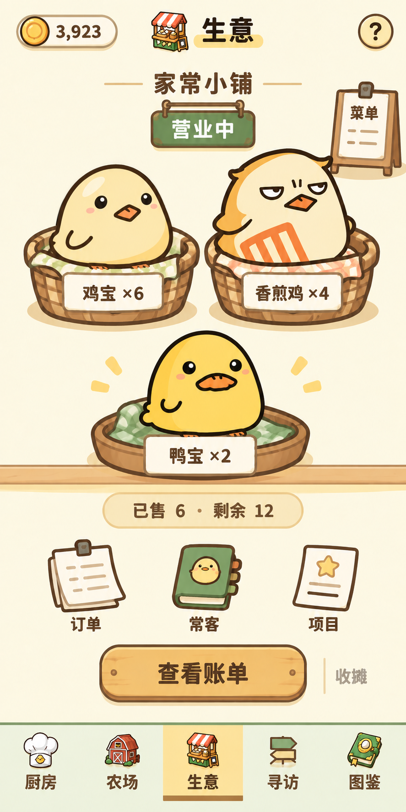
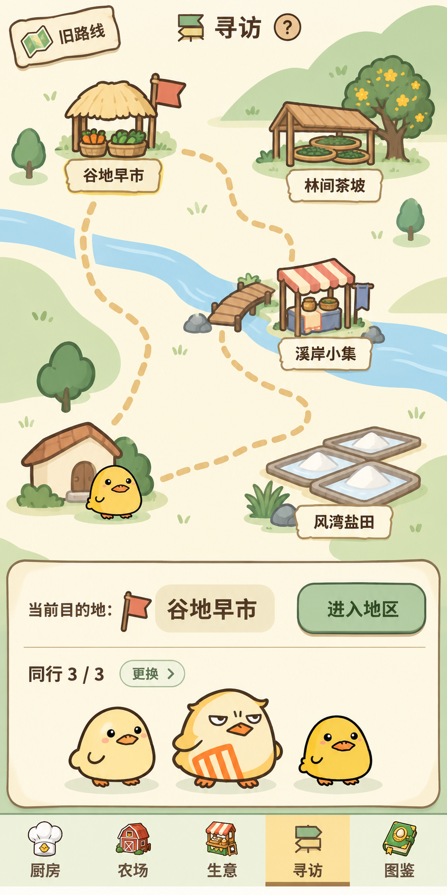
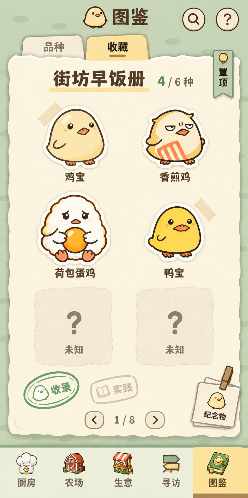

# 鸡宝厨房 · 简化版 Game UI / Art Direction

2026-09-24 · 第二轮视觉验证 · **等待用户确认**

本轮只交付三张完整页面 Mockup 与未来素材拆分方案。没有制作正式 Asset Sheet，没有切分正式角色或物件，没有修改运行 manifest、游戏代码、经济、存档或安装包。上一轮复杂店铺、绘本与写实田野构图不作为本轮建议。

## 1. 看图入口与本轮决定

| 页面 | 完整视觉稿 | 主体 | 保留的少量场景元素 |
|---|---|---|---|
| 生意 | [01-business.png](mockups/01-business.png) | 实际售卖品种的角色与剩余数量 | 货篮、托盘、窄柜台边、营业牌、三个业务物件 |
| 寻访 | [02-journey.png](mockups/02-journey.png) | 四地区、路线、队伍、当前目的地 | 四个地标、溪流、少量树木、目的地旗 |
| 图鉴／收藏 | [03-collection.png](mockups/03-collection.png) | 已有鸡宝／鸭宝角色 | 一张纸、少量胶带、标签、两种印章、纪念物入口 |

共同原则：少元素、强识别、可爱、易交互。角色优先，物件帮助理解操作；仅寻访保留较完整地图。暖奶油底、蜂蜜黄、柔和草绿与粗棕轮廓延续原作。避免连续细木纹、大幅背景故事插画、满屏花草、复杂建筑和多层边框。

**视觉 Mockup 与正式游戏资产分开管理。** 本目录的 PNG 是整体布局参考，文字、数字和角色均参与了生成，不能当运行背景，也不能从中抠取正式角色。图像生成对角色仍会有细微重绘；本轮已修正明显鸡鸭错配，但不声称像素级复用了源图。正式组合必须直接读取现有角色资源。

示例 CP、营业数量、队伍与收藏进度只用于视觉验证，不代表修改或读取玩家当前状态。字体大小、触区和缩放规则是后续落地约束，本轮不声称经过真机交互验收。

## 2. 生意：角色坐进货篮

这张稿展示“营业中”。上方只留店名、营业状态和菜单入口，中间用两个货篮及一个托盘展示实际在售角色，每种一个代表形象，数量由纸签表示。代表形象不是实际只数，不随库存数量堆出几十只角色。

柜台只是一条薄边，不再画店铺建筑、货架、遮阳棚、花草或来客群像。画面的注意力先落到鸡宝、香煎鸡、鸭宝，再看到剩余数。

交互安排：

- 点货篮查看该品种本单数量和售出记录；在准备状态才可调整备货。营业中不因点篮子自动补货或换品种。
- 菜单牌显示当前菜单。营业中看详情；换菜单须沿用已有收摊流程，不能绕开经营状态。
- 订单纸条、常客簿、项目牌保留三个明确入口。小物件配两个字，避免只能猜图标。
- 主操作“查看账单”查看本单已成交明细；现有实现若只支持上一单账单，未来实施须绑定本单记录，未有成交时明确显示空账，不误开上一单。次操作“收摊”保留实际已售／退回数量的确认。
- 准备状态复用同一构图：空篮显示“摆上出品”，底部变为“备好 x / 容量”“核对开张”；不开第二套表单式主页。
- 最多六种出品时扩成两列三行的小篮布局，角色不能缩成小图标；短屏允许货篮区滚动，提交动作固定可达。不改变现有六种上限。

主页面不平铺留种复选框、奖励规则、价格公式、接待窗口和来客倾向下拉框。留種／奖励／来客偏好进入备货设置，开店核对页保留本次消耗、保护与收益摘要。复杂规则进入页面右上“？”。“减少文字”不能隐藏真实交易后果。

### 对应 Asset Sheet 清单

| 计划素材表 | 一张表内的独立素材 | 后续组合方式 |
|---|---|---|
| B01 柜台与承托物 | 窄柜台边、空货篮后层／前沿、空托盘后层／前沿，共5件；衬布可并入空器皿 | 同一空货篮复用多次；角色夹在后层和前沿之间，名称与数量另加 |
| B02 木牌与纸签 | 无字营业吊牌、无字菜单牌、无字数量纸签，共3件 | 营业状态、菜单名、数量全部由文字层填入，不为每种状态生成一张带字图 |
| B03 经营小物 | 小收银箱、常客留言簿、订单纸条、项目板，共4件 | 账单、常客、订单、项目入口；收银箱可用于账单子页，不强行全部挤进主页 |

不生成“带鸡宝的篮子”。角色与容器必须独立，空篮能容纳鸡鸭各自不同轮廓。小物件源图不包含营业、菜单、订单等界面文字；Mockup 中的字只用于验证信息位置。

## 3. 寻访：四个地标构成的地图

四地区依靠特征辨识：谷地的矮棚与菜篮、溪岸的水边布摊、茶坡的焙叶棚与花树、盐田的浅盐畦。连接路径和一条溪流组织空间，留出大片安静底色，不用密集风景填空。

地图稿是选择地区这一步，主按钮为“进入地区”，不越过地点选择直接出发。底部队伍是当前准备的摘要，点“更换”可改人。地图上的起点角色是队伍标记，不是第五个可探索地区；旧路线保留独立小入口。

完整路径仍是：**地图 → 地区小景 → 地点 → 伙伴 → 核对出发**。进入地区后复用该地区地标与少量特征物，放大成简单场景，只出现两个地点，例如谷地的菜畦与谷物棚边；点地点后保留场景，底部换为伙伴与出发摘要。不是为每一步重画整幅背景。

在途时：队伍标记沿本次路线显示位置与简短状态；底部动作变为“查看行程”，地图仍可浏览，不能重复出发。归队时换归队篮与“查看带回”，满包继续保留原篮中待取规则。

伙伴条件、发现概率、采样、向导与沿途货物等放在对应准备子页和“？”帮助；选了哪些、需要多少时间、会占用／消耗什么仍在出发核对中可见。未开放地区点选后给一条具体缺口，不用长篇说明占地图。

### 对应 Asset Sheet 清单

| 计划素材表 | 一张表内的独立素材 | 后续组合方式 |
|---|---|---|
| J01 四地区地标 | 谷地矮棚与菜篮、溪岸布摊、茶坡焙叶棚与花树、盐畦，共4组无字小景 | 四组统一轻俯视、地平线和底部锚点；地图节点用相同画面尺度，不把文字和队伍烘焙进去 |
| J02 地图连接与环境 | 溪流直段／弯段、路段直线／弯线、桥、起点小屋、圆树、小草丛，共8件 | 地图由这些独立件组合，环境点缀限制数量；路线选择与点击反馈属于交互层 |
| J03 行程状态物件 | 无字目的地旗、背包、归队篮、伙伴空位布垫、行程纸签，共5件 | 队伍直接复用角色；在途、归队、时长用状态与文字层表达，不给每个数字重画旗子 |

后续地区地点所需的菜畦、谷物袋、浅滩、折布、焙叶盘、花枝、盐田小路、潮线草等，先从确认后的地标源稿检查可复用部分，再补同类地点素材表；不在本轮提前批量生成八幅完整风景。已有地图稿也不可作为整张运行背景。

## 4. 图鉴／收藏：角色加少量纸制品

移除桌面、书脊、早餐插画和满页装饰，只保留一张纸的阅读区。主角是鸡宝、香煎鸡、荷包蛋鸡、鸭宝；两处未发现位用中性纸袋表达，不提前暴露未知角色名称、剪影或配方。

六个展示位是本页候选展示，不将“收录六种且符合代表条件”改成“必须集齐图上固定六种”。4 / 6 是数量示意，不等于所有阶段条件已满足。阶段状态与代表缺口从现有收藏数据取得；已收录和实践印分开呈现。

交互安排：点角色进入原品种档案；点未知位看当前可公开线索；点印章看该阶段缺口；点“置顶”沿用全局唯一目标位；翻页切主题。搜索缩为入口，不常驻长输入框。品种、收藏为当前核心书签，见闻从页边目录／纸签抵达，不删掉已有见闻功能。纪念物入口打开真实物件收藏及三格陈列，不能当新增可购买道具。

每页最多两至四条胶带、两种小印章；不在每个角色外面再包一张卡片。角色贴纸白边仅为展示衬底，不改变角色源图。已收录但售空仍保留彩图，收藏不变成库存账。

### 对应 Asset Sheet 清单

| 计划素材表 | 一张表内的独立素材 | 后续组合方式 |
|---|---|---|
| C01 纸张与装订小件 | 主纸页、折叠小纸、两种胶带、短标签、页边书签，共6件 | 全部无字；一套反复复用，文字与角色覆盖其上，不画完整书籍背景 |
| C02 收藏状态 | 收录章底纹、实践章底纹、中性未知纸袋、两个不同尺寸贴纸衬底，共5件 | 章内界面文字独立；未知态按数据控制，无轮廓泄漏；衬底不包含角色 |
| C03 标本 | 八种地区材料的标本局部，共8件，正式制作时可分两张4件表 | 图中主页无需摆满；用于同系统见闻／标本子页，同类单叶、谷粒或束状材料统一观察视角 |
| C04 纪念物 | 现有M01–M12，共12件，建议两张6件表 | 本稿角落仅示意M01木夹与折账页；其余按原设定制作，不增加收藏物数量 |

优先制作这张页面实际需要的 C01、C02 和 M01 样例；C03 与余下纪念物是确认后的后续范围，不因为清单存在就立即生产。M01 必须保留“木夹夹住折起账页、旧纸缺一角”的设定，不重画成篮子。名字和说明不能印在素材里。

## 5. 正式 Asset Sheet 工作流（方案确认后执行）

1. **冻结 Mockup 的布局与用量。** 先确定三页的元素密度和角色比例，再冻结需要制作的素材表；不要边批量出图边扩大场景。
2. **检查复用。** 按现有资源入口核对角色、导航、厨具与适用物件。可用素材直接复用；CSS、Canvas、简单SVG、emoji或几何占位不能登记为已完成正式美术。
3. **同类成表。** 一张只放同类物件，使用统一轻俯视或正面视角、棕色线宽、暖左上柔光、有限阴影、共同尺寸基准。柜台篮子与纸张不混在一张；标本与纪念物分表。无界面文字、编号、水印和角色；素材身份通过外部清单对应格位。
4. **检查整表。** 确认同类比例一致、轮廓完整、物件不互相接触，透明底不是棋盘格画进图里；格间留足裁切空间，不混用透视或光源。
5. **切分与修整。** 保留原表；按外部格位表切独立透明PNG，复核透明边缘、白边、接缝、底部锚点。前后遮挡件必须在角色可穿插处拆开，不能从平面篮子里生硬盖住角色。
6. **登记后再接入。** 每个独立资产进入正式 manifest，代码按资产ID组合。不要把整页Mockup接入背景，也不把Asset Sheet原图当UI整页加载。

建议表格为2×2或3×2，单件母稿256–512px，柜台等长件单独宽格；最终尺寸以390逻辑宽的实际显示大小及高清需求确定。表少而一致优于一次塞入二十多个不可读小物。

未来 manifest 至少记录：assetId、category、sheet来源和版本、格位／裁切框、独立PNG路径、原始尺寸、透明状态、anchor、显示尺度、文字安全区、需要时的前后层关系、风格版本、制作来源、审核状态。只有正式审核通过的独立素材才能标记 production；Mockup 保持 design-only。本轮未创建或改动运行 manifest。

**图层示例**：生意为底色 → 柜台／篮后层 → 现有角色 → 篮前沿 → 数字纸签 → 交互文字；地图为底色／溪流 → 路线 → 地标 → 现有队伍角色 → 目的地旗 → 动态文字；收藏为衬底 → 主纸 → 胶带／贴纸衬底 → 现有角色 → 名称／印章状态 → 导航。代码承担布局、命中、文字与状态，不承担用几何图代替正式物件绘画。

## 6. 已有角色的复用依据

| 角色 | 稳定身份 | 当前素材入口 |
|---|---|---|
| 鸡宝 | 0:0 | `web/art/chick-v4-0.png` |
| 香煎鸡 | 0:3 | `web/art/chick-v4-3.png` |
| 荷包蛋鸡 | 0:4 | `web/art/chick-v4-4.png` |
| 鸭宝 | 1:0 | `assets/png/Character/character_1/character_1_0_0_0.png` |

以后实际渲染应通过现有 `web/catalog.js` 的角色资源映射取得，不把这张表扩展成另一份身份库。旧素材清晰度差异要单独评审，不能默认重新生成所有角色。图中的角色姿态和精度仅为Mockup效果，不是新增正式角色交付。

## 7. 复核基线与边界

本轮方向建立在原请求中已阅读的 UI／美术文档、运行模块以及 `artifacts/visual-polish/device/` 下9月24日真机截图：`after-business.png`、`after-dispatch.png`、`after-collection.png`、`after-book.png`、`after-kitchen.png`。这些是项目已有设备证据，未声称本轮重新连接真机；对话没有另附新的截图。

实际资源与行为核对包括 `web/business-ui.js`、`web/regional-ui.js`、`web/collections-ui.js`、`web/catalog.js`、`web/visual-assets.js` 和内容册。文档中“尚未接入”等历史措辞不作为当前事实；9月24日计划与实际代码优先。上一轮97个代码SVG仍是工程／概念资产，不能因已有文件就免除正式美术制作。

未来验收应检查390宽及320窄屏：主要物件无需放大能识别，点击区域至少44逻辑像素，角色不会被篮沿遮住脸，六种生意出品和长名称可达，地图选中不只依赖颜色，未知内容不泄漏。主页面只放短标签与操作摘要，长规则放“？”，交易前后果保留在核对中。

厨房沿用前轮提出的局部布局方向：调味料靠场景左上，扫把与清洁度靠场景右上，压缩上部空白并保留墙面／台面／24枚蛋阵关系。用户本次指定重新输出三个核心页面，因此本轮没有继续生成厨房或修改厨房布局。

生成方式：内置 imagegen；完整提示词与最终来源见 [prompts.json](prompts.json)。本轮已逐张查看最终输出，修正生意与收藏的明显鸡鸭身份错配。下一步仅等待用户对这三张简化稿确认，不执行正式素材表、批量美术或代码实现。
