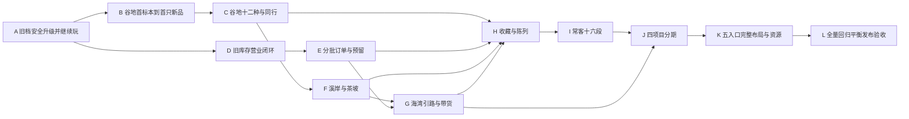

# 鸡宝厨房：内容扩展后续实施计划

2026-09-23｜状态：计划完成，以下Work均未实施。工程合同见[工程接入与迁移设计](engineering-integration-design.md)；当前执行状态仍由[当前计划](plan.md)维护。本计划不替代已确定的玩法、UI或48种内容定义。

## 1. 拆分原则与交付纪律

按能试玩、能保存、能重进继续的闭环分期。每个Work同时完成所需的内容投影、状态命令、最小页面、迁移和测试；不安排“所有Model完成后才开始UI”。A是唯一较基础的切片，但其验收是旧玩家升级后完成一锅、出售、寻访和备份恢复，不是只看编译成功。

最小UI不是临时调试按钮：必须用正式的资格解释、确认、保存失败反馈和未知遮罩。美术未交付时可使用明确标注的概念剪影，不能以旧画像冒充新品。完整视觉和响应式优化放到后期，核心可用页面随各Work交付。

每次完成记录：输入/产物哈希、schema与活动规则版本、测试命令与结果、可玩场景、故障注入结果、回滚开关及其读档兼容范围。用户没要求发版时，不顺带安装APK、覆盖真实档或发布。需要发布时按既有备份/签名/更新门禁执行。

## 2. 依赖图与并行边界

A完成后，地区线B→C→F与经营线D→E可并行开发。H/I/J按功能依赖集成，不提前把未来的故事条件默认满足。K的资源制作和无状态组件可以提前，但正式整合验收在J后。L的测试设计/模拟器可提前，最终运行必须针对最后组合。

共同热区是app、engine、inventory、world-clock、progress-save、SaveRepository和注册表导出。并行开发应指定每个热区的单一集成人；其他Work通过已冻结接口新增文件，不在两个分支各自改同一份存档校验或重写时间线。独立可测不意味着没有前置，也不意味着可单独撤掉已写入玩家档的字段。

## 3. 各Work

### Work A：旧档升级后仍能完成旧循环

**风险高；依赖：无。** 产物是支持新身份边界的兼容运行底座，所有新内容操作暂关闭，旧游戏完整可玩。

| 项目 | 交付 |
|---|---|
| 修改模块 | content-pack合成出口；engine.normalizeSave；progress-save；save-store；app的act/commitProgress与生命周期；Native SaveRepository；旧内容生成器的legacy193读取边界 |
| 新增模块 | `content-registry.js`、`tools/build-runtime-content.mjs`、`tools/content-runtime-rules.mjs`；`save-migrations.js`、`game-commands.js`、`rng.js`；运行时生成物与来源manifest。名字为建议，职责需保持 |
| 数据迁移 | 固化1→2→3旧行为，新增3→4空扩展状态/revision/时钟/RNG；保留旧批次/寻访快照；保存升级前字节副本。Java与Web同包认识v4 |
| 测试 | 黄金v1/v2/v3；当前256回归；193键和值不变；241注册表/83材料引用覆盖；未来/损坏拒读；保存失败与ACK不明恢复；跨标签第二写者拒绝；2MiB UTF8边界 |
| 可玩验收 | 导入中期旧档，继续原锅、交旧订单、领原寻访篮、出售、退出重开、导出导入；CP和库存差额与旧版相同，旧回礼状态不变。关闭新入口仍能识别合法新身份的兼容fixture |
| 并行 | 编译/映射和存档命令可以分工；schema/注册表合同先冻结。不得让两人独立定义不同v4 |
| 回滚 | 未写v4可回原代码；已写v4只回兼容读取v4且关闭新入口的构建。保留备份，不自动恢复旧档覆盖后续游玩 |

完成A时构建器必须识别整个作者包字段并列出所有需编译的条件，不要求一次实现所有玩法命令。未开放系统的规则也不能以unknown默认true；生成覆盖清单。新增语义使用baseline中的旧tags/traits，旧原始属性做一致性校验。

### Work B：谷地首标本→辨认供货→首只新品

**风险高；依赖：A。** 只开放V-S1、材料75和V-C1这一条正式内容路线，验证最不确定的概率/知识/容量链。

| 项目 | 交付 |
|---|---|
| 修改模块 | exploration、knowledge、ingredient-unlocks、engine.startBatch/collect、candidate-query、recipe-book、材料购买/返料/礼物容量检查；对应厨房/寻访/图鉴最小页面 |
| 新增模块 | `regional-exploration.js`、`regional-methods.js`、`batch-plan.js`、`material-capacity.js`、`visibility-model.js`；首条runtime规则与票据 |
| 数据迁移 | v4预置的稀疏regions/cards/methods/trial在命令首次使用建立；新trip规则v2与batch规则新版本，旧票据不改；首材料辨认后容量36 |
| 测试 | 新档到120/5合法前置；首标本非方法依赖；满包待领；免费辨认不重复赠料；3趟补方法；25%边界、3败后4批、变种owed；精确材料/额外材料拒绝；保存后重入 |
| 可玩验收 | 鸡蛋玩家用旧队伍出发，得到荠菜标本和一格试做料；辨认并能买75，获得完整方法；保持清洁并及时收取，前三批失败后第4批安排且实收0:128；图鉴显示C129；售出后仍知名且可复刻1+23。另测安排目标变种时owed继续保留 |
| 并行 | 可与D并行；依赖A的事务入口和库存/时间接口，不自行再做一套saveStore |
| 回滚 | 关闭新试做/地区出发；已在途v2仍可归队、已开批次仍可收、已得75仍保留/可用、已得新品可售。停止入口不能重置owed或把容量降回30 |

此Work不顺带新增剧情，不启用未完成系统的奖励；收取/寻访的事实接口从这一期开始保存，保证未来同行页可认真实新记录。

### Work C：谷地十二种与旧池互斥闭环

**风险高；依赖：B。** 在同一条系统链加入第二材料、两个地点、全部六卡、12新品与ALT-V，证明数据扩展不靠复制分支。

| 项目 | 交付 |
|---|---|
| 修改模块 | 上述地区模块；steamer候选适配；recipe-book/knowledge；farm展示和art解析；progression/validator点数来源 |
| 新增模块 | `legacy-recipe-adapter.js`、`region-model.js`；V完整内容投影/知识方向，批次模式预览与未知说明组件 |
| 数据迁移 | 无根版本变化；允许新key/卡/方法的稀疏记录；发现每5种来源自然延至240，validator上限64；已学手艺不重配 |
| 测试 | V-C3旧烧麦伴随但无双重保底；V-C5/V-D5旧料新品首标本门槛；V-C6/V-D6观赏卡门槛；奶料/面包机需Lv.4；ALT-V原目标概率；切地点不清4趟计数 |
| 可玩验收 | 同一中期档能依已知方向生产可做新品，后期回访做12种全收；观赏可同行、不能营业候选；旧蒸笼普通模式仍保留原多配方保证；旧签礼/四时不被地区模式覆盖 |
| 并行 | 地区数据与美术manifest适配可分工；BatchPlan主干单一负责人 |
| 回滚 | 关V新增目标，继续识别并结清已有；保留12种与76库存、知识、保护；不能删除其注册表条目 |

### Work D：旧库存挂机营业闭环

**风险最高；依赖：A。** 用MN1和旧家常货完成备货、离线成交、提前收摊、报告，尽早验证资产和时间模型，不等48种齐备。

| 项目 | 交付 |
|---|---|
| 修改模块 | inventory、world-clock、progression.basketQuote/额度、app命令/恢复、collection-ui即时出售、Native校验；新增生意入口，手艺重配关闭营业适配 |
| 新增模块 | `business.js`、`business-model.js`、`business-ui.js`、`facts.js`、`requirements.js`、`timeline.js`；有界复合见证聚合 |
| 数据迁移 | 4→5增加空business/orders/facts/inventoryPolicy；v4地区记录原样，trip/batch不改。保存schema5兼容代码先随本Work落地 |
| 测试 | T/R/S/Q查询；0/2h/24h/数周；同输入切片/一次推进；95CP例、18只收摊、余数/额度预留；farm释放边界；关闭时保存失败；写成功ACK失联；窗口连点 |
| 可玩验收 | 已达营业门槛旧档留家1只、备24只家常，2h卖6，离线后售完；CP按分项变化，不能即时售掉S，报告重读不加钱；提前收摊仅余货释放，旧即时出售仍完整可用 |
| 并行 | A后可与B/C地区线并行。时间线、库存、事务接口需要共享；业务UI可独立实现 |
| 回滚 | 禁止新开店，现有session由原rulesVersion结清/手动收摊；保留已成交货款和facts。不得还原初备库存 |

即使仅开放MN1，事实reducer也要能记录全包未来条件需要的key/role/档位/单次关联维度；避免I/J上线时发现之前营业明细已经丢掉。

### Work E：分批订单与库存分配闭环

**风险高；依赖：D。** 开放O01、O04及新订单基础，接入8菜单定义并验证旧品种的合法搭配；尚未开放地区的菜单继续显示正确缺项。

| 项目 | 交付 |
|---|---|
| 修改模块 | inventory owner查询与Q损耗收缩；business来客/提案；story-orders保留适配；生意订单页/菜单备货页；species投影 |
| 新增模块 | `orders.js`、`order-model.js`、`menu-model.js`、`order-ui.js`；finite资格匹配与明确组分配；菜单适配/完整档公共查询 |
| 数据迁移 | schema5已有容器中建立实例，旧三章仍在progress.orders；新订单序号、提案游标、最多2 active，O04共享NOTE-O04 |
| 测试 | 分两次交O01各6、当次基础款和尾款；Q不会被S占用；O04各1三不同不扣货不付款；取消再接新ID；无distinct解不生成；默认留一与显式覆盖；提案跳过不无限刷新 |
| 可玩验收 | 玩家把旧库存一部分备货、一部分预留订单，分两锅交完；检查自由/在家/预留数量。做一次O04展示得到纸条，换变体不重复；旧第一采购仍可完成且旧酬谢只一次 |
| 并行 | 订单逻辑和菜单视图可分工；可与F并行。共同库存接口不可另建副本 |
| 回滚 | 禁止生成/接新单，允许原实例交付/取消；已消费货不退，已付CP不重给，释放尚未用的Q |

MN2–MN8的完整条件在此编译并用内容提供的两套例子测；每窗口剩余备货判档与实际完整成交见证同时验证，不能只做一次准备页匹配。

### Work F：溪岸与茶坡两条地区闭环

**风险中高；依赖：C。** 复用已稳定地区链增加R/T24新品、4材料、12卡及ALT-T；结合E后开放相应订单和菜单。

| 项目 | 交付 |
|---|---|
| 修改模块 | region/runtime规则、供货/入门资格、知识方向、相关页面；若E已合入则启用O02/O03/O05/O06前区与茶坡/O07/O08/O09/O10/O12合法变体 |
| 新增模块 | R/T数据投影和资产绑定；新增地域条件应以规则数据为主，只有确实缺失的有限predicate才补代码 |
| 数据迁移 | 无根版本；按取得事实建立稀疏记录；累计辨认4种后材料包42，供货不因此全开 |
| 测试 | 蜂蜜/水芹白米供货见证，烧水壶/牛乳高阶锁；旧料新品、R/T观赏；R-S1/T-N2加成仅一次；ALT-T旧材料映射3而非10；O06冻结地区、O10两章各6（订单部分需E） |
| 可玩验收 | 中期玩家走溪岸/茶坡首标本，逐步做新品并在Lv.4回访；每次只领一次奖励；选择茶坡单不会被后解锁海湾改写候选；无法制作的新品明示缺供货而非凭空解锁 |
| 并行 | R与T内容/资产可并行在各自配置文件；共用领域逻辑不分叉。若E未就绪，地区验收先独立，经营联合验收作为E+F集成门槛 |
| 回滚 | 各区独立关闭新出发/目标，已有卡/库存/容量与票据保留；ALT-R仍等PJ-2，不能提前送 |

### Work G：海湾确定引路与带货闭环

**风险高；依赖：F、E。** 完成最后12新品、2材料、6卡与ALT-B，重点证明新货物占用和路线没有循环锁。

| 项目 | 交付 |
|---|---|
| 修改模块 | exploration/timeline/库存带货、bay规则及Java校验、发现卡与方法、O06海湾/O11、MN7资格、寻访确认预览 |
| 新增模块 | `trip-cargo.js`或exploration内有界cargo命令；GUIDE-B取得规则；海湾资产与数据 |
| 数据迁移 | 无根版本；bay v2票据，普通12h/3基础、轻装9h36/2基础；继承同一队伍序号，旧路线枚举不改名 |
| 测试 | 旧前区入门→溪岸引路确定取得，不要求海湾货；GUIDE不占24卡；6货另加队员不能重占；召回退预留、归队消费一次；交换替代基础格；已得B-E1仍能换；R1 CP按真实base2/3 |
| 可玩验收 | Lv.3且前区新品实收玩家走溪岸取得引路，去盐田首标本，做B-C1；再带6份家常整趟换1盐花，无售款无订单销量；强退重进不复制货，最终241身份和24卡全部可达 |
| 并行 | 海湾资产可早做；cargo必须在统一库存上集成，不能绕过E的Q/S占用 |
| 回滚 | 关闭新bay/cargo操作；既有cargo按冻结条款到期或召回，已获得海湾身份保留；绝不因关闭菜单把其库存删掉 |

### Work H：收藏追认、同行观察与陈列闭环

**风险中高；依赖：C、E、F、G。** 8主题＋4地区＋4特殊页的完整条件与奖励一次入册，农场可选3纪念物陈列。

| 项目 | 交付 |
|---|---|
| 修改模块 | facts/requirements、图鉴收藏/见闻、农场陈列、存档/Native兼容；旧四时/神社页面保留原reward入口 |
| 新增模块 | `collection-progress.js`、`entitlements.js`、`collections-ui.js`；paper记录与memento模型；schema6迁移与后续常客/项目空容器 |
| 数据迁移 | 5→6，纯历史收录资格可协调登记一次；不凭空补经营/探索实践。读档迁移本身无发奖副作用，迁移后协调为独立幂等事务 |
| 测试 | 193全收老档页面与M01–M08可追认但不重发旧CP；COL-8客座不计；地区少量使用与有效菜单不同；SP-ALL每种首次同行；重复读页/更换陈列无经济效果；12纪念物上限 |
| 可玩验收 | 老玩家升级看到合理的历史收录进度，完成一趟混合新旧队伍点亮同行；少量新品交付获地区使用印；选择纪念物陈列并重进保留，不得到第13件项目纪念物 |
| 并行 | 收藏配置与页面可分工；允许I/J基于约定schema6开发，合并前必须H测试通过 |
| 回滚 | 隐藏新收藏入口也必须保留entitlements和显示选择；旧回礼继续原样；既有权益不撤销、重复协调不发第二份 |

### Work I：四常客十六段闭环

**风险中；依赖：H。** 把确定的事实分支接到常客页，完成阅读、下一段、自动纪念物以及营业/手动两条呈现路径。

| 项目 | 交付 |
|---|---|
| 修改模块 | facts复合见证、business来客、订单/发现提交后协调、全局pin和生意常客标签 |
| 新增模块 | `regulars.js`、`regular-model.js`、`regular-ui.js`；按RG阶段ID编译全部gate/OR分支 |
| 数据迁移 | schema6容器惰性建立stage；保存activatedSeq/基线、每位最多1pending；真实新经营事实可追认，旧三章只认认识门槛 |
| 测试 | 4×4段每条替代分支；RG2-3同单地区品；RG2-4激活后O05；RG3-4营业/订单各自18不混加；手动分支不再要求随机到访；每12/24销量与跨单进度；M09–M12只一次 |
| 可玩验收 | 不开营业，完成对应手动采购也能读下一段；开店达到真实销量触发合格反馈，读一段才推进下一段；退后台或刷新不跳段、不丢纸条、不重复领纪念物 |
| 并行 | 常客正文直接引用输入；模型和UI可并行，避免任何重新写剧情。RG4引路接已有GUIDE命令 |
| 回滚 | 暂停新故事排队，保留pending/read/权益；允许读已有段，且不能重新发奖或重置激活基线 |

### Work J：四项目阶段交付与支付闭环

**风险高；依赖：I、G。** 完成PJ1–4及ALT-R、菜单预设、永久画像展出，不创造新经济奖励。

| 项目 | 交付 |
|---|---|
| 修改模块 | requirement/payment/库存命令、生意项目页、厨房ALT-R准备、菜单预设、图鉴永久画像展出 |
| 新增模块 | `projects.js`、`project-model.js`、`project-ui.js`；有界阶段交付与付款记录 |
| 数据迁移 | schema6项目细目惰性初始化；阶段条件可追认，已交/已付绝不推算；首交付锁定要求的品种选择 |
| 测试 | PJ1 200；PJ2 100/0/400与2种各6；PJ3 200/0/600、36真实经营量；PJ4 400/600/1000与48只≥4招牌类；重复confirm/ACK丢失/CP不足；项目不发基础货款 |
| 可玩验收 | 先付/交各阶段，再重开应用，进度与余额正确；PJ2完成才获得ALT-R；PJ1可存3预设；PJ4画像可用旧观赏且不算食用货，不追加独立纪念物 |
| 并行 | 项目UI与规则可分工；I的常客事实需先稳定，支付命令必须复用事务入口 |
| 回滚 | 禁新阶段提交，保留已交物/已付款事实及权益；不自动退款；仍可查看进度和使用已开放方法 |

### Work K：五入口完整迁移与视觉接入

**风险中；依赖：J。** 每个旧新功能已有可用页面后，统一导航与布局，完成资源/字体和跨入口回跳。

| 项目 | 交付 |
|---|---|
| 修改模块 | app数值page适配、theme/scene、各UI工厂、style/game-screens、art manifest/portrait帧、字体构建、通知/返回导航合同 |
| 新增模块 | `router.js`、共享目标/缺项/库存行组件、地区/卡/菜单/项目资源manifest；不引入大框架 |
| 数据迁移 | 仅需保存的陈列/预设/pin已有schema6字段；纯滚动/筛选不进入经济存档；UI偏好若改变结构另设preferences版本，不滥升经济schema |
| 测试 | 厨房/农场/生意/寻访/图鉴5入口，商店和手艺可达；320×568低高、375/390/430及桌面/横屏；触控、键盘、safe area、减少动态、大字号；未知DOM/aria/图片路径扫描；所有返回来源 |
| 可玩验收 | 从订单缺货→配方→补给→厨房→收取→返回订单，保留选择；从发现卡→地区→出发→报告→图鉴；旧神社/四时未领回礼仍可找到；桌面不只是手机画布放大 |
| 并行 | 资产制作和纯展示组件从C起可并行；最终资源验收和整站路由合并放此Work，统一未知投影禁止分叉 |
| 回滚 | 回上一版可用布局适配层，保留相同业务命令和schema6；新内容的基本查看/结清入口不能一起撤掉 |

美术验收按原brief的轮廓对照、剪影、裁切与小尺寸识别执行。没有最终图时发行验收仍不通过，不把概念剪影和用户审美确认混为一谈。

### Work L：全量平衡、平台回归与发布验收

**风险高；依赖：K。** 对组合后的实际runtime验证，不拿作者审计或各Work孤立测试替代。

| 项目 | 交付 |
|---|---|
| 修改模块 | 仅针对失败修复；任何玩法/数值调整按变更流程记录，不以“平衡”名义重写已定内容 |
| 新增模块 | 合法操作驱动的48可达性/24卡轨迹、14天经济模拟、完整黄金档、跨Web/Java共享扩展fixture和发布验收报告 |
| 数据迁移 | 检查1→6所有链与进行中跨发行升级；如修复需要新schema则追加6→7明确步骤，严禁原地静默修复当前损坏档 |
| 测试 | 全部Node、runtime内容检查、字体、Java存档/通知、Python更新模拟、浏览器、打包一致性、真机生命周期/强退/备份恢复；所用构建与来源哈希一致 |
| 可玩验收 | 六黄金档全流程＋鸡蛋前期、收集优先、低频上线、193老玩家四类路线；241图鉴/24卡/48新品逐项可达；至少一次真实2h营业窗口及跨后台归来，与加速fixture结果分开记证 |
| 并行 | 平衡、平台、内容/泄露可分工跑；最后修复后按影响重跑必要门禁，最终同一候选包汇总 |
| 回滚 | 禁新业务入口的schema兼容热修复包先准备；暂停发布/保留现行候选，已升级玩家不自动倒档；保存与更新备份均验证可读 |

发布阻断：资产或CP不守恒、重复奖励、ID漂移、未来档被覆盖、保底叠加/失效、任一新品或发现卡无合法路径、未知页面泄露、原回礼重复、Native拒绝Web合法存档、活动票据无法结清。长期经济与最终美术验收未完成也不得声称正式241版已通过。

## 4. 共享接口交接合同

| 提供者 | 提供合同 | 后续使用者 |
|---|---|---|
| A | resolveSpecies/Material/Recipe、legacy193边界、execute/commit/revision、迁移注册表、RNG频道 | 全部Work；新增模块不得绕过原子提交 |
| B/C | buildBatchPlan、region/method查询、trip v2票据、capacity、未知投影 | F/G扩内容，H/I/J读事实，K展示 |
| D | free/home/owner库存接口、advanceTimeline、营业快照/窗口游标、事实reducer及复合见证 | E订单、G带货、H/I/J目标 |
| E | 显式group分配、订单实例ID/变体冻结、menuFit与完整成交见证 | G海湾变体，I常客，J项目统计 |
| G | GUIDE-B与cargoExchange事实、241/24完整注册表 | H/I/J与全量可达性 |
| H | grantEntitlementOnce、纯收录协调、页面/纪念物区分、schema6 | I/J新权益，K陈列 |
| I | stage read/activatedSeq、手动及营业排队统一行为 | J茶坡项目，K全局目标 |

接口先给成功/失败和幂等样例，不能只交类型名。例如订单模块交给营业模块的是可用提案与冻结实例，不是直接修改business内部数组的权限；项目只消费事实与库存命令，不能调用“完成某常客”的内部方法。

## 5. 验收与回滚操作顺序

每个Work先在合成黄金档通过，随后用隔离的开发保存键/测试安装验证端到端。发行升级前导出并校验真实备份，记录输入文件哈希；导入候选、完成至少一个代表操作、重启验证，再考虑扩大试用。失败时保留失败原档与最后可读档，不能先新建档再调查。

开关按region/business/orders/collections/regulars/projects/UI适配划分，但“停止新操作”和“禁用解释器”分开：已有营业必须可收摊，已有队伍必须可归队，旧批次必须可收取，已获身份必须仍被校验器认识。关闭开关不能把state删字段、减容量或清保护计数。

2026-09-24本工作区接入私有版本库 [HeHeYeast/chichen](https://github.com/HeHeYeast/chichen)，从接入时的开发基线开始记录Git提交；此前的过程见历史文档和source_snapshot备份。独立Work提交应能回退代码，玩家状态采用上述兼容回滚，不以源码回退等同存档降级。

## 6. 需求覆盖与完成定义

| 用户要求 | 主责Work |
|---|---|
| 内容运行时层、193/241和75/83身份、完整考古接缝 | A；C/F/G全量覆盖 |
| Schema链、旧库存/CP/图鉴/旧回礼保留 | A、D、H，各期Java同步；L跨版本 |
| Fact/Requirement/Progress最小模型 | D基础、E需求组、H/I/J复用 |
| reserve/consume/release/pay/reward原子性 | A可靠提交、D营业、E订单、G带货、J项目 |
| 原池/点心/四时/礼物/变化互斥与RNG | B、C；F/G全量数据；L概率回归 |
| 首标本、4趟、3趟方法、4批、复刻 | B首链、C泛化、F/G扩展 |
| 同一在线/离线营业逻辑、24h/2h窗口 | D；I来客；L平台验收 |
| 五一级入口与未知内容 | 各Work交最小正式页；K统一布局；L泄露扫描 |
| 黄金存档、守恒、48可达性与发布 | 每个Work自产必要fixture；L组合验收 |

实施完成的定义是：全部Work的可玩验收可复现、所需测试有新证据、schema链与回滚路径验证成功、最终资源齐备、长期经济结果已审阅，并按正式发布流程验收。本文交付只表示这些工作已经被设计和拆分，不能据此勾选任何实现Work已完成。
