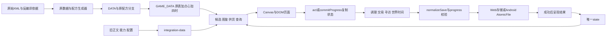
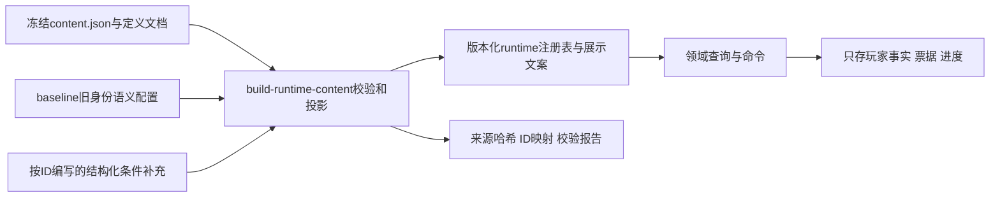

# 鸡宝厨房：工程接入与迁移设计

2026-09-23｜状态：工程设计完成，尚未实现241种版本。配套：[实施计划](engineering-implementation-plan.md)。负责人文档：[工程与维护](engineering.md)；实施后把稳定契约迁入该文档，本稿保留为此次迁移的决策依据。

## 1. 结论与输入边界

保留原生 JavaScript、Canvas 场景、HTML 页面和单份游戏状态。沿用现有纯查询、状态命令、复制后保存的工作方式，增加编译后的内容注册表、轻量事实查询、带持有者的预留查询、可重放结算和逐版本迁移。无需引入前端框架、数据库或通用规则引擎。

先用旧档证明新存档链可继续调理、出售和寻访，再做谷地首标本到首只新品。营业先用旧品种闭环；四地区铺开、常客与项目接入、完整UI迁移分别验收。功能开关只控制新操作的可用性，不能禁止读取、结清或展示已经获得的新内容。

本设计继承并核对以下全部输入，不重新编写48种、菜单、收藏、常客或地区正文：

- [玩法设计](gameplay-expansion-design.md)、[UI信息架构](ui-information-architecture.md)、[内容总册](content-expansion-assets.md)。
- [品种](content-pack/species.md)、[材料与发现](content-pack/materials-discoveries.md)、[经营](content-pack/business.md)、[收藏](content-pack/collections.md)、[美术](content-pack/art.md)、[内容审计](content-pack/audit.md)。
- [作者内容JSON](content-pack/content.json)，以及它引用的[旧内容快照](content-pack/baseline.json)。JSON已整体解析并检查全部字段形状、身份、配方和条件；重复白名单与定义文档交叉核对。旧快照中的 edible、tags、traits 是本期作者配置，当前游戏尚未使用。

输入优先级：正式内容包的逐项定义明确早期玩法稿的工作名、配方与项目分期；玩法稿约束系统规则；UI稿约束展示和入口。内容包 `version:1` 是作者格式，不是存档版本。`priceProposal` 仅作为接入初值，不能当作长期平衡通过。内容审计的1593项静态检查也不能代替运行测试。

本文中的“现状”有源码依据；“推荐/新增”都是后续工作。此次只修改文档，不迁移真实玩家存档、不接入runtime数据、不生成最终美术，也未制作需要清理的游戏prototype。

## 2. 当前架构考古

### 2.1 运行入口与状态所有权

正常入口加载 `app.js`，不是 `classic-app.js` 或历史 baseline 副本。应用闭包持有唯一 `state`，场景和各UI工厂通过 `getState()`读取；不是多个store各自保存库存。`act`、`commitProgress`、100ms时钟循环都复制状态，变更后保存，失败恢复旧引用。页面选择、滚动、弹窗与大部分草稿留在UI内存中。

根状态主要字段：`version:3`、`cp`、`kitchenLevel`、`toolLevels`、`ingredients`、`selected`、`egg/duck`、`batch`、`farm`、`total`、清洁/修缮时间、`events`、`progress`、`cleanCycle`。`farm`是当前总库存，包含外出队员；`total`是永久收取记录，卖掉不会减少。两者均为 `egg:id -> count` 稀疏对象，不是193格数组。

`progress`已有手艺版本和来源账本、交易额度与小数余数、知识事实/配方、三章采购、唯一寻访、寻访序号、上次队伍、旧线索失败计数和逻辑时钟。知识、图鉴发现、资格、当前库存并非同一概念，不能合并成一个 unlocked 布尔值。

### 2.2 系统边界表

| 系统 | 数据定义与运行读取 | 保存位置／修改者 | 耦合、适合扩展处与禁止直接改动处 |
|---|---|---|---|
| 鸡鸭身份 | 原提取 `DATA` 为171种；`content-pack`加6点心，`seasonal-pack`加16四时；`GAME_DATA`合成193，engine建立索引 | `farm/total`及批次蛋内 `egg,id`；`collect`、出售、旧时空交换等修改 | 合成出口适合追加；不可改旧数字ID、排序后重新编号，不能把新品写进原始提取表 |
| 配方 | 生成的 `recipes`保存原分支和权重；点心、四时另有匹配器；`recipe-book`合成知识目录；`candidate-query`做预览 | 批次结果开火时保存；准备在 `selected/events/progress.replicate`；破壳可再变种 | 开火当前依次处理原池→四时→旧手艺复刻，会覆盖位置；应增加统一计划器，不手改生成分支塞48个if |
| 材料 | `DATA.tools[2]`75条；`ingredient-unlocks`明确OR组内AND；商店、配方、寻访共用 | `ingredients`实体数、`selected`准备、trip.remaining及leftovers待领；购买/开火/领取/礼物修改 | 30上限分散在engine、探索、返料、活动、UI、validator；抽单一容量函数。供货资格与拥有不能互推 |
| 厨具/厨房 | 8原厨具＋蒸笼；engine购买顺序、等级和费用；`kitchen-stages`是外观/布局 | `toolLevels`9项：-1未购、0–2；厨房0–3；购买/升级修改 | 保留4厨房、9厨具、鸡专用蒸笼；新品最低厨房只是资格之一，不绕过设备购买和旧料供货 |
| 图鉴/知识 | `catalog/species-state`、`recipe-book`、`knowledge`；描述、线索、能力来自integration-data | `total/farm`判发现；knowledge保存L1–L5事实与完整配方ID；收取、观察、研读、寻访改动 | 收录或研读不等于库存；复用查询但集中未知投影。旧recipeId包含配方路径，不能重生成后让旧知识失效 |
| 寻访 | integration RULES三路线与193能力，knowledge给旧候选；exploration执行 | `progress.trip/routeFailures/tripSequence/logicalAt`；depart/recall/claimTrip/advanceWorld修改 | 一队1–3不同种；出发冻结材料、线索顺序/命中、能力/手艺；到期返家和领篮分开。扩展同一队伍记录，不新增第二套队伍库存 |
| 手艺 | skill-data30单级节点；progression计算门槛、效果、来源；旧配置仍供兼容快照使用 | progress.skills/sources/skillVersion/protection/trade等；learn/respec/applySkillPlan | 当前来源每5发现至193、总上限54；新上限64只延长来源，不加技能或免费重复额度。活跃快照不能被重配追改 |
| 农场 | farm提供日夜展示与随机站位；world-clock负责耐久和脱逃 | farm库存；farmFixed/farmChecked；repair/checkFarmLoss | 展示随机不应影响经济RNG；215普通展示位置不等于库存上限。不要为241全收强塞241只场景精灵 |
| 即时出售 | collection-ui做跨鸡鸭选择；basketQuote算基础/招牌/整筐/拼盘，engine.sell扣货 | farm、cp、trade.credits/markupRemainder | 整筐是特定12种的**单种24只**，奖励12或18CP；不是12只一筐。复用计价部件，不能直接调用sell实现营业，否则会重复扣预留或发奖励 |
| 特殊变化 | engine.updateBatch的病变、焦化、温泉蛋10秒边界及免疫名单 | 逐蛋id/status/animationAt/blackAt、批次rules、cleanCycle；updateBatch修改 | 部分变化在推进时才用随机数。新批次加确定票据，旧批次走旧规则；不因保底而取消病变或延长旧10秒窗口 |
| 四时 | seasonal-pack16种全年；与holiday-calendar的原28节令资格不同 | events.seasonalRecipe、seasonalCollections；prepare/claim、startBatch | 未知精确配方25%偶遇；已实收后显式准备1只。四章各600CP仍原入口领取，不与新COL-8混用 |
| 神社/旧活动 | shrine目标、legacy-activities委托/每日礼物/时空交换，holiday-calendar日期 | events中的campaign flags、legacyActivityClaims、gift target、shrineCollections；fortune.drought | 签礼抽取、实际收取重置、每日资格各有账本；全部原样继承。新纪念物不能触发旧CP回礼 |
| 存档 | engine.normalizeSave、progress-save验证，save-store选择主/上一代；Android SaveRepository | Web localStorage主键/.previous/.pre-import；Android私有saves目录AtomicFile＋SHA256封套 | Web严查玩法，Java额外校验3路线与票据结构；两端必须同发。未来版本拒读且不退到旧备份，损坏锁自动保存；正常入口不能换回出错即新建档的readSave兼容助手 |
| 离线/生命周期 | app.resume、100ms推进、visibility/pagehide和Native生命周期；world-clock | lastSeen、logicalAt、batch绝对时间、trip.endAt、farmChecked | 没有挂机营业。logicalAt目前主要在寻访中推进；不能把lastSeen直接当防倒拨时钟。通知只提醒，不负责结算 |
| UI | scene/theme画布，DOM热点，panel与dialog层；工厂注入查询/操作 | 页面数值编号：0厨房、1农场、2商店、3设置、4图鉴；UI草稿局部变量 | workshop把手艺/采购/寻访挤在一页；保留组件/场景，增加轻路由分流，不能简单重排数字导致所有旧回跳错位 |
| 测试/发布 | Node内置node:test；纯函数、源码契约、共享save fixture；Java stub测试；Python备份更新；浏览器脚本 | tests与android/tests，工具输出是证据而非存档 | Node通过不代表浏览器或手机通过；发布还有字体、原生存档/通知、更新模拟、浏览器6道门禁 |

### 2.3 当前数据流和状态流



收取链：蛋的最终身份→标记collected→farm/total各加1→基础收取CP与手艺奖励→整批结束/返料→保存。出售链：推进世界→校验可用库存→报价→扣farm和额度、加CP、更新小数→保存。寻访链：出发保存票据和占用→endAt释放队员→returned篮→逐次领材料/线索/CP→settled。`returned`不是再次抽奖的机会。

现有复制事务值得保留，但它属于应用包装，直接调用领域函数不保证失败无副作用，例如函数可能先推进世界再报错。后续测试和所有新UI必须经统一命令入口验证完整原子性。

## 3. 内容接入层

### 3.1 选择构建转换，拒绝运行时解释作者文件

比较三种方式：直接import完整JSON最快但携带美术brief、工作名和自然语言条件，无法严格执行；直接往engine及各UI粘常量会形成多份事实；构建转换略有前期成本，但能校验ID、条件和多端限制。选择第三种。



作者工具当前会import现行GAME_DATA，且运行会重写content、baseline和审计文件。接入后不能让它从已扩展的241表重新推导“旧193”。保留独立legacy193导出/固定快照，作者生成器只读取该冻结边界。工程构建直接读冻结JSON，不执行作者工具；不让runtime反向import作者文件，避免生成循环。

### 3.2 字段投影清单

| 输入 | runtime用途 | 留在作者/审计层 |
|---|---|---|
| species身份、egg/key、region、recipe、unlock结构字段 | 转成SpeciesDef、RecipeDef及Requirement引用；等级转换仅一次 | workName、namingDecision、technologyNote、oldSupplyRules说明 |
| name/description/clue | 独立展示表，由可见性投影决定是否返回 | 不能把是否显示交给每个UI自行判断 |
| edible/signature/tags/exploration | 显式语义属性，旧193来自baseline，新48来自species | 不根据中文名、描述、原料名称推断食用/茶味/环境 |
| priceProposal.baseSaleCP/collectCP | 明确版本化的初值；平衡验收前仍标候选 | status、ornamentalCostAllowed用于审计，不成为额外补贴逻辑 |
| material ID/price/specimen/entrySpecies | 实体材料、辨认供货和首标本资格 | 识别/美术制作说明；recognition/lore/shop若玩家可读，进展示表 |
| menus.roles.allowed/orders.groups.allowed/variants/selectors | 解析为稳定key的冻结数组；查询时构建Set；金额转整数百分单位 | 示例菜单只作测试输入，不作候选生成规则 |
| collections fixed/optional/rewards、projects.consume/costCP | 列表及数值可直接投影，其余条件由结构化补充表达 | 关系用途、展示客座不能当作完成条件 |
| regulars、guide、cards.gate、menus.complete/unlock、stage.check等自然语言 | 原文保留展示；工程补充按ID逐项编译为条件，覆盖率必须100% | 禁止字符串includes、中文正则或运行时eval |
| art及art-manifest | runtime只取assetId、路径、裁切、安全区/显示变体 | 轮廓brief、近邻对照、提示词、制作顺序、命名审查 |
| species.menus/orders/regulars/projects/uses、orders.card、cards.effects.practice | 可用于“相关去向”导航和审计 | **关系边不是发奖或解锁指令**；完成采购不自动获得所关联发现卡，某事件列出practice也不免除队伍条件 |
| counts/status/date/decisions/quail | 构建元信息和验收断言 | 不进入玩家规则；鹌鹑完全不占正式ID |

补充文件建议名 `tools/content-runtime-rules.mjs`，只存声明式条件、显式映射和来源JSON Pointer/文档段落，不写新剧情。构建遇到未覆盖条件、未知字段、引用不存在、数值混用单位，直接失败；不能默认为满足。

旧语义配置必须带入：content.json本身不含旧193的完整tags/traits；仅靠allowed名单不足以判断旧队员事件条件。baseline只导入新增语义，旧名字、售价、能力、配方仍以冻结现行runtime为准并做一致性检查。`artReference`亦不可一概照搬：点心/四时已有图集路径。

### 3.3 身份与注册表

| 范围 | 鸡key | 鸭key | 材料 |
|---|---|---|---|
| 旧内容不动 | 0:0–127 | 1:0–64 | 0–74 |
| V | 0:128–133 | 1:65–70 | 75、76 |
| R | 0:134–139 | 1:71–76 | 77、78 |
| T | 0:140–145 | 1:77–82 | 79、80 |
| B | 0:146–151 | 1:83–88 | 81、82 |

作者 `V-C1`映射`0:128`；展示编号C129由id+1生成，永不用于保存。MN/O/RG/PJ/COL/卡/纪念物身份保留作者ID。地点新增工程ID如`V:0`，不以“菜畦”字面作主键。品种型mixed allowed列表在构建时统一为key；模板、角色、需求组、变体仍各自保留ID。

引用类型必须由schema字段位置确定：四个地区收藏的`fixed.allowed`实际是两张标本卡ID，不能当品种key转换。它们列举地区核心卡，不表示A阶段就要求两卡全得；A/B/C仍按各自明确的阶段条件编译。相同字段名不代表相同规则语义。

原数据适配继续提供GAME_DATA形状，保证旧消费者先可运行；新的注册表提供`speciesByKey/materialById/recipeById/allowedSets/requirements/text/assets`。原配方生成器只看原表，新品绝不自动获得普通池概率。旧ABILITIES、描述、trade表通过只读合成适配补齐，避免新增函数到处import第二份JSON。先不做全面目录重构。

旧recipeId保持原字符串；新方法使用`REC-V-C1`等稳定ID，ALT使用`ALT-V`等。统一resolveRecipeId接受两种来源。新方法配料改版不换身份，却必须增加rulesVersion并保留活跃批次快照；旧配方ID若确需改变，专门别名迁移，不能靠重新拼字符串。

等级陷阱：新品recipe.toolLevel/kitchenLevel为展示1起；旧Supply.anyOf里的level已经是内部0起。转换器必须按字段定义转换，不递归给所有level减1。招牌中文值是已列举枚举，可显式映射6个内部代码；不做名称推断。

### 3.4 构建门禁与接口

构建输出建议分`regional-content.generated.js`、展示文案、资源manifest；输出稳定排序和sourceHash/runtimeFormat/rulesVersion。保存玩家数据不复制48条作者定义或完整白名单；活跃事务仅保存当时执行所需的小快照。发行包保留被活跃票据引用的规则版本。

构建必须验证：193前缀一致，241唯一身份、152鸡89鸭、83材料、48新品40食用8观赏、24卡、8菜单/主题、12模板、16常客段、4项目、12纪念物、24纸条；无孤立引用、精确配方冲突、单位错误、无资格见证的订单；各新料至少3厨具并覆盖鸡鸭；48有限保底路径；纸页和GUIDE-B不误计卡/纪念物。

保留当前1593检查作为作者审计，再增runtime等价测试。构建`--check`只比较不写入，CI拒绝生成物漂移。不要直接运行会改写audit.md的现有validator作为“只读验证”。

## 4. 存档Schema与迁移链

### 4.1 版本策略

对外称saveVersion，落盘继续使用根`version`作为唯一版本号，不并存两个可能矛盾的字段。另分`contentRevision`（数据发行号）、`rulesVersion`（活动事务解释器）、原有`skillVersion`（手艺布局），不可混用。

推荐渐进链：

| 迁移 | 责任与可玩边界 |
|---|---|
| 1→2 | 严守旧171身份验证；补未购蒸笼第9格，不改CP/时钟 |
| 2→3 | 保留已实施行为：用库存补缺失的永久发现最小1、建立progress/cleanCycle；历史手艺迁移作为受版本约束的一次迁移；固化现有输出fixture |
| 3→4 | runtime身份兼容、地区/材料/知识/试做状态、事务修订号、持久RNG根与时钟；旧游戏和首地区可玩 |
| 4→5 | 营业、新订单、事实聚合、库存偏好与预留；营业/交付闭环 |
| 5→6 | 收藏权益、常客阅读进度、项目分期、纪念物/陈列/菜单预设；最终扩展版 |

以上4/5/6是实施计划分配，不宣称当前已存在。若发布切片改变字段，追加明确步骤，不能偷偷给同一版本缺字段补默认。统一`validateSource(v) → migrate(v,v+1) → validateTarget(v+1)`，直到当前版本；迁移纯函数，禁止推进时间、随机发奖或UI副作用。每步可独立测试，整体重复加载无变化。

运行中旧batch.rules v1/v2与trip.version1原样保留，由兼容解释器完成；不重抽蛋、不重排线索、不改到期、不补扣货。3→4看到旧trip已经returned/settled，不能编造此前完整同行史；旧trip在升级后才真实越过endAt，可记录此次完整归队的确定成员事实，但不补发新发现票据。新地区只在下一次出发加入。

### 4.2 建议新增状态形状

以下是结构契约示意，不是可直接导入的完整存档：

```text
version, contentRevision
meta: revision, commandSeq, factSeq, lastCommit{commandId,payloadHash,summary},
      rng{algorithm,seed}, migrationHistory
clock: logicalAt, lastWallAt
expansion:
  regions: opened, introSpecimenDone, guideFlags
  discovery: cards{cardId: acquiredSeq}, identified{materialId: seq}
  methods: directions, full, freeProgress{regionId: {count,targetId}}
  trial: {recipeId: {failedFullBatches,owed,attemptSeq}}
  cardProtection: {regionId: {specimen: misses,lore: misses}}
  facts: version, businessCounts, orderCounts, menuWitnesses,
         tripWitnesses, companionFirst, eventWitnesses, predicateWitnesses
  business: sequence, active|null, lastReport|null, visitorProgress, themeRemainder
  orders: sequence, proposals[0..2], active[0..2], templateProgress
  inventoryPolicy: keepOne, collectionLocks, optionalOrderReservations
  collections: entitlements, stamps, display[3]
  regulars: {regularId:{readStages,pendingStage,activatedSeq,baselines}}
  projects: {projectId:{stages,pinnedChoices,deliveries,payments}}
  menus: presets[0..3]
```

仍然只有根farm/ingredients/cp持有资产；facts不保存第二份可花库存。集合可稀疏保存，但“字段缺失”和“合法空集合”在当前schema中严格区分。活跃营业/订单/项目/寻访包含自身ID和规则快照；预留数量从这些持有者计算，不再额外维护一份容易漂移的总预留账本。

### 4.3 逐字段迁移政策

| 范围 | 推荐迁移／默认 | 可追认的事实 | 绝不能追认或默默修复 |
|---|---|---|---|
| 193→241图鉴 | 保留稀疏farm/total所有键值，新48无记录视为未收；旧全收显示193/241 | 旧total>0或farm>0的永久发现；后续卖空不倒退 | 不为新区补1，不把完整知识当收录；不把未知非法key删掉再保存 |
| 75→83材料 | 旧数量逐项不变，新材料默认0 | 无 | 不按旧配方/材料名补标本、辨认、供货或实体赠料 |
| 新地区 | 根据旧累计/设备计算V/R/T可访问资格，首次动作才建细目；B未引路 | 确实已有的累计、发现、厨房、厨具和旧供货 | 不把旧water路线走过等同GUIDE-B；不认领新地区首趟 |
| 24卡/辨认 | 空集合；免费辨认是独立命令 | 无新卡历史可推导 | 旧线索、已知配方、相关采购都不等于发现卡；辨认不再次赠料 |
| 知识 | 原knowledge字符串和事实原样保留，新方向/方法空 | 旧已收录方法仍按原逻辑已知 | 不用旧观察技能一次解锁全部新方法；3趟免费计数从新事实开始 |
| 菜单 | 可用资格按实际旧身份推导；预设空 | 有所需旧出品的永久发现 | 不能从库存、旧销售、四时回礼反推有效接待/完整档 |
| 订单 | 原progress.orders三章原样；新proposal/active空 | 三章completed可作明确旧前置 | 不把旧三章当O01–O12完成，不自动预留，不重复发旧酬谢 |
| 营业/来客 | active/report空、序号和跨单来客进度0 | 无 | 不从cp或total估计营业数量、时间或来客；不自动开店 |
| 收藏/纪念物 | 权益账本空，迁移后的独立幂等协调可登记纯收录页/M01–M08 | 显式白名单内历史发现、COL-8旧四时章节事实 | 不给实践/营业/完整印，不给M09–M12；新收藏不调用旧领取函数 |
| 常客 | 可认识的旧前置可认；read/pending为空 | 旧三章只满足认识门槛；未来已保存的新事实可追认 | 不把“认识”当已读故事；未记录的旧采购品种明细不可补造 |
| 项目 | stages/deliveries/payments空，条件查询可显示已有部分 | 纯发现、章节和设备；新增后真实保存的经营事实 | 库存存在不等于交付、CP足够不等于已支付；不代付 |
| 手艺点 | 保留旧sources、skills、spent；每5种来源延至240，总64 | 收录总数达到195/200等自然增加来源；205/217/229/241对应57/59/61/64上限 | 不能重新发初始交易额度，不重置手艺、旧迁移重配权或冷却 |
| 容量等级 | 由辨认数推导30→36（首种）→42（4种），不是付费状态 | 真实identified集合 | 不因读到83定义就直接42；不截断旧包/待领篮。营业备货另按厨房24/48/72 |
| 新概率保护 | 每目标失败0/owed false，地区+focus失败0；对象惰性建立 | 只从新版本完整批次/趟次事件增长 | 不把旧fortune或routeFailures挪作新保底，不通过切换清零 |
| 旧四时/神社/events | 原对象完整保留，原claim标记继续唯一有效 | 原claimed true | 不从已收齐推定“已经领过”，也不把false改true后剥夺未领奖励 |

稀疏细目惰性初始化只能发生在显式命令中；查询不写档。跨版本迁移可以补默认，同版本损坏数据不得以默认掩盖。数值溢出/非法引用/占用超过库存时整体拒绝，保留原payload并进入恢复路径。迁移新增的RNG根从规范化源档哈希加固定域标记确定性派生；新档seed由建档输入显式提供。迁移过程不调用随机数，反复尝试同一源档不会换票据根。

### 4.4 校验同步与可恢复升级

Web需同步：身份索引、材料数量/总容量、leftovers和returnTicket 74上限、知识/线索列表上限、ABILITIES覆盖、trip路线/时长/材料池、54手艺上限、所有新持有者跨字段一致性。Java目前主要是封套/关键进度校验，并非Web规则的完整副本；新增version、bay12h、trip v2和营业预留等核心不变量，同一组共享fixtures分别执行。禁止只放宽Java版本号而跳过新状态验证。

第一次写升级档前保存**字节级升级前副本**，区别于滚动.previous。迁移候选在内存完成，源/目标验证成功后才提交；保存失败保留原始主档，关闭新操作并给恢复入口。导入同样先验证迁移，保留原档；未来版本不降级到旧备份。2MiB限制按UTF-8字节统一，事实只存有界聚合，报告只留最近一单。

回滚推荐“新schema兼容程序关闭新入口”，继续结清在途事务、保留新资产。**不提供6→3降级删字段**，也不把新CP或新品强行换成旧物。安装193旧程序只可读取独立升级前备份；该备份不含升级后的游玩，不应自动覆盖当前档。若以后要求真正无损旧二进制降级，属于另行审批的不可逆策略，目前不需要也不实施。

## 5. 最小Fact / Requirement / Progress模型

### 5.1 三层职责

Fact是已提交的事实或资产查询；Requirement是无副作用的条件树；Progress是某个实例的交付、付款、阅读或阶段状态。不要让Requirement执行pay/reward，也不让显示页面“顺便”完成项目。

仅实现 `all/any` 和少量带类型叶节点：`discoveredCount`、`identified`、`cardOwned`、`routeOpen`、`toolAtLeast`、`supplyOpen`、`methodKnown`、`stockAtLeast`、`counterAtLeast`、`witnessExists`、`stageDone/read`。返回`{met,current,target,missing,actionRef}`，同时给操作校验和UI解释使用。不支持任意表达式、脚本、数据库查询语言或内容自定义回调。

最小接口为`evaluate(requirementId,state,context)`、`reduceFacts(draft,committedEvents)`、`projectProgress(def,instance,state)`。context只能使用已声明的session/trip/order/stage快照，不允许传可执行函数。以RG2-3的经营分支为例，编译成`witnessExists(kind=validService, menuIds=[MN4,MN2], soldSpeciesSet=R食用新品, minSold=1, scope=sameSession)`；另与该段gate做all，再与O06溪岸完成分支做any。`stockAtLeast`显式携带free/home/owner视图；`counterAtLeast`显式携带来源集合、按key聚合和since基线。标签/种数/每种最低量的有限参数用于菜单和交付匹配，不扩展成任意脚本。

事实来源分三类：已有资产/永久发现现场查询；不可逆布尔见证以key保存；数量按有限维度聚合。每次成功命令生成内部事实事件，固定reducer一次更新，随后按依赖类型刷新相关目标。事件不作为无限历史保存；保留事务内明细、所需聚合、首次/最近序号和阶段激活基线。依赖图限制无环，不允许“收藏完成→再次支付→再触发自身”。

| 事实 | 生产者和必须携带的上下文 | 消费者/限制 |
|---|---|---|
| 实收 | collect的最终key、batchId、slot；时空交换标明来源 | 图鉴与纯收录可共用；批次保底只认对应批次真正收取目标 |
| 辨认/地区开放 | identify命令、guide完成，material/region ID | 供货、方向、容量；不等于材料库存或图鉴 |
| 营业成交 | session/window、key、role、quantity、成交档位、价格快照 | 累计销量、地区使用、来客；不增加harvest/旧额度来源 |
| 有效/完整菜单 | **单session内部**角色覆盖、数量、完整窗口内销量子集 | 菜单/常客/收藏；不同单或普通档销量不能拼成完整菜单 |
| 订单交付/完成 | instance/template/variant/group、key/quantity、冻结地区/章节 | 分批进度、常客、项目；O04展示单独事件不产生销量 |
| 完整寻访/卡 | tripId、region/place/focus、成员key及能力/特征快照、cardId | 同行、地区实践、事件实践；召回不算，领材料次数不算趟次 |
| 支付/项目交付 | project/stage/part、明确金额、消费明细、commandSeq | 仅对应阶段，不从CP减少差额猜用途 |
| 在家库存 | T/R/S/Q查询，不存永久事实 | O04即时展示/当前交付；不能历史追认“现在拥有” |

同一事务去重依靠实体游标（collected、processedWindow、trip processed、deliverySeq）及commandSeq；不能每次重建facts时把旧事件再累加。数字安全整数，事实计数可按已知最大目标饱和，经济余额不可静默截断。留作未来目标的通用销量计数若不饱和，溢出时拒绝并保留原档。

### 5.2 必须保留语义的实例

- RG2-3的“MN4或MN2有效且含溪岸新品”必须是同一单见证；不能拿去年MN2记录加今天卖1只新品拼接。RG3-3咸甜也要不同品种、同一合格单。
- RG2-4注明“激活后再完成O05”的分支保存activatedSeq或对应计数基线；其余允许追认分支使用真实已有记录。不存在历史记录时默认未知，不猜测。
- RG3-4营业18与订单18是两条OR分支，各自聚合3种；PJ-3的36只允许营业与采购合计。共享基础事实不意味着条件语义相同。
- PJ-4-A只数specimen/lore，不能把event算进去。COL-8客座48新品不计旧四时4/8收录和章节。
- 卡effects/订单card是关联提示，不等于强制发该卡。SP-LEAF的R-E1还要队伍叶形或茶香条件，即使该事件已经要求果香也不能省略额外检查。
- O04用display命令即时验证3不同候选各自由在家1只；不消耗、不加CP，两个变体共享NOTE-O04。它不能套普通采购“可生产完整配方”的门槛，从而排除旧特殊品。

为避免未来常客接入丢失当下经营历史，营业上线时就计算本包全部已定义的复合见证，按`requirementId -> witness摘要`保存；数量型条件保存key维度聚合。不能只存“MN2 done”后期待从中恢复品种、角色和档位。编译器列出每个Requirement所需事实维度，缺维度即不允许发版。

## 6. 库存与CP事务

### 6.1 单一资产与预留查询

每品种`T=farm[key]`，`R=运行中队员+带货`，`S=营业未售`，`Q=玩家主动订单预留`；`free=T-R-S-Q>=0`。reserve只建立持有者占用，不减少T；consume同时减少T及该持有者占用；release仅撤占用。项目确认交付直接消耗free，无长期项目隐形仓库。

新增三个不同查询，不能把旧availableCount全局机械替换：`freeCount`给出售/备货/新交付；`homeCount=T-R-S`给农场损耗（Q仍在家）；`usableByOwner=free+本持有者预留`给订单兑现。保留一只/收藏锁是用户库存偏好，不改变T，确认可显式覆盖；每个确认界面都预览受保护数量。

营业额度也有持有者：trade.credits仍是持有总数，business.creditReserve计占用；即时出售只用未预留额度，harvestCredit按总数判断3/6容量，不能因占用腾空再生产新额度。respec要求先结清营业，旧超当前容量额度不截掉。

### 6.2 命令边界

```text
execute(commandId, expectedRevision, command, now)
  取得单写者锁，核对revision及已提交commandSeq
  复制当前已持久化state；advanceTimeline至有效时间
  验证资格、引用、free/owner库存、CP及快照
  生成/读取确定票据；一次应用资产差额、进度、事实和权益
  校验跨字段守恒；revision和commandSeq加1
  saveStore提交完整快照并确认成功
  发布新state；再显示货款、动画与故事
```

领域命令串行，UI按钮提交期间禁重入。预计revision过期返回新报价，不能继续用旧数量。读档、后台返回和计时推进也走同一入口。浏览器用Web Locks等实际可用的单写者机制；若平台不支持可靠跨标签互斥，则第二标签只读，不用localStorage“先读后写”冒充原子锁。Android同一Repository串行写，不能让Web与Native分别结算。

现有写档失败回滚只适用于**确认没有提交**。Native写成功但桥返回丢失、进程被杀等结果不明时，停止后续写入，重读持久档比较revision/commandId/hash：若新修订已存在即成功；仍是旧修订才可用相同票据重试；无法读取则进入恢复模式。不要在不明结果时用旧内存覆盖已提交档。Web提交点仍是单个current值写入，previous只是恢复代，不能拿“先写previous成功”当事务完成。

这不是纯假设：当前MainActivity.write把SaveRepository.save和HatchScheduler.syncFromSave放在同一个try内；通知同步若在保存之后失败，也会返回“保存失败”。Work A应把数据提交确认与通知副作用分开，通知失败可重试且不回滚已保存资产。重复commandId核对payloadHash；旧序号一律不再执行，近期可返回lastCommit摘要，更早的只提示已处理，不为省去历史日志而重新应用。

### 6.3 操作矩阵

| 操作 | reserve / consume / release / pay / reward | 幂等与恢复 |
|---|---|---|
| 开始营业 | reserve S及可选额度；冻结快照；不消费、不发钱 | active唯一，sessionId；空货拒绝；保存后才显示营业 |
| 窗口成交 | consume S与T；pay基础+招牌+主题；记录角色/档位/销量 | `(sessionId,windowIndex)`只能一次；数量、CP、游标同档 |
| 提前/自动收摊 | 先处理到当前完整窗口；reward实际整筐/拼盘一次；release未售S与剩余额度 | closedAt/bonusSettled同档；重复收摊只返回报告，不返还已售货 |
| 订单预留/撤销 | reserve/release Q，不支付、不算交付 | 按instance/group持有，不能覆盖别单预留 |
| 分批订单交付 | consume自有Q优先及free；pay本次基础价；完成才reward约定bonus一次 | 冻结变体、组允许名单/计价版本；deliverySeq；取消保留已消费/已付款，释放Q，无尾款 |
| O04展示 | 仅check自由在家数量；reward一次纸条，无consume/pay | NOTE-O04权益ID跨变体去重；不能用营业占用货同时展示 |
| 项目交付 | consume指定自由库存；无基础售款、招牌、额度 | stage内deliverySeq、选择key和数量冻结；同只只分配一项 |
| 项目分期支付 | 验证该阶段条件，pay=扣CP；对应完成状态和权益同档 | A/B/C各付一次；余额不足全不提交；已经付过不再扣 |
| 寻访带货 | departure reserve R货6只，另reserve1–3队员；完整归队consume货，release队员；召回release全部 | cargo选择/交换材料槽/processed随trip冻结；不按6只发售款，不计订单/营业销量 |
| 材料采样 | 出发分配材料槽；归队卡自动登记，实体料入待领篮；领取才向ingredients转移 | 总份数不超base+extra，领一份从remaining移除一份；辨认不重复给料 |
| 离线结算 | 同一advanceTimeline逐窗口/归队处理，最后一次提交 | 未保存则全部重算相同结果；报告只是已保存结果投影 |

项目中含货物与付款的同一阶段（如PJ-4-B的48只+600CP），允许分次筹备交付，明示已交物不可再用；每次交付独立原子，满足数量后确认扣600并完成阶段。若最终付款时不足，已交物与进度保留，不重复扣。PJ-2-B的两种各6只首次交付锁两种选择，避免分批改目标；PJ-4-B保存按唯一招牌分类的交付量，至少4类每类1只。没有取消项目退款机制，不自行创作。

订单同一只只能归一个需求组；提交带显式group分配，总分配量不能超过持有者可用数。接取冻结O06选择地区、O10两章节各6，O04选择变体；其他允许组内混交。生成资格解必须同时满足distinct和角色/组约束，可对最多数个组做有限枚举/匹配，无需通用求解器。现有库存不足不阻止可生产订单出现。

守恒式：`T_after=T_before+实际收取/交换产出-实际出售-交付-带货消耗-脱逃`；reserve/release之和不影响T。`CP_after=CP_before+收取+允许售款/奖励-开火/采购/升级/支付等成本`，每一项有明确reason与测试。绝不通过打开报告、入册或刷新条件增加经济资产。

## 7. 概率、保底与票据

### 7.1 旧算法保留什么

原普通池不是“24次有放回独立抽样”：它把权重展开，抽一次删一个权重项，抽24枚；凤凰、天鹅等还有每批先随机入池的门。`originalRecipePlan`为预览将门视作可能，**不能直接用预览pool代替实际随机入池池**。点心则先插所有命中有料配方各1，再有放回加权补齐并洗牌。四时未知25%偶遇，已知显式准备覆盖1枚。旧CUL-5普通复刻收费10CP；新品固有复刻不自动多收这笔手艺费。

礼物68/69/70使用原媒介规则，签礼目标在领取时冻结；神社drought在实际新签收取时清零。原节令以开火时当地日历判定。后续病变/焦化仍可改变已安排品种；抽到不等于实收。

### 7.2 一个BatchPlan决定全部24枚

新增`prepareMode`判别联合，UI修改蛋/材料/厨具后重验，不同时存几个相互打架的target。已有存档批次原样完成；新开火流程：

1. 显式地区目标：满足精确蛋种/材料集合/设备/供货/完整方法/观赏卡条件，选择trial或regional-repeat。禁媒介68–70；不运行其他保证插入。
2. 显式local-alternative：仅替换旧匹配视图，实际消耗作者材料，旧目标/旧概率，不插新目标、四时或点心保证。
3. 显式已知四时或有效礼物准备：各只采用自身插入规则；冲突的准备状态拒绝开火并给缺项，不猜优先级扣费。
4. 无上述模式：保留旧普通/点心/四时首次偶遇/CUL-5合法路径。先决策模式再调用；旧合法组合输出回归等价。旧点心“多配方各1”是一个整体模式，不能与地区1只叠加。

地区成功时生成1目标＋23旧兼容伴随，失败24旧。普通原池伴随保持原权重抽取语义，可复用原24结果并按计划替换一个位置；蒸笼地区模式只用旧候选权重抽取，禁其保证列表。新材料在旧规则视图中滤掉；旧材料仍命中子配方。不能调用完整旧开火函数后再叠另一次CP/材料扣除。

ALT-T的作者材料是79+27，旧匹配替换79→3，27保留；target仍0:10。不要把品种0:10误读为材料10。四个ALT均生成明确replacement映射并做原池等价测试。

候选预览和执行共享`buildBatchPlan`的资格/模式/候选说明，预览不消费RNG；执行传入票据后落成结果。模式互斥是保证策略互斥，不是把普通池中的所有旧特殊概率删掉。

### 7.3 新品试做状态机

每recipe保存`failedFullBatches:0..3, owed:boolean, attemptSeq`。开火时：已实收→安排1只；未实收且owed或失败3→安排1只；否则批次一次25%票据决定是否安排。`owed`在已安排目标但尚未实收时保持，确保病变/过熟损失后下一次仍安排，不会重置保护。

完整收完24枚且未真正收录目标，失败数加1至3；任意槽实收对应目标，即转可复刻并清该目标失败/owed。放弃不增加失败；已冻结票据和已承担的成本不能被重新加载重抽。放弃后重新开火是新的付费批次；若前批已安排却未实收，owed仍在。整批finish标志保证最后一枚连点不重复累计。其他目标、普通批次、出售不会清这个计数。

### 7.4 新发现、知识和材料的出发计划

旧线索6/8趟的routeFailures独立保留；新卡每地区+关注方向（specimen/lore，lore含事件）独立misses，地点/队员/轻装切换不清零。

选择顺序：合格入门首标本确定保证→同方向3次合格完整失败后的第4趟→普通概率`min(0.60,0.25+0.02×团队F+一次可选0.05)`。事件的特征+环境是门槛，不按满足几人重复加成；R-S1水边、T-N2花香、B-N1盐晶是可选机会加成。卡候选顺序、逐候选机会票据、首标本覆盖和失败前值在出发冻结；一趟最多1新卡。入门保证可覆盖所选地点，确认前必须显示。

完整归队时若原目标已通过别途径登记，依保存顺序取下一仍合格未得候选及对应票据，不能重抽。全空则冻结计数，无CP补偿；召回不增长。旧线索、新卡、免费方法、引路可以各有记录，但都不额外创造材料格。

材料格统一分配：基础格先满足首标本试做料，再选中的带货换盐花，再最多1格地区采样，剩余才走旧定向/普通抽取；额外采集最多1格，总数维持base+extra。同一格只有一个来源标记。容量不足不丢卡，也不重复发料；实体待领篮阻止下一趟沿用现行规则。B-E1已得卡后的带货交换仍可执行，不依赖“再抽中一次卡”。

免费方法每地区3次合格完整寻访补全一条置顶可执行未知方法，单独count0..2；出发冻结目标及资格，归队目标若已知按已保存合格顺序补下一条，无合格则冻结、不发券不换CP。入门标本带回后首次辨认才建立方向；不能让“取得完整方法”成为该首标本的前置死循环。

### 7.5 RNG接口

经济RNG接口`unit(ticketId,channel,index)`严格返回[0,1)，生产用明确版本的整数PRNG＋持久root seed＋事务序号；测试用seeded或固定序列。使用稳定跨JS/Java可表达的整数算法，不把时间或Math.random调用次数作为唯一身份。UI抖动、站位、翻面动画用单独视觉随机源。

新batch票据保存plan版本、初始24身份、各蛋变化所需抽样、拾金、返料、门槛roll和已处理标记；trip保存候选顺序、各候选roll/概率、材料/CP结果、快照；营业普通销量确定，不需要随机决定6只。票据可以只存已解析有限结果，但必须带算法/规则版本，不能升级后用新算法从旧seed重算。

旧进行中批次未曾保存的病变随机不可能恢复历史“应有结果”；兼容解释器按原规则继续，只在实际首次处理后持久化结果，不伪造原始票据。新批次才获得完整重放保证。测试0、阈值前一格、阈值、接近1、非法NaN/1，和保存失败/重启/画面刷新不改变结果。

## 8. 离线营业与世界时间

### 8.1 冻结内容

开始保存sessionId、startAt、hardEndAt=start+24h、规则版本、菜单ID与角色/替代顺序、各key初备与剩余、基础价格、招牌类别/百分比、菜单资格所需永久事实快照、经营倾向、可来客内容候选、额度预留和奖励规则、roleCursor、processedWindow=0、成交明细与档位覆盖。最多6品种；默认24份并按在家留1/收藏锁/订单预留选货；厨房等级容量24/48/72。

销量和主题档位不冻结成“永远完整”：每窗口开始用**剩余备货**重新验菜单数量/角色/标签。价格和手艺在本单冻结，之后取得供货或学技能影响下一单；重配先结清。签名加价的全局百分余数不复制成营业独有余额，避免同时即时出售消费同一小数。

### 8.2 单一推进算法

`advanceBusiness(session, targetAt)`只处理`floor((min(targetAt,hardEndAt)-startAt)/2h)`以内尚未处理窗口。每个窗口按角色轮转，再按该角色玩家替代顺序取，空角色跳过，最多6只；角色游标跨窗口保存。t=0无销售；t=2h恰好第一窗；售罄可提早关闭；不卖后来收取的库存，不自动续店。

每只主题百分单位为`min(baseCP×ratePercent,200)`，其中普通0、合适5、完整8；累加全局themeRemainder并整除100付款、余数保留。招牌复用原markupRemainder，与主题相加不相乘。窗口货款、T/S扣除、按档位的成交明细、来客进度与processedWindow同一事务。

同单有效菜单要求实际成交必要角色每角色≥1、合计≥6；完整印记只从完整档窗口成交子集检查同样覆盖。开店时满配、后来掉档的全部销售不能统算完整。某些故事附带鸡鸭/地区/咸甜要求，同样使用单session内对应销量，不跨单凑。

关闭时按**本单实际售出合计**算整筐优先、剩余拼盘；消耗实际所需的预留额度，其余释放，bonusSettled一次。24只基础鸡、12%招牌、5%主题、1次普通整筐的基准总款95CP，招牌余数64、主题60；不含此前收取CP。18只早收无整筐，剩余6只解除S。

在线时钟和resume都调用同一个advanceTimeline；离线循环最多12营业窗＋唯一trip，不按秒补算、不依赖后台定时器。离线可在内存处理所有到期事件后一次保存；若保存前崩溃，从旧游标重放同票据。不得先存CP后存扣货，也不得为了显示报告再结一次。

### 8.3 与归队和农场损耗排序

当前farmLoss不是连续指数衰减：超过24h检查间隔且低耐久时，按检查时刻分段损失；少于10只走随机，大量库存取整，持家可能留1。改变检查频次就可能改变经济。因此**不把每2h营业窗口顺手变成全农场损耗检查**。

时间线按到期时间稳定排序：到期营业窗口先成交；到期保护释放前，用现有farmLoss核对仍在家的`T-R-S`；然后处理trip完整归队/cargo消费或营业关闭释放；再按现有checkFarm请求处理目标时刻。多个相同时间的释放共用一次损耗检查，不能每个模块各调用一次。Q仍在家，损耗后按订单持有者稳定顺序缩减Q至剩余，记录需补货，不发失败罚款。

新增营业到期边界与既有trip.endAt一样是确定释放点，24h后无论报告是否已读都不能继续保护S。未营业的旧状态沿用旧损耗触发；不开“每小时全世界结算”的新经济。在线/离线营业一致性测试给相同的用户动作和损耗检查请求序列，断言营业、库存占用、CP和事实相同；纯业务函数的分割时间推进应完全相同。历史农场在不同访问行为下可能不同，这不是本阶段要消除的旧规则，不承诺全世界所有状态与访问习惯无关。

### 8.4 时钟、来客与持久结果

新时钟有效时间`max(lastLogicalAt, wallNow)`，每次经济提交更新；单次营业只到hardEndAt。倒拨不回退游标也不重新开窗，前跳最多结一次24h；再倒拨不再发钱。长时间前跳后的逻辑时钟保留，并提示设备时间异常，不能静默调回以便重复结算。纯离线无可信服务器，无法阻止用户编辑时间或备份来获得等待进度；本方案保证有限授权与幂等，不假称防作弊。日期活动仍用原日历资格，不把其本地日历与营业时钟混为一谈。

累计每12只**真实营业销量**触发一次来客判定，余量跨单保存；每24只内优先一次合格未见反馈，候选为空仅普通文字无CP。开始冻结候选范围，窗口后用已生成事实检查资格；手动订单/发现满足常客分支可直接排队，不能强迫再营业。每位常客最多1未读，读后才激活下一段；获得纸条/纪念物在达成事务自动登记，阅读只改变read/下一段激活状态，不再付款。

持久化active全快照、游标、成交汇总、各窗口档位摘要、所有货款分项、全局百分余数、额度占用/settled、跨单visitorProgress/序号/seen、最多2订单提案和2进行中订单、常客pending及最近报告。报告清理不能清facts或奖励权益。导入/升级时保留活动规则解释器直到对应session结束。

## 9. 五入口UI接入

保持厨房/农场现有Canvas空间和点击反馈，逐步抽出轻量`router`，route为对象而非裸数字。模型只读，命令通过统一execute；不建立UI各自可修改的库存store。现有工厂依赖注入可直接作为迁移接缝。

| 一级入口 | 保留/移动/新增 | 查询模型与复用 |
|---|---|---|
| 厨房 | 原调理/收取/清洁/升级保留；商店变“补给”，手艺从workshop移来；新增明确地区试做模式 | batchPlan、cookInfo、supply、materialCapacity、skill模型；复用厨具拖动、材料选择、确认、手艺草稿 |
| 农场 | 场景、耐久、修缮、神社、立即/一键出售保留；新增库存用途拆分与3陈列位 | inventoryView提供T/R/S/Q/free；复用harvestEntries/报价/数量控件；Q不藏在家数量 |
| 生意 | workshop旧三章采购移动；新增营业/订单/常客/项目4标签 | business/order/regular/project只读模型与Requirement进度；复用纸页、列表、确认、收益反馈 |
| 寻访 | workshop出发/队伍/回篮移动；新增地区/地点/方向/报告/引路/带货 | explorationPlan、region/cards/knowledge；复用队员选择与材料篮，保持一队 |
| 图鉴 | 原鸡鸭分页/配方/观察保留；总览/品种/收藏/见闻4标签，食材见闻下挂 | speciesView、knowledgeView、collection/notes模型；旧四时/神社回礼保留独立领取入口 |

设置是全局次级页，保存原返回来源。页面对象保存子标签、过滤、滚动和returnRoute；“去补料/去制作/去交付”往返不会把用户扔回首页。UI草稿不reserve，确认才占用；恢复草稿必须重新quote。一个全局pin目标引用ID，可指配方、卡、项目或常客；不再为每系统各挂一个强制任务。

未知统一投影整合现有collection-ui中的speciesView、species-state与knowledge：未实收返回编号/蛋种/允许剪影/已知条件，名称、正彩图、隐含文案和配方全文由独立知识权限决定。catalog本身只提供身份索引与资源路径，不是现成的权限层。完整方法已知也不露真名和彩色角色。所有搜索、候选、订单替代、收藏客座、报告、alt/aria、工具提示均消费投影；原始定义不直接传UI。已实收但售空仍已知，队员外出不导致遮罩倒退。

runtime文件可被技术用户查看，客户端不能做到加密内容秘密；本要求是正常玩家界面不提前泄露，不以加密包替代投影测试。

移动端320/375/390/430宽及568低高检查触控≥44 CSS像素、正文≥14、safe area、滚动容器和底部按钮；Canvas 320逻辑坐标不能直接成为DOM字体/触控缩放标准。桌面≥1024且高度足够时侧导航＋主内容480–560＋摘要240–280，否则单列；不把整张手机图拉大当桌面适配。场景坐标与保存的蛋坐标不迁移。241页分页取注册表长度，旧speciesView当前capacity查询和scene资源分支须接注册表；新美术先适配manifest，禁止借旧图冒充新品。

## 10. 测试战略与验收证据

### 10.1 分层测试矩阵

| 层 | 必须证明的合同与典型反例 |
|---|---|
| 内容schema/编译 | 冻结193身份；48映射、83材料、24卡、数量与引用；1起/0起等级；allowed解析；关系不是条件；漏编译自然语言必须失败 |
| 迁移 | v1/v2/v3各种手艺版本逐步到6；每步幂等；旧资产/CP/total/events/活动票据不变；损坏当前档不补默认；未来档拒读且不覆盖 |
| 普通候选 | 原171分支、6点心、16四时预览/执行一致；新增材料不隐式命中新品；20处旧子配方伴随仍在；随机入池门不能被preview绕过 |
| RNG/保护 | 第1/2/3失败、第4必安排、变种后owed、半批/放弃、切目标；首标本覆盖、空池、卡已得fallback、切地点/轻装不重置、旧6/8与新4分离 |
| 库存守恒 | 生成随机命令序列：reserve/consume/release/collect/sell/cargo/loss；T-R-S-Q非负；满包待领；损耗Q收缩；同只两组/营业与订单争抢失败 |
| CP守恒 | 本次quote差额等于落盘余额差；分批/一次出售小数同值；95CP例；负数/溢出/保存失败无半提交；项目不发基础价；收报告不加钱 |
| 营业时间 | 0/2h−1ms/2h/24h/数周，切片推进vs一次推进；在线与离线相同12窗；中途掉档、角色替代、收摊18/24只、时钟倒退、活动同时到期 |
| 订单 | O01两批6；组内混交、distinct阻断、O06地区冻结、O10两章各6；取消再接新instance；O04不扣货且共享一次纸条；候选生成不能靠点跳过无限刷新 |
| 项目 | PJ-2两种各6分交，PJ-3销量36正确来源，PJ-4四类48与600分期；付款后强退重载不再扣；余额不足保留已交进度 |
| 事实/收藏/常客 | 同session见证，禁止跨单伪完整；新旧追认边界；RG2激活后分支；M01–M12唯一；GUIDE不是第25卡，纸条不是纪念物；旧回礼不重发 |
| 可达性 | 24张逐张资格/票据/入册实测；48个从合法前置到实收的有限失败轨迹，含8观赏、9个Lv.4回访；不能只创建全解锁假档测试 |
| UI/泄露 | 241个图鉴格及152/89分页；所有未知视图DOM文本/aria/图片URL/搜索结果；只有方法已知但未实收、售空、外出、未识别材料等边界 |
| 平台/发布 | Web和Java共享fixture，原生AtomicFile故障点，通知/恢复、2MiB UTF8限制、实际安装前备份、Android打包资源/字体、浏览器和真机操作 |

每个事务做故障注入：复制前、扣货后但保存前、previous写后、current写前、current写后ACK前、结果展示前；再加载、重试相同命令。断言只有完整旧态或完整新态，不能既有钱又回货。在线/离线比较用固定时钟、独立RNG频道和相同动作轨迹，忽略动画时间与报告阅读状态。

统计测试只验证概率近似分布，不代替边界/保底确定性。可达性报告列前置见证、取得方法、最多尝试次数、最终key及资产差额；内容审计“图可达”只能是其中一层。经济模拟覆盖23旧伴随、首发失败、清洁修缮、鸭蛋和设备投入及14天不同回访频率，负毛差初试不藏起来；改变核心价格需另案记录。

### 10.2 黄金存档

黄金档为合成、固定时间的只读fixture，不用真实玩家档。保存原raw、预期投影和版本标签；预期资产由人工核对的独立断言表达，不用当前迁移器生成expected再自证。

| 档名 | 必备内容 | 验收动作 |
|---|---|---|
| new-v3 | freshState：600CP、材料0一份、无鸭/批次/知识 | 迁移后资产不变，正常首锅；新区未送礼 |
| early-v1/v3 | 接近120收取/5发现；仅鸡蛋；第一采购部分交付 | 旧v1补蒸笼；旧订单不丢；满足门槛后谷地首标本→辨认→方法→4批保护 |
| mid-v3 | 厨房Lv.2、已购鸭、部分技能/知识、部分订单、running trip | 不重配/重抽/重扣队员，原时刻归队、领篮一次；溪岸与茶坡仍核实际设备 |
| complete193-v3 | 193全部total>0，部分farm=0；四时/神社有已领与未领混合 | 193/241不倒退，旧已领不再给、未领仍可领；新纯收录页一次，新营业/卡不伪造 |
| rich-stock-v3 | 高CP接近安全边界、多种99999、包30、余料5、招牌余数99、重配后额度超当前cap | 不裁剪；购买/返料满包处理；溢出整笔拒绝；一次/分批计价一致 |
| business-running-v5/v6 | 窗口3已结算、S剩余、Q占用、trip将到期、额度预留、主题余数、未读故事 | 断网/强退至24h后一次结算；窗口不重发、Q不被重复扣、未售如期释放 |

每档派生病变/焦化边界批次、returned满篮/settled、旧skillVersion缺失、无效字段/未来版、保存失败等fixture。另用包含241全身份和83材料的合法v6档验读写覆盖，但它不是48新品可达性的证明。

### 10.3 本次验证边界

本次核对基线仍是193种/schema3，内容输入SHA256：`41b7a4d0e09442bd0282259ac458bfa83fecb3ed1fb50073af1dfee5bc0f544f`。当前目录不是Git工作树，不能给出可靠提交号或以git diff证明范围；使用文件内容和哈希定位依据。

2026-09-23，Node v24.14.0：默认`npm test`因环境对子进程spawn报EPERM，未正常启动测试；使用`node --test --experimental-test-isolation=none tests/*.test.mjs`执行同一测试集合，**256通过、0失败**。这是旧基线回归，不是本设计的新功能测试。此次未运行完整发布门禁、浏览器验收、Java/Android构建或真机安装；后续Work必须各自提供新证据。

另做只读输入核对：旧193名称/售价/招牌/G/F/环境与baseline一致，新48引用的旧供货OR/AND组与现行规则一致；146个身份名单共5494次引用通过按类型解析，其中4个是地区标本卡名单。文档本地链接和12个Work的必填交付项也经检查。该核对不执行会重写作者文件的生成器，不代表runtime编译器已经实现。

## 11. 决策与风险清单

| 决策 | 原因／实现时检查 |
|---|---|
| 构建runtime＋显式条件补充 | 作者JSON含大量自然语言、关系和美术字段；必须可审计编译，不能运行时解释中文 |
| 保留单state＋复制提交 | 现有代码和测试已有这一接缝；只抽可靠统一入口，不引入事件溯源或多个库存store |
| 版本链＋活动规则版本 | Schema决定结构，规则决定进行中结果；新功能关闭也要可读可结清 |
| 事实轻量聚合＋有限见证 | 足以支持本包，避免每个系统手写同样条件，也避免无限事件日志超过2MiB |
| 预留按持有者派生 | 总库存不搬家，不维护双账；但free/home/owner视图必须区分，农场损耗不能误保护Q |
| 概率集中BatchPlan | 解决保证插入覆盖；原普通概率、旧已开始批次和特殊变化不重写 |
| 新权益自动登记、旧奖励原口径 | 老档可以追认纸页，不重复发旧钱；完成与已读分离 |
| 回滚保留新schema | 自动降级会丢新品/进度；发布前必须具备兼容读取和故障恢复版本 |

无需在本设计阶段暂停确认的事项：模块命名、稀疏存储、显式映射、有限条件类型、票据结构、分期Work。不可擅自做的重大事项：删除旧玩法、自动丢弃新字段降档、修改旧损耗经济/核心价格、取消旧未领回礼。本文未执行这些事项；未来出现必须改变的证据时再提交具体差异。

## 附录A：源码证据与变更定位

这是本次工程考古的定位表；正文合同不依赖固定行号。以下均为现有文件，拟新增文件集中列在实施计划。

| 证据入口 | 关键符号/用途 |
|---|---|
| [index](../web/index.html)、[app](../web/app.js) | state、act、commitProgress、save、changePage、resumeGameplay、100ms循环与平台事件 |
| [engine](../web/engine.js)、[progress-save](../web/progress-save.js) | freshState、startBatch、updateBatch、collect、sell、normalizeSave；freshProgress/validateProgress/migrateSkills |
| [save-store](../web/save-store.js)、[Native Repository](../android/app/src/main/java/com/jibao/kitchen/SaveRepository.java) | load/write、parseBackup/makeBackup；validateProgress、load/save、writeAtomic、FutureSaveException |
| [native-platform](../web/native-platform.js)、[MainActivity](../android/app/src/main/java/com/jibao/kitchen/MainActivity.java) | 桥同步保存、异步备份/导入、pause/resume/返回 |
| [content-pack](../web/content-pack.js)、[seasonal-pack](../web/seasonal-pack.js)、[data](../web/data.js) | GAME_DATA合成、expansionMatches/Recipes、四时候选/准备/章节领取 |
| [recipes](../web/recipes.js)、[candidate-query](../web/candidate-query.js)、[cooking-query](../web/cooking-query.js) | 原池权重抽取及随机入池；候选预览；本批有效选料 |
| [recipe-book](../web/recipe-book.js)、[knowledge](../web/knowledge.js)、[species-state](../web/species-state.js) | recipeId/paths/pathInfo；hasFact/study/prepare/clueCandidates；稳定身份/永久发现 |
| [ingredient-unlocks](../web/ingredient-unlocks.js)、[kitchen-stages](../web/kitchen-stages.js) | OR/AND供货、特殊媒介；厨房视觉/布局配置 |
| [inventory](../web/inventory.js)、[world-clock](../web/world-clock.js)、[farm](../web/farm.js) | reserved/available/validateConsumption；farmLossAt/advanceWorld；可见时段与站位 |
| [progression](../web/progression.js)、[skill-data](../web/skill-data.js)、[trade-data](../web/trade-data.js) | earnedSources、effects、basketQuote、randomUnit、fortunePool、checkedIncome；30手艺与193交易分类 |
| [exploration](../web/exploration.js)、[story-orders](../web/story-orders.js)、[integration-data](../web/integration-data.js) | depart/recall/claimTrip，三章accept/deliver，能力/正文/配置 |
| [shrine](../web/shrine.js)、[legacy-activities](../web/legacy-activities.js)、[holiday-calendar](../web/holiday-calendar.js) | 旧回礼标记、campaign/礼物/时空、原日期资格 |
| [catalog](../web/catalog.js)、[collection-ui](../web/collection-ui.js)、[workshop-ui](../web/workshop-ui.js) | speciesView、collectionPageModel、即时出售；手艺/采购/寻访复合面板 |
| [shop-ui](../web/shop-ui.js)、[recipe-book-ui](../web/recipe-book-ui.js)、[journal-ui](../web/journal-ui.js)、[scene](../web/scene.js)、[theme](../web/theme.js) | 入口回跳、配方/活动页面、画布布局与资源路径 |
| [资源manifest](../web/art/manifest.js)、[字体构建](../tools/build-font.py) | 裁切/placement与SVG；新文案字形覆盖 |
| [原数据生成](../tools/build-data.py)、[配方目录生成](../tools/build-recipe-catalog.py)、[旧内容生成](../tools/build-integration-content.mjs) | 不直接修改产物；193覆盖断言应保留为legacy断言，新增独立241合成断言 |
| [共享fixture](../tests/fixtures/save-contract.json)、[存档合同](../tests/save-contract.test.mjs)、[迁移测试](../tests/save-migration.test.mjs)、[二轮规则测试](../tests/round2.test.mjs) | 旧193身份、版本拒读、活动快照、分批交易、寻访等现有回归 |
| [发布门禁](../tools/verify-release.ps1)、[UI验证](../tools/verify-ui.mjs)、[Android测试目录](../android/tests) | 六门禁与平台独立验收 |
