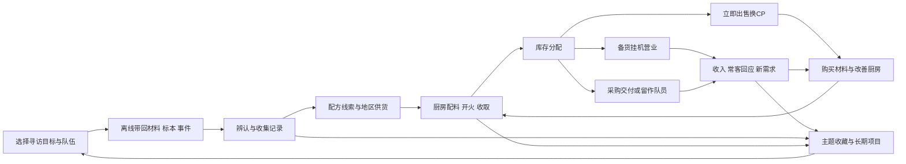

# 鸡宝厨房：下一阶段玩法与内容扩展设计

设计日期：2026-09-22。状态：**下一阶段推荐设计，尚未实现；规则原型数值待验证。**

面向后续系统策划、UI设计、内容作者与开发者。读完应能据此拆分玩法原型、设计主要操作流、制作首批内容，并判断一项新内容是否真正进入经营、挂机、收集的循环。本文件交付完整玩法方案，不授权在本轮修改实现，不表示新数值已通过平衡测试。

现行玩法仍以[游戏设计](game-design.md)和实际规则为基线；世界语义沿用[世界与内容](worldbuilding-kitchen-story.md)。本文负责下一阶段的系统取舍与跨系统关系；实施后，已落地规则分别迁回游戏设计、世界与内容、UI及工程文档，本文件保留未落地部分与重要取舍，不长期成为第二套现行规则。

## 1. 推荐结论与范围

将下一阶段定义为：**经营一家不断发现新风味的小厨房。玩家安排有限的营业和寻访，回来看到出品被谁需要、带回了什么，以及下一锅可以尝试什么。**

采用一套框架，而不是并列增加六套任务系统：

- **营业单**：从已有库存备货，选一个菜单、一个经营倾向，最长营业24小时。立即出售、一键出售继续可用。
- **生意簿**：情境采购与常客故事共用订单结构；长期项目组合已有生产、交易和发现记录，不再加每日任务。
- **寻味记录**：寻访结果扩充为材料、标本、见闻、事件和线索；标本辨认后建立地区供货，回厨房制作新品。
- **收藏册**：品种、主题、地区、特殊发现、纪念物互相索引。收藏提供新的目标和组合选择，不建立第二棵数值养成树。
- **四组地区内容**：整阶段增加48种鸡鸭，鸡24、鸭24；总量从193到241（152鸡、89鸭）。每组12种，分批交付，不因为已有193种而停止扩充。
- **第三蛋种本阶段不进入正式主线**：优先研究“鹌鹑小份试味”的独立价值，保留有验收门槛的可选原型。其数量不计入48种承诺；不以试验第三种类挤占鸡鸭扩充。

不增加战斗、装备、员工排班、桌位、配送、饥饿、租金、差评惩罚、每日送礼或连续登录奖励。厨房保持一批24枚、玩家主动选择配方并收取；没有后台无限生产。NPC常客是外部买家，不把可反复生产的鸡鸭写成唯一市民。

### 1.1 本轮信息依据与继承取舍

已阅读当前核心文档、品种与材料实际名单，核对厨房、出售、手艺、库存、采购、寻访、知识、内容包、存档和时钟规则，以及对应界面调用。重新读取此前“内容扩展空间探索”的22项方向及“鸡宝厨房扩展思路”讨论；其中举例金额、人物与自动化行为是讨论示意，不当作现有事实或照搬为数值。

| 既有分析方向 | 本方案处理 |
|---|---|
| 主题收藏、食材见闻、纪念物 | 采用，合并进同一收藏与记录结构 |
| 情境采购、主题菜单、常客、长期项目 | 采用，由营业结果和玩家自主选择驱动 |
| 寻访事件、地区食材、地区篇章 | 采用，组成完整“发现—试做—销售—再寻访”链 |
| 顺路带货 | 只做可选的少量沿途交换，不改免费出发 |
| 农场观察、生活插曲、小集会 | 合并成记录或项目成果，不各建入口与计时器 |
| 多配方、试做笔记 | 保留少量地方替代做法；自动记录本阶段配方尝试，不做复杂实验工作台 |
| 手艺试题 | 并入项目中的多解目标，不另发熟练度货币 |
| 天气、流动商人、旅行摆摊、前处理、多阶段路线 | 后置；本阶段用固定情境和出发前选择承载，不叠加时限与等待 |

[历史外部研究](archive/mqxq-research/妙奇星球玩法调研.md)只提供“主题交叉复用收藏、出发前解释预期、事件回应配队”的启发；不复用其战斗、负分排行、角色等级、探索食物刚需及多货币结构。本轮没有重查外部游戏现状，也不把研究中的推断当作本项目公式。

## 2. 当前实现：扩展必须接住的基线

### 2.1 已有系统与真实限制

| 系统 | 当前已实现 | 扩展含义 |
|---|---|---|
| 厨房 | 一批24枚；9类厨具各3级；4级厨房；材料槽1/2/3/3；逐只破壳、手动/划动收取 | 挂机营业不代替这段生产；当前批次结果与时刻不因升级重抽 |
| 经济 | 初始600 CP；收取每只基础1 CP；农场出售按品种基础价，另有招牌和整筐/拼盘 | 营业只结销售货款，不能再发一次收取CP或手艺点 |
| 蛋种 | 128鸡、65鸭；鸭蛋2500 CP永久开放 | 鸭不是按每枚额外付2500 CP；不虚构当前存在的鸡鸭生产成本等级 |
| 材料 | 75种，总包容量30；72种常规可购材料、3种特殊媒介 | 地区材料会加剧容量压力；记录与实体材料必须区分 |
| 成长 | 30单级手艺、5分支、最多1专精；现有内容最多54点，全部普通节点加1专精需74点 | 新品种会影响点数预算；不顺手塞入第六分支 |
| 经营 | 6个唯一招牌分类；招牌12%/18%；12种家常整筐；4种普通料理各3只拼盘；奖励次数来自收取 | 菜单主题不是第二套招牌，也不能凭营业时间生成经营奖励次数 |
| 采购 | 三章一次性采购，可分批交；基础货款＋完成酬谢；无招牌/拼盘叠加 | 新的重复订单须区分一次性故事奖励，防止重复刷2120 CP章节酬谢 |
| 寻访 | 一队1～3不同品种，每种占1只；菜园2h/溪岸6h/茶坡10h；基础材料1/2/3份 | 不增加多队与多个同步探险面板；现有配队与保底继续有价值 |
| 寻访能力 | 每种G＋F＝6、一个环境，共9类组合；材料/线索机会有上限 | 深度来自可读标签与发现目标，不给每种伙伴一棵技能树 |
| 寻访结果 | 出发保存材料/线索票据，归队释放占用；普通8趟、手艺6趟线索保护；满包暂存；无自动续派 | 标本等加入同一趟结果，不重抽旧旅程，不因领料拆分多领奖 |
| 知识 | 认识品种、知道配方、拥有资格和拥有库存分开；未知名称/完整图像仍待实际收取 | 标本不能直接填亮品种格；买到材料也不等于发现了品种 |
| 内容 | 点心6种；四时16种全年可做；原活动资格常驻，28品种仍有日历窗口；已有收藏回礼 | 新地区内容全年可推进；不追加“错过再等一年”作为主要门槛 |
| 照料 | 清洁36/54/72小时；保鲜与变化；农场失修可能脱逃；持家留种有条件 | 营业不能掩盖旧厨房的变化风险，也不能成为无限保护全部库存的仓库 |
| 平台 | 本地离线；schema3；严格校验与事务保存；无云端经济 | 新营业是本地确定性结算，不能假设服务器常驻、实时天气或跨设备合并 |

现有探索的“特殊样本”只是结果叙事标记，尚无独立标本册、地区供货或事件图谱。现有三章也不是可重复常客系统。上述两点需要新增机制，不能只改文案就宣称完成。

### 2.2 本次有意改变、继续保留与尚未证明的事

**有意扩展：**旧设计“无独占材料”改为“首次获取地区材料需要寻访或发现，辨认后允许CP稳定补货”；增加最多24小时的一张营业单；新增地区与收藏资格；材料收纳与手艺点预算见后文。世界文档过去“不要求顾客系统”是当时范围，本次用户已授权轻经营扩展；常客仍只承担买家职能。

**继续保留：**旧品种身份、原配方、即时交易、三章正文、已取得知识、特殊变化、原节令资格、已领回礼、手艺单专精与免费寻访。不开启独立旅行库存，不改既有白鹅等伙伴所属蛋种。

**尚未证明：**1.5.0候选版仍有长期成长与16项低利润配方警报待复核；本方案不宣称已解决。新品配方不能靠营业加价掩盖厨房成本倒挂。本轮没有执行真机游玩、构建、存档迁移或全量回归。

## 3. 四个循环及其连接

| 循环 | 玩家决策 | 执行与回报 | 如何进入别的循环 |
|---|---|---|---|
| 核心生产循环 | 下一锅做什么、钱先买什么、哪些伙伴留下 | 材料→24枚蛋→收取→库存→销售→再投资 | 新收录进入收藏；重复出品成为营业与订单供给；留下的伙伴能派队 |
| 挂机循环 | 一张营业单＋一趟寻访，均可沿用上次方案 | 时间推进有限计划；回来查看物品与发生的事 | 新需求决定下一锅，标本引出新做法；无需点完一串领奖才能继续玩 |
| 经营循环 | 围绕招牌做熟悉出品，或为情境换一张菜单 | 备货→销售/交付→顾客回应→供货、项目与纪念 | 已有收藏提供菜单解法；常客给调查方向，收入支付新配方与厨房投入 |
| 收集循环 | 当前想完成哪个主题或地区页面 | 发现→记录→实际制作→使用→专题完成 | 记录开放尝试方向；使用新品获得经营印记；主题成果指向下一片地区 |

三个连接必须是真实用途：**寻访改变“能做什么”，收藏改变“愿意试什么、能如何组合”，经营改变“接下来为什么生产”。** CP只是维持循环的资源，不是所有箭头唯一的结果。

### 3.1 一次回访的理想节奏

1. 首屏看“营业卖出多少、寻访带回什么、当前锅是否可收”。收益自动结算到有效存档；详情可稍后看。
2. 收锅或备下一锅；新发现集中展示，避免24次弹窗。
3. 从最多两份采购意向中决定要不要做，或继续正在筹备的项目。
4. 一键沿用菜单备货、沿用队伍出发；只在这次有新目标时修改。

普通回访以2～5分钟为体验目标；阅读故事、选新品和配队可另花时间。不设置“必须同时收齐三项”奖励，玩家只做厨房、只做收藏或暂不营业也能继续成长。

## 4. 挂机营业：完整规则

### 4.1 营业是什么，与立即出售如何共存

营业是把已经收取的出品交给既有收购渠道慢慢接待买家；无需雇员、店内座位或鸡鸭自己经营。每次只授权一张有限营业单，在线与离线同速推进。

| 方式 | 适合什么情况 | 收益 | 库存与操作 |
|---|---|---|---|
| 立即出售/一键出售 | 急需CP、清理库存、不想经营 | 沿用基础价＋当前招牌＋可用经营奖励 | 立即扣除自由库存；选择与确认方式保留 |
| 挂机营业 | 想招待某类来客、推进主题、为下次生产找方向 | 同类销售计价＋克制的主题加价；有营业记录与来客结果 | 预留有限库存，按进度卖出；无需守候 |
| 采购交付 | 主动选择一笔有明确回报的生意 | 基础货款＋约定酬谢 | 只消耗玩家确认交付的数量；不被营业自动代交 |

即时出售不降价、不收费、不加冷却，也不失去已有经营奖励。营业逐步销售，提前收摊不保证货已卖完；按本节节拍完整营业24小时可以售完上限内的合格备货。不自动消耗后来收取的伙伴，不自动接采购、不自动购买材料。缺货正常结束接待，不扣信誉、不赔钱、不出现负余额。

### 4.2 下线前只做三项决定

| 决定 | 默认行为 | 玩家可调整的范围 |
|---|---|---|
| **摆什么** | 沿用上次菜单；初次为“家常小铺” | 一张菜单，最多3个角色位，例如主食、茶味、小点；每位最多2种可替代出品，总计最多6种 |
| **备多少** | 从自由库存智能备24只，默认每种在家留1只 | 营业单上限初始24、厨房Lv.2为48、Lv.3及以后为72；可少量备货，自定数量 |
| **想招待谁** | “熟悉街坊” | 熟悉街坊／寻味来客两个倾向；只影响事件方向，不形成收入高低档 |

“留一只、收藏锁、采购预留”是长期库存偏好，设好后记住，不要求每次重新选择；展开时可编辑。对未发现品种无需另设“保护未知”：未收取伙伴尚不在库存中，不可能被营业卖掉。

营业单统一最多持续24小时，无需选择开店时长。默认预览显示预计售罄时刻和最晚收摊时刻。备货少可以更早售罄，之后不生成空转收入、订单或常客进度。玩家随时回来都可以先做别的，结果不需按时领取。

确认前显示：选定品种与数量、每种留家量、在途量、订单预留量、价格构成、预计销售节奏、已保留的经营奖励次数、可遇见的内容方向。无合格库存时给出“先收取或换出品”，不允许靠空店刷事件。

### 4.3 库存如何分配

在现有“总库存T、寻访占用R”的基础上，增加营业未售预留S、主动采购预留Q。自由数量为：

`自由库存 F = T − R − S − Q`，所有量均为实际数量，不能小于0。

启用顺路带货后，R明确拆为“同行队员占用＋沿途货物占用”两项，界面分别显示；归队只释放队员占用，货物按交换是否完成扣除或释放。不得把额外携货漏出这条守恒式。

“每种留家K只”是对新的自动选择/消费的保护下限，不是凭空创建库存；计算可自动备货量时再减K。默认K＝1且以在家为准，外出的1只不能冒充在家留种。锁定品种默认全部不参与自动备货。玩家显式关闭留种并确认后可以卖光，发现记录不丢失。

- 备货只增加S，不立即减T；真正成交同时减少T和S。同一只不能同时出发、上架、交付或即时出售。
- 新采购“预留”是可撤销的数量占用；**预留不算交付**。旧采购升级时不自动占走玩家库存，由玩家选择启用。
- 采购预留Q仍在农场，不增加脱逃保护。现有损失按实际在家量T−R−S计算；损失后将Q缩至剩余可预留数量，说明需补货，不记采购失败或扣酬谢。不能因新增预留功能让农场全量永久免维护。
- 停止营业先结算已经过去的销售，再释放未售S；不退回已成交伙伴。修改正在营业的菜单等同收摊后重开，不能改写过去结果。
- 营业中的备货由收购点照看，预留期间不计农场脱逃；24小时后未售货在结束时刻释放，之后按在家库存参与现有损失规则。不能靠放着未读报告永久保护库存。
- 照料只保护有限营业货物，不能寄存病变、纯观赏品或无限珍品；24/48/72上限独立于农场总量。以后若加观赏寄售必须另行设计，本阶段仅有食用白名单营业。
- 整修、归队、收摊和脱逃同刻按时间线结算；先处理该时刻应发生的交易和占用变化，再处理此后的在家损失。UI不能使用昨天的可用数强行成交。

### 4.4 离线期间怎么营业

以下为原型初值，不是已经验证的最终经济配置。

1. **固定服务节拍**：每满2个实际营业小时完成一个接待窗口，每窗口最多售6只，24小时最多12窗口/72只。第一个窗口满2小时才发生销售，无“开店立即赠一次”漏洞。窗口内先按菜单角色轮转，再按玩家设置的替代顺序取货；预览能给出确定的普通销售数量。
2. **基础需求有保证**：白名单内出品都可以正常销售，主题不合格时只是没有主题加价/对应事件，不突然全盘滞销。库存不足时卖实际数量，空角色不阻塞其他出品。
3. **菜单适配影响内容**：主题完整度决定加价资格与来客内容池；经营倾向决定优先出现熟客续篇还是陌生风味线索。稀有度不加快接待、不改变窗口上限。
4. **销售推进见闻**：每实际累计售出12只，推进一次“来客见闻”判定；进度跨营业单保存，不按开店次数、点击次数、在线时长加速。每24只里至少有一次对应当前合格方向的未见反馈；没有合格新内容时只记普通经营摘要，不补无限CP。
5. **一次只推进一段故事**：同一常客未读的后续只保留下一段，玩家未处理时不连续跑完一生故事。重复采购意向最多2份；满了仍可营业，后续同类询问合并为文字，不丢已生成意向、不红点堆积。
6. **结果在开始后不可重抽**：开店保存菜单、库存、价格规则、手艺、内容候选与随机种子；按已完成窗口结算。停止再开不会重置已累计的12只见闻进度或未消费的下一次来客序列。在线/离线、反复读取、分次查看的最终结果一致。

售罄后营业单结束；不拿空店剩余时间继续抽奖。提前收摊保留已完成窗口和已成交成果，未满2小时的窗口不发货款；未售货可以立即出售。为避免重开刷主题，同一营业单的一次性“完整菜单见闻”只发一次，后续同主题只推进真实累计销售/项目记录。

### 4.5 货款、招牌与经营奖励

营业货款分开列：**基础货款＋招牌加价＋主题加价＋整筐/拼盘奖励**。主题加价只乘该出品基础售价，与招牌相加不相乘。

- 招牌仍是6个固定唯一经营分类，T2为12%、TS为18%。菜单可以同时使用多个分类；不因本次主题改变招牌，招牌仍只在重配时更换。
- 本次主题达到“合适”时，合格出品主题加价5%；“完整”时为8%。每只主题加价最多2 CP；不匹配品种为0。不会给高价珍品无限放大，也不加价订单酬谢。
- 加价按百分整数累积小数，招牌沿用共享小数账，主题另记小数账；拆窗口不损失小数，也不能反复取整获利。主题加价精确上限按每只基础价的8%与2 CP较小者计算。
- T3/T4/T5/TS继续使用现有经营奖励次数。开始营业可选择“使用已有经营奖励”，默认关闭，偏好可保存；开启时按本单全部备货预估所需次数并预留，不允许即时出售同时用掉。
- 收摊时，仅对本单**实际售出总数**按现有“优先整筐，再用剩余组拼盘”规则核算，扣除预留中的实际使用次数，释放未用次数；同一只不能重复参加两种奖励。在线查看只展示预计奖励，不先结算后再结算。所有货款可以分窗口入账，整筐/拼盘仅收摊入账一次。
- 备货不生成次数；营业销售也不增加累计收取、神社赠礼进度、返料、O5首次发现或点数。收取仍是这些计数的唯一相关事件。
- 经营奖励持有总量包含已预留次数；T5容量3/6不因预留而腾出额外额度。现有旧额度过量规则保留。
- 手艺重配前要求先收摊，界面提供一步“结算并收摊后重配”；不让最长24小时营业成为新强制等待。当前厨房/队伍原有限制仍适用。

**可复算例：**24只基础鸡宝，基础价3 CP，家常招牌12%、T3一次奖励12 CP，起始小数为0。立即出售获得72＋8＋12＝92 CP，留下0.64 CP招牌小数。若家常菜单仅达到“合适”，营业售完获得72＋8＋3＋12＝95 CP，另外留下0.60 CP主题小数；原先收取的24 CP不再发。主题精确增量只是3.6 CP，营业价值主要是该批带来的来客与记录。若只卖出18只就收摊，本单没有24只整筐奖励，预留次数退回；其余6只回到自由库存。

因此不存在“把同一批直接变成数千CP”的承诺，也不要求玩家为多3 CP强制等待。基础生产利润、收取所得与销售所得必须在经济分析中分开。

### 4.6 回来看到什么、需要处理什么

营业摘要默认最多三行，示意：

> 家常小铺已收摊：卖出24只，货款95 CP已入账。  
> 老顾客询问：下次能否添一种带茶香的出品？  
> 新增“街坊早饭”记录1条；下一份采购已留在生意簿。

点击详情才看卖了哪些、价格构成、剩余货、奖励次数以及何种菜单触发哪条反馈。收益在世界推进并成功保存时到账，“查看账单”只读，不再发钱；没有“先领奖才能收锅”的强制顺序。

需要玩家决定的最多两件：是否接采购、下一次是否换菜单。短故事可稍后读；永久知识和纪念物自动登记，只有陈列位置由玩家选。空店、无新事件、同主题毕业时直说实际情况，不伪装有重大收获。

### 4.7 如何避免只剩等钱

每个营业主题必须至少连接一条**非CP结果**：常客下一段、地区调查方向、主题使用印记或项目成果。每条结果要显示下一步，例如“溪岸有类似叶片，选‘找标本’可追寻”；不得只有无后续的彩色掉落动画。

同时避免营业成为所有系统的强制关卡：基础配方、材料采购、旧图鉴与原路线不要求开店；地区入口提供营业与寻访两种首次线索渠道。常客故事和营业纪念可以专属营业，但不能锁住大部分新增鸡鸭。

## 5. 经营内容：共用菜单、采购与记录

### 5.1 主题菜单：可读的搭配题

菜单用最多3个“需要什么”的角色位表达情境；不展示总战力、星级或隐藏负分。品种可以有多个主题标签，但招牌类别仍唯一。食用资格单独维护，不能从“看起来像食物”或招牌类别推断。

完整度只有三档：未成题（可普通营业）、合适（满足必要角色）、完整（必要角色＋一个明确搭配条件）。早期家常菜单只需1种；后期才鼓励2～3种。组合评分在备货时计算，替代方案不改变分数上限。

同一品种可具有多个标签，但本单只分配给一个菜单角色；同一只出品不同时补两个需求。一项“有效主题接待”要求本单实际售出覆盖全部必要角色、每个角色至少1只，并合计售出至少6只；完整主题印记还要求这些成交来自达到完整档位的窗口。满足配置却一只未卖不记完成。

| 菜单 | 必要角色/合适 | 完整条件 | 已有内容的实际用途 |
|---|---|---|---|
| 家常小铺 | 1种家常白名单 | 2种不同家常，各至少6只 | 基础鸡鸭持续能卖，不被新品淘汰 |
| 茶香便当 | 1种茶味＋1种饱腹料理 | 第3种便携小点，各至少3只 | 茶叶蛋鸡能在烧水壶开放前承担茶味；不硬要求“饮品” |
| 蒸笼早市 | 1种蒸点＋1种家常 | 含一种咸味、一种甜味且各至少3只 | 小笼包鸡与奶黄流沙鸡有明确位置；前期不强制甜点 |
| 溪岸野餐 | 1种便携主食＋1种清爽出品 | 鸡鸭两类各有一种、3种各至少3只 | 用已有料理可成立，新溪岸品种增加替代选项 |
| 茶坡小点 | 1种茶味＋1种烘焙/蒸点 | 3种不同出品，至少一个花香或焙香标签 | 不把所有茶味归到唯一茶饮招牌 |
| 暖锅小聚 | 1种炖煮＋1种家常 | 3种中有姜香或菌菇出品，各至少3只 | 非稀有炖鸡、姜母鸭等仍有用途 |
| 海风轻食 | 1种咸香主食＋1种清爽出品 | 使用已辨认海湾风味且有鸡鸭两类 | 后期地区材料回到营业，不靠售价压过旧内容 |
| 四时相逢 | 任2种已收录四时手作 | 来自3个不同四时章节，各至少3只 | 全年筹备；不要求现实季节或原节日品种 |

上表适配为作者配置，接入前逐种审核白名单。不能因为名称含“茶”就自动具备茶味，也不能让观赏、焦化、病变品种满足食用主食。造型收藏使用另一套展示条件。

备货时3种各3只不代表全过程一直完整。某一角色售罄后，下一窗口按剩余可供菜单重新评估；主题加价只按当时档位计算。建议自动均衡备货，并在预览中显示“完整主题预计可维持几个窗口”。不扣已完成窗口的加价和记录。

### 5.2 情境采购：有替代、有结束、没有打卡

新采购来自来客见闻或地区事件；同一时间最多显示2份候选、最多进行2单。三章主线独立置顶，不占候选槽。未接可忽略或换一个方向；没有付费刷新、几分钟冷却或每日次数要求。

候选只有玩家接取、明确略过或完成真实营业/寻访里程碑后才推进已保存的提议序列；重复打开、退出、重载和反复略过不重抽高价。略过后不会立刻无限补一份，可继续生产，不用守刷新时钟。

新单接取时冻结需求、允许的替代组、数量和酬谢，永不过期；可按物品组分批交付。与旧第三章“交第一只后锁定单一品种”不同，新单可以混交允许替代，但已交付数量与身份不返还、更不改价。取消剩余需求不追回已支付基础货款，不给完成酬谢；重新出现也不继承被取消进度。

| 情境例 | 需求与替代 | 回报与用途 |
|---|---|---|
| 街坊备早饭 | 家常类12只，允许鸡鸭混合 | 基础货款＋12 CP；第一次留下街坊便签 |
| 茶会添一盘 | 茶味6只＋点心6只，各组至少1种 | 基础货款＋20 CP；常客故事推进或一次性茶坡调查方向 |
| 雨后野餐 | 便携与清爽两组共12只，至少2品种 | 基础货款＋20 CP；首次给溪岸样本的追寻目标，情境不要求真实下雨 |
| 外地尝鲜箱 | 某地区新出品6只＋已有家常6只 | 基础货款＋24 CP；地区经营印记。永不要求未开放蛋种 |
| 花叶陈列 | 已收录的花/叶造型任选3种，在家各1只供查看 | 这是展示委托，不扣库存、不付基础货款；一次性明信片，不反复刷钱 |

重复单酬谢初值12～24 CP，按需求难度配置上限，不按稀有度无限翻倍。一次性常客章节奖励优先为记录、纪念物和供货选择；旧三章120/500/1500 CP保持一次性身份，不能拷贝为重复单奖励。

生成器只给已有制作资格、可获材料、已知可执行路径的普通需求；若目标需新品发现，单列为可选调查，不占普通采购。不同蛋种或厨具尚未开放时使用替代或不生成，不能用订单提前泄露未知名称。

### 5.3 常客：四位足够形成连续关系

首阶段完整内容目标4条常客线，每条4段，共16段，每段2～5句短文本。保留“旧厨房老顾客”；新增使用职能称呼，不强制私人履历或立绘。

| 常客线 | 四段内容节奏 | 关联与成果 |
|---|---|---|
| 旧厨房老顾客 | 熟悉家常→茶香便当→自选小聚→认出玩家招牌 | 复用三章既成事实；“常坐的那一桌”纪念便签 |
| 溪边采购人 | 便携出品→水边叶片→尝试溪岸新味→带来野餐请求 | 引向山柚/水芹；折叠野餐布纪念物 |
| 茶坡访客 | 比较茶香→焙叶标本→搭配一咸一甜→寄回风味评语 | 茶叶蛋鸡与新茶鸭并用；小茶罐纪念物 |
| 沿湾货客 | 家常货箱→盐花来历→海风轻食→完成地方交换 | 海湾地区与长期项目；贝壳货签纪念物 |

关系按“已完成哪些生意/见闻”推进，不显示好感度条、不衰减、无需每日问候。每段提供至少两类可接受出品或“营业记录/手动采购”两种满足方式，专属物种发现章节例外时必须提供明确保底渠道。

常客没有必须准点上线才能碰见的时间窗口。满足条件后的下一次有效来客判定优先安排该线下一段；不连续随机失败阻塞。两种经营倾向只改变多个合格故事间的优先顺序，玩家可在生意簿固定一个想继续的常客。

### 5.4 长期经营项目：少量、跨系统、能毕业

初期只显示一个推荐项目；完整阶段4个项目，可同时记录自然进度，最多置顶1个。检查型目标追认已有永久记录；物资交付型目标必须明确确认消耗，已卖出的同一只不能再算捐赠。项目中销售记录可以同时满足主题与常客，不重复扣货。

| 项目 | 可执行的目标组合 | 成果 |
|---|---|---|
| 我的小店招牌册 | 收录任选6种可营业品种；两类菜单各完成一次有效主题接待；支付200 CP印制 | 可陈列招牌册、保存3套菜单预设；不提高全局售价 |
| 溪岸风味篮 | 记录2种溪岸标本；实收4种溪岸新品，其中鸡鸭各1；交付任意2种各6只；支付500 CP | 地区插页与野餐篮摆件；溪岸替代做法1条 |
| 茶坡一桌 | 记录一次焙叶事件；任选3种茶味/点心累计营业或交付36只；完成茶坡常客一段；支付800 CP | 主题布置与茶坡风味册；自主举办“茶香小聚”的成果页 |
| 四地风味展 | 每地任选6种新品已收录；每地2份标本/见闻；4种不同主题各完成一次有效接待；筹备交付总48只，至少4类；支付2000 CP | 完整展览插画、纪念章与自选陈列布局；明确毕业，不无限循环捐钱 |

费用是待测初值，分项目阶段支付；不一次占用整笔CP、不收租、不计现实截止日。第四项是后期目标，不作为解锁海湾的必需条件，避免“要先收海湾才能去海湾”。项目成果优先横向与展示；不制造必须做完才能赚钱的永久倍率链。

陈列最多3个位，已得纪念物任选；不加经营数值，随时更换。小集会只是完成筹备后呈现的成果与一张自选菜单，不再开一个要守候的活动倒计时。

## 6. 挂机寻访：每趟带回一个可理解的进展

### 6.1 保留骨架，增加寻找目标

仍只有一队、1～3不同品种、无出发费和体力；现有2/6/10小时路线与轻装模式保留。新增海湾路线12小时、基础3份材料，同样最多额外1份；普通池为盐、海苔、柠檬，未解锁材料仍按旧规则替换食盐土。旧配方线索按该材料池关联真实配方，环境适应沿用水边。不是把现有三路线整体替换为远征。

出发前仍选路线与队伍，再选一个**本次关注**：补材料／找标本／寻见闻。默认记住上次关注；这是对发现池的选择，不是额外战斗模式。已有R2/RS仍负责指定实体材料，OS仍负责在合格配方线索中指定目标；免费关注不能代替这些手艺的精确定向功能。

每条路线有2个内容地点，用于承载事件条件，例如溪岸的浅滩与岸边摊；默认推荐尚有发现的地点。地点不新增倒计时、不分割成两段等候，不要求途中上线决定岔路。

| 结果层 | 每趟如何取得 | 进入哪里 | 能改变什么 |
|---|---|---|---|
| 实体材料 | 沿用基础份数、额外材料机会；可选普通补货或地区采样池 | 同一材料包；满包留在寻访篮 | 下一批配料或后续库存 |
| 既有配方线索 | 沿用真实配方候选、当前概率及6/8趟保护 | 既有知识记录 | 帮助尝试旧品种；不因新增标本减少旧线索机会 |
| 新发现卡 | 每趟最多1张，候选为标本、地点见闻或事件 | 收藏册自动登记，不占材料格 | 辨认供货、地方配方方向、故事或项目目标 |
| 沿途交换 | 玩家出发前主动携带并确认，符合约定即完成 | 货物消耗记录＋既定回报 | 让重复出品换定向补货或调查进展 |

四层不是四次领奖，归队汇总一次展示；材料可以稍后取，知识和记录先登记。新发现卡属于同一事件对象：一张“柚皮浮在浅滩”可同时登记标本与见闻，不能把同一段内容拆成5个重复红点。

### 6.2 配队从两个概率扩展到少量特征

保留G/F和既有环境。新增海湾仍采用“水边适应”作为既有溪岸环境的别名关系，不立刻重分全体能力或新增第四属性。为每种伙伴人工标记最多2个寻访特征，例如茶香、叶形、便携、谷物、花香；品种可以没有额外特征，基础能力仍有效。

事件一般要求“一个相关特征＋一个适应环境的伙伴”，同一位可满足两项；最多检查两个条件。常见品种应有解，不要求三个指定稀有品种或全鸡/全鸭阵容。举例：“能认茶香的同行者＋水边适应”可由茶叶蛋鸡与适应水边的普通队员完成；不会擅自把所有茶味伙伴设为水边适应。

UI先给一行谜面，再显示可操作条件与已满足状态；可点查看已收录候选。发现乐趣来自选谁、去哪和看结果，不来自猜作者没写出的词。新物种也按G＋F＝6加入现有三档分配，不普遍给4/4或稀有度加成。

### 6.3 新发现概率与保护

本节为建议原型值；**与已有配方线索分别计算和保底**，不得挪用旧线索失败计数。

- 在所选地点有合格未得发现时，新发现概率为`min(60%, 25%＋2%×全队F＋5%×是否满足该目标特征)`。条件门槛与5%加成分开：不合格目标不入池，入池后特征加成按该卡配置至多一次。
- 首次开启地区后，第一次完整寻访保证一个入门标本；候选优先为当前厨房能试做的那一种。第二材料的标本需达到对应厨具/材料槽后才成为候选，不用不可制作奖励挤掉当前机会。
- 追寻同一地区的“找标本”或“寻见闻”时，连续3趟有合格候选但无新发现，第4趟必得一张未得卡；计数按地区＋关注方向保留，换队、轻装、换地点不清空。无合格内容或提前召回冻结计数。
- 有多个目标时，优先当前置顶收藏缺项，再按未完成地区章节顺序；其余候选等权随机。同一张已登记卡不再次算新发现。
- 已经全收齐的方向显示“本方向已完成”，仍可为材料出发。重复风景文本可出现，但不给重复首发现CP、隐藏碎片币或永续强化。
- 出发时保存候选顺序、结果票据、保护状态与队伍快照；期间从其他渠道得到同卡，归队按原已保存合格候选顺序去重顺延；若已无新内容，冻结保护而非强发CP。
- R3影响现有材料/线索概率，R4影响原配方线索保护；本阶段不偷改为对所有收藏都加成。发现卡概率使用F，是让现有配队有延伸价值；如后续重写手艺，需另做完整预算，不隐藏扩效。

短路线仍适合积极补货，长路线有各自材料与地区内容，不能将某个核心标本只放2小时路线并要求一天跑十次。首批地区主线每条4～6次有方向的完整寻访就应看见一个阶段成果；这是验收目标，不能用“平均概率不低”代替长尾保护。

### 6.4 标本、食材见闻、地区材料的区别

| 对象 | 示例 | 是否消耗/占包 | 解锁边界 |
|---|---|---|---|
| 标本 | 山柚皮标本 | 首次自动记入册，永久、不占包、不出售 | 证明辨认过这种地方风味；不等于已拥有可下锅的材料 |
| 实体地区材料 | 山柚1份 | 消耗、占普通材料包 | 用于明确的新配方；同一材料不再按出处拆多个堆叠 |
| 食材见闻 | “柚皮香气比果肉更明显” | 永久文本，可配小物件图 | 展示已知用途与发现地点；不自动改变所有旧配方 |
| 地方做法 | 山柚与现有蜂蜜的搭配方法 | 永久配方知识 | 告知厨具和配料；仍需材料、资格与实际收取 |

标本归队自动登记，玩家首次打开可点“辨认”直接完成，不额外等研究时间、不收费。辨认后永久开放该材料的杂货铺供货，并得到一条可执行的入门配方方向；新发现卡不能把实际材料也复制一份。

首次保证标本的那趟，把**一份基础材料位置**换为对应试做材料，不额外增加总份数；即使包满，实体材料留篮、标本先入册。路线从此可选“地区采样池”：每趟第一份基础材料从本地区已经辨认的材料中等权取得（最多2种，只有1种时必得该种），其他基础份及额外份沿用普通池。R2/RS可定向这份地区材料，其定向份数上限与原手艺一致；未辨认材料不靠随机材料池绕过发现过程。

首次标本替换、地区采样、沿途交换不得同时改写同一份材料：出发预览先分配首次标本试做位，再分配沿途交换位，剩余基础位置才按所选材料池与手艺定向填入；地区采样每趟最多占1位。基础份数不够时，本趟不提供会冲突的带货约定，不暗中增发材料。

供货不轮换、不每日限量。建议初始单价：荠菜15、麦芽20、山柚20、水芹15、焙香叶25、桂花25、盐花20、海蓬菜20 CP；需经过整批配方利润复算后定价。这些成为普通可购食材，适用T1返利和C3返料；3种既有特殊媒介仍排除。

材料包仍是一套：开放首个地区材料时免费从30扩至36；辨认4种地区材料后扩至42。不加仓库货币，不把扩容卖给被系统塞满的玩家；旧存档超量暂存仍可领取。这里有意修改当前容量规则，工程阶段须同步所有购料、返料、寻访与存档校验，不能只改界面数字。

### 6.5 四地内容与开放链

地区名字为本阶段工作名，不创造王国政治或远途自驾世界。海湾定位为厨房周边沿水可归巢的地方；图文只表示近郊路线，不暗示伙伴横跨大陆。

| 地区/路线 | 2个内容地点 | 新材料 | 如何开放；必有兜底 |
|---|---|---|---|
| 菜园与谷地/原菜园2h | 菜畦、谷物棚边 | 荠菜、麦芽 | 现有菜园开放后可发现荠菜；麦芽标本在厨房Lv.2与对应厨具就绪后入池 |
| 溪岸小集/原溪岸6h | 浅滩、岸边摊 | 山柚、水芹 | 原溪岸开放可预览方向；厨房Lv.2且有可执行入门配方后启用地区首标本与双材料制作链；由寻访入门或溪边采购人引出 |
| 林间茶坡/原茶坡10h | 焙叶棚、花树径 | 焙香叶、桂花 | 原路线开放＋厨房Lv.2＋发现24种；入门用水煮锅/烤箱，不等待Lv.4烧水壶 |
| 风湾盐田/新海湾12h | 盐田小路、潮线草地 | 盐花、海蓬菜 | 厨房Lv.3＋发现40种＋完成任一前三区的入门标本与一次新出品实收；再做一次路线引导事件 |

海湾引导可由“沿湾货客”来访取得，也可在符合门槛的溪岸寻访中选择“追寻沿湾路标”确定触发；不要求先完成常客或茶坡全收集。不消耗手艺点解锁地区，不要求四地全完成才能获得最后一地资格。

每地制作6张发现卡（2标本、2地点见闻、2条件事件），四地共24张。供货最迟通过4趟保护取得，不把关键路线门槛藏在无限随机。地区全套内容可跨早中后期展开，地图出现不代表本地12种都已经可做。

### 6.6 四个具体寻访事件

| 事件 | 条件/选择 | 归队内容 | 后续行动 |
|---|---|---|---|
| 藏在菜畦边的香气 | 菜园、找标本；第一次不要求特殊队员 | 荠菜标本＋基础材料位中的荠菜1份 | 免费辨认，开放供货；平底锅单材料试做荠菜煎饼鸡 |
| 漂在浅滩的柚皮 | 溪岸、找标本；水边适应是有提示的机会加成 | 山柚标本与辨认记录 | 山柚＋现有蜂蜜进入新品方向；茶香便当可添清爽出品 |
| 两种很像的叶子 | 茶坡、寻见闻；茶香特征＋林间适应 | 焙叶见闻，指出旧乌龙茶和新焙香叶差别 | 给旧茶叶蛋鸡的地方替代做法方向；保持旧配方有效 |
| 货筐上的盐晶 | 海湾、寻见闻；可选带家常货6只 | 不带货得普通地点记录；带货按预览换盐花1份并推进交流记录 | 新地区烤/煮配方；“四地风味展”增加地方经营素材 |

**顺路带货规则：**每趟最多一份约定，初值6只，来源必须是额外自由库存，不是三个同行队员；确认时单独占用。只有完成全趟才扣货、给预先明确的交换物，召回原样释放；不支付基础销售CP、不使用招牌/经营奖励，不又算采购交付。交换物替换本趟一份基础材料位，不在免费产量上再叠一份，收益在出发前直接比较。例：基础鸡宝6只换盐花1份，放弃18 CP基础售价及本可带回的普通材料，换取20 CP材料的确定性与一次新交流；有招牌/经营奖励时真实机会成本更高，应直接列出。它不是刷CP渠道，也不应推荐给只想补货的玩家。已完成交流后可不带货，免费探索所有基本地区内容仍可取得。

### 6.7 到期与长期离线

普通一趟到期自动归队，不自动续派。报告和未领取材料不腐败，过一天再读不会失去标本或事件；旧队伍归队后也不被奖励篮继续占用。材料留篮未清时沿用“用掉、领取或明确放弃后再出发”，清理操作在归队页直接提供，不能把满包转化为付费解锁。

不增加“错过事件选择即失败”。事件选择都在出发前或回家后做，后者影响下一步方向，不倒改这次收获。用户睡觉时无需处理任何岔路。

## 7. 图鉴与内容扩充：48种鸡鸭及长期收藏

### 7.1 数量与结构

本阶段总目标**新增48种，鸡24、鸭24**，分四组各6鸡6鸭。完成后鸡152、鸭89，共241，较现状增加约25%；鸭新增比例约37%，补足当前鸡明显更多的结构。首个可玩切片先交付12种，后续三组依次跟上，不以“系统做了、剩下以后再说”替代48种内容目标。

每组12种建议构成：8种围绕两种地区材料做交叉配方、2种用已有材料承接菜单、2种有独特造型的观赏/发现品种。构成可按重叠审查微调，但每组两种蛋各6、至少8种有两项以上跨系统用途的目标保持。

新增名称均为工作名，下面是完整选材池，不是已生成数据或最终角色美术。配方接入前需审查与旧配方及四时包的相同组合冲突；已存在的荷叶糯米鸡、柠檬香煎鸡、姜饼鸭等不改名重复计数。

| 内容组 | 新鸡6种 | 新鸭6种 |
|---|---|---|
| 谷地早市 | 荠菜煎饼鸡、麦芽脆片鸡、荠菜蒸团鸡、麦芽小卷鸡、芝麻薄脆鸡、麦穗冠鸡 | 荠菜蛋卷鸭、麦芽米糕鸭、荠菜汤包鸭、麦芽奶冻鸭、椒香饭团鸭、谷粒斑鸭 |
| 溪岸野餐 | 山柚蜜煎鸡、水芹饭团鸡、山柚酥饼鸡、水芹蒸饺鸡、姜香小饼鸡、柚灯鸡 | 山柚清茶鸭、水芹清煨鸭、山柚米团鸭、水芹薄饼鸭、芝麻酥卷鸭、水纹叶鸭 |
| 茶坡花香 | 焙茶锅煮鸡、桂花米糕鸡、焙茶小饼鸡、桂花奶冻鸡、蜜香蒸糕鸡、茶芽冠鸡 | 焙香奶茶鸭、桂花茶鸭、焙香米团鸭、桂花酥鸭、姜蜜软糕鸭、花露羽鸭 |
| 海风盐田 | 盐花烤鸡、海蓬薄饼鸡、盐花奶酥鸡、海蓬蒸卷鸡、胡椒米饼鸡、盐晶冠鸡 | 盐花慢煨鸭、海蓬饭团鸭、盐花焦糖鸭、海蓬汤包鸭、柚香脆卷鸭、潮纹贝鸭 |

鸡、鸭不硬分“便宜/昂贵”“陆地/水域”的全局阶级。各自优势来自具体菜单、配方与环境适应；同一地区的鸡鸭不能只换头形和名称。每组至少要有轮廓、材料表现、料理方向不同的例子。

### 7.2 代表新品：外形、获取、用途一起设计

以下16项为可供下一轮内容制作的锚点；工具等级按显示等级书写。未给具体售价，因为需连同整批23个伴随产物测算利润；建议售价带保持在相近旧料理范围，稀有外观不等于数值更强。

| 新品 | 可辨识的外形与线索 | 推荐获取路径 | 跨系统用途 |
|---|---|---|---|
| 荠菜煎饼鸡 | 扁圆煎饼边与碎叶纹；“菜畦边的香气，碰一下平锅” | 鸡蛋、平底锅Lv.1、荠菜；1槽可试 | 谷地首发新品；家常早市替代、菜园叶形事件、谷地收藏 |
| 麦芽脆片鸡 | 层叠脆片尾羽与琥珀纹 | 鸡蛋、烤箱Lv.1、麦芽＋面粉；厨房Lv.2 | 茶坡小点候选、谷物特征、烘焙招牌 |
| 麦穗冠鸡 | 麦芒扇形冠、圆谷粒身体；明确观赏 | 鸡蛋、保温灯、麦芽＋食盐土；完成谷地标本辨认 | 造型收藏、谷地事件队员；不进入食用菜单 |
| 荠菜蛋卷鸭 | 螺旋蛋卷身、叶纹鸭翼 | 鸭蛋、平底锅Lv.1、荠菜；鸭蛋已开放 | 便携菜单、谷地/溪岸共用叶形条件 |
| 麦芽米糕鸭 | 方块米糕身与浅色谷纹 | 鸭蛋、水煮锅Lv.2、麦芽＋糯米 | 甜味角色、茶会添盘、谷地食材见闻 |
| 山柚蜜煎鸡 | 半月柚皮边与蜜色煎纹 | 鸡蛋、平底锅Lv.2、山柚＋蜂蜜 | 清爽/果香搭配，溪边采购人与野餐主题 |
| 水芹蒸饺鸡 | 月牙饺身，水芹梗状尾 | 鸡蛋、竹蒸笼Lv.1、水芹＋薯粉 | 蒸点招牌、溪岸项目；兼顾点心包旧品替代 |
| 山柚清茶鸭 | 通透浅黄茶身，柚皮卷颈圈 | 鸭蛋、烧水壶Lv.1、山柚＋乌龙茶叶；后期制作 | 茶饮招牌、海风轻食、晚期回访溪岸理由 |
| 水纹叶鸭 | 叶脉与水波纹交错，非汤饮造型；观赏 | 鸭蛋、保温灯、水芹＋河水；浅滩见闻资格 | 特殊发现页、水边/叶形组队、花叶陈列 |
| 焙茶锅煮鸡 | 深褐焙叶纹、圆壳小帽，与旧茶叶蛋鸡区分 | 鸡蛋、水煮锅Lv.1、焙香叶；茶坡入门 | 不用烧水壶也可体验茶坡；茶味菜单与辨叶事件 |
| 桂花米糕鸡 | 半透明米糕身，花点集中成冠 | 鸡蛋、水煮锅Lv.2、桂花＋糯米 | 花香小点、常客一咸一甜组合、食材用途记录 |
| 焙香奶茶鸭 | 奶色茶身、深色焙叶斑 | 鸭蛋、烧水壶Lv.1、焙香叶＋牛乳 | 后期茶饮内容；与旧奶茶鸭并列提供菜单替代 |
| 桂花酥鸭 | 花瓣状酥皮尾与细碎桂花点 | 鸭蛋、烤箱Lv.2、桂花＋面粉 | 烘焙/花香主题，茶坡常客与地区收藏 |
| 盐花烤鸡 | 烤色身、疏落晶粒冠 | 鸡蛋、烤箱Lv.2、盐花＋香草叶 | 海风轻食、盐田地区制作印记；不替换既有香草烤鸡 |
| 海蓬饭团鸭 | 长条饭团身、分叉海蓬叶翼 | 鸭蛋、水煮锅Lv.2、海蓬菜＋白米饭 | 主食/便携，沿湾货客、四地风味展 |
| 潮纹贝鸭 | 贝壳状双翼、水线纹胸；明确观赏 | 鸭蛋、保温灯、盐花＋河水；潮线见闻资格 | 海湾特殊发现、观赏主题与水边事件，无自动食用标签 |

其他32项按上述结构制作同等信息，不仅提交名字。每种至少记录：稳定身份、造型差异、蛋种与精确配方、候选类型、解锁门槛、食用资格、唯一招牌类别或无类别、主题标签、寻访能力/特征、两项用途、获取线索与来源。菜单标签复用公开定义，不让内容作者自行创造十几个同义标签。

### 7.3 新品种的获取与重复生产

新地区料理使用**地区试做**入口，与普通随机候选、四时首次偶遇、旧蒸笼保底分别标识。选择已经获得方向的目标，按该目标要求设置蛋种、厨具和材料；获得完整方法前仍保留未知名称与剪影规则。辨认材料后，其全部相关新品方向按当前可做/以后可做列入地区页；使用旧材料的地区新品方向随该地区首标本登记开放，观赏品则还需明确的见闻资格。因此48项都有可追寻入口，不必等待随机顾客逐个送配方。

方向只揭示编号、厨具及第一味，完整配料可通过观察/研读获得。另设免费知识兜底：辨认后，每完成3次该地区完整寻访，可补全1条当前置顶且合格的地方做法；记录自动累积、到达时自动补全，不生成可囤积的“研究券”。没有合格目标时冻结，选好目标后继续；完成所有地方做法后不换成CP。这样不强迫购买观察手艺，主动研读仍能节省等待。

- 每次符合条件的地区试做，初次发现目标的批次机会为25%；连续3次完整收取却没有收录目标，第4批安排1只。进度按目标永久保存，切换目标不清空；放弃锅不计失败、不刷新票据。
- “安排1只”不是保证免疫病变与过熟。只有实际收取目标才重置该目标保护并点亮图鉴；安排目标却发生变化时，后续有效试做继续享受安排，不能再次从零刷3批。
- 实际收录后，从配方册明确准备该目标，可安排1只，其他23枚沿用兼容的原生产规则；不承诺24枚都是新品。订单和项目因此优先用“主题任选”，不要求每个新品攒24只。
- 当前蒸笼会同时满足多个保底，四时会安排第0枚；新地区试做须在确认页明确互斥模式，不挤掉旧已安排目标。普通模式旧配方不受影响，新模式的目标与伴随池须有统一候选说明。
- 地区观赏品使用对应见闻资格＋明确配方，同样采用4批保护，不能再叠现实日期或无保护的第二次稀有判定。
- 所有新鸡鸭通过厨房实收进入品种图鉴。寻访只带回物件与知识；不直接批量送新品跳过厨房。

旧配方的地方替代做法每地至多1条，不计入48个新品种；沿用原品种身份。只接受有实际取舍的替代，例如使用地区茶叶替代旧茶叶、供货或材料槽安排不同，不普遍提高全部旧产物的确定性。

### 7.4 收藏册的五种视角

| 页面视角 | 如何推进 | 不消耗什么 | 奖励或用途 |
|---|---|---|---|
| 品种图鉴 | 第一次实际收取鸡鸭 | 已发现不会因卖光消失 | 名称/完整画像、配方与用途入口；继续显示总数量 |
| 主题收藏 | 固定代表项＋主题内任选若干，兼顾老新内容 | 不要求长期囤住所有伙伴 | 插页、纪念物、菜单方向 |
| 地区收藏 | 新品种＋材料标本＋当地见闻＋一次使用记录 | 不重复收走已卖/已交的库存 | 地区经营经历完整可见、下个探索方向 |
| 特殊发现 | 条件事件、观赏形态、已发生的生活小景 | 记录不占实体背包 | 观察卡、短文、展示素材 |
| 纪念陈列 | 收藏/常客/项目给定成果 | 无装备费用与维护 | 3个固定陈列位、自选排序，表达玩家经历 |

食材见闻作为地区/主题页中的材料子页，同时从商店材料详情直达，不新增“食材等级”。记录“已辨认、可供货、已用过、关联已知配方”；未知配方只给符合当前知识层级的提示。

完整阶段安排8张经营主题收藏页，对应8种菜单方向，但“收录完成”与“经营使用完成”分开：只收集的玩家也能完成品种侧，不被迫卖掉珍品。典型页面分三段：已收录3种→收录任选6种→完成一次相关经营/探索实践；专题可用明确的4种/8种目标，前两段给插页与小纪念，实践段给额外印记，不把全部奖励锁在末段。地区与特殊发现仍在各自视角呈现，下表是跨视角目标示例，不是另加四张经营主题页。

| 收藏实例 | 条件 | 为什么能长期追求 |
|---|---|---|
| 一片叶子的四种模样 | 茶/叶相关品种任选4种；一个相关标本；一次有叶形/茶香队员的事件 | 旧茶叶蛋鸡、新焙茶鸡、茶鸭都能提供解法 |
| 鸡鸭同桌 | 可食用鸡鸭各3种；完成一次同时含两类的完整菜单 | 鸭的用途来自主题结构，而非统一更贵 |
| 从谷地到海湾 | 每地任选6/12种、2标本、1地方见闻；使用记录独立印记 | 中途有成果，不要求48/48才拿第一份回报 |
| 看起来不像鸡鸭 | 旧河童/雪人/鸭嘴兽等与新观赏品任选8种 | 老特殊收藏继续有位置，完全不要求食用或出售 |

旧四时、签鸡等回礼照常；新收藏页引用旧发现不重新发旧回礼。新主题以纪念物为主，不再每页堆600 CP。原图鉴编号稳定追加，不按地区重排；新地域是展示分类，不是重写原种族。

同一种可以关联多个收藏，但只有一个实收事实；重复使用记录可跨页引用，不重复扣货。收藏总览默认显示当前置顶的1个目标和可推进的2个方向，不把全241项与所有未知事件同时铺成未完成清单。

## 8. 是否加入第三种甚至更多种类

### 8.1 方案比较与决定

| 方案 | 相比继续扩鸡鸭的独特价值 | 成本/问题 | 决定 |
|---|---|---|---|
| 继续同时扩鸡鸭 | 已有工具与两类差异足以支持四地；最快把新机制变成可玩内容 | 需要避免鸡鸭同配方换壳 | **本阶段主方案：48种全部给鸡鸭** |
| 新增鹅蛋/鹅宝 | 可以构想大份、适合宴席、少量高价值产出 | 当前鸭图鉴已有白鹅、白天鹅、黑天鹅；“大份宴席”也可作为鸭菜单实现，独特性不足 | 暂不独立；保持既有身份，不为分类整齐迁走白鹅 |
| 新增鹌鹑蛋 | 小份试味：同一批组合两种微型风味，较少库存也能做多样菜单 | 改变一批一配方及单蛋种假设；要处理配料、24枚布局、保底、通知、存档 | **值得做小原型，但不是本阶段必需内容** |
| 鸽/鸟类蛋 | 可以构想消息与远途能力 | 易沦为邮件皮肤，或将“信使职业”强加给风味生物；鸡鸭也能带线索 | 暂不加入 |
| 水生卵/昆虫等 | 潜在有全新栖息和观察玩法 | 需要不同孵化、场景、语义与用途，会明显改变厨房核心体验 | 本阶段排除 |

若只增加“第三蛋按钮＋24个一样流程的新品”，继续扩鸡鸭更有价值。独立种类应改变一个低压力的生产决策，同时形成独立外形语言，才值得承担全系统改造。

### 8.2 鹌鹑原型的具体玩法价值

后期可选“试味盒”：仍占用厨房唯一批次，24个位置维持不变，其中12枚实际鹌鹑小蛋、12个作为盒衬不产出；实际12枚分成两组各6枚。玩家选两种已辨认地方风味，最多一次选择组合模板，做出两种小份出品。不是另一条同时工作的产线，也不以更短倒计时要求更勤上线。

候选例子：**麦芽脆壳鹌、桂花米团鹌、山柚蜜珠鹌、盐花小酥鹌**。每种具备明确小份造型；作用是用较小总量覆盖菜单两种风味，给后期尝试新主题一个库存成本较低的入口。绝不把“1只鹌鹑＝2只鸡”写成通用兑换，不让其同时赢得CP/小时、材料效率与菜单覆盖。

原型只做4种、2个双味模板，以体验测试判断：

1. 玩家确实会为“两种味道小量试做”选择它，而不是只喜欢新头像。
2. 对相同资源和等待，普通鸡鸭仍提供更高的单类备货量；鹌鹑只赢在试菜单的组合便利。
3. 回访步骤不增加，成功理解两组结果不需新的配方计算器。
4. 把同一机制做成鸡鸭的“小份试做模式”对照后，独立蛋种仍有足够的识别价值。

若第4项不成立，保留机制给鸡鸭，不建立第三种。通过后再规划8～12种正式首包、独立经济、图鉴与能力；不在本文件承诺全量新蛋规则。当前存档、蛋种条件、农场显示、特殊变化、图集、配方生成与原生校验多处只支持0/1，第三种不是仅追加几行数据。形态与玩法两项价值均成立后再承担这项工程成本。

## 9. 一条完整内容链：溪岸野餐

以已经开放鸭蛋、厨房Lv.2的中期玩家为例，时间与CP不使用未测的“几天一定完成”承诺。

1. 玩家已有基础鸡鸭、茶叶蛋鸡等。先把自由库存备成茶香便当，立即出售剩余不想留的库存；派一趟溪岸寻访，关注找标本。
2. 离线后营业消耗备货并留下溪边采购人的野餐询问；寻访带回山柚标本，原基础材料2份中有1份换成山柚，另1份沿用旧池。标本免费辨认，开放山柚供货。
3. 玩家在见闻里得到“山柚＋蜂蜜、平底锅”的尝试方向；具体尚未知道的部分由观察/研读或后续定向记录补全。准备地区试做；没遇到时，目标页显示4批保护进度，不误写配方无效。
4. 首次实收山柚蜜煎鸡：品种格点亮；溪岸收藏进1项；之后可从配方册安排复刻。暂留一只给观察，其余可放入野餐菜单。
5. 采购需要便携与清爽两组，不要求12只新品；已有饭团/家常替代承担大部分数量，少量新品也能参与。交付只拿订单货款和酬谢，不再领营业加价。
6. 溪岸风味篮项目记录标本、实收与已确认交付，出现水芹方向；玩家选择下次去浅滩找第二标本，或留在原路线补普通材料。
7. 后期开放烧水壶后，同一个山柚供货又能做山柚清茶鸭；已经“玩过”的溪岸产生新配方与茶饮菜单用途，不另加一套声望等级。

这条链的所有方向都可从首个寻访标本进入，营业加深故事与经营选择，但不是新材料的唯一钥匙。没有现实雨天、特定星期、限时顾客或必须即时回应的步骤。

## 10. 前期、中期、后期：按理解逐步开放

解锁采用行为里程碑，不采用登录第几天；下表数字是建议初值。已有手艺、厨具与原路线门槛不在本轮整体提前。达到门槛只开放功能，不连续弹出所有教学；下一次主动进入相关页面时再介绍一个主要新概念。

| 玩家阶段 | 当前主要体验 | 本阶段加入什么 | 展示/操作负担上限 |
|---|---|---|---|
| 第一次开火至收取24只 | 认识配料、破壳、收取与出售；第一笔生意和手艺 | 只提供“卖出后记录仍保留”的收藏认知 | 不显示营业、地区、常客、项目的空白面板 |
| 收取72只＋发现3种＋完成第一笔生意 | 已理解库存与CP | 营业24只上限、家常模板；一个示例账单 | 只需确认备货，倾向默认；首个6只接待窗口给无额外奖励的说明便签 |
| 收取120只＋发现5种，原菜园开放 | 首次派队，开始发现不同料理 | 菜园首标本、第一张主题页；营业倾向选项可展开 | 同时只引导一个目标；不额外增加手艺学习前置 |
| 收取240只＋发现8种，原溪岸开放 | 第二章茶香采购、鸭蛋投资取舍 | 情境采购候选、老顾客第一段；溪岸方向；首个菜单组合 | 最多2候选、1置顶目标；不把未买鸭蛋列成失败 |
| 厨房Lv.2＋发现12种 | 两材料、蒸点与四时逐步可用 | 48只营业；谷地第二材料、溪岸试做；招牌册项目 | 免费收纳扩容；从现有出品推荐可做的2种菜单 |
| 厨房Lv.2＋发现24种＋原茶坡开放 | 三章经营已有收束，跨分支手艺成熟 | 茶坡篇、第二/第三常客、主题实践与地区项目 | 不要求先集齐前区；读完章节不强开下一章 |
| 厨房Lv.3＋发现40种＋一条入门发现链完成 | 生产风格形成，准备专精 | 72只营业、海湾、四地风味展方向 | 仍一店一队，最多2进行采购；不增第四个后台计时器 |
| 厨房Lv.4及高收藏 | 烧水壶/面包机、晚期四时与稀有补齐 | 同材料的饮品/烘焙新品、跨地区菜单、收藏毕业与陈列 | 不新增必须每天清空的高阶任务，不要求第三蛋种 |

### 10.1 不同回访习惯

| 回访习惯 | 可获得的完整体验 | 接受的差异 |
|---|---|---|
| 经常上线 | 多做几锅、用即时销售周转、短寻访追某个目标 | 更多主动生产收入合理；不会因反复开关店更快抽常客 |
| 一天1～2次 | 用现有持家保护安排一锅、备库存营业、选择6/10/12小时寻访 | 短路线不会自动续跑；没有损失已生成见闻，不以连登奖励拉大差距 |
| 数天回来一次 | 上次有限营业与一趟寻访仍结算，记录永久保存，可直接继续 | 不承诺离线数天无限收入；原厨房变化和农场失修仍存在，回访摘要必须说明影响 |
| 主要喜欢图鉴 | 新标本与地方配方照常可获；可即时出售维持经济 | 可不完成营业专属故事和实践印记；不影响品种收录完整性 |

“挂机”在本阶段指**有限生产等待、库存营业和一次寻访能离线执行**。不宣称睡几天自动循环数百锅。这个取舍保留配方与手动收取的核心乐趣，也避免新增维护工作；若后续明确需要自动生产，应作为独立设计审视保鲜、特殊变化与经济，而不是藏在营业升级里。

### 10.2 老玩家与回流

193种已发现、旧知识、旧回礼、原采购交付均保留。新增主题的纯收录条件追认；“用某菜单营业”不能凭历史库存虚构完成，显示尚未实践。旧三章完成的玩家直接获得相应常客的“已认识”背景，不重新收一次原货或再领原酬谢。

高级老档进入后先展示一张总览：“可以安排营业；新增四地48种伙伴”，提供稍后查看。所有合格功能开放，但只推荐谷地一次闭环；允许直接去自己满足条件的地区，不强迫重新玩新手流程。旧满包不吞材料；扩容按永久资格补发一次。

## 11. 经济、成长和低压力边界

### 11.1 唯一主货币与资源去向

继续只有CP作为通用货币。见闻、标本、地区完成度、常客章节都是永久记录，不可出售、不可反复兑换，也不形成四种隐藏代币。需求侧复用材料、厨具、研读、清洁与项目筹备。

| 资源 | 主要流入 | 流出或用途 | 本阶段新增约束 |
|---|---|---|---|
| CP | 收取、即时销售、营业、有限采购酬谢 | 购料、厨具/厨房、研读、维护、项目费用 | 营业加价小于核心生产差异，项目不无限收款 |
| 出品库存 | 厨房收取 | 出售/营业、采购、沿途交换；队员暂时占用 | 所有消耗通道互斥，同一只不多付钱 |
| 材料 | 商店、寻访、返料 | 开火 | 新材料多配方复用；一个材料包、容量阶梯36/42 |
| 永久记录 | 实收、标本辨认、事件、真实经营 | 给出配方方向、主题/地区完成依据 | 不要求“花掉见闻”解锁下一张见闻 |
| 经营奖励次数 | 沿用每实际收取24只 | 整筐/拼盘 | 营业预留不制造新次数，没卖够自动释放 |

新品料理若只有1只被安排，其整批收益必须计算其他23枚的真实分布，不能用“24×新品售价”定价。材料买价、返利、开火费、收取收入、即时销售、营业主题增量、清洁/整修各列一项。寻访材料按替代购买价值估算机会收益，不能又算成同额CP入账。

### 11.2 新品种带来的手艺点

推荐继续“每发现5种给1点”，将品种上限随内容从193更新到241；收取与厨房里程碑不加新档，**完整阶段最多64点**，比现有54点多10点。全部普通手艺＋一个专精仍需74点，保留至少10点取舍，专精仍仅1个。

| 累计内容量 | 鸡/鸭 | 可得点数上限 | 相比上批 |
|---|---|---:|---:|
| 现有193 | 128/65 | 54 | — |
| 第一组后205 | 134/71 | 57 | ＋3 |
| 第二组后217 | 140/77 | 59 | ＋2 |
| 第三组后229 | 146/83 | 61 | ＋2 |
| 第四组后241 | 152/89 | 64 | ＋3 |

这里的上限包含已实现的16点其他来源。点数应基于总发现数，不把新主题印记、标本和纪念物也算“新品种”。旧来源账本原样保留，跨195/200等里程碑各发一次。要同步改变当前193截断、54校验与界面说明；本轮仅设计，不改生成数据。

第三蛋种未正式采用，所以不提前计算更多点数。如果未来总量继续增加到足以接近74点，再设计点数政策，不能当前为了保留取舍就停掉鸡鸭扩充。

### 11.3 待验证的平衡目标

- 同一批货，纯营业货款相较即时销售通常增加0～8%的基础货款，主题每只至多2 CP；不把故事一次性奖励折算为永续收益。
- 早期不开营业仍可按原有路径买设备、开放鸭蛋和升级厨房；营业不是弥补原低利润配方的唯一办法。
- 普通品种至少覆盖全部入门菜单、每地一个发现条件和一种可重复采购；稀有品种可以提供替代，但没有“稀有越多评分越高”。
- 新普通料理在可持续供料、合理照料情景下应有正的整批净收益；特殊观赏收藏允许作为花费，但在准备页说明其用途，不伪装高利润生产。
- 2/6/10/12小时路线各自有不可替代的内容池，某区完成后自然可以休息，不需要持续访问来维持资格。
- 主动与低频玩家比较时同时报告单位在线操作数、每次回访的新进展和达到关键功能的总投入，不能只按CP/小时评胜负。

### 11.4 明确不制造的压力

没有每日采购列表、签到、连续营业天数、常客好感衰减、售罄差评、临期清仓、标本腐败、陈列耐久和漏读处罚。新内容全年常驻，任何推荐“最近适合”都不是到期消失。现有神社/节令规则保留，但不复制成新增系统的通用模板。

本阶段最多保留厨房、营业、寻访三个并行时间过程；常客、标本辨认、收藏奖励和项目不再单独计时。默认只在真正有结果时显示一个入口提示，不为每个未完成目标持续催促。

## 12. 交互契约：为下一轮UI架构设计提供依据

本文件确定任务与信息优先级，不在此冻结新的一级导航数量或像素布局。下一轮UI应整体审视厨房、农场、经营、寻访、图鉴、商店与手艺，不能在现有菜单尾部继续塞一串独立弹窗。

必须能清楚承载的四条流程：

1. **收完一锅→分配库存**：可立即出售、为采购预留、按当前菜单备货；不把同一批导入三个地方重复选择。默认保护首只，明确“已收录但售空”与“还有队员在外”。
2. **开店→离线→账单**：三项摘要→确认→经营中→累计成交→自动收摊→可读账单。修改营业前明确哪些已经成交，不把“更换菜单”伪装成无成本回滚。
3. **寻访→新发现→厨房**：归队卡→标本与见闻→配方方向→准备下一批。尚缺厨具/材料时能一键看条件，不能把“知道了”按钮当实际获得。
4. **发现新品→主题/地区目标**：品种页显示两条最相关用途→置顶一个目标→下次营业/寻访预览显示能推进哪项。全收集比例退到总览，不占每个页面的主要位置。

| 页面状态 | 必须说明的事实 |
|---|---|
| 营业准备 | 总备货、留家、在途、采购预留、价格/主题资格、售罄时间、哪些结果只是可能 |
| 营业中 | 已成交与未售分开；只有未售可撤；新收取不自动加入 |
| 营业结束 | 已到账收入、库存去向、已用奖励次数、最多两条可行动后续 |
| 寻访准备 | 保证材料、旧线索机会、新发现机会、两种保护进度、携货成本分别解释 |
| 收藏详情 | 已收录事实与需要实践的目标分开；替代候选与下一步直接可看 |
| 未解锁/失败 | 明确缺什么、不会扣什么、下一步去哪；保存失败留在原草稿 |

数值预览不能把概率写成保证；“预计售出”普通供货为可确定值，遇见哪段事件则明确是候选。未知伙伴名称不从采购、主题页、候选列表旁路泄露。移动端只突出一个主要动作，支持长文本、大字号与减少动态效果；详细UI样板另做，不把本文件的文字示例当实机截图。

## 13. 工程接入边界与不可破坏的契约

本节描述需要满足的行为，不提供本轮实现代码。当前不是一个“只追加数据就完成”的扩展；营业引入第二种长期库存占用，新材料与内容规模还触及严格存档校验。

### 13.1 需要新增的概念

营业单、备货数量、成交账本、已结算窗口、经营奖励预留、持续来客进度；新采购的需求组与占用；常客章节；菜单适配标签；地区资格、标本/见闻身份、新发现保护；地区配方尝试记录；项目条件与确认交付；纪念物及陈列。

不要求把所有内容做成一个巨型通用任务引擎。先统一“永久记录、数量消费、一次性奖励、可重复交易”的语义，再用少量明确模板组合。作者数据要能静态检查不可达、循环依赖、重名与错误食用资格。

### 13.2 离线结算顺序

1. 读取并验证存档，按兼容策略保留旧批次、旧寻访票据和原截止时刻，不因新版本补抽标本。
2. 使用不倒退的有效时间，按途中发生的营业窗口、归队、收摊等边界分段推进世界；两种占用共同参与库存校验。
3. 每个营业窗口、来客判定、归队、订单完成、项目奖励使用稳定事务身份，只能结算一次；一个总事务内同时更新扣货、CP、永久记录与领取标记。
4. 持久化成功后再显示收益、图鉴和动画；失败则整笔回滚，不出现货扣了但故事没记录，或重启重发奖励。
5. 长期离线只执行已经授权的一张营业单和一趟寻访；没有新生产/购料/续派/接单。营业最晚24小时终止，时钟前跳不扩成无限批次。

同刻成交/归队的具体排序应固定并有测试，不由玩家先点哪个页面决定。改变时区只影响已有日历规则解释，不重新安排已开始营业的相对窗口。离线本地备份仍能回退整个世界，不承诺服务端防作弊。

### 13.3 迁移与兼容

- 从鸡0:128、鸭1:65起追加稳定身份；具体ID由内容清单统一分配，本稿不占号。旧193项不移动，不把配方替代视作新品。
- 新系统默认为未开始；不会把旧库存自动上架，不追溯虚构离线营业。旧章与旧知识仅用于自然解锁/纯记录追认。
- 新 schema 由实施阶段确定并同时更新Web、Android结构校验、备份、导入导出、字体与共享存档样本。不能把当前schema3验证会拒绝的字段或数量直接塞回旧版本。
- 材料容量、材料ID上限、品种计数、64点上限、配方知识候选上限、路线/保底枚举、新预留必须统一更新。现有材料返还校验仍限旧ID，不能遗漏。
- R5轻装在海湾若开放则为9小时36分、基础2份，R1额外CP机会按2×6＝12计算；普通海湾为3×6＝18，与现有口径一致。新发现保护不因轻装重置。
- 既有寻访篮和余料篮只保存实体待领物；新标本与事件自动登记为知识，不再增加独立旅行仓。
- 计价及主题调整只作用下一张营业单；已开始单使用原快照。开单后解锁新角色、采购、手艺不会重算过去货款。
- 持久记录按稳定内容身份去重，不能按中文标题去重；删改内容时保留已取得物的可读回退，不能让合法老档因某页停用无法读取。

### 13.4 必须验证的边界案例

| 情景 | 预期 |
|---|---|
| 24只备货中有1只同时被选作队员 | 第二个提交重新检查，不能同时占用；不静默少派/少卖 |
| 一键出售时已有营业/采购预留 | 只选自由库存，明确预留量；不会取消营业 |
| 中途收摊，尚未满足整筐 | 已成交货款保留，次数释放，未售回家，不能返还已售货 |
| 满经营奖励次数后预留给营业，再收一批 | 预留仍占容量，不凭空额外攒出3/6次 |
| 同种最后一只在途 | 默认在家留种不能借用这只；需要至少另有1只留家 |
| 离线跨归队、营业结束及农场失修 | 按各时间段的真实占用结算，未读报告不永久保护货 |
| 回来先读报告、先点立即出售、或先入图鉴 | 世界结算后的CP、库存与记录一致 |
| 材料包满且同时获得标本/返料/交换材料 | 知识可先登记；各篮实际数量可追溯，不丢也不复制 |
| 在途时从另一渠道学会同一线索/标本 | 沿原候选顺序去重，没新内容不虚构CP，不错误重置保护 |
| 途中/营业中保存失败、连点、退出重开 | 所有扣除与奖励原子提交，同一结果不重复 |
| 已卖光旧品种、已完成旧三章、193种全收老档 | 图鉴追认正确，主线不重做，营业/地区可选开放 |
| 新品第4批被病变或放弃锅 | 实收与尝试分别记录；不虚假点亮图鉴，不靠弃锅刷保护 |
| 原四时/蒸笼与地区试做组合重合 | 预览、扣料、保证位置与实际结果一致；模式互斥有说明 |
| 所有主题与地区内容已完成 | 正常生产/销售/寻访可继续，没有空奖励红点或无限知识换CP |

## 14. 推荐方案与备选取舍记录

| 问题 | 采用方案 | 备选及暂不采用原因 |
|---|---|---|
| 营业使用什么货 | 玩家明确备好的已收取库存 | 自动做/收/买/卖整条产线：会改写保鲜、特殊形态与厨房决策，超出本阶段定位 |
| 立即出售的地位 | 保持原交易能力与价格 | 删除或大幅降价：会把等待强加给所有玩家 |
| 营业时长 | 单次最多24h、固定2h接待窗口、按备货售罄 | 自由4/8/12h加奖励档：容易让短档高频上线成为最优，增加一次设置 |
| 经营策略 | 一个菜单＋熟客/寻味倾向 | 价格、员工、排班、补货、订单优先级五项滑杆：学习成本高，难以解释结果 |
| 菜单评价 | 角色覆盖与一个明确组合条件，三档反馈 | 复杂负分排名：容易逼查表、囤最优稀有；完全无条件加价：没有组合价值 |
| 挂机主要回报 | 小额主题收益＋具体内容推进 | 全局大倍率：直接出售失去合理性，强化纯计时领取 |
| 地区材料 | 首次发现，随后CP常驻补货 | 永久稀有掉落：生产被随机补货锁住；全部直接开卖：削弱探索发现 |
| 新发现与旧线索 | 独立判定，合并展示 | 共用奖励槽：扩展标本会挤掉现有观察/寻访收益；全部固定必得：短期可用，但长期缺少偶遇 |
| 经营/探索连接 | 内容方向＋可选少量带货 | 强制探索口粮：迫使每次出发前先做指定料理，形成劳动与断粮 |
| 内容扩充 | 四组48种鸡鸭，先做第一组闭环 | 只复用193种：未满足明显扩图鉴目标；一次新增100种：配方/美术/QA产能风险过高 |
| 常客成长 | 有限生意章节 | 好感度/送礼：增加日常维护，和现有世界人物职能不匹配 |
| 主题奖励 | 纪念、记录与方便操作 | 每页永久加收益：叠加膨胀，收藏被迫成为经济必做 |
| 第三种类 | 后期鹌鹑小原型独立验证 | 鹅等仅换蛋壳：现有鸭内容重叠，机制价值不足 |

## 15. 实施顺序与完整内容交付口径

以下是未来实施建议，不代表本轮开始开发。先完成总体玩法，再做整体UI信息架构与交互样板，然后制作全量内容清单，最后按可玩的闭环分批实现。基础存档/库存改造必须先于营业，不能先画领奖页再补资源归属。

| 批次 | 可独立试玩的结果 | 内容规模 | 通过条件 |
|---|---|---|---|
| A：闭环原型 | 立即出售＋库存营业＋首标本＋厨房试做＋主题页 | 谷地12新品、2材料、6发现卡；家常/早市2菜单、2主题页、1常客4段、3采购模板、招牌册1项目 | 普通玩家无需解释就能完成“备货→回来→新目标→试做”；即时出售仍有用；库存/结算边界通过 |
| B：经营展开 | 鸡鸭搭配、溪岸发现、替代采购与地区项目 | 再12新品、2材料、6发现卡；累计4菜单/4主题页、2常客、6采购模板、2项目 | 鸭新品不是鸡的同皮肤替代；不需要稀有单一指定品种卡单 |
| C：中后期回访 | 茶坡新风味连接旧茶叶蛋与晚期茶鸭 | 再12新品、2材料、6发现卡；累计6菜单/6主题页、3常客、9采购模板、3项目 | 已探索地区在后期有新做法；熟客毕业后不刷重复奖励 |
| D：完整阶段 | 海湾与四地风味展，四地收藏形成毕业目标 | 再12新品、2材料、6发现卡；总8菜单/8主题页、4常客16段、12采购模板、4项目 | 241品种可达；48新品各有用途；低频与高频成长均无资源死锁 |
| 可选实验 | 鹌鹑双味小盒与鸡鸭小份模式对照 | 4实验品种、2模板；不计正式新增数 | 满足第8节独特价值门槛后才决定是否正式制作 |

“采购模板”指可替代需求结构与文字情境，每模板最多3个明确变体；不把换数量复制几十条算内容量。发现卡24张已含8张标本，不能再把它们叠加算32张。纪念物目标12件：8件主题成果＋4件常客成果；项目奖励使用这套物件的配套册页、章与布置，不额外承诺12套大型场景。地区插页4张，尽量由地图局部、材料与角色组合，避免为每张事件制作全屏插画。

每批都同时交付规则、内容、界面、迁移和验收。新角色美术48份、图鉴头像与未知剪影、配方/标签人工审查是主要内容成本；不能以旧素材可复用推断本阶段成本很低。完整批次不因第三种类原型失败而缩减鸡鸭目标。

### 15.1 交给后续UI与内容工作的明确输入

- UI阶段：使用第4/6/12节的状态和操作流；解决库存三个去向、营业摘要与事件后续、一个置顶目标、多页深链返回。完整导航和mockup在UI职责文档维护，不复制一份玩法规则。
- 内容阶段：将48项工作名做重复/轮廓筛查、补全配方和用途；8新材料每种至少关联4个新品且覆盖鸡鸭，至少2类厨具；每地至少6个已有品种参与菜单/事件，具体名单需人工审定。
- 平衡阶段：先审现有低利润警报，再按整批产物与实际回访习惯测新品；所有原型值在通过后统一定稿，不混用示例账单与最终价格。
- 工程阶段：先出迁移和库存事务方案，再实现A闭环；旧源表/生成器不能在只改文档的阶段提前重生成。发布与设备更新另按现有维护流程执行。

## 16. 验收与设计自检

### 16.1 后续可玩验收

| 要证明的体验 | 验证办法 | 不通过时优先改什么 |
|---|---|---|
| 三项核心互相连接 | 让玩家不看攻略走完第9节闭环，能说出“为什么做下一锅” | 先改结果指向与配方可达，不先加更多奖励 |
| 营业确有少量决策 | 3～5位新玩家第二次备货，记录确认前修改数与耗时；目标常规沿用30秒内、主动调整90秒内 | 减少策略项，预设可解释；不靠自动替玩家卖珍品 |
| 回来有有趣结果 | 在第一次地区阶段，玩家能区分钱、材料、标本和新机会，并自选一个后续 | 合并重复卡，补具体下一步；不添更多弹窗 |
| 不强制挂机销售 | 对比缺钱即时卖、晚间备货、做订单三种情景，均有合理用处 | 收敛营业加价，清楚展示事件价值 |
| 不强制高频上线 | 模拟一天1次/2次/多次及离线72小时；报告单位操作的进展和损失 | 调整内容门槛/保护，不给短档专属奖励 |
| 收藏扩充有质量 | 48新品逐项检查至少2条用途；8新材料检查交叉配方；每地检查鸡鸭与旧品参与 | 删除同质候选并补新结构，而非只加图鉴格 |
| 点数仍需取舍 | 64点与30节点方案枚举，至少三种风格各有合理选择 | 调整节点价值，不额外送专精或用新货币绕门槛 |
| 新旧存档和经济守恒 | 覆盖第13节全部边界，记录每次消耗的去向及唯一奖励身份 | 修事务与时序，禁止通过清档/重抽掩盖 |

经济模拟至少分别列新档、高级低库存档、高级大量囤货档；时间跨度覆盖14天与72小时回流。记录CP净流量、升级/新路线投入、材料容量、每次回访操作、各种事件保护长尾，不将独立24枚期望利润直接换算成毕业天数。数值模拟之后仍需真人理解验证。

### 16.2 本设计的读者走查结论

已按“首次营业玩家、中期发现新品玩家、全收集老玩家、后续开发者”四个视角做文本走查，补齐以下容易误解的边界：

- 营业不自动生产；CP到账与读报告分开；中途收摊不会返还已卖出品。
- 主题不同于招牌；基础鸡可以营业，但不误算成普通料理拼盘；观赏品不会被食用菜单选中。
- 备货与采购/寻访占用互斥；未读账单不是永久寄存；经营奖励次数预留仍占上限。
- 标本不占材料包、不等于实体材料；首次试做材料替换已有份数，不能凭“标本＋材料”双倍发放。
- 免费寻访可独立打开地区；海湾入口不需要先完成海湾收藏；新常客没有日历期限。
- 新品计划48种、鸡鸭各24明确；第三种类为独立可选实验，不混入241的总量。
- 54→64点、30→36/42容量及新身份都属于待实现的规则变化，不能把文档写完说成版本已支持。

本次文本走查不是新玩家测试，也不是实现回归。下一阶段优先验证A闭环是否令人愿意再次安排营业和寻访；若无此体验，先修决策与反馈，再扩大后三组内容制作。
