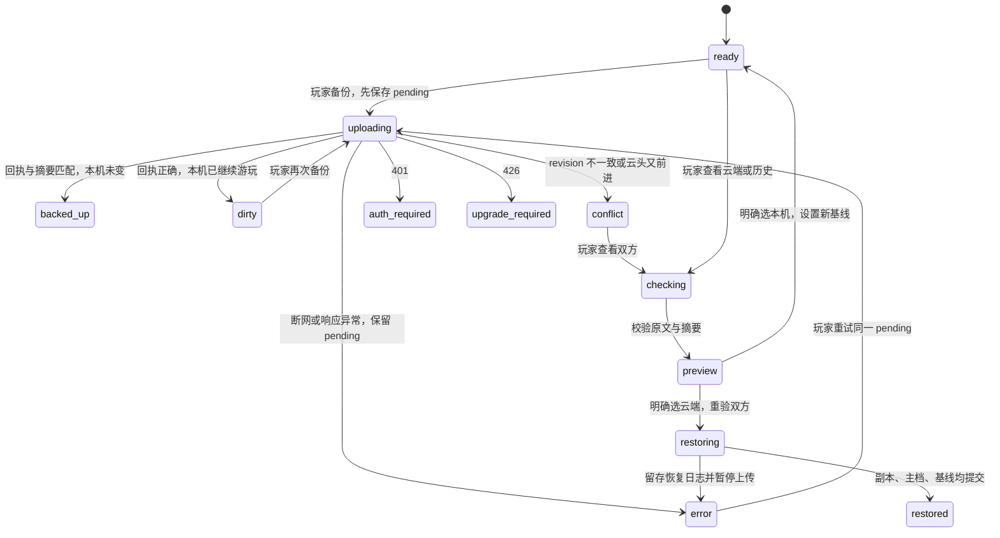

# 账号云备份实施与微信小游戏评估

核实日期：2026-10-08。负责人：[工程与维护](../engineering.md)，执行状态：[当前计划](../plan.md)。这是开发环境交付，**没有部署云服务、购买资源、修改生产数据库、提交微信审核或移植完整 UI**。

本轮承接 [此前审计](cloud-save-design.md)，采用用户后续确认的 **本地自动存档为主，云端手动备份／恢复**。首次支付不得超过 50 元，全年成本小于 50 元。本文的实施合同取代旧报告中自动上传、会话刷新、分层历史保留等未实施设想；旧报告的字段审计和服务比较继续作为依据。

## 1. 结论与验证边界

| 层级 | 当前结果 | 证据／限制 |
|---|---|---|
| 存档与游戏规则回归 | 707 项通过，包括新增云存档相关 9 项 | [最终日志](../../artifacts/cloud-implementation/all-tests-final.log)；首次沙箱运行有 4 项路径权限失败，放开项目测试目录权限后复跑通过；另复核六份黄金历史原档经云端原文往返 |
| Web 与服务端联调 | 通过 | [浏览器记录](../../artifacts/cloud-implementation/browser.json)：隔离 Edge、真实 HTTP、真实本机 SQLite，两个独立浏览器上下文；另用隔离磁盘 profile 实际关闭、重启浏览器并刷新，游客／账号进度保留；不是网络接口 mock |
| Cloudflare 运行时 | 本机 workerd + Miniflare D1 通过 | [记录](../../artifacts/cloud-implementation/workerd.json)：scrypt、D1 条件写入、重试、冲突、账号隔离；不是部署到 Cloudflare |
| 微信兼容性原型 | 实际执行共享规则和 Canvas，存档往返通过 | [记录](../../artifacts/wechat-probe/runtime.json)、[画面](../../artifacts/wechat-probe/canvas-browser.png)；wx API 明确由测试替身提供 |
| 微信开发者工具／微信真机 | **未验证** | 未获得可用 AppID／开发者工具路径；本机常见安装位置未找到工具。不能称为微信环境验收通过 |
| 国内真实玩家网络、移动端浏览器、Cloudflare 免费档 CPU | **未验证** | 需测试云环境与玩家实际设备 |
| 正式环境 | **未启用** | 客户端云地址为空，Worker 开关关闭，D1 ID 为占位值 |

可立即在本机运行完整账号／手动云备份流程；尚不能让不同地点的玩家使用线上云存档。步骤见 [服务运行说明](../../cloud/README.md)。现有单机玩法继续沿用原存档事务。

## 2. 对真实项目的增量审计

### 架构、构建与耦合

当前 [发行配置](../../android/release.json) 是 **1.5.19 / code 35**；此前 10 月 7 日报告记录的 1.5.18 是当时基线。当前存档仍为 schema 6、内容修订 `regional-1`，241 种伙伴、83 种材料。本轮不改发行版本、不重生成角色资料。

- Web 是原生 ES 模块，入口为 `web/index.html → boot.js → app.js`，没有 React/Vue 或完整游戏引擎；用 `node server.mjs` 启动静态开发服务，正式 Web 无打包依赖。
- 厨房、农场等使用 Canvas；详情、图鉴、订单、设置等大量使用 HTML/CSS/SVG、DOM 事件和滚动布局。`app.js` 同时协调绘制、输入、生命周期、业务命令，不能直接搬到无 DOM 环境。
- `engine.js`、`game-commands.js`、`progression.js`、`exploration.js`、营业／订单／常客规则及生成内容可脱离 UI 复用。原型实际打包 56 个依赖模块并在无 DOM 全局对象的运行环境执行。
- Android 是 Java WebView 壳，构建沿 HTML/import 图收集资源；主存档经过原生桥，不是浏览器 localStorage。新账号入口仅在普通 Web 启用；Android 和 review 分支仍走原路径。
- 本轮新增 `cloud/` 的开发工具依赖锁定在独立 package-lock；不把 Wrangler、SQLite 或服务端密码代码带进浏览器。

### 主档、保存时机与迁移

完整字段表见 [原审计第 2 节](cloud-save-design.md#2-当前工程事实与存档审计)。本轮对接的原入口是 `createSaveStore`，并未另写一套游戏保存器。

| 项目 | 真实行为及本轮处理 |
|---|---|
| 游客主档 | `localStorage['chick-kitchen-v1']`；保留原键，注册仅复制，不移动或删除 |
| 账号主档 | 新增 `chick-kitchen-v1.account.<uid>`；当前账号指针独立保存；账号之间不共用主档 |
| 自动保存 | 经济命令提交立即持久化，约 60 秒时间检查点，暂停／隐藏尝试刷出；仍保持“保存成功才接受新状态” |
| 本地恢复点 | 原有 `.previous`、`.pre-import`、`.pre-upgrade-vN`、`.unreadable`；云恢复额外保存 `.cloud-before-restore` |
| 导入导出 | 原设置入口继续工作，作用于当前游客或账号主档。整档替换前确认并留存原档 |
| 多标签 | 复用原 `navigator.locks` 单写者规则，账号切换也要求当前窗口可写；不支持该能力时仍按原合同只读 |
| 版本 | 复用 v1→v6 逐级迁移和严格校验；游戏版本、存档 schema、本地事务 revision、云 revision 分开 |
| 损坏／未知版本 | 拒绝写入，不把解析失败当新玩家；未知账号指针也停止切换，不猜测归属 |
| 多来源 | 普通 Web、Android 私有目录、review、classic-review、本机账号分支是不同来源；不会自动合并 |

地区伙伴使用稳定 ID，地区保底／发现／试做记录在 `expansion`；寻访队伍、冻结奖励与已处理位在 `progress.trip`；新营业与订单在 `expansion.business/orders`，常客关系和阅读／触发基线在 `expansion.regulars`。本轮未找到独立命名为“羁绊”的第二套存储系统，不能凭玩法名称新增空字段。新增线索追踪、订单情报仍是 `progress.knowledge` 的已有结构。云端保存 **整份经校验的 JSON 原文**，不会仅提取 CP 和图鉴数量而漏掉这些进度。

浏览器刷新保留同源存档；换域名／端口／浏览器、清理网站数据、隐私窗口退出和设备损坏可能使本地副本不可用。现有自动保存和云功能不能保证这些情况下零丢失：**没有手动上传的进度只能靠本机或用户导出的备份恢复**。离线游玩指已加载游戏中的断网操作；本项目尚未新增 Service Worker，普通 Web 断网冷启动不在本轮保证范围。

## 3. 服务选型、价格与预算

### 官方额度与实际适用性

以下 Cloudflare 数值于 2026-10-08 核实；是额度，不是大陆可用性承诺。

| 服务 | 官方免费额度／限制 | 本项目判断 |
|---|---|---|
| Workers Free | 每日 100,000 请求；每请求 10ms CPU；128MB 内存 | 低频请求量够用，密码散列的 CPU 是必须实测的阻断条件。[限制](https://developers.cloudflare.com/workers/platform/limits/) |
| Workers Paid | 起价 5 美元／月 | 超出全年 50 元预算；不作为自动升级路径。[定价](https://developers.cloudflare.com/workers/platform/pricing/) |
| D1 Free | 每日读 500 万行、写 10 万行，账号 5GB | 约十人整档足够；索引维护也计写入，失败请求的限速更新也计费额。[定价](https://developers.cloudflare.com/d1/platform/pricing/) |
| D1 单库／恢复 | Free 单库 500MB；单行 2,000,000 字节；Time Travel 7 天 | 账号总 5GB 不能当作一个库的容量；本应用云档上限 512KiB。[限制](https://developers.cloudflare.com/d1/platform/limits/)、[恢复](https://developers.cloudflare.com/d1/reference/time-travel/) |
| R2 Standard | 每月 10GB-month、100 万次 A 类、1000 万次 B 类；出站流量免费 | 当前存档不用 R2。其免费额度不覆盖所有存储类别；开通有订阅结算流程，超额可计费。[定价](https://developers.cloudflare.com/r2/pricing/)、[开通](https://developers.cloudflare.com/r2/get-started/) |

Cloudflare 的中国网络是 Enterprise 额外订阅，不包含在普通免费 Workers 中；也不能假设全球所有产品在中国网络均有同等功能。[中国网络官方说明](https://developers.cloudflare.com/china-network/)

因此 **Workers + D1 被选为本轮可移植代码与封闭测试目标，不是已经验证的大陆长期稳定托管方案**。即使十人流量很低，跨境链路、运营商、默认域名可达性、账户风控、免费额度耗尽仍会影响可用性。本轮未做真实玩家大陆多网测试。

密码代码使用 Node `scrypt(N=32768,r=8,p=3)`、随机盐和恒定时间比较；这是 OWASP 列出的内存／CPU 组合之一。Cloudflare 当前文档支持 Node crypto 的 scrypt；本机 workerd 实际注册通过，墙钟约 167ms，但 **墙钟不是 CPU 计费时长，也不是免费档线上通过证明**。线上若超限，先停止开放，选择其他运行环境或调整预算，不降低散列成本。[OWASP](https://cheatsheetseries.owasp.org/cheatsheets/Password_Storage_Cheat_Sheet.html)、[Cloudflare crypto](https://developers.cloudflare.com/workers/runtime-apis/nodejs/crypto/)

### 替代方案，承接上轮结果

| 方案 | 成本与可靠性结论 | 本轮位置 |
|---|---|---|
| 腾讯 CloudBase 国内地域 | 国内部署更符合访问方向；免费体验有续期条件，不能承诺永久。上轮核实个人版优惠 19.9 元／月，全年约 238.8 元，超预算 | 国内候选，尚无适配实现；保留 [定价](https://cloudbase.cloud.tencent.com/pricing)、[体验资源规则](https://cloud.tencent.com/document/product/876/127357) 依据，开通时重新核价 |
| uniCloud 支付宝按量 | 上轮核实需 200 元保证金；即使可退也超过首次支付限制 | 排除，不再申请。[官方计费](https://doc.dcloud.net.cn/uniCloud/price.html#balance) |
| Bmob、LeanCloud 等 | 上轮已检查；旧免费限制、服务生命周期不能替代持续运营保证 | 不重复开账号或凭旧教程换后端；详情见原报告 |
| 已有可信服务器运行 Node + SQLite | 代码可复用；如果已经有机器及合规访问入口，增量费用可能低；新买服务器的续费、HTTPS、备份和维护另算 | 没有确认用户有此资源，不能将它计作“免费稳定” |
| 本地导出／导入 | 零托管费用，不依赖服务器 | 始终保留；不足以等同自动跨设备服务 |

目前仍未找到已验证同时满足“首次 ≤50 元、全年 <50 元、大陆长期稳定、无续期条件”的托管服务。手动上传显著降低流量与冲突频率，但不会消除网络和密码运行时限制。

### 十人用量测算

按 30 天、每份 64KiB 规划（不是宣称所有玩家实测都等于 64KiB）：

| 每人每日手动备份 | 全体月上传次数 | 原始上传量 |
|---|---:|---:|
| 1 次 | 300 | 18.75MiB |
| 3 次 | 900 | 56.25MiB |
| 10 次 | 3,000 | 187.5MiB |

10 人 × 21 份 × 64KiB ≈ 13.13MiB 原始历史数据；按上限 512KiB 则约 105MiB，另加索引和其他表。请求、预览、限速、认证产生的行操作另算。容量不是首要风险；密码 CPU、恶意请求造成拒绝服务、免费额度可用性更关键。

应用设置了全局每日 3,000 次计数上限、每分钟 600 次；IP 每分钟 100 次；认证每 IP／用户名 10 分钟 8 次；账号每分钟 60 次；反馈每 IP 每天 3 次、全局每天 50 次。这是基础保护，**不是费用绝对上限或 DDoS 防护**：被拒请求仍可能消耗入口请求和一个限速计数写入。保持免费套餐、不开 R2、不自动升级；平台额度耗尽时云端失败，本地继续保存。

## 4. 已实现的账号与存档合同

实现：[客户端](../../web/cloud-client.js)、[账号分支](../../web/cloud-profiles.js)、[界面](../../web/cloud-ui.js)、[服务](../../cloud/service.mjs)、[数据库](../../cloud/schema.sql)。机器可读接口：[OpenAPI](../../cloud/openapi.json)。

### 身份与持久化模型

服务端随机 UID 是跨平台身份；用户名只是登录名。数据库中的 `users` 保存用户名与密码哈希，`sessions` 只保存会话 token 的 SHA-256，`saves` 是不可变版本列表。当前档是该 UID 的最大 revision，不另维护可能与历史写入不同步的 current 指针。

每条云记录含 UID、云 revision、上传 UUID、原始 JSON、服务端 SHA-256、schema、服务端时间。`CLOUD_EPOCH` 独立于数据库配置，代表整个云库世代。数据库灾备恢复／迁移后必须换 epoch，防止客户端用灾前 revision 静默接续灾后旧库。

客户端账号主档旁保存云基线、epoch、最近回执及待确认上传。待确认记录固定 `raw + expectedRevision + epoch + uploadId`，先落盘再发请求；网络断开后只在玩家再次点击时重试。游戏继续产生新进度时，不偷偷改变该次上传的内容。

### 操作与结果

| 情景 | 已实现行为 |
|---|---|
| 游客首次注册 | 先刷出游戏待保存操作，服务端注册成功后将游客原文复制到新 UID 分支并回读，再切账号指针；游客原档保留；不自动上传 |
| 注册已成功但回执丢失 | 不删除游客档；可用同一用户名登录。登录已有账号不会自动复制游客分支，需退出账号导出游客档，再登录后导入并预览云端选择；此少见路径尚未做快捷引导 |
| 登录另一设备 | 打开该 UID 的本机分支；若没有副本，显示新建本机状态。玩家点“查看云端并恢复”确认后恢复。仅登录不会把新档上传或覆盖云端 |
| 断网游玩 | 原本地事务仍运行；云失败不改主档。联网不会偷偷同步，需手动重试 |
| 两设备并行 | 上传必须携带最后确认的云 revision；SQL 在一条语句内比较最大 revision 后插入，只有一台成功，另一台 409 |
| 收到 409 | 查看双方摘要，明确选云端或本机；不比较设备时间，不叠加 CP／材料／奖励，不自动“取较大值” |
| 云端恢复 | 预览时冻结本机原文；应用前再次检查本机未变、云头未变；保存本机恢复前副本，写恢复日志，经原 saveStore 导入再确认基线 |
| 恢复中途本地写失败 | 保留副本与未确认恢复标志，暂停后续上传，避免重放恢复前旧快照；重新检查／恢复或导出排障 |
| 上传回执丢失 | 同 UID、同 UUID、同内容返回此前版本；不会产生新奖励或重复云版本；如云头又前进，提示冲突 |
| 旧版本游戏 | 服务端／客户端严格校验；未来 schema 返回 426 或拒绝解析；旧客户端不能覆盖服务端已识别的更新 schema |
| 云历史 | 当前 + 最近 20 份，数据库插入触发器同事务清理；历史恢复到本地后，下一次备份产生新 revision |
| 退出账号 | 刷本机盘、尝试撤销会话、清当前会话与指针、回游客档；账号本机副本保留。离线撤销无法联系服务端时原 token 等待过期 |

历史规则有意简化为“最近 20 份”，**未实现上轮规划的每日／迁移专用槽**；频繁手动上传会缩短可回溯时长。当前保存的完整状态包含奖励处理位，恢复不会将两支收益相加；但这是可导入、可离线回滚的单机游戏，不提供服务器权威防作弊或跨分支全球唯一奖励保证。

### 明确的同步状态机

图示名称便于阅读；源码使用 `backed-up/auth-required/upgrade-required` 等连字符值。状态由操作结果和持久化元数据共同决定；不运行后台自动同步循环。

### API 与安全边界

所有路径以 `/v1` 开头。注册／登录 POST 返回会话；GET `saves/current` 获取当前档；POST `saves` 条件上传；GET `saves/history` 游标分页，GET `saves/history/{revision}` 查看单份；DELETE `sessions/current` 撤销；DELETE `account` 重新核验密码并级联删除；POST `feedback` 收件。详见 OpenAPI 的请求字段与错误码。

- 用户名 3–24 位 ASCII 字母数字／下划线，归一小写；密码 10–128 字符。仅允许服务端登记的用户名注册，普通玩家仍用用户名密码。
- 密码不明文入库；会话 32 随机字节、24 小时有效、最多 5 个，数据库只留哈希。网页 token 放当前标签页的 sessionStorage，绑定 endpoint 与 UID；没有管理员密钥、刷新 token 或自动续期。前端出现 XSS 仍可能泄露该标签页会话，不能把 sessionStorage 当 HttpOnly 保险箱。
- 服务端从 token 推导 UID，忽略客户端伪造 UID；所有存档查询包含 UID 条件。SQL 参数化，账号不能枚举或写其他玩家版本；普通客户端没有直连 D1 权限。
- 云地址必须 HTTPS，只有 loopback 开发允许 HTTP。CORS 精确匹配一个配置的 Web origin；无 Origin 的原生请求仍须 bearer 认证。CORS 本身不是身份认证。
- 流式限制请求 600KiB，原始云档 512KiB；本地仍支持 2MiB，不截断、压坏或清空超限档。结构／范围／业务交叉校验复用游戏校验器；完整合法但被玩家编辑的单机档不等于可识别作弊。
- 服务器响应 `no-store`，错误带 requestId；不记录密码、token、完整存档或反馈正文。尚无独立运维告警平台。
- 无邮箱注册没有邮箱找回。**管理员身份核验、一次性恢复码／密码重置流程尚未实施**；熟人核对也不得只凭用户名。开放真实账号前必须补齐或明确告知无找回能力，不能承诺任何人忘记密码都能恢复。
- 账号删除 API 已测试，界面尚无删除按钮；不自动删除本机导出文件。匿名反馈与账号无关联，无法靠删账号定位，需用反馈编号申请删除。
- 反馈只有玩家主动填写的 20–2000 字内容和随机编号，保留本地草稿，失败需手动重试，不上传存档／诊断／联系方式。管理端暂用有权限的数据库控制台查看，尚无工单后台和自动回复。
- 每日维护任务清理过期会话、限速行和超过 90 天反馈；任务延迟／服务停用会推迟清理，恢复后补跑。账号及云档保留到用户删除；D1 Time Travel 或管理员离线备份不会随当前行瞬间消失，须在隐私说明列出实际保留期。

### 灾备和后续更新：设计与待完成项

D1 历史版本不能替代独立备份。建议测试通过后，管理员每周导出数据库到受限、加密的离线介质，保留滚动 4 周；**尚未设置自动任务、执行真实云导出或完成恢复演练**。数据库包含密码哈希，不能放公共仓库或普通截图。删除请求需要维护删除清单，灾备恢复时再次执行删除，不能让已删账号复活。

恢复顺序：停上传 → 保全现库 → 从快照恢复到隔离库 → 校验 UID、hash、schema、记录数 → 换 `CLOUD_EPOCH` → 撤销会话 → 测试恢复 → 再启用。客户端发现 epoch 变化须重新登录、查看双方进度。上线前必须演练这个流程。

升级顺序：先发布向后兼容的服务端校验器与迁移测试，再发布客户端；结构或语义不兼容时升级 schema，保留黄金原档。数据库表变更另用编号 SQL 迁移，不修改游戏 schema 冒充数据库迁移。未来仅改内容而不升 schema 时，也必须让服务端认识新内容修订再开放上传。尚未实现单独的 `minReaderBuild/minWriterBuild` 配置接口。

## 5. 微信小游戏发布资质：已核实与未核实

### 关键结论

**本轮不能确认“个人主体、完全免费、无内购”即可正式公开发布本游戏。** 免费不自动等于无需网络游戏出版审批；能创建 AppID、能预览与能正式发布是不同问题。当前原作授权未落实，是本项目独立于技术路线的发布前提。

官方微信文档页面本轮读取失败，浏览器访问又被站点安全策略阻止，未绕过。没有登录该游戏管理后台查看主体准入与资质页面。因此，个人主体当前是否开放本类游戏、认证具体费用、无内购分类材料和平台是否存在特殊通道，均明确列为 **待后台核验**；没有用第三方“个人 30 元／企业 300 元”等教程数字冒充现行官方价格。

### 主管部门一手依据（2026-10-08 核实）

| 事项 | 官方依据与可得结论 |
|---|---|
| APP／小程序备案 | 工信部《关于开展移动互联网应用程序备案工作的通知》明确将小程序、快应用纳入管理；应备案后提供服务，完整准确材料的审核有办理时限要求。备案不是版号。[工信部通知](https://wap.miit.gov.cn/jgsj/xgj/wjfb/art/2023/art_dd783a581c9644a4aee10afa582811db.html) |
| 自然人能否备案 | 官方备案材料包含自然人身份证件、主体负责人材料；“自然人可提交备案材料”不能推出“自然人获得所有网络游戏出版／运营资格”。[西藏通信管理局办事指南](https://xzca.miit.gov.cn/bsfw/bszn/art/2024/art_5d3cc7f452c04fdd97b6881a20b656f9.html) |
| 游戏出版审批 | 《网络出版服务管理规定》第 27 条规定网络游戏上网出版审批；条文未给出“免费无内购一律免审批”的通用豁免。[国家新闻出版署](https://www.nppa.gov.cn/xxgk/fdzdgknr/zcfg_210/bmgz_213/202112/t20211209_442163.html) |
| 国产游戏申报主体和材料 | 官方审批事项要求有相应网络游戏出版资质的出版单位等条件，并列运营机构电信资质、权利证明及内容材料。版权证明可包含登记证、公证或相关声明，不能一概把软著证当作唯一法定证明，也不能把取得软著等同获得版号。[国产网络游戏审批](https://www.nppa.gov.cn/bsfw/xksx/cbfxl/wlcbfwspsx/202210/t20221013_600725.html) |
| 休闲移动游戏 | 2016 年移动游戏出版通知对部分简单休闲类型规定简化申报路径；简化不等于免审批，也不能只凭“轻量”把本项目剧情、经营、收集内容归入该范围。[官方通知](https://www.nppa.gov.cn/xxgk/fdzdgknr/zcfg_210/gfxwj_215/201606/t20160602_4684.html) |
| 境外权利来源 | 本项目已有原作权利联系材料指向台湾制作团队；如果使用其游戏版权，须核实适用审批类别，不能因为新增 JS 就直接认定全游戏为自主国产作品。[境外著作权人授权游戏审批事项](https://www.nppa.gov.cn/bsfw/xksx/cbfxl/wlcbfwspsx/202210/t20221013_600723.html) |
| 未成年人和实名 | 2021 年通知规定网络游戏实名要求及未成年人周五、周六、周日和法定节假日 20–21 时服务时段。本地单机测试账号不是正式网络游戏实名方案；微信登录也不能自行等同完成防沉迷接入。[官方通知](https://www.nppa.gov.cn/xxfb/tzgs/202108/t20210830_666285.html) |

平台接入是否代办实名／时长控制，必须按当前小游戏后台能力核实并真机验证；不要为满足调研自行收集身份证照片。隐私说明至少列出用户名、密码哈希、游戏进度、会话、反馈、处理目的、云服务方、存储地域、保留期、删除与联系渠道；处理未满 14 周岁个人信息还需监护人同意及专门规则。跨境云存储与正式上线的数据处理条件需另行核验，不能以“只有十人”直接省略。[《个人信息保护法》](https://www.cac.gov.cn/2021-08/20/c_1631050028355286.htm)

### 微信后台待核验清单

| 用户要求的项目 | 当前可交付判断／下一步 |
|---|---|
| 个人能否注册、能否发布及限制 | **本轮未核实到可据以承诺的现行平台规则**。用本人主体在官方注册页／后台核对“小游戏”类目，记录可选主体、准入条件和官方客服答复；注册通过仍不等于正式发布通过 |
| 小游戏与普通小程序 | 技术载体不同；小游戏为 JS、Canvas/WebGL 与 wx 游戏 API，小程序通常 WXML/WXSS 组件体系。不能将游戏包装成普通小程序网页来规避游戏类目和资质 |
| 注册和认证费用 | 不能给出已核实的当前金额；以官方注册／认证付款页为准，先记录、不付款。费用与账号云服务预算分开核算；首次总支付限制仍有效 |
| 游戏备案流程 | 在管理后台准备主体／负责人、服务名称与内容、接入信息，按平台入口提交备案，经校验及通信管理部门审核后展示备案信息；具体后台表单待确认。APP 备案与出版审批分别检查 |
| 软件著作权、授权书等 | 准备代码与美术／音乐权利链；平台是否要求同名软著、授权链格式与主体一致性待确认。项目当前 [授权准备目录](../permission-request/README.md) 明示未获授权，不得用“免费”替代许可 |
| 免费、无内购、版号 | 已核实主管部门规定不能支持通用豁免结论；要求平台确认本游戏公开上线需要的出版批准文件及主体。未确认前仅开发测试，不承诺正式公开 |
| 开发版、体验版、正式版 | 本轮把本机调试／受邀测试／审核后公开发布分层管理；开发／体验不视为发布许可，也不用于绕过审核扩散。当前名额、有效期和功能差异待官方后台核验 |
| 首次审核与更新 | 预留首次审核、代码和内容版本更新审核；不假设资源热更新可绕过内容审核。现行审核清单、时长和免审边界待后台核验 |
| 广告、支付、虚拟道具 | 第一阶段全部关闭；个人主体是否可接激励广告、收入结算、虚拟支付及 iOS 限制分别核实，不能从“可开发”推断“可收款” |
| 隐私与未成年人 | 上线前配置平台隐私保护指引、必要权限说明、实名／防沉迷流程及数据删除入口；当前仅备份用用户名密码不是完整发布合规功能 |

因此“个人开发者目前能否满足正式发布要求”的项目结论是：**当前材料与验证不足，尚不具备已确认可正式上线的条件**。这不等于断言所有个人小游戏都不能上线，而是不能对本游戏作未经官方核实的承诺。

## 6. 技术路线、复用与工程量

### 不能原样运行的具体原因

入口 `boot.js` 直接使用 `window/document/localStorage`，还检查 `HTMLDialogElement`、`HTMLElement.inert`、CSS `:has`、PointerEvent 等浏览器能力；`app.js` 和大量 `*-ui.js` 生成 innerHTML、查询元素并绑定事件；`ui-kit*.css` 依赖布局、滚动和皮肤。微信小游戏适配器不提供完整 HTML/CSS 浏览器。

Web 的 PNG/WebP、配色、字体设计、音效、Canvas 绘图规则原则上可复用，但需分别验证解码、字体装载和资源许可。需要重建的是 DOM 页面布局／交互适配，不能说现有视觉图稿必须全部重做，也不能声称一键导出即可保持全部 UI。

| 路线 | 复用／维护方式 | 初步工作量和风险 |
|---|---|---|
| **A：原生小游戏 Canvas + 薄平台层，逐页增量迁移（推荐验证）** | 保留 `web/` 正式 UI；共享 engine／commands／content／save schema；新增小游戏 renderer、输入、资源、存储／网络适配。厨房 Canvas 优先验证，DOM 页逐个实现 | 完整可测版本约 **25–45 人日**；加低端机、审核整改缓冲约 6–10 周单人。文字排版、图鉴长列表、输入与触控是主要风险；原型已证明共享规则可运行，不证明完整画面性能 |
| B：小游戏 Canvas 渲染框架 + 共享规则 | 用适配微信的轻量场景／布局能力管理页面；规则仍从当前模块导入，不复制业务。微信官方 canvas-engine 可作布局参考，但其开放数据域用途不能被当作完整 DOM 引擎 | 约 30–50 人日；需先验证字体、滚动列表、命中和适配层兼容。框架能减少部分 UI 工作，却增加版本和运行时依赖 |
| C：Cocos Creator 展示层 + JS 规则桥 | 保留纯 JS 规则与内容；重搭场景、组件、资源管理和页面。Web 先继续旧入口，不同步迁入引擎 | 约 45–70 人日；编辑器与微信导出链成熟，但当前 UI、事件与场景要大幅重接，两套表现层长期维护成本最高；目前不推荐直接启动 |

这些是熟悉本项目的一名开发者、无新增玩法、已有可用美术与授权材料的工程估算，不含注册、备案、审批等待或重新制作全部授权素材。先用 2–4 人日完成真机技术验证，再根据图鉴复杂页样例校准，而不是将估算当作承诺排期。

参考一手技术资料：[微信官方小游戏示例](https://github.com/wechat-miniprogram/minigame-demo)、[微信官方 Canvas 布局引擎](https://github.com/wechat-miniprogram/minigame-canvas-engine)、[Cocos Creator 微信发布说明](https://docs.cocos.com/creator/3.8/manual/zh/editor/publish/publish-wechatgame.html)。普通 WebView 包装不是本次可行的“微信小游戏”路线。

### 分阶段共用代码

不先搬目录或抽空 `app.js`。按可验收的功能切面接入：同一规则模块 → 平台接口 → 两端不同的视图。平台层只负责 storage、HTTP、时钟／生命周期、图片、字体、音频、输入和身份；服务器和两端使用同一游戏校验与迁移代码。角色、配方、地区等内容继续同一生成入口与稳定 ID，不手工复制两套 JSON。

Web 的 `fetch/localStorage/Audio/Image/requestAnimationFrame` 分别接为 `wx.request`、小游戏存储／文件接口、音频上下文、canvas 图片、帧循环；不把用户代理判断散落到每个业务规则。小游戏输入框可调用平台键盘，表单重建不影响 Web 原表单。生命周期以已完成事务为主，`onHide` 是补充保存，不能依赖“退出前一定运行”。

资源采取首屏小包、按页面分包／按需下载、缓存版本号与离线降级。当前纯规则原型未压缩 JS 为 **1,819,585 字节（约 1.74MiB）**，不含现有全套美术／音乐，不能据此宣布正式包体合格。当前微信主包、分包、缓存上限的准确数字未能从官方页面核实，必须在真实开发工具上传校验；工程先以首包 <4MiB 作为内部保守目标，**不是将其宣称为 2026 年官方上限**。

图片分辨率、atlas、中文字体子集、短音效与背景音乐分别量测；不能把原 APK 全资源塞首包。按安全区与宽高比布局，DPR 设置上限，坐标与触摸共用变换；图鉴长列表虚拟化、减少大透明层和逐帧文本测量。需覆盖 Android／iOS、中低端机、刘海屏、后台杀进程、音频中断与网络恢复。当前原型未验证这些性能与兼容性。

### 微信身份与账号绑定（仅设计）

`wx.login` 得到的一次性 code 交服务端，AppSecret 仅保存在服务端受保护配置，服务端换取该应用下的身份。新增 `identities(provider,appId,subject) → uid` 唯一映射；`openid` 不是通用 UID，`unionid` 也不能假设所有玩家都有。

已有用户名账号玩家先登录，明确点“绑定微信”，同时证明当前微信身份与既有账号控制权，再用单次短期绑定票据完成映射。微信身份已属于别的 UID 时拒绝自动合并；如两边都有进度，先保存双方副本再人工选择整档，不能叠加奖励。解绑需再认证且保留至少一个可用登录方式。本轮没有接入微信登录、AppSecret、身份绑定表或跨平台实机同步。

## 7. 最小原型与实际证据

原型位于 [experiments/wechat](../../experiments/wechat/README.md)，独立存储键和入口，不加载正式 UI，也不写真实玩家主档。

已运行：真实规则开 24 枚蛋 → 按原型测试按钮推进时间 → 收取 CP 从 600 到 624 → 再收取不重复加奖励 → 通过 wx 存储适配器读回 → 第二个隔离运行实例读回一致。Node VM 中没有 DOM、window、localStorage、fetch，补充 JSON 状态 clone 与 UTF-8 编码适配；另在浏览器真实 Canvas 上点击原型按钮并截图。

这提供了**实际执行证据**，而不是只看文档推断规则可复用；wx 存储与触摸 API 是模拟的，所以仍**不满足微信真实环境验收**。开发者工具、微信手机、资源加载、网络登录、完整画面与性能均留为明确待验项，不以本机通过代替。

真实验证流程：安装官方微信开发者工具 → 使用用户自己的小游戏 AppID 打开隔离项目 → 构建并编译 → 检查 API／包体报错 → 扫码到有体验权限的手机 → 开锅／收取／重启读档 → 核对记录和截图 → 再做一个图鉴长列表、音频和 HTTPS 请求样例。测试域名校验关闭只能用于调试，不能当正式域名配置通过。不要提交审核或付款。

## 8. 下一阶段计划与交付清单

### 必须做：开放真实云账号之前

1. 用户自行注册／登录 Cloudflare 免费账号，通过官方授权方式连接；只提供公开 endpoint、测试 D1 ID／允许的 Web origin 等非秘密配置，不在聊天粘贴密码、管理 token 或 AppSecret。
2. 在独立测试环境验证 scrypt 的实际 CPU 与错误率、D1 条件写、Cron 清理；不行就停，不购买套餐或削弱安全参数。
3. 从玩家电信／联通／移动、Wi-Fi／蜂窝实际网络测试登录、上传、恢复与断网重试。连续多天记录成功率／延迟，预定可接受标准（建议正常网络操作成功率 ≥99%、P95 ≤5 秒，作为项目验收目标，不是厂商承诺）。
4. 补账号找回／密码重置及删除 UI，确认隐私说明；完成独立备份／恢复演练和正式资源预算防护，再决定是否开放十人内测。
5. 新 schema 发布时同时更新服务端校验器、两端迁移 fixtures；任何更新先导出旧玩家副本，保持 origin／UID／账号键不变。

### 必须做：微信完整移植之前

1. 核实原作及全部使用素材授权；本人进入微信后台核对个人主体、当前费用、备案、出版／软著要求与免费游戏类目条件，保存官方结果。
2. 在微信开发者工具和至少 Android、iOS 各一台手机跑本原型，记录系统／基础库版本、CP、存档哈希、重启恢复与 API 报错。
3. 用一个图鉴列表和现有厨房 Canvas 的最小场景验证字体、资源和性能，再确定 A 或 B 路线及排期。

### 建议与可暂缓

建议：云备份页显示最近回执时间、注册回执丢失的游客迁移快捷引导、恢复前本地副本导出入口、更细的异常统计、已知设备会话列表。可暂缓：自动后台同步、实时合并、排行榜、支付、广告、社交、R2、完整后台网站、统一引擎迁移。

### 文件与完成程度

| 交付 | 位置与状态 |
|---|---|
| 架构与存档审计 | 原报告第 2 节 + 本文第 2 节；已完成代码核对 |
| 云选型／价格／局限 | 本文第 3 节；官方额度已核实，真实国内网络未验证 |
| 账号、API、状态机与恢复 | 本文第 4 节、`cloud/openapi.json`；主要测试实现完成，找回与运维部分为设计 |
| Web 改造 | 修改 `app.js`、`settings-ui.js`、`settings-ui.css`；新增 `cloud-client/config/profiles/ui.js`；保留原经济逻辑与视觉皮肤 |
| 后端及配置 | `cloud/service/password/worker/local-database/dev-server/verify-worker.mjs`、SQL、Wrangler 模板、依赖锁文件；仅开发和本机验证 |
| 测试与 UI 证据 | `tests/cloud-*.test.mjs`、`tools/qa-cloud-save.mjs`、`artifacts/cloud-implementation`；707 项回归及真实本机联调通过 |
| 微信资质 | 本文第 5 节；主管部门依据完成，当前微信平台个人主体／费用／材料未核实完，不承诺上线 |
| 微信路线与原型 | 本文第 6–7 节、`experiments/wechat`、`artifacts/wechat-probe`；核心兼容实验完成，真实微信未验 |

当前最值得做的一件事：**在用户授权的 Cloudflare 免费测试账号上完成一次真实环境验证，优先测密码 CPU 与国内可达性**。这能最早决定云备份是否能在现有预算内提供给玩家；微信完整移植等真实原型与发布资格确认后再投入。
