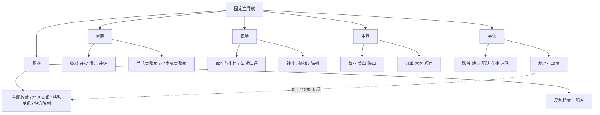
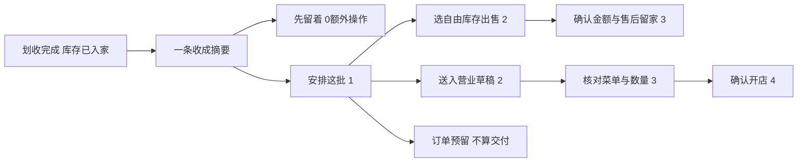
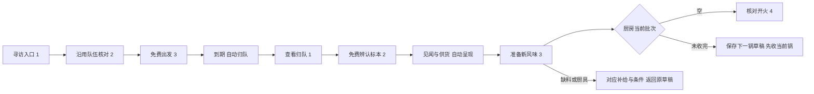

# 鸡宝厨房：整体 UI 信息架构与交互设计

设计日期：2026-09-22；交付核对：2026-09-23。状态：**下一阶段完整设计提案，未接入游戏；原型仅使用独立示例数据。**

读者是系统策划、UI／美术、内容作者及后续开发者。读完应能把一个新功能放到确定的位置，完成页面与返回关系设计，并按本文件逐条验收四个核心操作流。本阶段不修改生产、经济、存档或正式美术，不发布游戏版本。

玩法依据：[下一阶段玩法与内容扩展](gameplay-expansion-design.md)。现行行为依据：[游戏设计](game-design.md)与实际界面。视觉与交互不变量继承[UI／美术规范](ui-ux.md)。**本提案有意替代旧规范中“四主导航”和“厨房三个成长快捷按钮”的未来布局建议；上线前当前四导航仍是实现事实。** 不覆盖原厨房空间关系、24枚蛋阵、留种与交易规则。

## 1. 阅读与视觉入口

- [设计展板与四条流程图](ui-architecture/index.html)：现状截图、导航结构、页面构成、紧凑屏与桌面对比。
- [可点击原型](ui-architecture/prototype.html)：默认营业准备，可切换五个主页面；左上“设计演示”可选四条完整流程和边界状态。直接双击 HTML 可用，所有示例操作仅存在当前页面内存中。
- [320×568 营业样板](ui-architecture/evidence/proposed-business-320.png)、[桌面样板](ui-architecture/evidence/proposed-business-desktop.png)：由原型实际渲染，不能当游戏已实现截图。
- [原型检查记录](ui-architecture/verification.json)：尺寸、关键流程、浏览器错误及检查范围；真机和新玩家理解测试另行进行。

下文示例金额、地区及新品工作名来自扩展方案或明确标注的演示状态，不冻结数值与最终命名。当前193种，下一阶段目标241种；不把未来数量写入现行版本的进度。

## 2. 当前界面审计

### 2.1 实际结构

| 层级 | 当前实现 | 主要承载 |
|---|---|---|
| 封面 | 开始游戏；冷启动停留，温恢复保留现场 | 进入游戏，不是离线领奖大厅 |
| 四个主导航 | 厨房／农场／图鉴／商店；设置在右上 | 两个场景与两种工具并列 |
| 厨房 | CP、厨房等级、清洁、调味料、鸡鸭蛋、24蛋阵、厨具、翻页 | 生产与照料；底部一个“手艺·生意·寻访”入口 |
| 成长大面板 | 手艺／生意／寻访三标签共享面板 | 30手艺草稿、三章采购、一队三路线 |
| 农场 | 横向生活场景、收成、修缮、神社、建筑快捷入口 | 观看伙伴、出售库存、特殊活动 |
| 图鉴 | 鸡／鸭、已发现筛选、九格分页、总数；手艺与配方册快捷入口 | 品种档案、观察、配方准备、单只出售 |
| 商店 | 厨具／调味料／鸭蛋等货架；材料详情和补货 | 设备与材料购买、部分内容入口 |
| 旁支 | 四时手记与寻宝日历、神社求签／签册／回礼、来信、时空旅行、设置／帮助／备份 | 跨图鉴、商店、农场多处可达 |

本次实际检查使用独立浏览器上下文的演示存档，截图见展板。读取了入口、场景布局、手艺、生意、寻访、收成、图鉴、配方、商店、日历、神社与设置模块；未打开真实玩家存档。实现证据定位见第15节。

### 2.2 问题与影响

| 问题 | 观察依据 | 新系统加入后的后果 | 设计响应 |
|---|---|---|---|
| 高频异步任务藏在成长入口 | 厨房入口先到手艺，再选生意或寻访 | 查营业／归队需要反复经过无关页 | 生意、寻访成为一级入口 |
| 页面职责混合 | 图鉴同时查永久记录、出售、进入手艺；农场收成另有批售 | 玩家难区分“已收录”和“当前能卖” | 图鉴负责知识；农场库存负责实物，档案只显示去向与深链 |
| 大面板兼作页面与弹窗 | 同一种带关闭叉的面板承载长列表、完整任务和局部详情 | 关闭、返回、切主导航含义模糊 | 完整页面用返回；临时选择才用关闭 |
| 相同概念多个入口缺统一归属 | 配方、观察、日历、神社从多个位置互跳 | 深链越多，越难回到原草稿 | 每个对象一个权威详情；跨页保留来源与草稿 |
| 320宽的信息预算已紧 | 寻访路线＋三人位＋收益摘要占满首屏；页内滚动承载其余信息 | 两种保护、标本、地点、带货无处加入 | 默认摘要，只展开当前决策；不缩字塞满 |
| “经营”语义尚不分层 | 经营手艺、经营奖励、生意订单相邻 | 容易把菜单当招牌、把经营次数当营业次数 | 手艺保留经营分支，生意页明确菜单／招牌／奖励次数三者 |
| 总收集比例占据注意力 | 图鉴先给总数与连续未知格 | 241格、24发现卡、主题实践成为欠账墙 | 总览先给一个置顶目标和两项可推进方向 |
| 已有规范与实际布局不完全一致 | 旧文档建议三个独立入口；实际仍是一个组合入口 | 仅看设计文档会错误判断基线 | 本文和展板分列事实与提案 |
| 画风新旧混用 | 运行厨房v7与用户要求的原作小幅清稿尚不一致 | 新UI容易把现代餐厅式管理板当美术基准 | 保留原作场景空间，纸册承载管理信息；不新增固定厨房设备 |

保留的优点：24枚连续划收、鲜明的厨房与农场场景、鸡鸭识别、独立厨具、暖纸色与粗棕轮廓、无期限三章采购、满包留篮、手艺先试配后应用。新架构应让这些体验更容易找到。

## 3. 总体决定：五个地方，一套对象

**一级导航固定为：厨房／农场／生意／寻访／图鉴。** 从早期到后期不再新增第六项。不做总任务大厅，不把玩家每次上线先送进报告页。

| 一级页面 | 玩家问题 | 二级结构 | 默认进入状态 |
|---|---|---|---|
| 厨房 | 这一锅怎么样，下一锅做什么？ | 场景；备料与开火；厨具与升级；手艺；小卖部；清洁 | 当前锅，保留选择与视野 |
| 农场 | 伙伴在哪里，哪些可以用？ | 场景；库存收成；留种／收藏锁／订单预留；陈列；神社；修缮 | 生活场景；库存为一击入口 |
| 生意 | 这批卖给谁，接下来做什么？ | 营业／订单／常客／项目；菜单选择和账单为所属子页 | 有未读结果时显示摘要，否则正在营业或备货 |
| 寻访 | 去哪里，带谁，能发现什么？ | 出发／地区／归队记录；路线与地点；配队；发现结果 | 在途卡、归队卡或上次准备方案 |
| 图鉴 | 已经认识什么，下一样想发现什么？ | 总览／品种／收藏／见闻；配方册、主题、地区记录、特殊发现、纪念物 | 上次子页；首次总览 |

“经营”是系统术语，主导航写“生意”，页面标题可写“营业准备”“生意簿”；不在导航中交替使用经营／营业／店铺三个同义入口。“订单”页包括旧三章采购与新情境采购，内容文案仍称采购。

### 3.1 为什么选五项

| 方案 | 好处 | 代价 | 决定 |
|---|---|---|---|
| 沿用四项，厨房再加营业等快捷 | 初期改动少 | 延续本次要解决的入口堆积，异步任务仍在二级 | 不采用 |
| 四项：厨房／生意／寻访／图鉴，农场并入厨房 | 底栏更松 | 农场场景降级，库存观看多一步，改变已有生活感 | 不采用 |
| 五项：厨房／农场／生意／寻访／图鉴 | 生产、实物、销售、外出、知识边界清楚；320宽每项64px | 商店少了底栏直达；需提供缺料直接补货 | **采用** |
| 六项或更多 | 每系统都可直达 | 320宽触区与标签拥挤，扩展仍无终点 | 不采用 |

五项均为两个汉字，不横滑底栏；图标不是唯一识别信息。厨房默认页不变，农场保留主入口。小卖部从厨房固定“补给”按钮一击到达，从缺料或缺厨具位置直接打开对应货架；不会先进入生意总览再找商店。

### 3.2 一个对象，一个归属

| 对象 | 权威页面 | 其他页面怎样引用 |
|---|---|---|
| 实物库存 | 农场→库存 | 备货／交付／配队用同一选择器，不复制库存账 |
| 品种身份与知识 | 图鉴→品种档案 | 新发现卡、配方、订单都深链到同一档案 |
| 菜单 | 生意→营业→菜单 | 主题页给“按此菜单备货”，不在收藏页直接开店 |
| 订单／常客故事 | 生意→订单／常客 | 账单只给摘要和去处理入口，图鉴只引用成果 |
| 地区 | 寻访→地区行动；图鉴→同一地区记录 | 行动视角先看路线与缺口；记录视角先看已得标本与见闻，共享内容身份 |
| 纪念物 | 图鉴→收藏→纪念物 | 农场陈列调用同一选择器；无第二份奖励 |
| 全局置顶目标 | 主题／地区／项目／常客共用1个目标位 | 生意与寻访只解释“本次能推进什么”；更换不丢原进度 |

“固定一个常客”与“置顶一个目标”共用目标位：置顶常客同时指定偏好故事线；换成主题时不再固定该常客，但历史进度保留。若以后需要独立经营偏好，应另行设计；本期不暗藏第二个追踪栏。

## 4. 页面、侧栏、卡片、弹窗的分工

完整页面承载需要阅读、排序、反复比较或可能跨页的任务；面板形式不由开发方便决定。

| 形式 | 适用内容 | 限制 |
|---|---|---|
| 完整页面 | 营业准备／进行／账单、订单详情、常客章节、项目、配队、品种／主题／地区详情、手艺、小卖部、配方册、神社 | 明确标题与返回来源；保留底栏，交易草稿不会因切主导航丢失 |
| 桌面侧栏 | 本次备货摘要、队伍收益、当前置顶目标、条件对照 | 与当前任务相关；手机合并为正文摘要和底部提交，不形成必填的隐藏第二页面 |
| 卡片 | 厨房回访摘要、一个归队结果、一份采购意向、主题下一步 | 最多标题＋两层信息＋一个主要去向；单卡不塞完整账本 |
| 选择抽屉 | 菜单、品种替代、少量库存数量、材料、纪念物位置 | 一次选择；内容长时升级全页。320宽队员选择直接全页 |
| 确认弹窗 | 卖光最后一只、放弃当前锅、提前收摊、取消未完成订单、不可逆交付 | 同时只有一层；必须写对象、消耗、结果。普通看结果不弹确认 |
| 轻量菜单 | 筛选／排序、查看来源、历史、召回入口、页面帮助 | 最多约5项；不放常用出发／收取／开店 |
| 非阻断提示 | 已保存、已入册、已留货、缺少条件 | 合并连续结果；不遮24蛋阵、返回和确认按钮；成功不能代替最终状态 |

设置保留右上全局工具。音量、提醒、帮助、导入导出为设置内完整页或局部控制；不新增“我的”主导航。导入导出返回继续原操作；恢复存档错误是独立恢复页，不能假装为普通toast。

### 4.1 返回与草稿

用户从订单看品种，再查看配方再补料，返回顺序为：货架→配方→订单原需求。上方显示“返回订单”，不以关闭叉把人送回厨房。一级标签记忆各自滚动与筛选；从深链返回恢复原数量与候选。最大常用深度为主页面→列表／准备→对象详情；补货等跨系统分支靠来源路径返回，不继续套弹窗。

生意备货、配队、手艺试配、下一锅配料均为独立草稿，切页暂存，页面头给“草稿”状态；只有提交才占用／消耗。明确“放弃改动”才清空；只有离开会真实丢失改动时才询问。温恢复保持来源；冷启动仍经封面入厨房，在状态条恢复尚可用草稿。资源已变动时标出差额，不能静默补选别的稀有品种。

## 5. 厨房与农场：保留生活场景，整理实物去向

厨房依然是墙面、放厨具的平台、24枚6×4蛋阵、床前沿与收取容器。场景不改成卡片网格，不新增橱柜、灶台或员工柜台。导航变化只整理场景外的信息带。

厨房首屏按优先级：①当前锅／可收取状态；②当前厨具和材料／下一锅准备；③清洁；④一条可收起的回访便签。便签最多合并“营业结果／寻访归队”两项，点开才进入详情。剩余成长入口为“手艺”和“补给”，升级点厨房等级，配方点准备区；不把所有系统同时排在厨具下。

连续划收后出现**批次收成页**的可点摘要，不强制打断收下一批。选择进入后默认“全部留家”，可同时分配“立即出售／本次营业／订单预留”，一份列表、一次核对；不是三套列表逐一重复选。同一只仅一个去向。订单预留不算交付，本次营业只生成草稿，要完成开店提交后才占用。

| 分配信息 | 默认呈现 | 展开后 |
|---|---|---|
| 这批收取 | 新收24只、已到账收取CP、新收录摘要 | 基础与手艺收取收益分开，不能销售时再发 |
| 留家 | 默认每种至少1只；收藏锁全部留下 | 改数量、关闭留种；卖光才危险确认 |
| 用途 | 自由可用／订单预留／本次备货数量 | 按品种看在家、队员在途、沿途货物、营业未售、采购预留 |
| 立即出售 | 本次选择数量与净货款 | 基础／招牌／奖励；独立确认消费 |
| 营业 | 送到同一份备货草稿 | 选菜单并确认开店；不自动销售后来收取的库存 |

“先留着”不需要确认，因为收取后库存已经在家。组合分配有即时出售时，按钮写“出售6只，并保留备货草稿”，明确哪些已成交，不能用笼统“完成”。原型演示三个主要分支，组合分配的每种数量编辑留待实施。

农场保留昼夜、横向拖动与伙伴走动。固定工具只保留“库存”“修缮”“神社”；陈列是场景物件和库存页次入口，不加常驻第四大按钮。库存默认在家可用，筛选可看在途／备货／预留；收藏锁与留种是偏好，不伪装成额外仓库。已收录但售空显示“已收录 · 在家0”，不恢复未知剪影。

## 6. 核心页一：营业与挂机经营

### 6.1 营业准备

页头“营业准备”，二级导航营业／订单／常客／项目。首屏先说**拿现有库存营业，最长24小时**。正文按三项决定排列：

1. **摆什么**：一张菜单，显示“合适／完整／未成题”与具体缺口；最多3个角色，每角色最多2种替代。
2. **备多少**：默认智能备24只，给出“留家、在途、订单预留”的压缩账；点击调整才开详细列表。初始上限24，Lv.2为48，Lv.3后72，不把容量提高误写成默认必须备满。
3. **招待谁**：熟悉街坊／寻味来客，默认记住上次。初次教学折叠为一句说明，后续可直接改。

底部固定摘要“备货24只 · 预计8小时售罄”和“核对并开店”；核对页确认具体品种数量、留家量、价格、奖励占用与最晚结束。采用两阶段提交：准备页可修改，核对页提交后生效。常规沿用只需进入、沿用、确认，最多3次点击。

价格展示确定与可能分开：普通货款按当前快照可算；主题持续窗口需考虑缺位售罄；来客、故事写“可能遇见”，不混进确定收入。整筐奖励勾选默认关闭，开启时先预留、收摊后按实际卖出结算。招牌链接指向手艺已学经营设置，菜单选择不会替换招牌。

### 6.2 开店核对与进行中

核对第一页必须可见数量、预计售罄、在家保护、主按钮；价格细项在滚动正文，不能藏在hover。无库存时允许看菜单，主动作改“回厨房准备”，说明缺口。收藏锁、观赏／病变等不合格出品在候选中说明原因，不全卡变透明。

进行中以“本次已售18／24只”为主数字，不用秒级倒计时催人。下次接待时刻、预计售罄是辅助；已售收入与未售库存分开。玩家可以收锅、购买、派队，不能在当前营业单里无限自动补货。

“提前收摊”在次菜单；确认写“18只已成交不可取回，6只回家；未满足24只，预留经营奖励退回”。“换菜单”导向同一收摊确认，再开新草稿，不能在途直接换价格。重配手艺链接先处理营业，再核对原有批次与队伍限制；不是一键绕过所有限制。

## 7. 核心页二：营业结算与回访

**账单是一张已完成的记录，不是领奖按钮。** 世界推进并保存后CP与记录已入账；重复打开没有收益。冷启动从封面进厨房，回访便签可同时说“营业卖出24只／寻访带回1个新发现”；不要连续弹两张全屏结算。

账单从上到下：

| 区块 | 内容 | 主次 |
|---|---|---|
| 结果 | 菜单名、实际时段、售出数、货款“已到账” | 首屏最大数字；不用含义模糊的“领取95” |
| 收入小票 | 基础＋招牌＋主题＋整筐／拼盘；已用与释放次数；小数余额可展开 | 已到账货款与预计奖励绝不混列 |
| 库存去向 | 已售、未售释放、仍在家；报告生成时点和当前库存区别 | 长离线后的脱逃另列实际时间记录，不说未读货仍被保护 |
| 发生的小事 | 一段2～5句常客回应／新采购／经营印记 | 最大两项下一步；读故事可稍后 |
| 下次动作 | 主操作“沿用菜单再备货”；次操作“看看采购”或“追寻线索” | 不同时并列四个彩色按钮 |

样例使用扩展文档可复算账：24只基础鸡宝，72基础＋8招牌＋3主题＋12整筐＝95 CP，主题合适，起始小数0；收取24 CP不计入此单；招牌0.64与主题0.60留在小数账。样例假设原已有1只留家，出锅新增24只，所以备24并非卖光。同例若未启用经营奖励则83 CP。该金额是教学示例，不是所有初次营业的保证收入。

状态：经营中／售罄结束／到24小时自动结束／提前收摊／无新来客／全部内容已完成／保存失败。仅“真实新结果”提示点，读过即取消；未读不等于未结算。失败保留原草稿或可重试状态；仅实际成功回滚后使用“物品已恢复”文案。

## 8. 核心页三：订单与常客

### 8.1 订单列表与详情

旧三章采购占顶部一张“厨房往事”卡，完成后折叠为回读入口；不占新候选槽。进行中最多2单，其后最多2份候选，不把没有期限的订单画成倒计时任务。列表优先显示最近操作或置顶关联单，避免同时展开所有需求。

详情以需求组为单位显示“已交4／12、可用6、采购预留2”，并明确替代：新单允许组内混交；旧第三章第一只交付后锁定单一出品，不能统一显示成新规则。每组给“查看可用替代”，只列已知名称；未知方向用类别提示。

主按钮按真实行为写“交付6只”，先展示本次货款、交后进度、完成酬谢条件，再确认。完成前不把酬谢加入到账合计。预留按钮是可撤销库存占用，不是支付或交付；预留减少时显示“还需补2只”。展示委托用“供查看，不消耗库存”，不能复用带扣货金额的交付按钮。

取消剩余订单写清“已交不退，已付货款保留，完成酬谢不发”；略过候选后原位“已略过，继续营业或寻访后可能有新询问”，不提供无限刷新动画。满2单时可阅读候选并说明进行上限，不静默替换旧单。

### 8.2 常客页

每位常客是一枚小物件＋职能称呼＋当前话题，如“茶坡访客／想尝一咸一甜”。4位常客不画好感排名，故事以四段折页呈现“已读／可继续／还需一件事”。不补写私人履历，不把风味鸡鸭改成人类NPC。

当前段直接给两个可行方向，例如有效营业记录或采购交付；专属发现要求例外时标明途径与保护。可置顶想继续的一位，占同一个全局目标位。未读最多保留下一段，读故事不会扣库存。毕业页显示纪念物与回读，不保留永远待办的红点。

## 9. 核心页四：新版寻访、地区与发现

### 9.1 寻访准备

准备页只组织三个问题：**去哪／和谁／这次关注什么**。线路卡显示路线名、时间、保证材料；地点在路线内选择，每地2处，不画一条需要途中操作的长线关卡。路线列表可纵向浏览，避免四个长名称挤成四等分按钮。

队伍显示三个头像位及“沿用上次”；小屏选人全页，桌面可用右侧选择区。每位候选同时给在家可用、留家后的数量、G/F与适应、最多两个特征，以及加入后的概率变化。默认在家留1只；取消该筛选给解释，不把已被营业／采购占用的伙伴重新选入。

关注为补材料／找标本／寻见闻，目标与队伍紧邻；指定材料／指定旧线索是已学手艺的高级控制，不能把免费关注当精确定向。收益摘要分三行：①保证材料；②旧配方线索机会与独立保护；③新发现机会与独立保护。无候选时明确“本方向已完成”或缺条件，不显示0%假装坏运气。

可选带货在默认折叠区，展开说明额外6只不包含同行队员、放弃销售CP与被替换的基础材料份；配队确认同时列队员和货物占用。轻装需写减少材料，不只标“更快”。新地图是近郊手绘示意，不能暗示远航、战斗或多队。

### 9.2 归队结果

到期队员先自动回家；结果页按“本次新发现→实际材料篮→旧线索／CP”组织，用一页承载四层结果。标本／见闻已记录，不占包；材料入包／待领数量分列。默认不连续弹标本、配方、图鉴、主题四个奖励窗。

标本卡先写“已记录，尚未辨认”，一击免费辨认后出现“供货已开放”和“试做方向”；这是一条资格变化，不再赠一份实体材料。首次试做材料来自本趟基础份数替换。下一步“准备这道新风味”只建立厨房草稿，不扣钱、不放弃当前锅、不直接填亮品种图鉴。

材料包满仍能先看新发现、辨认与读线索；按钮“去使用材料”带来源返回，释放容量后回篮领取。篮未清时不能续派，给“领入空位／去用材料／明确放弃剩余”三个真实解法；放弃必须确认具体份数。旧线索和CP的领取遵循迁移后确定的实际事务状态，不能一律写“已到账”。新扩展知识按方案在归队登记；旧实现仍有领取步骤，这个差异需在实施验收专门检查。

### 9.3 地区行动页与记录页

地区行动页回答“从这里下一趟做什么”：两地点、目前关注、可达发现、当前厨房能尝试的一个方向。地区记录页回答“我已经带回什么”：2标本、2见闻、2事件、12新品的知识状态及使用印记。两页共享同一地区对象，不生成两个进度条体系。

入口未解锁时显示确定条件与任一可走路径；海湾可由常客或溪岸路标开启，不要求先完成海湾收藏。地图出现≠全部新品都能制作，点锁定方向应直接看厨房／厨具条件。未知事件只给题面和可操作条件，不泄露未收品种名称与完整画像。

## 10. 核心页五：新版图鉴与主题收藏

图鉴主导航名称保留，进入后四个二级标签：**总览／品种／收藏／见闻**。不要把五种收藏视角全部变成并列一级标签。

| 二级 | 包含内容 | 高频工具 |
|---|---|---|
| 总览 | 一个置顶目标、最多两个可推进方向、最近收录、总数小字 | 回到上次阅读；没有新事就安静展示 |
| 品种 | 鸡鸭图鉴、观察／获取知识、配方册入口 | 搜索已知名称／编号；蛋种、已收录、可准备筛选；稳定编号不重排 |
| 收藏 | 8主题、旧四时／签鸡回礼入口、纪念物与陈列 | 默认当前目标；标签筛选而非新增一层横导航 |
| 见闻 | 地区册、标本与食材见闻、特殊发现、寻宝日历 | 按地区／类型筛选；材料详情直达关联记录 |

品种页三种状态分开：“未收录但知道方法”“已收录但在家0”“已收录且可用／占用”。名称与完整图像只在实际收取后展示；未知搜索不返回真名，主题候选不借名称泄密。详情固定顺序：身份与趣味一句→已知获取条件→当前库存去向→**最相关两条用途**→全部关联折叠。固定主动作是“准备下一锅”或“查看缺少条件”，不再内嵌一个独立单只售卖表单；“管理这类库存”直达农场筛选。

主题收藏是一本有阶段成果的册页：代表项／任选项→收录阶段成果→实践印记。例：收录3种得插页，任选6种得小纪念，完成相关实践得额外印记；具体按主题配置。收录不要求永久囤住，售空仍算；实践不能只看备货配置，必须有真实营业、交付或事件记录。只收集玩家不做营业也能获得品种侧成果。

成果随已保存的达成记录自动入册，“查看成果”只打开展示；若旧签册回礼仍需主动领取，按钮必须保留“领取回礼”及实际物品／满包处理，不统一改成自动发放。新纪念物最多3处陈列，无数值、无维护、不增加收藏币。点击“陈列”进入三位置选择，替换不销毁旧物件。

食材见闻页明确四态：已找到标本／已辨认／供货开放／已用于料理。买到材料不等于收录新品，见闻学习不等于实际有材料。地区与主题引用同一次事实，各页有进展但只发一次所属成果；用合并的“新增1个伙伴，推进2个收藏”摘要代替两连弹。

## 11. 核心页六：长期经营项目

项目放生意第四标签，不另设建设或任务主导航。初期显示一个推荐项目，后期4个项目按“筹备／已完成”分组；自然记录可以并行，界面只置顶1个目标。

项目详情采用“这件东西的样子→已有经历→还要筹备什么→最终成果”。检查型目标用“已记录”，交付型用“需交付”，CP用“待支付”，三种行有文字和不同符号，不靠颜色区分。已经销售的记录可同时满足主题与项目，但物资交付必须消耗另一批实际库存。

以“我的小店招牌册”为原型：收录6种可营业品种／两类菜单各一次有效接待／支付200 CP印制。前两项追认，最后主按钮“支付200 CP，印制招牌册”；印制后显示册页与3套菜单预设的用途，不弹新的下一阶段强制任务。其他项目按阶段费用，不能首页显示一个总额让人误以为必须一次付清。空档可以正常生产、销售、探索；没有项目倒计时。

## 12. 四条核心操作流与步数

计步口径：一次点击／确认为一步；等待、阅读、滚动和连续划收不算点击，但单独记成本。以下为**设计目标，未经真人计时验证**。默认资源足够、草稿有效；改数量每次加减／输入另计，不能称为真实一键完成。

### A. 做完一锅 → 留货／出售／营业

新收1种仅1只默认留下；可用库存不足24仍允许少量备货。已有营业时“营业”分支显示“本单进行中，保存下次草稿”，不能替当前单追加无限货。用户不进收成页，原厨房接锅不受阻。

### B. 下线前安排营业 → 再次上线 → 查看结果

首次配置菜单、数量、倾向可增加2～5次操作；不要求选择营业时长。归来最多一个合并便签，不以领取结果阻挡厨房。普通沿用目标30秒内、主动调整90秒内，后续招募测试验证。

### C. 派出寻访 → 新发现 → 图鉴／见闻 → 厨房

新路线首次选地点＋关注＋1～3位队员需约6～10步，同行每人选择单独计数；不宣传为一键。篮中物品未领完时续派受限，但辨认和厨房试做方向可先阅读。

### D. 新品种 → 图鉴 → 主题收藏 → 收藏成果

一个伙伴最多推荐两条相关用途，其余展开。未收录前只能进入未知档案；标本辨认不走“新品已收录”路径。

### 高频操作成本表

| 起点与任务 | 点击目标 | 例外成本 |
|---|---:|---|
| 厨房→沿用上次配方开火 | 2 | 有旧锅则危险确认；缺料另补 |
| 厨房→清洁 | 2 | 显示真实花费与周期 |
| 厨房→买已知缺料→返回配料 | 3～4 | 调整数量另计，不丢选料 |
| 任一主页面→查看营业／寻访现状 | 1 | 含结果摘要；完整结果最多再1步 |
| 厨房→手艺详情 | 2 | 试配＋应用另2步；重配另走检查 |
| 农场→自由库存批售 | 3 | 进库存、选数量预设、确认；卖光加一次危险确认 |
| 生意订单标签→分批交付 | 3 | 选订单、选本次数量、确认；详情若已选数则2步 |
| 品种档案→准备下一锅 | 1 | 真正开火再确认1步，不能把准备当扣料 |
| 图鉴总览→置顶主题详情 | 1 | 改置顶2步：选另一对象、置顶 |
| 图鉴→按已知名称找配方 | 3＋输入 | 品种、搜索、结果；无按字逐次页面跳转 |

## 13. 解锁、反馈与边界状态

### 13.1 渐进开放，导航位置稳定

底栏五项位置从首次入游戏固定。新手的生意先承载第一笔采购，寻访为一张简短条件页；不铺出营业／地区／常客／项目的锁定空板。锁定项没有红点，保持可读，只说明最近一个条件和回厨房动作。这在“固定方位”与“早期不展示空系统”之间取中：预告一处，不展示内部功能树。

| 行为阶段（提案门槛） | 主页面内自然扩展 | 教学上限 |
|---|---|---|
| 第一锅至24只 | 厨房与农场；生意第一笔；图鉴品种；手艺开启 | 收成摘要解释“卖光仍收录” |
| 收72＋发现3＋第一笔完成 | 生意内出现营业标签，旧订单仍在原位 | 1张家常菜单核对，不先推主题目录 |
| 收120＋发现5＋菜园开放 | 寻访准备；首标本；图鉴收藏与见闻 | 第一份发现后再解释辨认 |
| 收240＋发现8＋溪岸开放 | 生意订单加入情境意向；常客标签有首位内容 | 候选最多2份，不连播教学 |
| Lv.2＋发现12 | 菜单48上限、首项目、溪岸试做 | 推荐两种目前可做菜单 |
| Lv.2＋发现24＋茶坡开放 | 地区列表追加茶坡；已有主题增加可用解法 | 不要求前区全收 |
| Lv.3＋发现40＋入门链完成 | 海湾、72上限、四地展方向 | 仍一店一队，主导航不变化 |

二级标签未开放时不占一排灰框；逐个出现后位置按固定顺序，已操作的页面不因解锁被强行切走。完整阶段一级仍5项，生意二级4项、图鉴4项、寻访3项；超过上限通过列表分类扩内容。第三蛋种不在本期导航和未知格提前占位。

### 13.2 提示管理

提示优先：保存失败／操作阻塞 > 当前锅可收 > 营业与寻访真实新结果 > 已得收藏成果。常用目标“尚未完成”不打点。一个事件可推进多个系统，但主提示只落原结果入口；图鉴只在最近记录显示，避免同时五处红点。数字角标只数需要玩家选择的订单，不数所有新图鉴格。全局不设置每日任务完成率。

| 边界 | 页面响应 | 继续路径 |
|---|---|---|
| 自由库存0或被占用 | 显示占用去向；当前选择保留但无提交 | 释放采购预留、换伙伴或回厨房 |
| 只剩在途1只 | 不算在家留种；默认不可消费 | 等自动归队或显式改留种偏好 |
| 已有一单营业 | 已成交与未售显示；新货仅入下次草稿 | 当前收摊后重新核对 |
| 存档失败／资源变化 | 原位错误、保留草稿；显示数量变化 | 刷新可用量再确认；备份在设置 |
| 材料满包 | 知识先登记；实体留篮 | 用料→返回领取；或明确放弃 |
| 离线72小时 | 至多执行一单营业与一趟寻访；报告可读 | 当前在家损失独立说明，不虚构后台生产 |
| 未知名称／画像 | 编号、类别、已知条件 | 观察／研读／寻访；实际收取才揭晓 |
| 主题收录满足但实践未做 | 品种成果已得，实践印记未得 | 自选实践或继续纯收集 |
| 所有地区已完成 | “本方向已完成，可继续补材料” | 无空奖励弹窗、无重复首发现CP |
| 大字体／短横屏 | 正文纵向滚动、按钮换行；侧栏收回正文 | 不缩小整个画面保住首屏 |
| 长名／大数额 | 两行标题，金额完整带单位；不覆盖按钮 | 详情展开，按内容增长高度 |

## 14. 实际尺寸、桌面布局与美术规范

### 14.1 当前尺寸事实

运行画布基础320×568，逻辑高度按屏幕比例限制在568～800；`scale=min(宽/320,高/逻辑高)`，页面采用CSS zoom。面板常见宽304。当前320×568截图为1:1；375×667约1.172倍、390×844约1.219倍、430×932约1.344倍。1280×900桌面当前仍是居中的约507×900竖幅；不能误写为已有桌面双栏。横屏文档与具体平台行为要分别检查，本次不修改现有容器。

**提案：场景继续用320逻辑坐标，新的信息页用实际CSS像素的独立自适应外壳。** 不直接在已有zoom父层写14px；未来实施需将外壳与场景缩放分离，保持场景显示与命中坐标一致。这是布局接入工作，不是本次原型已实现游戏适配。

### 14.2 布局预算

| 视口 | 布局 | 尺寸策略 |
|---|---|---|
| 320×568 | 单列；五项底栏；正文独立纵滚 | 页头48、二级44、底部提交约68、底栏60，正文约348；状态条按需占用时压缩装饰，不压字 |
| 375×667 | 同单列 | 增加留白与可见卡数；重要信息14～15px |
| 390×844／430×932 | 同结构长屏 | 屏底安全区；不自动变两列长卡；角色维持等比 |
| 768宽及短横屏 | 居中560以内信息页，可滚动 | 不借高度不足整体缩小；场景原适配需另测 |
| ≥1024宽且高≥650 | 左侧五导航＋中间任务正文＋右侧本次摘要 | 中栏约480～560、侧栏240～280，总宽≤1160；无关总资源不占右侧 |
| 桌面放大文字后宽度不足 | 回退单列与底栏 | 同源内容顺序，不能藏掉提交或价格条件 |

320底栏每项64×60，点击区至少44×44。主按钮最小44高，正文最小14，辅助非关键12；长条件换行，不缩到10px。二级标签最多4项，图标只补充含义。正文通常一层滚动；底部操作与底栏各占布局行，不能靠覆盖正文固定定位。安全区在底栏额外加，不侵吞主按钮触区。

桌面侧栏不增加第二个强制流程：本次概要、一个主提交、与当前任务直接相关的解释。主导航从底部换到左侧，排序与名称不变；中间仍是纸册，保留足够角色与物件。厨房／农场中间展示等比场景，侧栏才放结果便签或库存摘要，不把场景横向拉伸。

### 14.3 延续已有画风

视觉定义：**小厨房里的账本、食谱、夹在书中的便签。** 奶油纸#FFF7DE，正文卡#FFFCF0，暖棕字#4D3828，边#8B6544，蛋黄主动作#FFD16A，叶绿完成状态。粗轮廓与轻微纸边，避免每层卡片都套厚框；不增加霓虹图表、钻石货币和管理软件式KPI墙。

标题20～22、卡标题16～17、正文14～15、大金额24～28；数字等宽且带CP／只／份单位。优先现用Chicken UI，缺字回退中文系统字体，正式接入再补字体子集；本轮不重建字体。图标优先既有锅、篮、册、脚印组合SVG；角色来自现有合法目录和裁切元数据，未知新品用明确标注剪影，不用旧角色冒充已经完成的新美术。

原型厨房使用原作墙与平台图作为构图参考，蛋阵只示意，不当作已批准新皮肤。新UI不烘焙文字入画、不增加现代固定厨具、不重新定义等级。地区用纸面路径小示意，后续艺术制作另做近郊环境校准板。新增主要美术需求：营业／寻访导航图标、4地插页局部、菜单物件图、12纪念物、小票印章；48新品角色属于玩法内容制作，不由本轮UI原型替代。

选中态为描边＋勾或文字，锁定态写缺项，金额错误不能只变红。按压反馈100～160ms，结果印章150～250ms；减少动态时静态替代。键盘Tab顺序与视觉一致，返回恢复触发按钮焦点；对话框隔离背景、Esc取消；读屏播报合并结果、不逐只播24遍。关键条件不能只在悬停出现。

## 15. 接入建议、依据与验证边界

### 15.1 本轮交付与后续顺序

本轮只有文档、视觉展板、独立原型、截图与原型检查脚本。没有导入游戏模块到原型，没有连接游戏存档、真实计时或经济结算。现状采集脚本为只读实现核对使用独立演示进度；它不属于原型运行依赖。

未来推荐：①统一页面归属与来源返回，保留旧入口到新位置的短期指引；②库存选择器及占用说明；③第一地区营业—寻访—厨房—收藏闭环；④扩展订单／常客／项目；⑤扩大内容列表。每阶段保持五主导航方位，不先把未实现页的按钮堆满。旧商店导航迁移提示只展示一次：“补给搬到厨房了，缺料时也能直接打开。”旧神社／日历／配方快捷保留深链，内部归属按新结构统一。

本稿不是拆分开发任务的指令。上线前仍需完成库存／存档事务方案、规则数值审查和原图美术确认；不能直接复制原型的演示数字到生产配置。

### 15.2 实现审计定位（本次决策依据）

这是本设计的证据定位表，不作为长期模块说明。行号会变化，按标识定位。

| 文件／标识 | 核对事实 |
|---|---|
| `web/theme.js`：NAV、LAYOUT、fitViewport | 四导航顺序、320×568、568～800逻辑高 |
| `web/app.js`：renderControls、showPanel、resize | 单一成长入口、页面关闭策略、场景缩放 |
| `web/workshop-ui.js`：shell、skills／story／trip | 三标签同壳、手艺草稿、采购与配队布局 |
| `web/collection-ui.js`：renderCollection、renderAlbum、showCharacter | 九格图鉴、收成表、档案跨页 |
| `web/recipe-book-ui.js`、`web/shop-ui.js` | 配方、缺料、设备、货架返回关系 |
| `web/journal-ui.js`、`web/shrine-ui.js`、`web/activities-ui.js` | 日历／四时／神社／旧活动不能遗漏 |
| `web/farm-scene.js`、`web/settings-ui.js` | 农场场景与修缮／神社，设置／备份入口 |
| `web/style.css`、`web/game-screens.css` | zoom父层、304宽面板、字号与底部区域 |
| `docs/ui-ux.md`、`web/art/README.md`及来源记录 | 原作构图优先、停用资产、现用头像裁切 |

### 15.3 设计验收清单

| 要验证 | 通过判据 | 本轮／后续 |
|---|---|---|
| 全功能归属 | 本文映射覆盖生产、农场、材料、手艺、配方、神社、日历、设置与七类新核心页 | 本轮文本走查 |
| 四条核心流 | 原型可到终点，返回无断路，刷新不写入游戏进度 | 本轮自动点击与渲染检查 |
| 尺寸清晰 | 320／375／390／430与桌面，无横溢、提交被挡；截图人工看 | 本轮浏览器，非真机 |
| 状态可理解 | 留种、在途、备货、预留分开；已到账不再领取；记录不等于实物 | 本轮文本＋样板；后续真人 |
| 行为可靠 | 占用冲突、重复提交、离线72h、满包、失败恢复 | 本轮写契约；未来真实实现测试 |
| 低压力 | 3～5新玩家无需解释完成回访，能说出下一锅原因 | 后续；不是当前已通过 |
| 可访问 | 正文大字、键盘、焦点恢复、减少动态、读屏 | 原型抽查；正式完整验收待实施 |
| 美术符合 | 原构图、等级层次、角色轮廓与已有资产协调 | 样板仅提案，用户审美未作通过声明 |

冷读走查采用四种读者：首次收锅、下线备货、中期首次标本、241品种毕业老档。补齐的关键歧义包括：25库存才能备24留1；72小时离线不连续补开营业；主题成果与旧回礼领取语义不同；标本不等于材料或新品；在途伙伴不能充当留家；原型的模拟时间只属于演示工具；采购预留不等于交付。尚需真人测试五导航是否易找、分配页是否有理解负担及首屏阅读时间，不能用浏览器通过替代。
